# Functional Specification Document
# Sistem FingerScan Biometrik

---

| Dokumen | Nilai |
|---------|-------|
| Nomor Dokumen | FSD-BJBS-FingerScan-01 |
| Versi | 1.1.0 |
| Tanggal | 30 Januari 2026 |
| Referensi PRD | PRD-BJBS-FingerScan-01 |

---

## Daftar Isi

- [1. Pendahuluan](#1-pendahuluan)
  - [1.1 Tujuan Dokumen](#11-tujuan-dokumen)
  - [1.2 Ruang Lingkup](#12-ruang-lingkup)
  - [1.3 Definisi dan Istilah](#13-definisi-dan-istilah)
  - [1.4 Referensi](#14-referensi)
- [2. Deskripsi Umum Sistem](#2-deskripsi-umum-sistem)
  - [2.1 High Level Architecture](#21-high-level-architecture)
    - [2.1.1 Context Diagram](#211-context-diagram)
    - [2.1.2 Container Diagram](#212-container-diagram)
  - [2.2 High Level Process Flow](#22-high-level-process-flow)
    - [2.2.1 Enrollment Process Flow](#221-enrollment-process-flow)
    - [2.2.2 Verification Process Flow](#222-verification-process-flow)
- [3. Modul Sistem](#3-modul-sistem)
  - [3.1 Fingerstation (Client App)](#31-fingerstation-client-app)
  - [3.2 Fingerscan Service (Backend)](#32-fingerscan-service-backend)
  - [3.3 Fingerscan Management (Web Portal)](#33-fingerscan-management-web-portal)
- [4. Spesifikasi Fungsional](#4-spesifikasi-fungsional)
  - [4.1 F01: Enrollment Sidik Jari](#41-f01-enrollment-sidik-jari)
  - [4.2 F02: Verifikasi Sidik Jari](#42-f02-verifikasi-sidik-jari)
  - [4.3 F03: Manajemen Lock/Unlock](#43-f03-manajemen-lockunlock)
  - [4.4 F04: Fallback Password](#44-f04-fallback-password)
  - [4.5 F05: Manajemen Device & Station](#45-f05-manajemen-device--station)
  - [4.6 F06: Audit & Reporting](#46-f06-audit--reporting)
- [5. Spesifikasi Antarmuka](#5-spesifikasi-antarmuka)
  - [5.1 API Specification](#51-api-specification)
  - [5.2 WebSocket Events](#52-websocket-events)
  - [5.3 External System Integration](#53-external-system-integration)
- [6. Spesifikasi Data](#6-spesifikasi-data)
  - [6.1 Entity Relationship Diagram](#61-entity-relationship-diagram)
  - [6.2 Data Dictionary](#62-data-dictionary)
- [7. Spesifikasi User Interface](#7-spesifikasi-user-interface)
  - [7.1 Fingerstation UI](#71-fingerstation-ui)
  - [7.2 Verification Dialog](#72-verification-dialog)
  - [7.3 Management Portal](#73-management-portal)
- [8. Business Rules](#8-business-rules)
- [9. Error Handling](#9-error-handling)
- [10. Security Specification](#10-security-specification)
- [11. Performance Requirements](#11-performance-requirements)
- [12. Lampiran](#12-lampiran)

---

## 1. Pendahuluan

### 1.1 Tujuan Dokumen

Dokumen ini menjelaskan spesifikasi fungsional lengkap untuk **Sistem FingerScan Biometrik** yang akan digunakan sebagai mekanisme otorisasi transaksi di seluruh jaringan kantor Bank. Dokumen ini menjadi acuan bagi tim pengembang, QA, dan stakeholder terkait dalam proses development dan testing.

### 1.2 Ruang Lingkup

**Dalam Scope:**

| No | Fitur | Keterangan |
|----|-------|------------|
| 1 | Enrollment biometrik | Pendaftaran sidik jari user definitif dan alternate |
| 2 | Verifikasi biometrik | Proses verifikasi untuk approval transaksi |
| 3 | Device management | Pengelolaan perangkat DigitalPersona 4500 |
| 4 | Fallback mechanism | Mekanisme fallback ke password di modul DAF/BDS |
| 5 | Audit trail | Pencatatan seluruh aktivitas verifikasi |
| 6 | Integration API | Service untuk integrasi dengan surrounding apps |

**Di Luar Scope:**

- Biometrik selain sidik jari (face recognition, iris scan)
- Login sistem menggunakan fingerprint
- Proses integrasi detail di sisi surrounding apps
- Fingerscan Management / Service tidak menangani proses fallback password

### 1.3 Definisi dan Istilah

| Istilah | Definisi |
|---------|----------|
| **Enrollment** | Proses pendaftaran sidik jari user ke dalam sistem |
| **Template** | Data digital hasil ekstraksi fitur sidik jari (bukan gambar mentah) |
| **Fingerstation** | Aplikasi client yang terhubung dengan device fingerprint |
| **Maker** | User yang melakukan input transaksi |
| **Checker/Approver** | User yang melakukan otorisasi transaksi |
| **Definitif** | User utama yang memiliki wewenang approval |
| **Alternate** | User pengganti yang dapat melakukan approval |
| **Fallback** | Mekanisme cadangan menggunakan password |
| **mTLS** | Mutual TLS untuk autentikasi dua arah |

### 1.4 Referensi

| No | Dokumen | Versi |
|----|---------|-------|
| 1 | PRD-BJBS-FingerScan-01 | 1.0.0 |
| 2 | DigitalPersona 4500 SDK Documentation | - |
| 3 | Bank Security Policy | - |

---

## 2. Deskripsi Umum Sistem

Sistem FingerScan Biometrik merupakan sistem middleware yang berfungsi sebagai layer verifikasi biometrik antara aplikasi bisnis (DAF, BDS, dll) dengan proses approval transaksi. Sistem ini menggantikan mekanisme otorisasi berbasis password untuk meningkatkan keamanan dan memastikan kehadiran fisik approver.

### 2.1 High Level Architecture

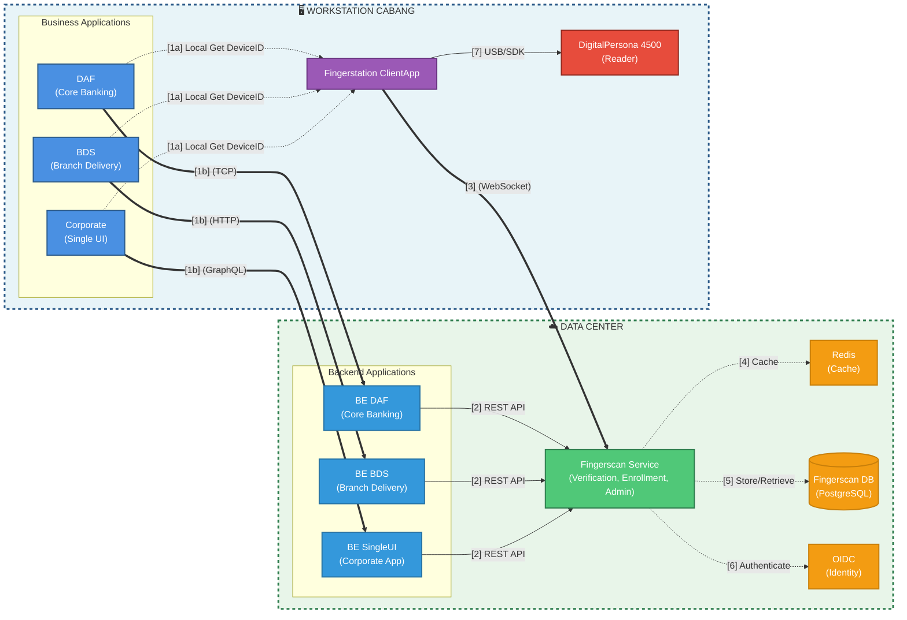
```mermaid
graph LR
    subgraph DataCenter["☁️ DATA CENTER"]
        direction TB
        
        subgraph BackendApps["Backend Applications"]
            BE_DAF["BE DAF<br/>(Core Banking)"]
            BE_BDS["BE BDS<br/>(Branch Delivery)"]
            BE_SingleUI["BE SingleUI<br/>(Corporate App)"]
        end
        
        Service["Fingerscan Service<br/>(Verification, Enrollment, Admin)"]
        Redis["Redis<br/>(Cache)"]
        DB[("Fingerscan DB<br/>(PostgreSQL)")]
        OIDC["OIDC<br/>(Identity)"]
        
        %% Backend to Fingerscan Service connections
        BE_DAF -->|"[2] REST API"| Service
        BE_BDS -->|"[2] REST API"| Service
        BE_SingleUI -->|"[2] REST API"| Service
        
        %% Service connections
        Service -.->|"[4] Cache"| Redis
        Service -.->|"[5] Store/Retrieve"| DB
        Service -.->|"[6] Authenticate"| OIDC
    end

    subgraph Workstation["🖥️ WORKSTATION  CABANG"]
        direction LR
        
        subgraph Apps["Business Applications"]
            DAF["DAF<br/>(Core Banking)"]
            BDS["BDS<br/>(Branch Delivery)"]
            Corporate["Corporate<br/>(Single UI)"]
        end
        
        FS["Fingerstation ClientApp"]
        Device["DigitalPersona 4500<br/>(Reader)"]
        
        %% Local connection between apps and station
        DAF -.->|"[1a] Local Get DeviceID"| FS
        BDS -.->|"[1a] Local Get DeviceID"| FS
        Corporate -.->|"[1a] Local Get DeviceID"| FS
        
        %% Station internal
        FS -->|"[7] USB/SDK"| Device
    end
    
    
    %% Cross-location connections (Workstation to Data Center)
    DAF ==>|"[1b] (TCP)"| BE_DAF
    BDS ==>|"[1b] (HTTP)"| BE_BDS
    Corporate ==>|"[1b] (GraphQL)"| BE_SingleUI
    FS ==>|"[3] (WebSocket)"| Service
    
    %% Styling
    classDef workstationBG fill:#E8F4F8,stroke:#2E5C8A,stroke-width:3px,stroke-dasharray: 5 5
    classDef datacenterBG fill:#E8F5E9,stroke:#2E7D4E,stroke-width:3px,stroke-dasharray: 5 5
    classDef appStyle fill:#4A90E2,stroke:#2E5C8A,stroke-width:2px,color:#fff
    classDef backendStyle fill:#3498DB,stroke:#2874A6,stroke-width:2px,color:#fff
    classDef serviceStyle fill:#50C878,stroke:#2E7D4E,stroke-width:2px,color:#fff
    classDef storageStyle fill:#F39C12,stroke:#C87F0A,stroke-width:2px,color:#fff
    classDef stationStyle fill:#9B59B6,stroke:#6C3483,stroke-width:2px,color:#fff
    classDef deviceStyle fill:#E74C3C,stroke:#922B21,stroke-width:2px,color:#fff
    
    class Workstation workstationBG
    class DataCenter datacenterBG
    class DAF,BDS,Corporate appStyle
    class BE_DAF,BE_BDS,BE_SingleUI backendStyle
    class Service serviceStyle
    class Redis,DB,OIDC storageStyle
    class FS stationStyle
    class Device deviceStyle
```

---

**Penjelasan Alur:**

| No | Layer | Lokasi | Protokol | Deskripsi |
|----|-------|--------|----------|-----------|
| **[1a]** | Apps → Fingerstation | **Local** (Workstation) | IPC/Local API | Business apps memanggil Fingerstation secara lokal untuk mendapatkan Device ID |
| **[1b]** | Apps → Backend Apps | **Network** (WAN/VPN) | TCP/HTTP/GraphQL | Business apps mengirim request otorisasi/enrollment ke Backend masing-masing |
| **[2]** | Backend → Service | **Network** (WAN/VPN) | REST API (HTTPS) | Backend apps mengirim request verifikasi ke Fingerscan Service |
| **[3]** | Fingerstation → Service | **Network** (WAN/VPN) | WebSocket (mTLS) | Fingerstation mengirim template hasil capture ke service via koneksi aman |
| **[4]** | Service → Cache | **Local** (Data Center) | Redis Protocol | Service mengecek cache untuk template yang sering digunakan |
| **[5]** | Service → Database | **Local** (Data Center) | JDBC/SQL | Service menyimpan dan mengambil data template, audit log, dan konfigurasi |
| **[6]** | Service → OIDC | **Local** (Data Center) | OAuth2/OIDC | Service melakukan autentikasi dan autorisasi user saat enrollment |
| **[7]** | Fingerstation → Device | **Local** (Workstation) | USB/SDK | Fingerstation berkomunikasi dengan hardware fingerprint reader |

**Catatan Arsitektur:**

- 🖥️ **Workstation/Cabang**: Business applications (DAF, BDS, CMS) dan Fingerstation berjalan di PC yang sama
- ☁️ **Data Center/Kantor Pusat**: Fingerscan Service dan semua komponen backend berjalan secara terpusat
- 🔗 **Koneksi Lokal** ([1a], [6], [7]): Komunikasi dalam satu mesin/workstation
- 🌐 **Koneksi Network** ([1b], [2]): Komunikasi melalui jaringan (VPN/MPLS) antara cabang dan kantor pusat

---

#### 2.1.1 Context Diagram

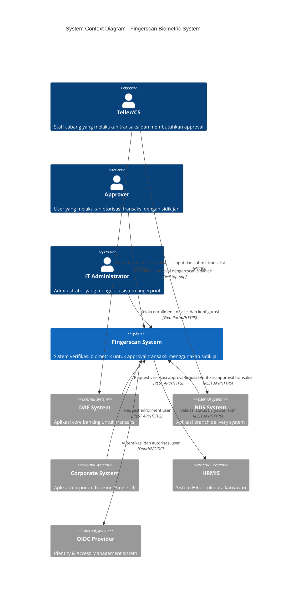
```mermaid
C4Context
    title System Context Diagram - Fingerscan Biometric System

    Person(teller, "Teller/CS", "Staff cabang yang melakukan transaksi dan membutuhkan approval")
    Person(approver, "Approver", "User yang melakukan otorisasi transaksi dengan sidik jari")
    Person(admin, "IT Administrator", "Administrator yang mengelola sistem fingerprint")

    System(fingerscan, "Fingerscan System", "Sistem verifikasi biometrik untuk approval transaksi menggunakan sidik jari")

    System_Ext(daf, "DAF System", "Aplikasi core banking untuk transaksi")
    System_Ext(bds, "BDS System", "Aplikasi branch delivery system")
    System_Ext(corporate, "Corporate System", "Aplikasi corporate banking (Single UI)")
    System_Ext(hrmis, "HRMIS", "Sistem HR untuk data karyawan")
    System_Ext(oidc, "OIDC Provider", "Identity & Access Management sistem")

    Rel(teller, daf, "Input dan submit transaksi", "HTTPS")
    Rel(teller, bds, "Input dan submit transaksi", "HTTPS")
    Rel(approver, fingerscan, "Verifikasi approval dengan scan sidik jari", "Desktop App")
    Rel(admin, fingerscan, "Kelola enrollment, device, dan konfigurasi", "Web Portal/HTTPS")

    Rel(daf, fingerscan, "Request verifikasi approval transaksi", "REST API/HTTPS")
    Rel(bds, fingerscan, "Request verifikasi approval transaksi", "REST API/HTTPS")
    Rel(corporate, fingerscan, "Request enrollment user", "REST API/HTTPS")
    
    Rel(fingerscan, hrmis, "Validasi status karyawan aktif", "REST API/HTTPS")
    Rel(fingerscan, oidc, "Autentikasi dan autorisasi user", "OAuth2/OIDC")

    UpdateLayoutConfig($c4ShapeInRow="3", $c4BoundaryInRow="1")
```

**Penjelasan Context Diagram:**

| Elemen | Type | Deskripsi |
|--------|------|-----------|
| **Teller/CS** | Person | User yang melakukan input transaksi dan meminta approval |
| **Approver** | Person | User yang melakukan otorisasi transaksi menggunakan sidik jari |
| **IT Administrator** | Person | Administrator yang mengelola enrollment, device, dan sistem |
| **Fingerscan System** | System | Sistem inti untuk verifikasi biometrik dan manajemen enrollment |
| **DAF System** | External System | Core banking application yang memerlukan approval biometrik |
| **BDS System** | External System | Branch delivery system yang memerlukan approval biometrik |
| **Corporate System** | External System | Corporate banking app (Single UI) untuk enrollment |
| **HRMIS** | External System | Sistem HR untuk validasi data karyawan |
| **OIDC Provider** | External System | Identity provider untuk autentikasi dan autorisasi |

**Key Interactions:**
- Business Apps (DAF, BDS) mengirim request verifikasi ke Fingerscan System
- Approver berinteraksi langsung dengan Fingerscan untuk scan sidik jari
- Fingerscan System memvalidasi user melalui HRMIS dan OIDC
- Administrator mengelola sistem melalui web portal


#### 2.1.2 Container Diagram

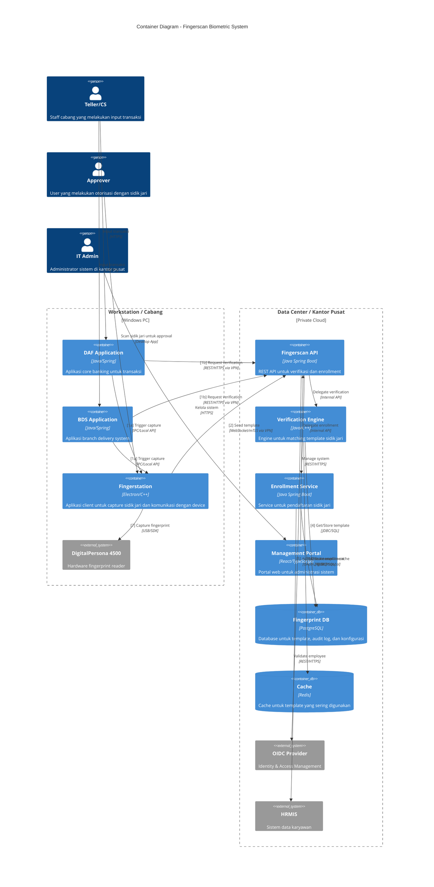
```mermaid
C4Container
    title Container Diagram - Fingerscan Biometric System

    Person(teller, "Teller/CS", "Staff cabang yang melakukan input transaksi")
    Person(approver, "Approver", "User yang melakukan otorisasi dengan sidik jari")
    Person(admin, "IT Admin", "Administrator sistem di kantor pusat")

    Boundary(b1, "Workstation / Cabang", "Windows PC") {
        Container(daf, "DAF Application", "Java/Spring", "Aplikasi core banking untuk transaksi")
        Container(bds, "BDS Application", "Java/Spring", "Aplikasi branch delivery system")
        Container(fingerstation, "Fingerstation", "Electron/C++", "Aplikasi client untuk capture sidik jari dan komunikasi dengan device")
        
        System_Ext(device, "DigitalPersona 4500", "Hardware fingerprint reader")
    }

    Boundary(b2, "Data Center / Kantor Pusat", "Private Cloud") {
        Container(api, "Fingerscan API", "Java Spring Boot", "REST API untuk verifikasi dan enrollment")
        Container(verif, "Verification Engine", "Java/C++", "Engine untuk matching template sidik jari")
        Container(enroll, "Enrollment Service", "Java Spring Boot", "Service untuk pendaftaran sidik jari")
        Container(mgmt, "Management Portal", "React/TypeScript", "Portal web untuk administrasi sistem")
        
        ContainerDb(db, "Fingerprint DB", "PostgreSQL", "Database untuk template, audit log, dan konfigurasi")
        ContainerDb(cache, "Cache", "Redis", "Cache untuk template yang sering digunakan")
        
        System_Ext(oidc, "OIDC Provider", "Identity & Access Management")
        System_Ext(hrmis, "HRMIS", "Sistem data karyawan")
    }

    %% User interactions
    Rel(teller, daf, "Input transaksi", "HTTPS")
    Rel(teller, bds, "Input transaksi", "HTTPS")
    Rel(approver, fingerstation, "Scan sidik jari untuk approval", "Desktop App")
    Rel(admin, mgmt, "Kelola sistem", "HTTPS")

    %% Local workstation communications
    Rel(daf, fingerstation, "[1a] Trigger capture", "IPC/Local API")
    Rel(bds, fingerstation, "[1a] Trigger capture", "IPC/Local API")
    Rel(fingerstation, device, "[7] Capture fingerprint", "USB/SDK")

    %% Network communications (Workstation to Data Center)
    Rel(daf, api, "[1b] Request verification", "REST/HTTPS via VPN")
    Rel(bds, api, "[1b] Request verification", "REST/HTTPS via VPN")
    Rel(fingerstation, api, "[2] Send template", "WebSocket/mTLS via VPN")

    %% Data center internal communications
    Rel(api, verif, "Delegate verification", "Internal API")
    Rel(api, enroll, "Delegate enrollment", "Internal API")
    Rel(mgmt, api, "Manage system", "REST/HTTPS")
    
    Rel(verif, cache, "[3] Check template cache", "Redis Protocol")
    Rel(verif, db, "[4] Get/Store template", "JDBC/SQL")
    Rel(enroll, db, "[4] Store enrollment", "JDBC/SQL")
    
    Rel(api, oidc, "[5] Authenticate user", "OAuth2/OIDC")
    Rel(enroll, hrmis, "Validate employee", "REST/HTTPS")

    UpdateLayoutConfig($c4ShapeInRow="4", $c4BoundaryInRow="2")
```

**Penjelasan Container Diagram:**

| Elemen | Jenis | Deskripsi |
|--------|-------|-----------|
| **Teller/CS** | Person | User yang melakukan input transaksi di aplikasi bisnis |
| **Approver** | Person | User yang melakukan otorisasi menggunakan sidik jari |
| **IT Admin** | Person | Administrator yang mengelola sistem fingerprint |
| **Workstation Boundary** | Boundary | PC di cabang yang menjalankan business apps dan fingerstation |
| **Data Center Boundary** | Boundary | Infrastruktur terpusat di kantor pusat |
| **DAF/BDS** | Container | Aplikasi bisnis yang memerlukan otorisasi fingerprint |
| **Fingerstation** | Container | Aplikasi client untuk interface dengan device |
| **DigitalPersona 4500** | External System | Hardware fingerprint reader |
| **Fingerscan API** | Container | API gateway untuk semua request verifikasi/enrollment |
| **Verification Engine** | Container | Engine untuk matching sidik jari (1:1 matching) |
| **Enrollment Service** | Container | Service untuk proses pendaftaran sidik jari |
| **Management Portal** | Container | Web portal untuk administrasi |
| **Fingerprint DB** | Database | PostgreSQL untuk menyimpan template dan audit |
| **Cache** | Database | Redis untuk performa (caching template) |
| **OIDC Provider** | External System | SSO untuk autentikasi user |
| **HRMIS** | External System | Sistem HR untuk validasi karyawan |

## 2.2 High Level Process Flow

### 2.2.1 Enrollment Process Flow

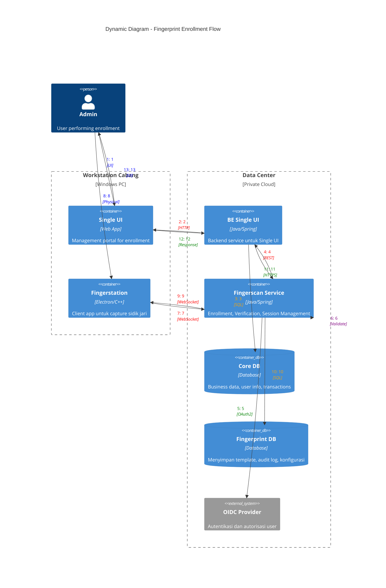
```mermaid
C4Dynamic
    title Dynamic Diagram - Fingerprint Enrollment Flow

    Person(admin, "Admin", "User performing enrollment")
    
    Boundary(workstation, "Workstation Cabang", "Windows PC") {
        Container(portal, "Single UI", "Web App", "Management portal for enrollment")
        Container(station, "Fingerstation", "Electron/C++", "Client app untuk capture sidik jari")
    }
    
    Boundary(datacenter, "Data Center", "Private Cloud") {
        Container(backend, "BE Single UI", "Java/Spring", "Backend service untuk Single UI")
        Container(service, "Fingerscan Service", "Java/Spring", "Enrollment, Verification, Session Management")
        
        ContainerDb(coredb, "Core DB", "Database", "Business data, user info, transactions")
        ContainerDb(db, "Fingerprint DB", "Database", "Menyimpan template, audit log, konfigurasi")
        System_Ext(oidc, "OIDC Provider", "Autentikasi dan autorisasi user")
    }

    Rel(admin, portal, "1", "UI")
    Rel(portal, backend, "2", "HTTP")
    Rel(backend, coredb, "3", "SQL")
    Rel(backend, service, "4", "REST")
    Rel(service, oidc, "5", "OAuth2")
    Rel(service, service, "6", "Validate")
    Rel(service, station, "7", "WebSocket")
    Rel(admin, station, "8", "Physical")
    Rel(station, service, "9", "WebSocket")
    Rel(service, db, "10", "SQL")
    Rel(service, backend, "11", "HTTPS")
    Rel(backend, portal, "12", "Response")
    Rel(portal, admin, "13", "UI")

    UpdateRelStyle(admin, portal, $textColor="blue", $offsetY="-30")
    UpdateRelStyle(portal, backend, $textColor="red", $offsetY="-30")
    UpdateRelStyle(backend, coredb, $textColor="orange", $offsetX="-50")
    UpdateRelStyle(backend, service, $textColor="red", $offsetY="-30")
    UpdateRelStyle(service, oidc, $textColor="green", $offsetX="-50")
    UpdateRelStyle(service, service, $textColor="purple", $offsetX="50")
    UpdateRelStyle(service, station, $textColor="red", $offsetY="20")
    UpdateRelStyle(admin, station, $textColor="blue", $offsetY="-30")
    UpdateRelStyle(station, service, $textColor="red", $offsetY="-30")
    UpdateRelStyle(service, db, $textColor="orange", $offsetX="20")
    UpdateRelStyle(service, backend, $textColor="green", $offsetY="20")
    UpdateRelStyle(backend, portal, $textColor="green", $offsetY="20")
    UpdateRelStyle(portal, admin, $textColor="blue", $offsetX="50")
```

**Penjelasan Alur:**

| Step | Dari | Ke | Deskripsi | Protokol |
|------|------|-----|-----------|----------|
| **1** | Admin | Single UI | Admin memilih user untuk enrollment | UI Action |
| **2** | Single UI | BE Single UI | Portal mengirim request enrollment ke backend | HTTP/GraphQL |
| **3** | BE Single UI | Core DB | Backend validasi user data dan business rules | JDBC/SQL |
| **4** | BE Single UI | Fingerscan Service | Backend mengirim request ke Fingerscan Service | REST API (HTTPS) |
| **5** | Fingerscan Service | OIDC | Validasi user aktif dan check hak akses enrollment | OAuth2/OIDC |
| **6** | Fingerscan Service | Fingerscan Service | Validasi user dan inisialisasi session | Internal |
| **7** | Fingerscan Service | Fingerstation | Mengirim perintah capture ke Fingerstation | WebSocket (mTLS) |
| **8** | Admin | Fingerstation | User meletakkan jari di device (min 3 jari) | Physical Action |
| **9** | Fingerstation | Fingerscan Service | Mengirim template hasil capture | WebSocket (mTLS) |
| **10** | Fingerscan Service | Fingerprint DB | Menyimpan template terenkripsi dan audit log | JDBC/SQL |
| **11** | Fingerscan Service | BE Single UI | Mengembalikan hasil enrollment ke backend | Response/HTTPS |
| **12** | BE Single UI | Single UI | Backend mengembalikan hasil ke portal | Response |
| **13** | Single UI | Admin | Menampilkan konfirmasi sukses | UI |

**Timeline Estimasi:**
- Step 1-7: ~450ms (UI + DB validation + backend routing + OIDC auth + initiation)
- Step 8: ~10-30 detik (capture 3+ fingers with quality check)
- Step 9-13: ~550ms (save + response chain)
- **Total: ~11-31 detik** (user-dependent)


### 2.2.2 Verification Process Flow

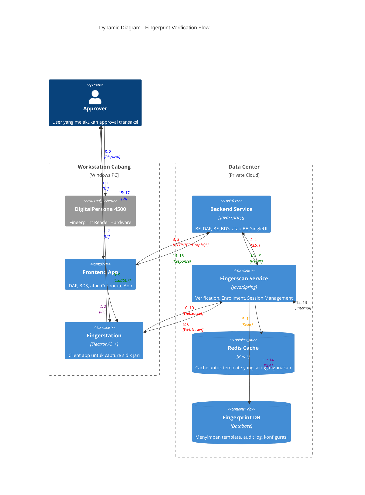
```mermaid
C4Dynamic
    title Dynamic Diagram - Fingerprint Verification Flow

    Person(approver, "Approver", "User yang melakukan approval transaksi")
    
    Boundary(workstation, "Workstation Cabang", "Windows PC") {
        System_Ext(device, "DigitalPersona 4500", "Fingerprint Reader Hardware")
        Container(app, "Frontend App", "", "DAF, BDS, atau Corporate App")
        Container(station, "Fingerstation", "Electron/C++", "Client app untuk capture sidik jari")
        
    }
    
    Boundary(datacenter, "Data Center", "Private Cloud") {
        Container(backend, "Backend Service", "Java/Spring", "BE_DAF, BE_BDS, atau BE_SingleUI")
        Container(service, "Fingerscan Service", "Java/Spring", "Verification, Enrollment, Session Management")
        
        ContainerDb(cache, "Redis Cache", "Redis", "Cache untuk template yang sering digunakan")
        ContainerDb(db, "Fingerprint DB", "Database", "Menyimpan template, audit log, konfigurasi")
    }

    Rel(approver, app, "1", "UI")
    Rel(app, station, "2", "IPC")
    Rel(app, backend, "3", "HTTP/TCP/GraphQL")
    Rel(backend, service, "4", "REST")
    Rel(service, cache, "5", "Redis")
    Rel(service, station, "6", "WebSocket")
    Rel(station, approver, "7", "UI")
    Rel(approver, device, "8", "Physical")
    Rel(device, station, "9", "USB/SDK")
    Rel(station, service, "10", "WebSocket")
    Rel(service, cache, "11", "Redis")
    Rel(service, db, "12", "SQL")
    Rel(service, service, "13", "Internal")
    Rel(service, db, "14", "SQL")
    Rel(service, backend, "15", "HTTPS")
    Rel(backend, app, "16", "Response")
    Rel(app, approver, "17", "UI")

    UpdateRelStyle(approver, app, $textColor="blue", $offsetY="-30")
    UpdateRelStyle(app, station, $textColor="purple", $offsetX="-40")
    UpdateRelStyle(app, backend, $textColor="red", $offsetY="-30")
    UpdateRelStyle(backend, service, $textColor="red", $offsetY="-30")
    UpdateRelStyle(service, cache, $textColor="orange", $offsetX="20")
    UpdateRelStyle(service, station, $textColor="red", $offsetY="20")
    UpdateRelStyle(station, approver, $textColor="blue", $offsetY="20")
    UpdateRelStyle(approver, device, $textColor="blue", $offsetY="-30")
    UpdateRelStyle(device, station, $textColor="green", $offsetX="20")
    UpdateRelStyle(station, service, $textColor="red", $offsetY="-30")
    UpdateRelStyle(service, cache, $textColor="orange", $offsetX="-50")
    UpdateRelStyle(service, db, $textColor="orange", $offsetX="20", $offsetY="-20")
    UpdateRelStyle(service, db, $textColor="purple", $offsetX="40", $offsetY="20")
    UpdateRelStyle(service, backend, $textColor="green", $offsetY="20")
    UpdateRelStyle(backend, app, $textColor="green", $offsetY="20")
    UpdateRelStyle(app, approver, $textColor="blue", $offsetX="50")
```

**Penjelasan Alur:**

| Step | Dari | Ke | Deskripsi | Protokol |
|------|------|-----|-----------|----------|
| **1** | Approver | Frontend App | User menekan tombol approval di aplikasi bisnis | UI Action |
| **2** | Frontend App | Fingerstation | Aplikasi mengambil Device ID dari Fingerstation | Local Call/IPC |
| **3** | Frontend App | Backend Service | Aplikasi mengirim request approval ke Backend | HTTP/TCP/GraphQL |
| **4** | Backend Service | Fingerscan Service | Backend mengirim request inisialisasi verifikasi | REST API (HTTPS) |
| **5** | Fingerscan Service | Redis Cache | Membuat session verifikasi dengan TTL 30 detik | Redis SET |
| **6** | Fingerscan Service | Fingerstation | Mengirim perintah capture ke Fingerstation user | WebSocket (mTLS) |
| **7** | Fingerstation | Approver | Menampilkan dialog "Letakkan jari Anda" | Desktop UI |
| **8** | Approver | DigitalPersona 4500 | User meletakkan jari di device fingerprint reader | Physical Action |
| **9** | DigitalPersona 4500 | Fingerstation | Device mengirim raw fingerprint data ke Fingerstation | USB/SDK |
| **10** | Fingerstation | Fingerscan Service | Mengirim template hasil capture ke service | WebSocket (mTLS) |
| **11** | Fingerscan Service | Redis Cache | Mengambil template enrolled user dari cache | Redis GET |
| **12** | Fingerscan Service | PostgreSQL | Jika cache miss, ambil dari database | JDBC/SQL |
| **13** | Fingerscan Service | Fingerscan Service | Proses matching 1:1 antara template capture vs enrolled | Internal |
| **14** | Fingerscan Service | PostgreSQL | Menyimpan hasil verifikasi dan audit log | JDBC/SQL |
| **15** | Fingerscan Service | Backend Service | Mengembalikan hasil verifikasi (SUCCESS/FAILED) | Response/HTTPS |
| **16** | Backend Service | Frontend App | Backend mengembalikan hasil approval ke aplikasi | Response |
| **17** | Frontend App | Approver | Menampilkan hasil approval atau error message | UI |

**Timeline Estimasi:**
- Step 1-7: ~250ms (local + network + initiation)
- Step 8-9: ~2-5 detik (user action + capture)
- Step 10-14: ~400ms (template processing + matching + logging)
- Step 15-17: ~200ms (response chain)
- **Total: ~3-6 detik** (user-dependent)

---

## 3. Business Rules

| ID | Category | Rule | Implementation |
|----|----------|------|----------------|
| BR-001 | Enrollment | Minimal 2 jari dari kedua tangan | Validation sebelum save |
| BR-002 | Enrollment | Quality score minimal 40 | Check saat capture |
| BR-003 | Enrollment | Tidak boleh duplicate | Cross-check dengan existing templates |
| BR-004 | Enrollment | User harus aktif di HRMIS | API call ke HRMIS |
| BR-005 | Verification | Max retry 3x | Counter di database |
| BR-006 | Verification | Timeout 30 detik | Session expiry |
| BR-007 | Verification | Match threshold configurable | Default 40 |
| BR-008 | Verification | 1 active session per user | Reject concurrent |
| BR-009 | Lock | Auto lock setelah 3x gagal | System triggered |
| BR-010 | Lock | Manual unlock by admin only | Role-based access |
| BR-011 | Fallback | Approval dari Admin Kantor Pusat | Workflow approval |
| BR-012 | Fallback | Max duration 30 hari | Validation |
| BR-013 | Fallback | Auto disable setelah expired | Scheduler |
| BR-014 | Audit | Semua aktivitas harus di-log | Aspect/interceptor |
| BR-015 | Audit | Retention minimal 2 tahun | Archival policy |

---

## 4. Modul Sistem

### 4.1 Fingerstation (Client App)

**Deskripsi:** Aplikasi desktop yang diinstal pada workstation cabang untuk menghubungkan device fingerprint dengan Fingerscan Service.

**Teknologi:** Electron / .NET Desktop App

**Fungsi Utama:**

| No | Fungsi | Deskripsi |
|----|--------|-----------|
| 1 | Device Connection | Mengelola koneksi dengan DigitalPersona 4500 |
| 2 | Capture | Melakukan capture sidik jari dari device |
| 3 | Template Extraction | Mengekstrak template dari hasil capture |
| 4 | Secure Communication | Mengirim template ke service via WebSocket |
| 5 | Status Reporting | Melaporkan status device dan station |

**State Diagram:**

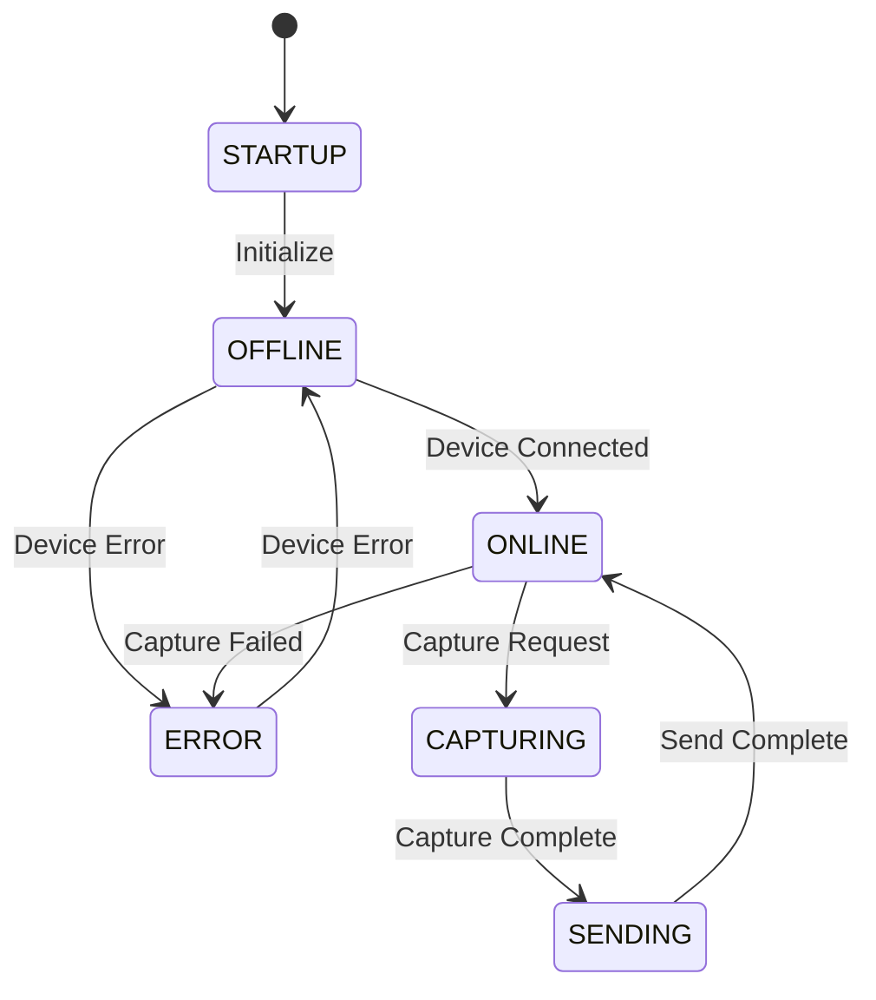
```mermaid
stateDiagram-v2
    [*] --> STARTUP
    STARTUP --> OFFLINE: Initialize
    OFFLINE --> ONLINE: Device Connected
    OFFLINE --> ERROR: Device Error
    ERROR --> OFFLINE: Device Error
    ONLINE --> CAPTURING: Capture Request
    ONLINE --> ERROR: Capture Failed
    CAPTURING --> SENDING: Capture Complete
    SENDING --> ONLINE: Send Complete
```

### 4.2 Fingerscan Service (Backend)

**Deskripsi:** Backend service yang menangani logika bisnis verifikasi, enrollment, dan manajemen sistem.

**Teknologi:** Java Spring Boot / Node.js

**Sub-modul:**

| Sub-modul | Fungsi |
|-----------|--------|
| **Verification Engine** | Matching template, session management |
| **Enrollment Service** | Pendaftaran dan update template user |
| **Station Manager** | Manajemen koneksi station |
| **Admin Service** | Konfigurasi dan parameter sistem |
| **Audit Service** | Logging dan reporting |
| **Scheduler** | Fallback expiry, cleanup tasks |

### 4.3 Fingerscan Management (Web Portal)

**Deskripsi:** Portal web untuk administrasi sistem fingerprint.

**Teknologi:** Next.js / React

**Menu Struktur:**

```
Fingerscan Management
├── Dashboard
│   ├── Station Status Overview
│   ├── Verification Statistics
│   └── Alert & Notifications
├── Enrollment
│   ├── New Enrollment
│   ├── Update Enrollment
│   └── Enrollment History
├── User Management
│   ├── User List
│   ├── Lock/Unlock User
│   └── Fallback Management
├── Device Management
│   ├── Station List
│   ├── Device Registration
│   └── Maintenance Schedule
├── Reports
│   ├── Verification Report
│   ├── Audit Trail
│   └── Usage Statistics
└── Settings
    ├── System Parameters
    ├── Branch Configuration
    └── Integration Settings
```

---

## 5. Spesifikasi Fungsional

### 5.1 F01: Enrollment Sidik Jari

#### 4.1.1 Deskripsi

Proses pendaftaran sidik jari user ke dalam sistem untuk pertama kali. Enrollment dilakukan untuk user definitif (di Kantor Pusat) dan user alternate (di Cabang).

#### 4.1.2 Precondition

- User terdaftar dan aktif di HRMIS
- User telah login ke sistem via OIDC
- Fingerstation dalam status ONLINE
- Device DigitalPersona terhubung dan berfungsi

#### 4.1.3 Flow Diagram

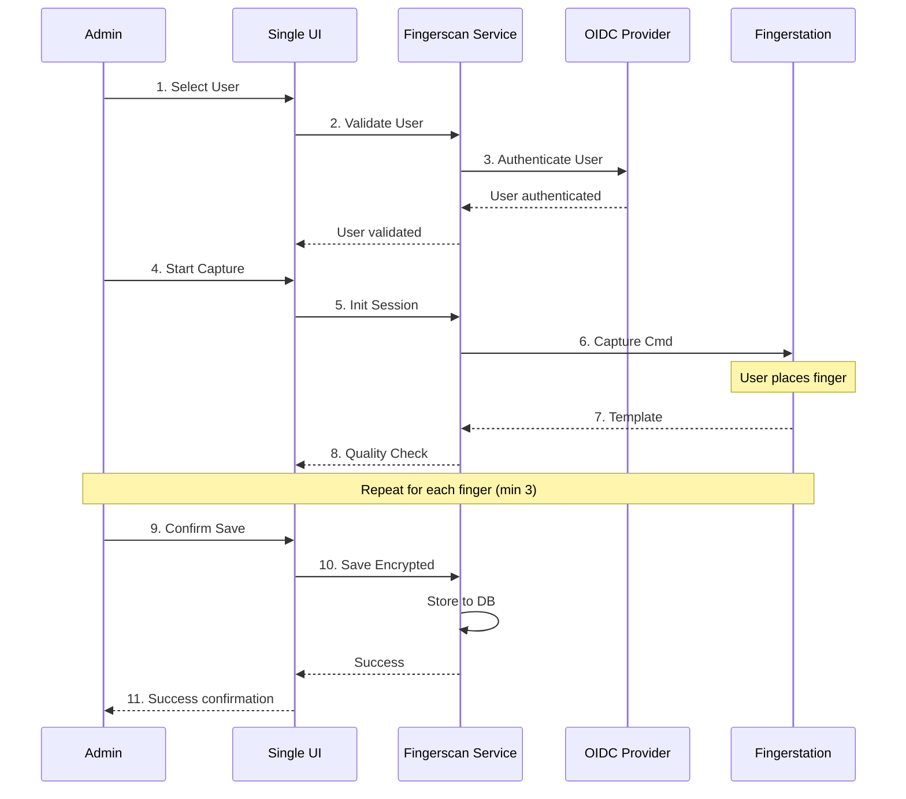
```mermaid
sequenceDiagram
    participant Admin
    participant Portal as Single UI
    participant Service as Fingerscan Service
    participant OIDC as OIDC Provider
    participant Station as Fingerstation
    
    Admin->>Portal: 1. Select User
    Portal->>Service: 2. Validate User
    Service->>OIDC: 3. Authenticate User
    OIDC-->>Service: User authenticated
    Service-->>Portal: User validated
    
    Admin->>Portal: 4. Start Capture
    Portal->>Service: 5. Init Session
    Service->>Station: 6. Capture Cmd
    
    Note over Station: User places finger
    
    Station-->>Service: 7. Template
    Service-->>Portal: 8. Quality Check
    
    Note over Admin,Station: Repeat for each finger (min 3)
    
    Admin->>Portal: 9. Confirm Save
    Portal->>Service: 10. Save Encrypted
    Service->>Service: Store to DB
    Service-->>Portal: Success
    Portal-->>Admin: 11. Success confirmation
```

#### 4.1.4 Business Rules

| Rule ID | Rule | Validasi |
|---------|------|----------|
| BR-E01 | Minimal 3 jari dari kedua tangan | System enforced |
| BR-E02 | Template harus memenuhi quality threshold | Score >= 40 |
| BR-E03 | Tidak boleh duplicate dengan user lain | Matching check |
| BR-E04 | User harus aktif di HRMIS | API validation |
| BR-E05 | Enrollment definitif hanya di Kantor Pusat | Location check |

#### 4.1.5 Data Input

| Field | Type | Required | Validation |
|-------|------|----------|------------|
| user_id | String | Yes | Exists in HRMIS, Active |
| finger_index | Integer | Yes | 1-10 (mapping jari) |
| template_data | Binary | Yes | Quality >= 40 |
| station_id | UUID | Yes | Station ONLINE |
| enrolled_by | String | Yes | From session |

#### 4.1.6 Data Output

| Field | Type | Description |
|-------|------|-------------|
| enrollment_id | UUID | ID enrollment |
| status | Enum | SUCCESS, FAILED |
| finger_count | Integer | Jumlah jari terdaftar |
| message | String | Status message |

---

### 4.2 F02: Verifikasi Sidik Jari

#### 4.2.1 Deskripsi

Proses verifikasi sidik jari user saat melakukan approval transaksi. Verifikasi dipicu oleh aplikasi bisnis (DAF, BDS, dll) ketika user melakukan aksi approval.

#### 4.2.2 Precondition

- User telah melakukan enrollment
- User tidak dalam status LOCKED
- User aktif di HRMIS
- Fingerstation dalam status ONLINE

#### 4.2.3 Sequence Diagram

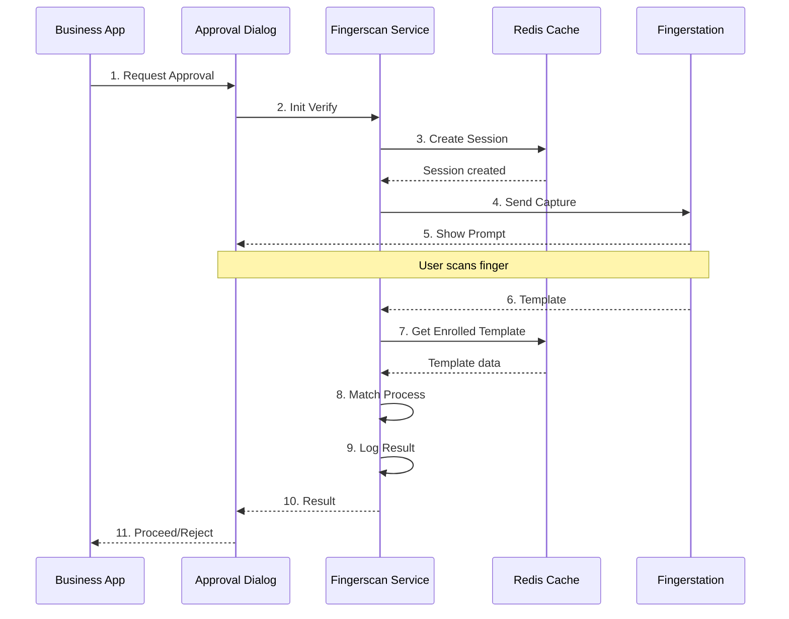
```mermaid
sequenceDiagram
    participant App as Business App
    participant Dialog as Approval Dialog
    participant Service as Fingerscan Service
    participant Cache as Redis Cache
    participant Station as Fingerstation
    
    App->>Dialog: 1. Request Approval
    Dialog->>Service: 2. Init Verify
    Service->>Cache: 3. Create Session
    Cache-->>Service: Session created
    
    Service->>Station: 4. Send Capture
    Station-->>Dialog: 5. Show Prompt
    
    Note over Dialog,Station: User scans finger
    
    Station-->>Service: 6. Template
    Service->>Cache: 7. Get Enrolled Template
    Cache-->>Service: Template data
    
    Service->>Service: 8. Match Process
    Service->>Service: 9. Log Result
    
    Service-->>Dialog: 10. Result
    Dialog-->>App: 11. Proceed/Reject
```

#### 4.2.4 Flow: Verifikasi Gagal

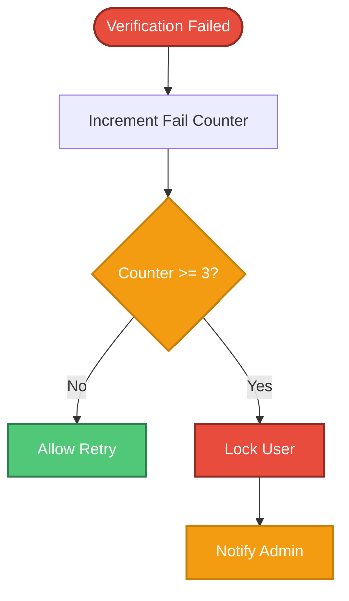
```mermaid
flowchart TD
    Failed([Verification Failed]) --> Increment[Increment Fail Counter]
    Increment --> Check{Counter >= 3?}
    Check -->|No| Retry[Allow Retry]
    Check -->|Yes| Lock[Lock User]
    Lock --> Notify[Notify Admin]
    
    style Failed fill:#E74C3C,stroke:#922B21,stroke-width:2px,color:#fff
    style Check fill:#F39C12,stroke:#C87F0A,stroke-width:2px,color:#fff
    style Lock fill:#E74C3C,stroke:#922B21,stroke-width:2px,color:#fff
    style Notify fill:#F39C12,stroke:#C87F0A,stroke-width:2px,color:#fff
    style Retry fill:#50C878,stroke:#2E7D4E,stroke-width:2px,color:#fff
```

#### 4.2.5 Business Rules

| Rule ID | Rule | Action |
|---------|------|--------|
| BR-V01 | Max retry 3x | Lock user setelah 3x gagal |
| BR-V02 | Timeout 30 detik | Cancel session jika timeout |
| BR-V03 | Match threshold >= 40 | Configurable via parameter |
| BR-V04 | 1 session per user | Reject concurrent request |
| BR-V05 | User harus aktif HRMIS | Check sebelum verify |

#### 4.2.6 API Request

```json
POST /api/v1/verification/init
{
  "user_id": "USR001",
  "station_id": "STN-001-A",
  "transaction_ref": "TRX20250128001",
  "transaction_type": "TRANSFER",
  "application_code": "DAF-CORE",
  "amount": 50000000,
  "callback_url": "https://daf.internal/callback"
}
```

#### 4.2.7 API Response

```json
{
  "session_id": "550e8400-e29b-41d4-a716-446655440000",
  "status": "SUCCESS",
  "verified_at": "2025-01-28T10:30:00Z",
  "user_id": "USR001",
  "verification_id": "VRF-20250128-00001",
  "match_score": 85
}
```

---

### 4.3 F03: Manajemen Lock/Unlock

#### 4.3.1 Deskripsi

Fungsi untuk mengunci dan membuka kunci akun user di level fingerprint.

#### 4.3.2 Kondisi Lock

| Kondisi | Trigger | Auto/Manual |
|---------|---------|-------------|
| 3x verifikasi gagal | System | Auto |
| Request dari admin | Admin action | Manual |
| User resign/non-aktif | HRMIS sync | Auto |
| Security incident | Security team | Manual |

#### 4.3.3 Proses Unlock

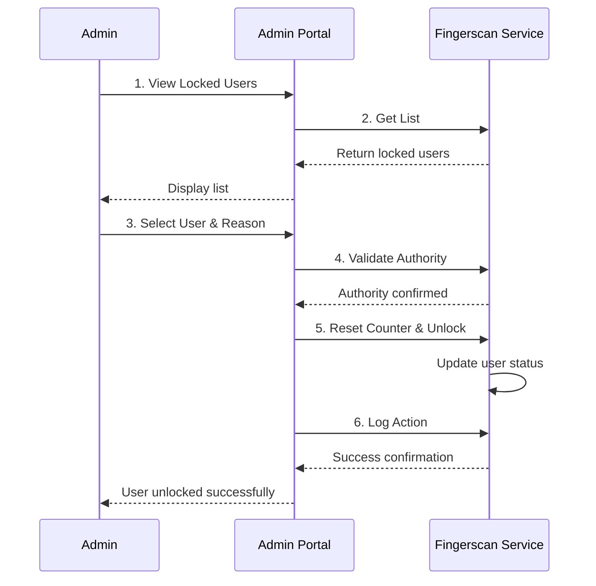
```mermaid
sequenceDiagram
    participant Admin
    participant Portal as Admin Portal
    participant Service as Fingerscan Service
    
    Admin->>Portal: 1. View Locked Users
    Portal->>Service: 2. Get List
    Service-->>Portal: Return locked users
    Portal-->>Admin: Display list
    
    Admin->>Portal: 3. Select User & Reason
    Portal->>Service: 4. Validate Authority
    Service-->>Portal: Authority confirmed
    
    Portal->>Service: 5. Reset Counter & Unlock
    Service->>Service: Update user status
    
    Portal->>Service: 6. Log Action
    Service-->>Portal: Success confirmation
    Portal-->>Admin: User unlocked successfully
```

---

### 4.4 F04: Fallback Password

#### 4.4.1 Deskripsi

Mekanisme cadangan yang memungkinkan user melakukan approval dengan password ketika fingerprint tidak dapat digunakan (device rusak, kondisi darurat).

#### 4.4.2 Ketentuan Fallback

| Parameter | Nilai | Keterangan |
|-----------|-------|------------|
| Approval Required | Admin Kantor Pusat (TI) | Mandatory |
| Max Duration | 30 hari | Configurable |
| Min Duration | 1 hari | Configurable |
| Auto Expire | Yes | Scheduler based |
| Reason Required | Yes | Mandatory field |

#### 4.4.3 Flow Aktivasi

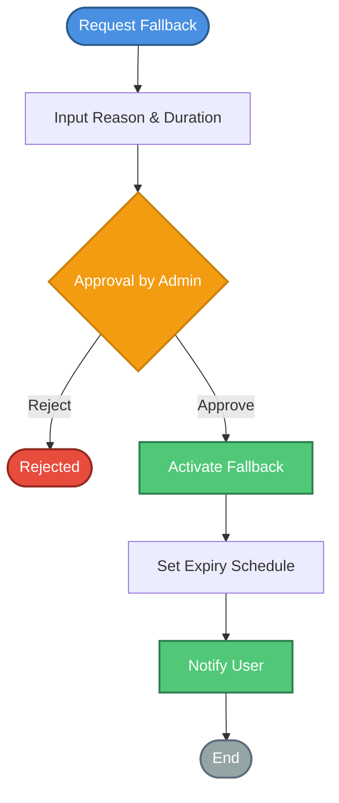
```mermaid
flowchart TD
    Start([Request Fallback]) --> Input[Input Reason & Duration]
    Input --> Approval{Approval by Admin}
    Approval -->|Reject| Rejected([Rejected])
    Approval -->|Approve| Activate[Activate Fallback]
    Activate --> SetExpiry[Set Expiry Schedule]
    SetExpiry --> Notify[Notify User]
    Notify --> End([End])
    
    style Start fill:#4A90E2,stroke:#2E5C8A,stroke-width:2px,color:#fff
    style Rejected fill:#E74C3C,stroke:#922B21,stroke-width:2px,color:#fff
    style Approval fill:#F39C12,stroke:#C87F0A,stroke-width:2px,color:#fff
    style Activate fill:#50C878,stroke:#2E7D4E,stroke-width:2px,color:#fff
    style Notify fill:#50C878,stroke:#2E7D4E,stroke-width:2px,color:#fff
    style End fill:#95A5A6,stroke:#5D6D7E,stroke-width:2px,color:#fff
```

#### 4.4.4 Flow Expiry

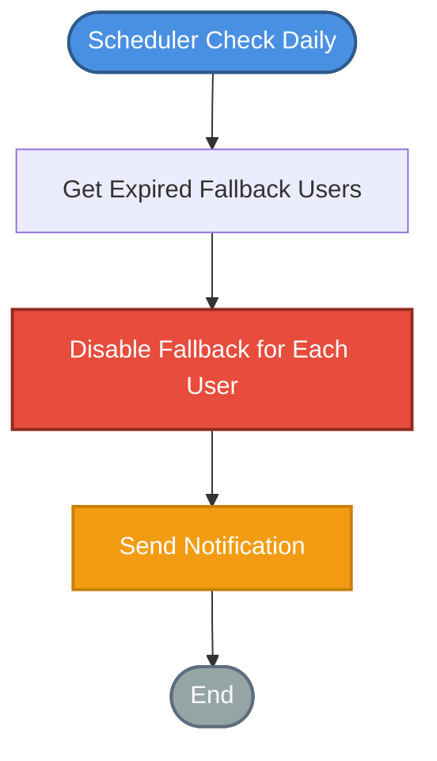
```mermaid
flowchart TD
    Start([Scheduler Check Daily]) --> GetExpired[Get Expired Fallback Users]
    GetExpired --> Disable[Disable Fallback for Each User]
    Disable --> Notify[Send Notification]
    Notify --> End([End])
    
    style Start fill:#4A90E2,stroke:#2E5C8A,stroke-width:2px,color:#fff
    style Disable fill:#E74C3C,stroke:#922B21,stroke-width:2px,color:#fff
    style Notify fill:#F39C12,stroke:#C87F0A,stroke-width:2px,color:#fff
    style End fill:#95A5A6,stroke:#5D6D7E,stroke-width:2px,color:#fff
```

---

### 4.5 F05: Manajemen Device & Station

#### 4.5.1 Registrasi Station

| Field | Type | Required | Description |
|-------|------|----------|-------------|
| station_name | String | Yes | Nama identifikasi station |
| branch_code | String | Yes | Kode cabang |
| device_serial | String | Yes | Serial number device |
| ip_address | String | Yes | IP address station |
| location | String | No | Lokasi fisik (Teller 1, CS, dll) |

#### 4.5.2 Status Monitoring

| Status | Kondisi | Action |
|--------|---------|--------|
| ONLINE | Connected & device ready | Available for use |
| OFFLINE | No heartbeat > 60s | Alert to admin |
| ERROR | Device malfunction | Require maintenance |
| MAINTENANCE | Scheduled maintenance | Temporarily unavailable |

#### 4.5.3 Heartbeat Mechanism

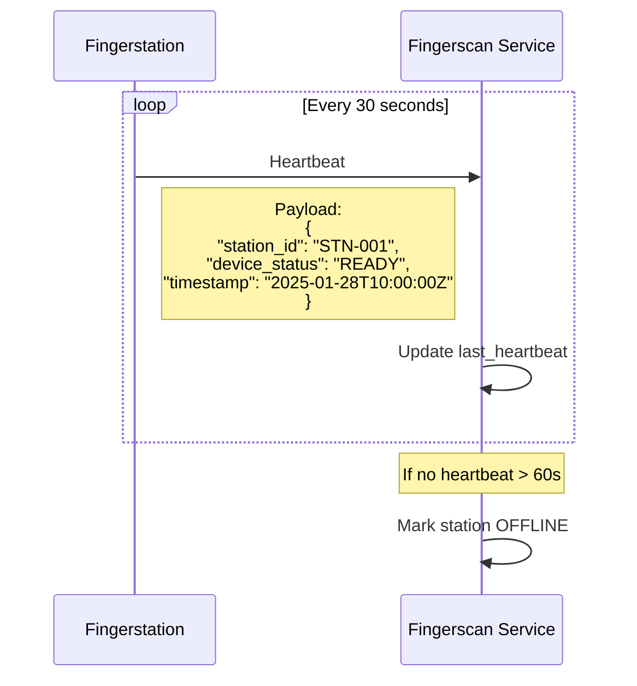
```mermaid
sequenceDiagram
    participant Station as Fingerstation
    participant Service as Fingerscan Service
    
    loop Every 30 seconds
        Station->>Service: Heartbeat
        Note right of Station: Payload:<br/>{<br/>"station_id": "STN-001",<br/>"device_status": "READY",<br/>"timestamp": "2025-01-28T10:00:00Z"<br/>}
        Service->>Service: Update last_heartbeat
    end
    
    Note over Service: If no heartbeat > 60s
    Service->>Service: Mark station OFFLINE
```

---

### 4.6 F06: Audit & Reporting

#### 4.6.1 Data Audit Trail

| Field | Type | Description |
|-------|------|-------------|
| log_id | UUID | Unique log identifier |
| timestamp | DateTime | Waktu event |
| event_type | Enum | ENROLLMENT, VERIFICATION, LOCK, UNLOCK, FALLBACK |
| user_id | String | User yang terlibat |
| actor_id | String | User yang melakukan aksi |
| application_code | String | Kode aplikasi source |
| transaction_ref | String | Referensi transaksi |
| transaction_type | String | Jenis transaksi |
| station_id | String | Station yang digunakan |
| ip_address | String | IP address |
| result | Enum | SUCCESS, FAILED |
| details | JSON | Additional details |

#### 4.6.2 Report Types

| Report | Deskripsi | Retention |
|--------|-----------|-----------|
| Verification Summary | Ringkasan verifikasi harian/bulanan | 2 tahun |
| Failed Verification | Daftar verifikasi gagal | 2 tahun |
| User Activity | Aktivitas per user | 2 tahun |
| Station Usage | Penggunaan per station | 1 tahun |
| Fallback Usage | Penggunaan fallback | 2 tahun |

---

## 5. Spesifikasi Antarmuka

### 5.1 API Specification

#### 5.1.1 Base URL

```
Production: https://fingerscan.bank.internal/api
Staging:    https://fingerscan-stg.bank.internal/api
```

#### 5.1.2 Technology Stack

| Component | Technology |
|-----------|------------|
| Framework | Sanic (Async Python) |
| Database | PostgreSQL 15+ |
| ORM | SQLAlchemy 2.0 (Async) |
| Cache/Messaging | Redis (Pub/Sub) |
| Authentication | JWT (24h expiration) |
| Real-time | WebSocket |
| API Documentation | OpenAPI 3.0 / Swagger |

#### 5.1.3 Authentication

Semua API menggunakan JWT Bearer Token:

```
Authorization: Bearer <access_token>
```

| Endpoint | Method | Description |
|----------|--------|-------------|
| /auth/register | POST | User registration |
| /auth/login | POST | Login dan mendapatkan JWT token |
| /auth/me | GET | Get current user info |

#### 5.1.4 Endpoints

**Device Management** (`/devices`)

| Method | Endpoint | Description |
|--------|----------|-------------|
| GET | /devices | List semua devices (dengan filter) |
| GET | /devices/pending | List devices pending approval |
| POST | /devices | Register device baru |
| GET | /devices/{device_id} | Get device detail |
| PUT | /devices/{device_id} | Update device |
| DELETE | /devices/{device_id} | Hapus device |
| POST | /devices/{device_id}/approve | Approve pending device |
| POST | /devices/{device_id}/status | Check device online status |

**Enrollment** (`/enrollment`)

| Method | Endpoint | Description |
|--------|----------|-------------|
| POST | /enrollment/start | Mulai enrollment session |
| POST | /enrollment/capture | Request capture (async) |
| POST | /enrollment/capture-sync | Request capture (sync, 15s timeout) |
| POST | /enrollment/complete | Complete enrollment session |
| GET | /enrollment/sessions | List enrollment sessions |
| GET | /enrollment/sessions/{session_id} | Get session detail |
| GET | /enrollment/result/{session_id} | Get capture result |
| PUT | /enrollment/sessions/{session_id}/template | Add template to session |

**Fingerprint Verification & Identification** (`/fingerprint`)

| Method | Endpoint | Description |
|--------|----------|-------------|
| POST | /fingerprint/verify | Start verification (async) |
| POST | /fingerprint/verify-sync | Verify synchronous (timeout) |
| GET | /fingerprint/verification/result/{id} | Get verification result |
| POST | /fingerprint/identify | Start identification 1:N (async) |
| POST | /fingerprint/identify-sync | Identify synchronous |
| GET | /fingerprint/identification/result/{id} | Get identification result |

**Template Management** (`/fingerprint/templates`)

| Method | Endpoint | Description |
|--------|----------|-------------|
| GET | /fingerprint/templates | List templates (dengan filter) |
| GET | /fingerprint/templates/{template_id} | Get template detail |
| POST | /fingerprint/templates | Create/update template |
| PUT | /fingerprint/templates/{template_id} | Update template |
| DELETE | /fingerprint/templates/{template_id} | Hapus template |

**User Management** (`/users`)

| Method | Endpoint | Description |
|--------|----------|-------------|
| GET | /users | List users (dengan filter) |
| GET | /users/{user_id} | Get user detail |
| PUT | /users/{user_id} | Update user (termasuk unblock) |
| DELETE | /users/{user_id} | Hapus user |

**Configuration** (`/parameters`)

| Method | Endpoint | Description |
|--------|----------|-------------|
| GET | /parameters | List configuration parameters |
| GET | /parameters/{parameter_id} | Get parameter |
| POST | /parameters | Create parameter |
| PUT | /parameters/{parameter_id} | Update parameter |
| DELETE | /parameters/{parameter_id} | Delete parameter |

#### 5.1.5 Contoh API Detail

**POST /fingerprint/verify-sync** (Verifikasi Synchronous)

Request:
```json
{
  "user_id": "550e8400-e29b-41d4-a716-446655440000",
  "device_id": "660e8400-e29b-41d4-a716-446655440001",
  "username": "john.doe",
  "application": "DAF-CORE",
  "supervisor_name": "Jane Smith",
  "reference_number": "TRX20250128001",
  "description": "Transfer approval"
}
```

Response (Success):
```json
{
  "success": true,
  "confidence_score": 95.2,
  "message": "Fingerprint verified successfully",
  "verification_id": "770e8400-e29b-41d4-a716-446655440002"
}
```

Response (Error - 408 Timeout):
```json
{
  "error": "Verification timeout",
  "message": "No fingerprint captured within timeout period"
}
```

**POST /enrollment/start** (Mulai Enrollment)

Request:
```json
{
  "user_id": "550e8400-e29b-41d4-a716-446655440000",
  "device_id": "660e8400-e29b-41d4-a716-446655440001",
  "templates_required": 3,
  "ip_address": "192.168.1.100"
}
```

Response (201):
```json
{
  "status": "success",
  "id": "880e8400-e29b-41d4-a716-446655440003",
  "user_id": "550e8400-e29b-41d4-a716-446655440000",
  "device_id": "660e8400-e29b-41d4-a716-446655440001",
  "session_status": "pending",
  "templates_captured": 0,
  "templates_required": 3
}
```

### 5.2 WebSocket Events

#### 5.2.1 Connection

```
wss://fingerscan.bank.internal/ws/station
```

#### 5.2.2 Communication Pattern

Sistem menggunakan Redis Pub/Sub untuk komunikasi async antara API dan Fingerstation:

1. **API** mengirim command ke Redis channel
2. **Fingerstation** subscribe ke channel dan menerima command
3. **Fingerstation** mengirim hasil capture ke Redis
4. **API** mengambil hasil dari Redis (polling atau callback)

#### 5.2.3 Events

| Event | Direction | Payload |
|-------|-----------|---------|
| station.connect | Station → Service | { station_id, device_serial } |
| station.heartbeat | Station → Service | { station_id, device_status, is_online } |
| capture.request | Service → Station | { session_id, finger_position, timeout } |
| capture.result | Station → Service | { session_id, template_data, quality_score } |
| capture.error | Station → Service | { session_id, error_code, message } |
| echo.request | Service → Station | { command_id, echo_text } |
| echo.result | Station → Service | { command_id, result } |
| station.disconnect | Station → Service | { station_id, reason } |

### 5.3 External System Integration

#### 5.3.1 OIDC Integration

| Parameter | Value |
|-----------|-------|
| Authorization Endpoint | https://sso.bank.internal/oauth/authorize |
| Token Endpoint | https://sso.bank.internal/oauth/token |
| Userinfo Endpoint | https://sso.bank.internal/oauth/userinfo |
| Scopes | openid profile email |

#### 5.3.2 HRMIS Integration

| Endpoint | Method | Purpose |
|----------|--------|---------|
| /api/employee/{id} | GET | Validate employee status |
| /api/employee/{id}/branch | GET | Get employee branch |

---

## 6. Spesifikasi Data

### 6.1 Entity Relationship Diagram

> [!NOTE]
> Diagram berikut menunjukkan relasi antar tabel. Detail field lengkap akan didokumentasikan dalam TSD.

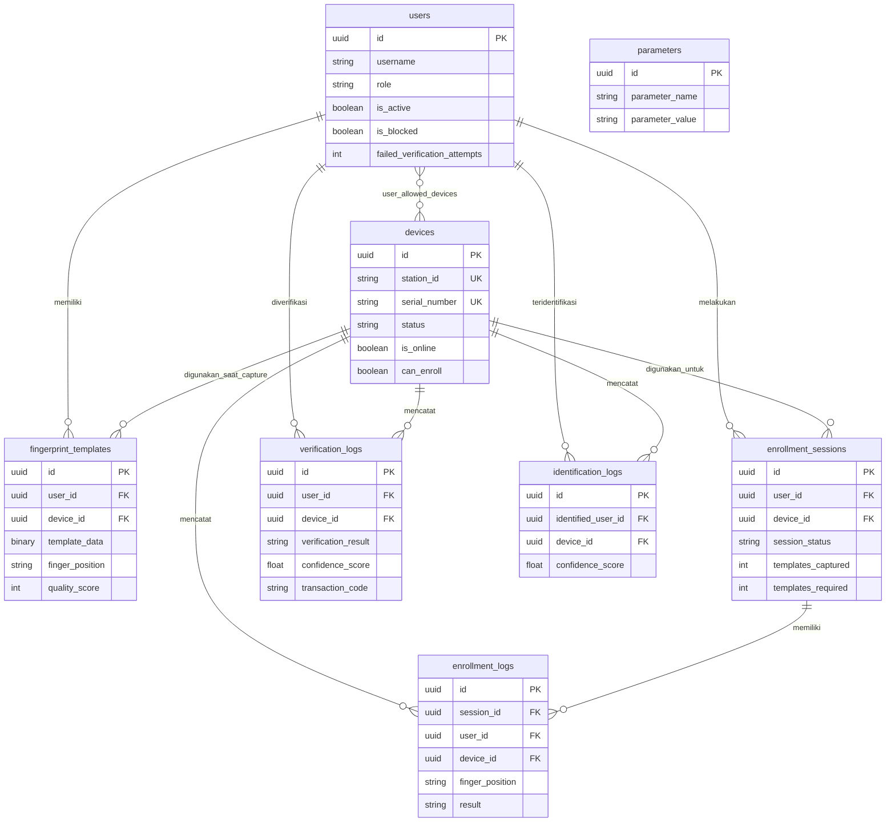
```mermaid
erDiagram
    users ||--o{ fingerprint_templates : "memiliki"
    users ||--o{ enrollment_sessions : "melakukan"
    users ||--o{ verification_logs : "diverifikasi"
    users ||--o{ identification_logs : "teridentifikasi"
    users }o--o{ devices : "user_allowed_devices"

    devices ||--o{ fingerprint_templates : "digunakan_saat_capture"
    devices ||--o{ enrollment_sessions : "digunakan_untuk"
    devices ||--o{ enrollment_logs : "mencatat"
    devices ||--o{ verification_logs : "mencatat"
    devices ||--o{ identification_logs : "mencatat"

    enrollment_sessions ||--o{ enrollment_logs : "memiliki"

    users {
        uuid id PK
        string username
        string role
        boolean is_active
        boolean is_blocked
        int failed_verification_attempts
    }

    devices {
        uuid id PK
        string station_id UK
        string serial_number UK
        string status
        boolean is_online
        boolean can_enroll
    }

    fingerprint_templates {
        uuid id PK
        uuid user_id FK
        uuid device_id FK
        binary template_data
        string finger_position
        int quality_score
    }

    enrollment_sessions {
        uuid id PK
        uuid user_id FK
        uuid device_id FK
        string session_status
        int templates_captured
        int templates_required
    }

    verification_logs {
        uuid id PK
        uuid user_id FK
        uuid device_id FK
        string verification_result
        float confidence_score
        string transaction_code
    }

    identification_logs {
        uuid id PK
        uuid identified_user_id FK
        uuid device_id FK
        float confidence_score
    }

    enrollment_logs {
        uuid id PK
        uuid session_id FK
        uuid user_id FK
        uuid device_id FK
        string finger_position
        string result
    }

    parameters {
        uuid id PK
        string parameter_name
        string parameter_value
    }
```

### 6.2 Deskripsi Tabel Database

> [!NOTE]
> Detail lengkap spesifikasi kolom, tipe data, constraint, dan index akan didokumentasikan dalam TSD (Technical Specification Document).

#### 6.2.1 users
Tabel master untuk menyimpan data user yang ter-enroll dalam sistem biometrik. Menyimpan informasi kredensial, role (user/admin), status aktif, counter failed verification untuk auto-lock, dan informasi blocking.

#### 6.2.2 devices
Tabel master station/device fingerprint scanner. Menyimpan informasi station_id, serial_number, manufacturer, model, IP address, status koneksi (is_online), kemampuan enrollment (can_enroll), dan approval status (pending/approved/active).

#### 6.2.3 fingerprint_templates
Tabel untuk menyimpan template sidik jari user. Setiap user dapat memiliki multiple records (maksimal 10 jari dengan unique constraint pada kombinasi user_id + finger_position). Template disimpan dalam format base64. Menyimpan quality_score untuk validasi kualitas capture.

#### 6.2.4 enrollment_sessions
Tabel untuk mencatat sesi enrollment. Menyimpan progress enrollment (templates_captured vs templates_required), status session (pending/in_progress/completed/failed), dan referensi ke user dan device yang digunakan.

#### 6.2.5 verification_logs
Tabel transaksi untuk mencatat setiap proses verifikasi fingerprint 1:1. Menyimpan hasil matching (match/no_match/error), confidence_score, referensi ke aplikasi dan transaksi, serta informasi audit (IP address, timestamp).

#### 6.2.6 identification_logs
Tabel transaksi untuk mencatat proses identifikasi 1:N. Menyimpan user yang teridentifikasi, confidence_score, dan informasi audit.

#### 6.2.7 enrollment_logs
Tabel detail untuk mencatat setiap capture dalam sesi enrollment. Menyimpan finger_position, quality_score, hasil capture (success/failure), dan pesan error jika ada.

#### 6.2.8 user_allowed_devices (Junction Table)
Tabel many-to-many untuk mengatur device mana saja yang boleh digunakan oleh user tertentu. Menyimpan role assignment dan status aktif.

#### 6.2.9 parameters
Tabel konfigurasi sistem untuk menyimpan parameter-parameter seperti threshold matching, timeout, dan konfigurasi lainnya.

---

## 7. Spesifikasi User Interface

### 7.1 Fingerstation UI
TBD

<!-- **Main Window:**

```
┌─────────────────────────────────────────────────────────┐
│  FingerStation v1.0                              [─][□][×]│
├─────────────────────────────────────────────────────────┤
│                                                         │
│   ┌─────────────────────────────────────────────────┐   │
│   │                                                 │   │
│   │                  [Device Icon]                  │   │
│   │                                                 │   │
│   │              Status: ● ONLINE                   │   │
│   │                                                 │   │
│   │         Device: DigitalPersona 4500            │   │
│   │         Serial: DP4500-ABC123                  │   │
│   │                                                 │   │
│   └─────────────────────────────────────────────────┘   │
│                                                         │
│   Station ID: STN-001-BRANCH-A                         │
│   Branch: Cabang Utama                                 │
│   IP: 192.168.1.100                                    │
│   Connected: 2025-01-28 08:00:00                       │
│                                                         │
├─────────────────────────────────────────────────────────┤
│   [Settings]                      [Reconnect] [Exit]   │
└─────────────────────────────────────────────────────────┘
``` -->

### 7.2 Verification Dialog
TBD
<!-- **Verification Prompt (Muncul di aplikasi bisnis):**

```
┌─────────────────────────────────────────────────────────┐
│  Verifikasi Sidik Jari                            [×]   │
├─────────────────────────────────────────────────────────┤
│                                                         │
│   Transaksi: Transfer Dana                             │
│   Referensi: TRX20250128001                            │
│   Nominal: Rp 50.000.000                               │
│                                                         │
│   ┌─────────────────────────────────────────────────┐   │
│   │                                                 │   │
│   │              [Fingerprint Icon]                 │   │
│   │                                                 │   │
│   │        Letakkan jari pada scanner              │   │
│   │                                                 │   │
│   │              Timeout: 25 detik                  │   │
│   │              ████████████░░░░░░░               │   │
│   │                                                 │   │
│   └─────────────────────────────────────────────────┘   │
│                                                         │
│   Percobaan: 1 dari 3                                  │
│                                                         │
├─────────────────────────────────────────────────────────┤
│              [Gunakan Password]        [Batal]         │
└─────────────────────────────────────────────────────────┘
```

**Verification Success:**

```
┌─────────────────────────────────────────────────────────┐
│  Verifikasi Berhasil                              [×]   │
├─────────────────────────────────────────────────────────┤
│                                                         │
│                    ✓ SUKSES                            │
│                                                         │
│   Verifikasi ID: VRF-20250128-00001                    │
│   Waktu: 2025-01-28 10:30:00                           │
│   User: John Doe (USR001)                              │
│                                                         │
├─────────────────────────────────────────────────────────┤
│                        [OK]                             │
└─────────────────────────────────────────────────────────┘
``` -->

### 7.3 Management Portal
TBD
<!-- **Dashboard:**

```
┌────────────────────────────────────────────────────────────────────┐
│  Fingerscan Management                    [User: Admin] [Logout]  │
├──────────────────┬─────────────────────────────────────────────────┤
│                  │                                                 │
│  Dashboard       │  ┌──────────────────────────────────────────┐  │
│  Enrollment      │  │  Station Status                          │  │
│  User Mgmt       │  ├──────────────────────────────────────────┤  │
│  Device Mgmt     │  │  ● Online: 45    ○ Offline: 3            │  │
│  Reports         │  │  ⚠ Error: 2     🔧 Maintenance: 1        │  │
│  Settings        │  └──────────────────────────────────────────┘  │
│                  │                                                 │
│                  │  ┌──────────────────────────────────────────┐  │
│                  │  │  Today's Statistics                      │  │
│                  │  ├──────────────────────────────────────────┤  │
│                  │  │  Total Verifications: 1,234              │  │
│                  │  │  Success Rate: 98.5%                     │  │
│                  │  │  Avg Response Time: 2.3s                 │  │
│                  │  │  Failed Attempts: 19                     │  │
│                  │  │  Users Locked: 2                         │  │
│                  │  └──────────────────────────────────────────┘  │
│                  │                                                 │
│                  │  ┌──────────────────────────────────────────┐  │
│                  │  │  Recent Alerts                           │  │
│                  │  ├──────────────────────────────────────────┤  │
│                  │  │  ⚠ Station STN-005 offline (5 min ago)   │  │
│                  │  │  🔒 User USR045 locked (10 min ago)       │  │
│                  │  │  ⚠ Station STN-012 device error          │  │
│                  │  └──────────────────────────────────────────┘  │
│                  │                                                 │
└──────────────────┴─────────────────────────────────────────────────┘
``` -->

---

## 8. Business Rules

| ID | Category | Rule | Implementation |
|----|----------|------|----------------|
| BR-001 | Enrollment | Minimal 2 jari dari kedua tangan | Validation sebelum save |
| BR-002 | Enrollment | Quality score minimal 40 | Check saat capture |
| BR-003 | Enrollment | Tidak boleh duplicate | Cross-check dengan existing templates |
| BR-004 | Enrollment | User harus aktif di HRMIS | API call ke HRMIS |
| BR-005 | Verification | Max retry 3x | Counter di database |
| BR-006 | Verification | Timeout 30 detik | Session expiry |
| BR-007 | Verification | Match threshold configurable | Default 40 |
| BR-008 | Verification | 1 active session per user | Reject concurrent |
| BR-009 | Lock | Auto lock setelah 3x gagal | System triggered |
| BR-010 | Lock | Manual unlock by admin only | Role-based access |
| BR-011 | Fallback | Approval dari Admin Kantor Pusat | Workflow approval |
| BR-012 | Fallback | Max duration 30 hari | Validation |
| BR-013 | Fallback | Auto disable setelah expired | Scheduler |
| BR-014 | Audit | Semua aktivitas harus di-log | Aspect/interceptor |
| BR-015 | Audit | Retention minimal 2 tahun | Archival policy |

---

## 9. Error Handling

### 9.1 Error Codes

| Code | Category | Message | Action |
|------|----------|---------|--------|
| E001 | Enrollment | User not found in HRMIS | Verify user data |
| E002 | Enrollment | User already enrolled | Use update instead |
| E003 | Enrollment | Low quality capture | Retry capture |
| E004 | Enrollment | Duplicate template detected | Investigate |
| E005 | Enrollment | Station not available | Check station status |
| E101 | Verification | User not enrolled | Complete enrollment first |
| E102 | Verification | User is locked | Contact admin |
| E103 | Verification | Session timeout | Retry verification |
| E104 | Verification | No match found | Retry or use fallback |
| E105 | Verification | Station offline | Use different station |
| E106 | Verification | Concurrent session exists | Wait and retry |
| E201 | Fallback | Not authorized | Contact IT admin |
| E202 | Fallback | Invalid duration | Check parameters |
| E203 | Fallback | Already active | Check existing fallback |
| E301 | Station | Device not connected | Check USB connection |
| E302 | Station | Device error | Restart device |
| E303 | Station | Network error | Check connectivity |
| E901 | System | Internal server error | Contact support |
| E902 | System | Database error | Contact support |
| E903 | System | Service unavailable | Try again later |

### 9.2 Error Response Format

```json
{
  "code": "E104",
  "message": "No match found",
  "details": {
    "session_id": "550e8400-e29b-41d4-a716-446655440000",
    "retry_remaining": 2
  },
  "timestamp": "2025-01-28T10:30:00Z"
}
```

---

## 10. Security Specification

### 10.1 Data Security

| Aspect | Specification |
|--------|---------------|
| Template Storage | AES-256 encryption at rest |
| Data Transmission | TLS 1.3 + mTLS |
| Key Management | HSM-based key storage |
| Template Format | ISO/IEC 19794-2 (tidak menyimpan gambar) |

### 10.2 Access Control

| Role | Permissions |
|------|-------------|
| Teller/CS | View own verification status |
| Approver | Perform verification |
| Branch Admin | Enrollment alternate, view station |
| IT Admin | Full access except audit deletion |
| Auditor | Read-only audit logs |

### 10.3 Network Security

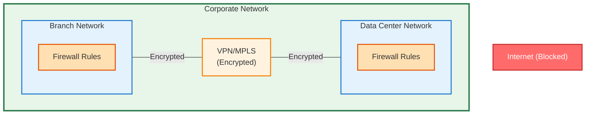
```mermaid
graph TB
    Internet["Internet (Blocked)"]
    
    subgraph Corporate["Corporate Network"]
        direction LR
        
        subgraph Branch["Branch Network"]
            BranchFW["Firewall Rules"]
        end
        
        VPN["VPN/MPLS<br/>(Encrypted)"]
        
        subgraph DataCenter["Data Center Network"]
            DCFW["Firewall Rules"]
        end
        
        Branch ---|Encrypted| VPN
        VPN ---|Encrypted| DataCenter
    end
        
    style Internet fill:#ff6b6b,stroke:#c92a2a,stroke-width:2px,color:#fff
    style Corporate fill:#E8F5E9,stroke:#2E7D4E,stroke-width:3px
    style Branch fill:#E3F2FD,stroke:#1976D2,stroke-width:2px
    style DataCenter fill:#E3F2FD,stroke:#1976D2,stroke-width:2px
    style VPN fill:#FFF3E0,stroke:#F57C00,stroke-width:2px
    style BranchFW fill:#FFE0B2,stroke:#E65100,stroke-width:2px
    style DCFW fill:#FFE0B2,stroke:#E65100,stroke-width:2px
```

### 10.4 Audit Trail

Semua akses dan operasi dicatat dengan informasi:

- Timestamp (dengan timezone)
- User ID dan IP address
- Action performed
- Result (success/failure)
- Request/Response payload (sanitized)

---

## 11. Performance Requirements

| Metric | Target | Measurement |
|--------|--------|-------------|
| Verification Response Time | < 5 detik (P95) | End-to-end |
| Enrollment Response Time | < 10 detik per jari | End-to-end |
| API Response Time | < 200ms (P95) | Server-side |
| Concurrent Verifications | 100 per detik | Load test |
| System Availability | 99.9% | Uptime monitoring |
| Database Query Time | < 50ms (P95) | Query profiling |
| WebSocket Latency | < 100ms | Network monitoring |

---

## 12. Lampiran

### Lampiran A: Finger Index Mapping

| Index | Tangan | Jari |
|-------|--------|------|
| 1 | Kanan | Jempol |
| 2 | Kanan | Telunjuk |
| 3 | Kanan | Tengah |
| 4 | Kanan | Manis |
| 5 | Kanan | Kelingking |
| 6 | Kiri | Jempol |
| 7 | Kiri | Telunjuk |
| 8 | Kiri | Tengah |
| 9 | Kiri | Manis |
| 10 | Kiri | Kelingking |

### Lampiran B: Status Transition

**User Status:**
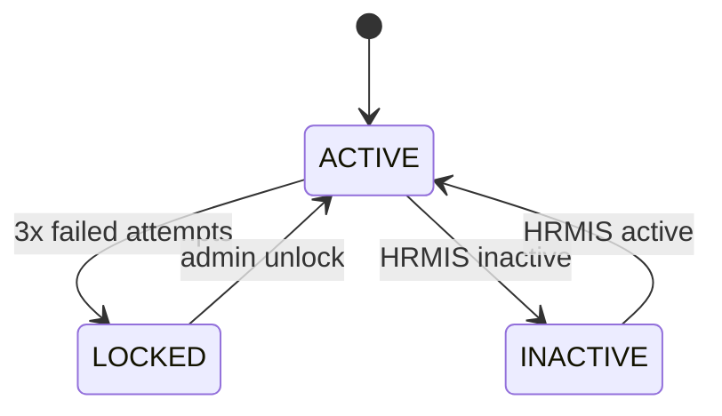
```mermaid
stateDiagram-v2
    [*] --> ACTIVE
    ACTIVE --> LOCKED: 3x failed attempts
    LOCKED --> ACTIVE: admin unlock
    ACTIVE --> INACTIVE: HRMIS inactive
    INACTIVE --> ACTIVE: HRMIS active
```

**Verification Status:**
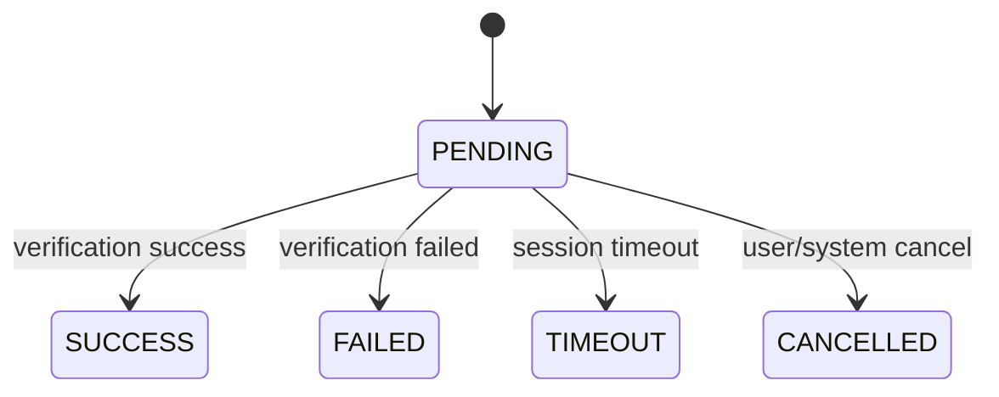
```mermaid
stateDiagram-v2
    [*] --> PENDING
    PENDING --> SUCCESS: verification success
    PENDING --> FAILED: verification failed
    PENDING --> TIMEOUT: session timeout
    PENDING --> CANCELLED: user/system cancel
```

**Station Status:**
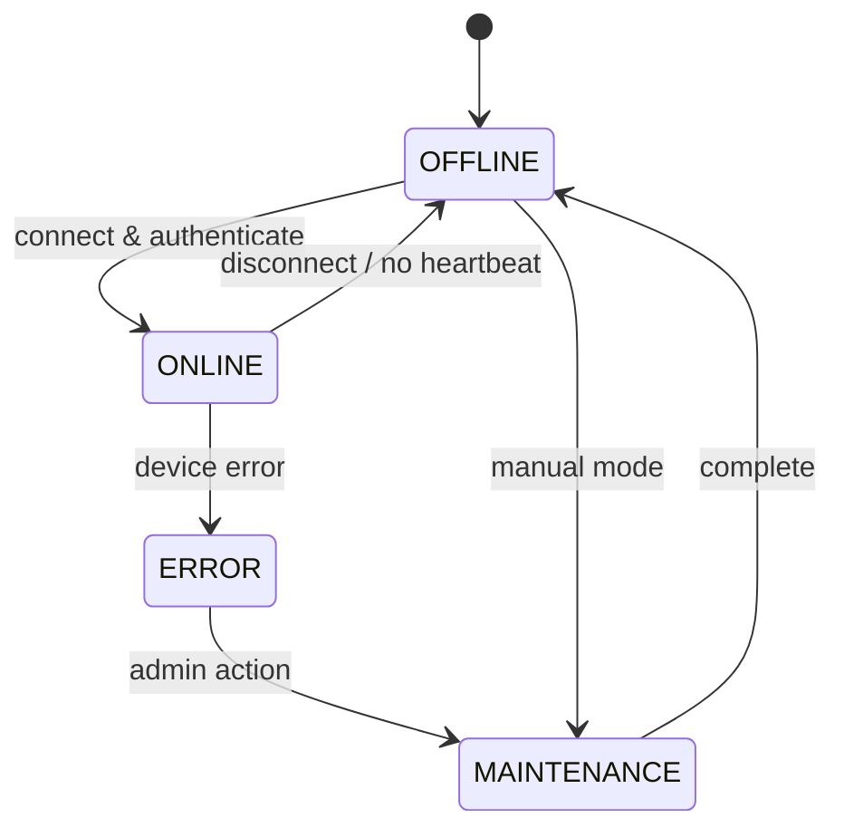
```mermaid
stateDiagram-v2
    [*] --> OFFLINE
    OFFLINE --> ONLINE: connect & authenticate
    ONLINE --> OFFLINE: disconnect / no heartbeat
    ONLINE --> ERROR: device error
    ERROR --> MAINTENANCE: admin action
    MAINTENANCE --> OFFLINE: complete
    OFFLINE --> MAINTENANCE: manual mode
```

### Lampiran C: Checklist Deployment

- [ ] Database schema created
- [ ] Redis cluster configured
- [ ] OIDC client registered
- [ ] mTLS certificates installed
- [ ] Firewall rules configured
- [ ] Monitoring setup complete
- [ ] Backup procedures tested
- [ ] Disaster recovery plan documented
- [ ] User training completed
- [ ] UAT sign-off obtained

---

## Riwayat Perubahan

| Versi | Tanggal | Penulis | Perubahan |
|-------|---------|---------|-----------|
| 1.0.0 | 01 Januari 2026 | - | Initial document |
| 1.1.0 | 30 Januari 2026 | - | Update API endpoints dan spesifikasi data sesuai implementasi backend (Sanic/Python) |

---

*Dokumen ini bersifat rahasia dan hanya untuk penggunaan internal.*
