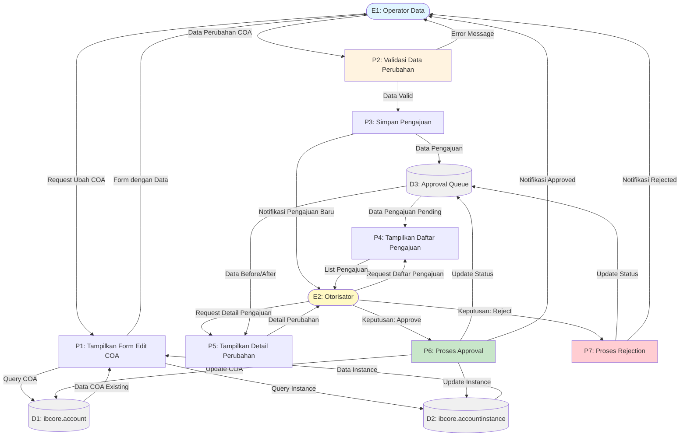
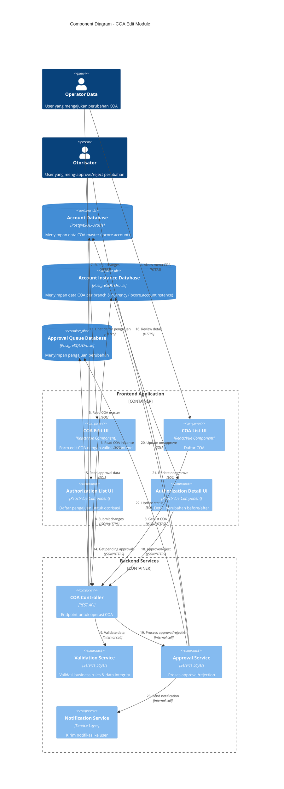

### Penjelasan Diagram:

**External Entities:**
- **E1 (Operator Data)**: User yang mengajukan perubahan COA
- **E2 (Otorisator)**: User yang meng-approve/reject pengajuan perubahan

**Processes:**
- **P1 (Tampilkan Form Edit COA)**: Load data COA dan instance dari database, tampilkan form edit ke operator
- **P2 (Validasi Data Perubahan)**: Validasi data perubahan (mandatory fields, business rules, format)
- **P3 (Simpan Pengajuan)**: Simpan data perubahan sebagai pengajuan pending approval
- **P4 (Tampilkan Daftar Pengajuan)**: Tampilkan daftar pengajuan pending ke otorisator
- **P5 (Tampilkan Detail Perubahan)**: Tampilkan detail before/after perubahan
- **P6 (Proses Approval)**: Approve pengajuan dan update data aktif di database
- **P7 (Proses Rejection)**: Reject pengajuan tanpa mengubah data aktif

**Data Stores:**
- **D1 (ibcore.account)**: Tabel master COA
- **D2 (ibcore.accountinstance)**: Tabel COA per branch & currency
- **D3 (Approval Queue)**: Tabel penyimpanan pengajuan perubahan

**Data Flows:**
1. Operator request form edit → sistem load data dari D1 & D2 → tampilkan form
2. Operator submit perubahan → validasi → simpan ke D3 (approval queue)
3. Otorisator akses daftar pengajuan → sistem load dari D3 → tampilkan list
4. Otorisator pilih pengajuan → sistem load detail → tampilkan before/after
5. Otorisator approve → update D1 & D2 → notifikasi ke operator
6. Otorisator reject → update status di D3 → notifikasi ke operator

**Urutan Proses (Process Sequence):**

**Skenario 1: Pengajuan Perubahan COA (oleh Operator)**
1. **P1**: Operator request ubah COA → sistem query D1 & D2 → tampilkan form edit dengan data existing
2. **P2**: Operator submit data perubahan → sistem validasi data (mandatory, format, business rules)
   - Jika validasi gagal → tampilkan error message ke operator (kembali ke P1)
   - Jika validasi berhasil → lanjut ke P3
3. **P3**: Sistem simpan pengajuan ke D3 (Approval Queue) dengan status "Pending" → kirim notifikasi ke otorisator

**Skenario 2: Approval Perubahan COA (oleh Otorisator)**
4. **P4**: Otorisator request daftar pengajuan → sistem query D3 untuk data pending → tampilkan list pengajuan
5. **P5**: Otorisator pilih pengajuan → sistem query D3 untuk detail → tampilkan before/after perubahan
6. **P6** (jika Approve): 
   - Sistem update data di D1 (ibcore.account)
   - Sistem update data di D2 (ibcore.accountinstance) 
   - Sistem update status pengajuan di D3 menjadi "Approved"
   - Sistem kirim notifikasi approval ke operator (E1)
7. **P7** (jika Reject):
   - Sistem update status pengajuan di D3 menjadi "Rejected"
   - Sistem kirim notifikasi rejection ke operator (E1)
   - Data di D1 & D2 tidak berubah

---

## C4 Component Diagram

Diagram berikut menunjukkan arsitektur komponen sistem menggunakan notasi C4 Model sebagai perbandingan dengan DFD di atas.

### Penjelasan C4 Component Diagram:

**People (Actors):**
- **Operator Data**: User yang mengajukan perubahan COA
- **Otorisator**: User yang melakukan approve/reject pengajuan

**Frontend Components:**
- **COA List UI**: Menampilkan daftar COA yang tersedia
- **COA Edit UI**: Form untuk edit data COA dengan validasi client-side
- **Authorization List UI**: Menampilkan daftar pengajuan yang pending
- **Authorization Detail UI**: Menampilkan detail perubahan (before/after) dan tombol approve/reject

**Backend Components:**
- **COA Controller**: REST API endpoints untuk semua operasi terkait COA dan approval
- **Validation Service**: Business logic untuk validasi data (mandatory fields, format, business rules)
- **Approval Service**: Orchestration logic untuk proses approval/rejection dan update database
- **Notification Service**: Service untuk mengirim notifikasi ke operator atau otorisator

**Databases:**
- **Account Database (D1)**: Database untuk tabel `ibcore.account` (master COA)
- **Account Instance Database (D2)**: Database untuk tabel `ibcore.accountinstance` (COA per branch & currency)
- **Approval Queue Database (D3)**: Database untuk menyimpan pengajuan perubahan pending

**Urutan Interaksi (Sequence):**

*Flow 1: Load dan Edit COA (Step 1-6)*
1. Operator akses menu COA via browser
2. Operator buka form edit COA
3. UI request list COA ke controller
4. UI request data COA detail ke controller
5. Controller query data master dari Account DB
6. Controller query data instance dari Account Instance DB

*Flow 2: Submit Perubahan (Step 7-12)*
7. Operator submit perubahan via form
8. UI kirim data perubahan ke controller
9. Controller panggil Validation Service untuk validasi
10. Controller panggil Approval Service untuk simpan pengajuan
11. Approval Service write data ke Approval Queue DB
12. Approval Service trigger notifikasi ke otorisator

*Flow 3: Review dan Approval (Step 13-23)*
13. Otorisator akses menu otorisasi
14. UI request daftar pending approvals
15. Controller read data dari Approval Queue DB
16. Otorisator pilih dan review detail pengajuan
17. UI request detail perubahan (before/after)
18. Otorisator klik approve/reject
19. Controller panggil Approval Service untuk process keputusan
20-21. (Jika approve) Approval Service update Account DB & Instance DB
22. Approval Service update status di Approval Queue DB
23. Approval Service trigger notifikasi ke operator

**Perbedaan DFD vs C4:**
- **DFD** fokus pada aliran data antar proses, data store, dan external entity (lebih cocok untuk analisis business process)
- **C4 Component** fokus pada arsitektur teknologi, komponen software, dan interaksi antar komponen (lebih cocok untuk desain teknis sistem)
- **Nomor di C4** menunjukkan urutan interaksi (sequence), sedangkan DFD lebih menekankan pada transformasi data
---
