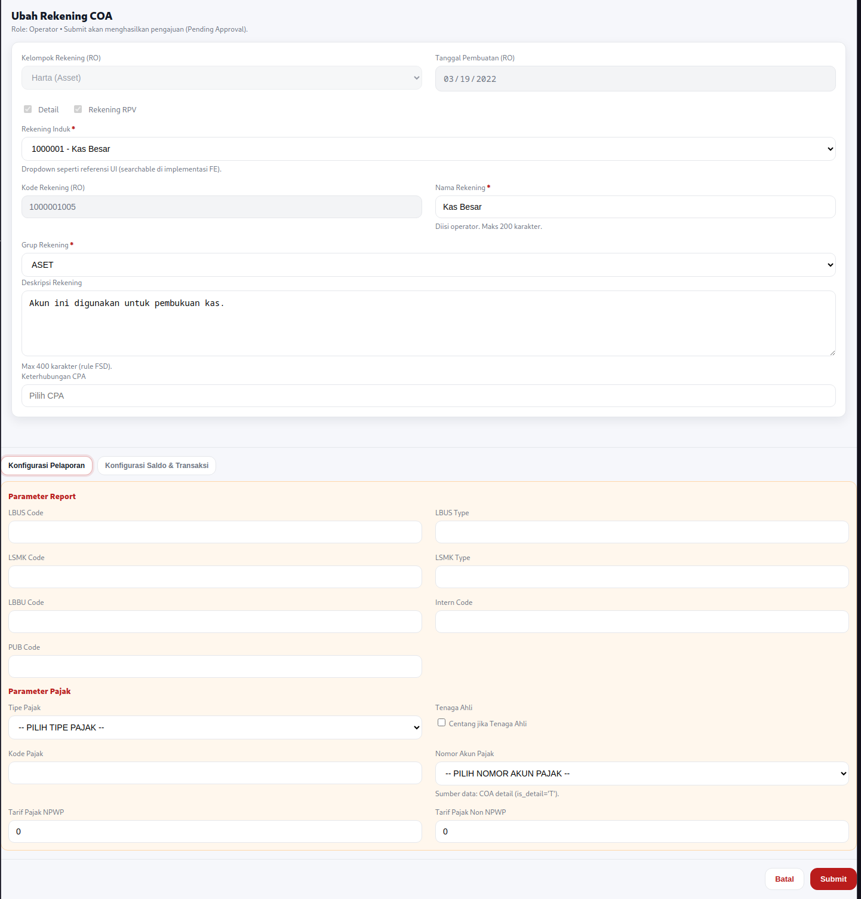
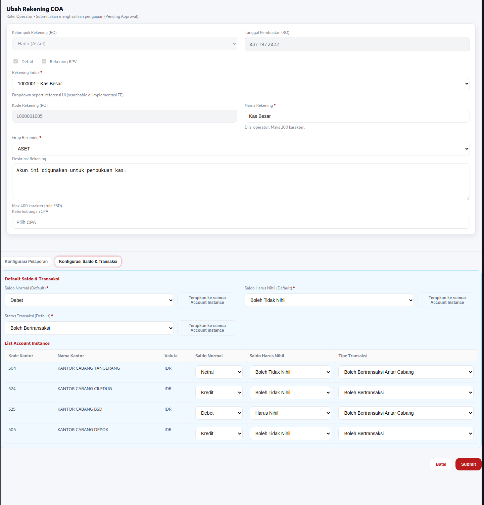

# FSD: Ubah Rekening (Chart of Account)

| **Metadata** | |
|--------------|-------------|
| **Module** | COA Management – Ubah Rekening |
| **Parent FSD** | FSD_COA_Main.md |
| **Version** | 1.0 |
| **Date** | 2026-01-19 |
| **Status** | Draft |
| **Owner** | IT / System Owner |

---

## Module Overview

Modul **Ubah Rekening (COA)** menyediakan fungsi untuk melakukan perubahan data master rekening (COA) beserta parameter pendukungnya.
Perubahan **tidak langsung efektif**, melainkan masuk ke **daftar otorisasi** untuk kemudian di-*approve* / di-*reject* oleh user berwenang.

Cakupan utama:

- Edit atribut COA pada level master (`ibcore.account`)
- Edit atribut COA per kantor & valuta (`ibcore.accountinstance`)
- Submit perubahan untuk proses otorisasi

---

## Actors & Roles


| Actor         | Deskripsi                                        |
| --------------- | -------------------------------------------------- |
| Operator Data | Mengajukan perubahan COA                         |
| Otorisator    | Melakukan approve/reject pengajuan perubahan COA |

---

## Data Flow Diagram

TBD

## 🖥️ Frontend Requirements (FE)

### FR-COA-001 (FE): Akses Halaman Ubah Rekening (COA)

**Deskripsi:**
Sistem harus menyediakan akses halaman untuk mengubah data rekening COA dari menu COA.

**Actor:** Operator Data

**Functional Acceptance Criteria:**

- Operator dapat membuka menu **Data Master → Data Rekening (COA)**
- Operator dapat memilih salah satu rekening dan klik **Ubah Rekening**
- Sistem menampilkan form edit dengan data existing
- Field **read-only** tetap tidak bisa diubah

**Functional Flow:**


| Step | Actor    | Action                                  | System Response               | Notes                 |
| ------ | ---------- | ----------------------------------------- | ------------------------------- | ----------------------- |
| 1    | Operator | Login                                   | Sistem validasi credential    |                       |
| 2    | Operator | Buka Data Master → Data Rekening (COA) | Sistem tampilkan daftar COA   |                       |
| 3    | Operator | Pilih COA, klik Ubah Rekening           | Sistem tampilkan halaman edit | Pre-fill data dari DB |

---

### FR-COA-002 (FE): Submit Perubahan COA untuk Otorisasi

**Deskripsi:**
Sistem harus menerima perubahan COA dan menyimpannya sebagai pengajuan yang memerlukan otorisasi.

**Actor:** Operator Data

**Functional Acceptance Criteria:**

- Sistem memvalidasi field mandatory & rule FE/BE
- Sistem menyimpan perubahan sebagai **pengajuan** dengan status **Pending Approval**
- Pengajuan muncul di daftar otorisasi untuk Otorisator

**Functional Flow:**


| Step | Actor    | Action                    | System Response                                                 | Notes                    |
| ------ | ---------- | --------------------------- | ----------------------------------------------------------------- | -------------------------- |
| 1    | Operator | Ubah field yang diizinkan | Sistem menerima input                                           |                          |
| 2    | Operator | Klik Submit               | Sistem validasi data                                            |                          |
| 3    | System   | Validasi                  | **IF** valid **THEN** simpan pengajuan **ELSE** tampilkan error |                          |
| 4    | System   | Simpan pengajuan          | Pengajuan masuk daftar otorisasi                                | Status: Pending Approval |

---

### FR-COA-003 (FE): Otorisasi Perubahan COA (Approve/Reject)

**Deskripsi:**
Sistem harus menyediakan daftar pengajuan perubahan COA dan memungkinkan Otorisator melakukan approve/reject.

**Actor:** Otorisator

**Functional Acceptance Criteria:**

- Otorisator dapat membuka daftar otorisasi (pending list)
- Otorisator dapat melihat detail perubahan (before/after)
- Otorisator dapat **Approve** atau **Reject**
- Jika Approve → perubahan diterapkan ke data aktif
- Jika Reject → perubahan dibatalkan, data aktif tidak berubah

**Functional Flow:**


| Step | Actor      | Action                | System Response                   | Notes                   |
| ------ | ------------ | ----------------------- | ----------------------------------- | ------------------------- |
| 1    | Otorisator | Login                 | Sistem validasi                   |                         |
| 2    | Otorisator | Buka daftar otorisasi | Sistem tampilkan data pending     |                         |
| 3    | Otorisator | Pilih pengajuan       | Sistem tampilkan detail perubahan | before/after            |
| 4    | Otorisator | Klik Approve/Reject   | Sistem proses keputusan           |                         |
| 5a   | System     | Approve               | Terapkan perubahan ke data aktif  | Update tabel terkait    |
| 5b   | System     | Reject                | Tandai pengajuan rejected         | Tidak update data aktif |

---

### UI/UX Specification

#### Menu & Navigasi

- **Data Master → Data Rekening (COA) → Ubah Rekening**

#### Proses Utama (UI)

1. Operator pilih rekening → buka form ubah
2. Operator edit field yang diizinkan
3. Operator submit → masuk otorisasi
4. Otorisator approve/reject

---

#### Mockup

- [FSD_COA_Edit.html](../assets/FSD_COA_Edit.html)

#### Screenshot

Screenshot Tab `Konfigurasi Pelaporan`



Screenshot Tab `Konfigurasi Saldo & Transaksi`

 |

---

### Frontend Field Specification & Validation

> Catatan: Beberapa label field UI dipetakan ke kolom DB berikut.

#### Form Ubah Rekening (Master `ibcore.account`)


| Field (UI)                    | Mandatory | DB Column                                   | Rules                                                 |
| ------------------------------- | ----------- | --------------------------------------------- | ------------------------------------------------------- |
| Kelompok Rekening             | M         | `account_group_code`                        | Read-only dari DB                                     |
| Tanggal Pembuatan             | M         | `time_create`                               | Read-only dari DB                                     |
| Rekening Administratif Aktiva | O         | `isactivaoffbalancesheet`                   | Read-only dari DB                                     |
| Account RPV                   | O         | `isrpvaccount`                              | Read-only dari DB                                     |
| Rekening Induk                | M         | `fl_parent_account`                         | Read-only. Parent rekening                            |
| Nama Rekening Induk           | M         | (lookup)                                    | Read-only. Lookup dari`account.account_name` parent   |
| Kode Rekening                 | M         | `account_code`                              | Read-only                                             |
| Nama Rekening                 | M         | `account_name`                              | Tidak boleh kosong. Max 200 char                      |
| Deskripsi Rekening            | O         | `account_desc`                              | Max 400 char                                          |
| Grup Rekening                 | M         | `account_type` / atau `account_group_code`* | Dropdown : reference data dengan kode     |
| Detail                        | O         | `is_detail`                                 | Read-only. Posting account indicator                  |
| Keterhubungan CPA             | O         | `fl_cpa_accountcode`                        | Pilih dari referensi CPA                              |
| LBUS Code                     | O         | `lbus_code`                                 | Pelaporan regulator                                   |
| LBUS Type                     | O         | `lbus_type`                                 | Pelaporan regulator                                   |
| LSMK Code                     | O         | `lsmk_code`                                 | Pelaporan regulator                                   |
| LSMK Type                     | O         | `lsmk_type`                                 | Pelaporan regulator                                   |
| LBBU Code                     | O         | `lbbu_code`                                 | Laporan internal                                      |
| Intern Code                   | O         | `intern_code`                               | Klasifikasi internal                                  |
| PUB Code                      | O         | `pub_code`                                  | Publikasi/laporan tertentu                            |
| Sandi BI                      | O         | `sandi_bi`                                  | Max 10 char                                           |
| Tipe Pajak                    | O         | `tax_type`                                  | Dari master pajak                                     |
| Tenaga Ahli                   | O         | `tax_flag_expert`                           | Default uncheck                                       |
| Kode Pajak                    | O         | `tax_code`                                  | Max 20 char                                           |
| Nomor Akun Pajak              | O         | `tax_account_code`                          | Refer ke`account.account_code` dengan `is_detail='T'` |
| Tarif Pajak NPWP              | O         | `tax_rate_npwp`                             | Numerik >= 0, default 0.00                            |
| Tarif Pajak Non NPWP          | O         | `tax_rate_non_npwp`                         | Numerik >= 0, default 0.00                            |
| Flag PPh21                    | O         | `tax_flag_pph21`                            | Opsional, flag                                        |
| RPV RAK Report Show           | O         | `isrpvrakreportshow`                        | Flag tampil report                                    |
| Hidden Offbalance Sheet       | O         | `is_hidden_offbalancesheet`                 | Flag                                                  |
| RAK Account                   | O         | `israkaccount`                              | Flag                                                  |

\*Catatan: pada dokumen lama ada "Grup Rekening" sebagai klasifikasi laporan (misal ASET). Di schema tersedia `account_group_code` dan `account_type`. Implementasi final perlu konsisten (pilih salah satu atau gabungkan aturan).

---

#### Tab: Parameter Saldo dan Transaksi (Default di `ibcore.account`)


| Field (UI)                  | Mandatory | DB Column                 | Rules                                                                    |
| ----------------------------- | ----------- | --------------------------- | -------------------------------------------------------------------------- |
| Saldo Normal (Default)      | M         | `normal_balance_type_def` | Dropdown: {Debet, Kredit, Netral} (mapping ke kode internal`varchar(1)`) |
| Saldo Harus Nihil (Default) | M         | `is_zero_balance_def`     | Dropdown: {Boleh Tidak Nihil, Harus Nihil} (mapping`varchar(1)`)         |
| Status Transaksi (Default)  | M         | `trx_permit_type_def`     | Dropdown status transaksi (mapping`varchar(1)`)                          |

##### Button Rules


| Button                        | Aksi                                                                                           |
| ------------------------------- | ------------------------------------------------------------------------------------------------ |
| Set Semua Status Saldo Normal | Update`accountinstance.normal_balance_type` untuk seluruh instance sesuai default yang dipilih |
| Set Semua Status Saldo Nihil  | Update`accountinstance.is_zero_balance` untuk seluruh instance sesuai default yang dipilih     |
| Set Semua Status Transaksi    | Update`accountinstance.trx_permit_type` untuk seluruh instance sesuai default yang dipilih     |

---

#### Grid: List Account Instance (`ibcore.accountinstance`)


| Field (UI)        | Mandatory | DB Column             | Rules                           |
| ------------------- | ----------- | ----------------------- | --------------------------------- |
| Kode Kantor       | M         | `branch_code`         | Read-only                       |
| Nama Kantor       | M         | (lookup)              | Read-only, lookup master branch |
| Kode Valuta       | M         | `currency_code`       | Read-only                       |
| Saldo Normal      | M         | `normal_balance_type` | Editable                        |
| Saldo Harus Nihil | M         | `is_zero_balance`     | Editable                        |
| Tipe Bertransaksi | M         | `trx_permit_type`     | Editable                        |

---

## 🛠️ Backend Requirements (BE)

### BE-COA-Edit-001: Get Data COA

**Request:**

- `account_code` (kode rekening yang akan di-retrieve)

**Response:**

1. **Tabel `ibcore.account`** - Data master COA
   - SELECT semua kolom yang diperlukan berdasarkan `account_code`
   - Includes: identitas rekening, klasifikasi, parameter default, data pajak, flag-flag, audit field
   
2. **Tabel `ibcore.accountinstance`** - Data instance per branch & currency
   - SELECT semua instance yang terkait dengan `account_code`
   - Includes: `accountinstance_id`, `branch_code`, `currency_code`, `normal_balance_type`, `is_zero_balance`, `trx_permit_type`
   - JOIN dengan master `branch` untuk mendapatkan nama kantor
   - JOIN dengan master `currency` untuk informasi valuta

**Response Data Structure:**

> **Catatan:** Spesifikasi berikut ditampilkan dalam format JSON untuk memudahkan pemahaman. Implementasi aktual tidak terikat pada format ini dan dapat menggunakan format message lain (seperti Protocol Buffers, gRPC, XML, atau format lainnya) sesuai kebutuhan arsitektur sistem.


```json
{
  "account": {
    "account_code": "...",
    "account_name": "...",
    "account_desc": "...",
    "fl_parent_account": "...",
    "parent_account_name": "...",  // lookup dari account parent
    "account_group_code": "...",
    "is_detail": "...",
    "normal_balance_type_def": "...",
    "is_zero_balance_def": "...",
    "trx_permit_type_def": "...",
    "tax_type": "...",
    "tax_code": "...",
    "tax_rate_npwp": 0.00,
    "tax_rate_non_npwp": 0.00,
    // ... field lainnya sesuai kebutuhan
  },
  "account_instances": [
    {
      "accountinstance_id": "...",
      "branch_code": "...",
      "branch_name": "...",  // lookup dari ibent.cabang
      "currency_code": "...",
      "normal_balance_type": "...",
      "is_zero_balance": "...",
      "trx_permit_type": "..."
    },
    {
      "accountinstance_id": "...",
      "branch_code": "...",
      "branch_name": "...",  // lookup dari ibent.cabang
      "currency_code": "...",
      "normal_balance_type": "...",
      "is_zero_balance": "...",
      "trx_permit_type": "..."
    },
    // ... instances lainnya
  ]
}
```

#### Response Field Specification

##### A. Account Master Data (Object `account`)

| Field Name | Type | Source Table | Description | Notes |
|------------|------|--------------|-------------|-------|
| `account_code` | string | `ibcore.account` | Kode rekening (PK) | Unique identifier |
| `account_name` | string | `ibcore.account` | Nama rekening | Max 200 char |
| `account_desc` | string | `ibcore.account` | Deskripsi rekening | Max 400 char |
| `fl_parent_account` | string | `ibcore.account` | Kode rekening induk | FK ke `account_code` |
| `parent_account_name` | string | `ibcore.account` (lookup) | Nama rekening induk | JOIN ke parent account |
| `account_group_code` | string | `ibcore.account` | Kode grup rekening | Klasifikasi rekening |
| `account_type` | string | `ibcore.account` | Tipe rekening | Tipe klasifikasi |
| `account_level` | integer | `ibcore.account` | Level hirarki | Kedalaman dalam tree |
| `is_detail` | string | `ibcore.account` | Flag posting account | 'T' = detail, 'F' = header |
| `normal_balance_type_def` | string | `ibcore.account` | Saldo normal default | D=Debet, K=Kredit, N=Netral |
| `is_zero_balance_def` | string | `ibcore.account` | Saldo harus nihil default | T=Harus Nihil, F=Boleh Tidak Nihil |
| `trx_permit_type_def` | string | `ibcore.account` | Status transaksi default | Kode status transaksi |
| `fl_cpa_accountcode` | string | `ibcore.account` | Keterhubungan CPA | Referensi CPA |
| `lbus_code` | string | `ibcore.account` | Kode LBUS | Pelaporan regulator |
| `lbus_type` | string | `ibcore.account` | Tipe LBUS | Klasifikasi LBUS |
| `lsmk_code` | string | `ibcore.account` | Kode LSMK | Pelaporan regulator |
| `lsmk_type` | string | `ibcore.account` | Tipe LSMK | Klasifikasi LSMK |
| `lbbu_code` | string | `ibcore.account` | Kode LBBU | Laporan internal |
| `intern_code` | string | `ibcore.account` | Kode internal | Klasifikasi internal |
| `pub_code` | string | `ibcore.account` | Kode publikasi | Publikasi/laporan |
| `sandi_bi` | string | `ibcore.account` | Sandi BI | Max 10 char |
| `tax_type` | string | `ibcore.account` | Tipe pajak | Dari master pajak |
| `tax_code` | string | `ibcore.account` | Kode pajak | Max 20 char |
| `tax_account_code` | string | `ibcore.account` | Nomor akun pajak | FK ke `account_code` |
| `tax_rate_npwp` | decimal | `ibcore.account` | Tarif pajak NPWP | >= 0, default 0.00 |
| `tax_rate_non_npwp` | decimal | `ibcore.account` | Tarif pajak non-NPWP | >= 0, default 0.00 |
| `tax_flag_pph21` | string | `ibcore.account` | Flag PPh21 | T/F |
| `tax_flag_expert` | string | `ibcore.account` | Flag tenaga ahli | T/F |
| `isactivaoffbalancesheet` | string | `ibcore.account` | Rekening adm. aktiva | T/F |
| `isrpvaccount` | string | `ibcore.account` | Account RPV | T/F |
| `isrpvrakreportshow` | string | `ibcore.account` | RPV RAK report show | T/F |
| `is_hidden_offbalancesheet` | string | `ibcore.account` | Hidden offbalance sheet | T/F |
| `israkaccount` | string | `ibcore.account` | RAK account | T/F |
| `userid_create` | string | `ibcore.account` | User pembuat | Audit field |
| `time_create` | timestamp | `ibcore.account` | Waktu pembuatan | Audit field |
| `userid_last_modified` | string | `ibcore.account` | User terakhir ubah | Audit field |
| `time_last_modified` | timestamp | `ibcore.account` | Waktu terakhir ubah | Audit field |

##### B. Account Instance Data (Array `account_instances[]`)

| Field Name | Type | Source Table | Description | Notes |
|------------|------|--------------|-------------|-------|
| `accountinstance_id` | string | `ibcore.accountinstance` | ID instance (PK) | Unique identifier |
| `account_code` | string | `ibcore.accountinstance` | Kode rekening | FK ke `ibcore.account` |
| `branch_code` | string | `ibcore.accountinstance` | Kode kantor/cabang | FK ke master branch |
| `branch_name` | string | `ibent.cabang` (lookup) | Nama kantor/cabang | JOIN dengan `ibent.cabang` |
| `currency_code` | string | `ibcore.accountinstance` | Kode valuta | FK ke master currency |
| `currency_name` | string | master currency (lookup) | Nama valuta | Optional, JOIN dengan master currency |
| `normal_balance_type` | string | `ibcore.accountinstance` | Saldo normal per instance | D=Debet, K=Kredit, N=Netral |
| `is_zero_balance` | string | `ibcore.accountinstance` | Saldo harus nihil per instance | T=Harus Nihil, F=Boleh Tidak Nihil |
| `trx_permit_type` | string | `ibcore.accountinstance` | Status transaksi per instance | Kode status transaksi |
| `isbolehinput` | string | `ibcore.accountinstance` | Boleh input manual | T/F |
| `balance_sign` | string | `ibcore.accountinstance` | Tanda saldo | +/- |

**Validasi:**

- `account_code` harus exist di `ibcore.account`
- Jika tidak ditemukan, return error 404 (data not found)

---

### BE-COA-002: Persist & Approval Apply

**Saat submit:**

- Simpan pengajuan perubahan + detail before/after (untuk audit & review otorisasi)
- Status pengajuan: Pending Approval

**Saat approve:**

- Update `ibcore.account` sesuai perubahan master
- Update `ibcore.accountinstance` sesuai perubahan per instance
- Update audit field `userid_last_modified`, `time_last_modified` pada `ibcore.account`
- Status pengajuan: Approved

**Saat reject:**

- Status pengajuan: Rejected
- Tidak ada perubahan ke data aktif

---

### Backend Data Requirements

#### Entity: `ibcore.account` (Master COA)

Primary Key: `account_code`

Kolom penting yang relevan untuk modul Ubah Rekening:

- Identitas & hirarki: `account_code`, `account_name`, `account_level`, `fl_parent_account`, `is_detail`
- Klasifikasi & pelaporan: `account_group_code`, `account_type`, `lbus_code`, `lbus_type`, `lsmk_code`, `lsmk_type`, `lbbu_code`, `intern_code`, `pub_code`, `sandi_bi`
- Parameter saldo & transaksi (default): `normal_balance_type_def`, `is_zero_balance_def`, `trx_permit_type_def`
- Parameter pajak: `tax_type`, `tax_code`, `tax_account_code`, `tax_rate_npwp`, `tax_rate_non_npwp`, `tax_flag_pph21`, `tax_flag_expert`
- Flag lain: `isactivaoffbalancesheet`, `isrpvrakreportshow`, `isrpvaccount`, `is_hidden_offbalancesheet`, `israkaccount`
- Audit: `userid_create`, `time_create`, `userid_last_modified`, `time_last_modified`

#### Entity: `ibcore.accountinstance` (COA per Branch & Currency)

Primary Key: `accountinstance_id`

Kolom penting yang relevan untuk modul Ubah Rekening:

- Identitas & relasi: `accountinstance_id`, `account_code`, `branch_code`, `currency_code`
- Parameter saldo & transaksi (per instance): `normal_balance_type`, `is_zero_balance`, `trx_permit_type`, `isbolehinput`, `balance_sign`
- (Read-only untuk konteks perubahan COA): berbagai kolom saldo seperti `balance`, `trial_balance`, dll.

## 📌 Shared Business Rules


| Rule ID    | Description                                                                                                               |
| ------------ | --------------------------------------------------------------------------------------------------------------------------- |
| FR-COA-R01 | `account_code` bersifat **read-only** dan tidak boleh diubah                                                              |
| FR-COA-R02 | `fl_parent_account` (rekening induk) bersifat **read-only** pada proses ubah rekening (sesuai dokumen awal)               |
| FR-COA-R03 | Semua perubahan wajib melalui**otorisasi** sebelum efektif                                                                |
| FR-COA-R04 | Jika pengajuan**Reject**, data aktif pada `account`/`accountinstance` tidak berubah                                       |
| FR-COA-R05 | Perubahan parameter default (di`account`) dapat dipropagasikan ke seluruh `accountinstance` melalui tombol "Set Semua..." |
| FR-COA-R06 | Field tarif pajak (`tax_rate_npwp`, `tax_rate_non_npwp`) tidak boleh negatif dan default 0.00 jika kosong                 |

---

## Open Questions (untuk finalisasi implementasi)


| # | Question                                                                          | Status | Notes                               |
| --- | ----------------------------------------------------------------------------------- | -------- | ------------------------------------- |


---

## Change Log

### 2026-01-19
- Inisialisasi 
- Menyesuaikan **Data Model** dan seluruh mapping field ke schema:
  - `ibcore.account`
  - `ibcore.accountinstance`
