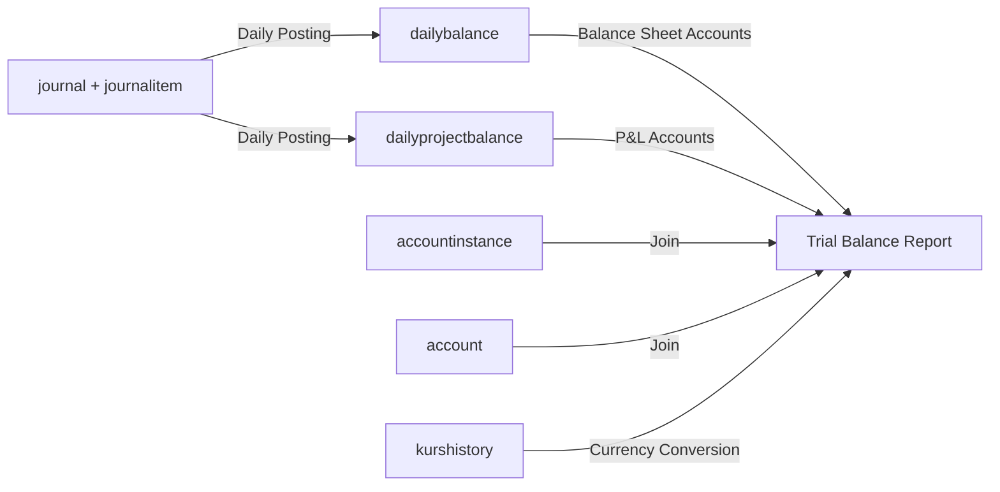

# TSD: Laporan Trial Balance

| **Metadata** | |
|--------------|-------------|
| **Module** | Laporan Trial Balance (General Ledger Reporting) |
| **Parent FSD** | FSD_trial-balance_report.md |
| **Version** | 1.0 |
| **Date** | 2026-02-05 |
| **Status** | Draft |
| **Owner** | IT / System Owner |

---

## 1. Tujuan & Ruang Lingkup

Dokumen ini menjabarkan spesifikasi teknis implementasi modul **Laporan Trial Balance**, mencakup:

- Endpoint backend untuk generate laporan Trial Balance (Neraca Saldo) dalam format Excel.
- Struktur payload dan mapping field ke schema database.
- Validasi, query data transaksi GL, dan perhitungan saldo (awal, mutasi, akhir).
- Konsolidasi multi-currency/multi-branch.
- Detail tabel database yang diakses.
- Mockup frontend dan mapping field UI ke database.

---

## 2. Asumsi & Ketergantungan

- Data transaksi GL sudah tersedia di `journalitem` untuk periode yang diminta.
- Master account tersedia di `account`.
- Exchange rate tersedia di `kurshistory` untuk konversi valuta.
- Master cabang tersedia di `enterprise.cabang`.
- User sudah login dan memiliki hak akses sesuai role.
- File Excel template untuk Trial Balance sudah tersedia.

---

## 3. Arsitektur Ringkas

- FE memanggil BE GraphQL endpoint `/graphql` dengan query `GetReportTrialBalance`.
- BE melakukan validasi parameter, query data transaksi, calculate balance (opening, movement, ending), konsolidasi (jika diperlukan), format ke Excel.
- BE menyimpan file Excel ke storage dan return JSON response dengan `url_path`.
- FE download Excel file dari URL yang diberikan.

> **Note**: Sistem menggunakan GraphQL untuk komunikasi FE-BE, bukan REST API.

---

## 4. Model Data & Mapping

### 4.1 Entity Utama

- `journalitem` (Transaksi GL)
  - PK: `journalitem_id`
- `accountinstance` (Instance Account per Cabang)
  - PK: `accountinstance_id`
- `account` (Master Chart of Account)
  - PK: `account_code`
- `kurshistory` (History Kurs Valuta)
  - PK: `kurshistory_id`
- `enterprise.cabang` (Master Cabang)
  - PK: `kode_cabang`

---

## 5. 🖥️ Frontend Specification

### 5.1 Mockup

Link mockup UI: [trial-balance.html](./assets/trial-balance.html)

### 5.2 Frontend Field Mapping

#### Form Generate Laporan Trial Balance

| Field (UI) | Mandatory | GraphQL Variable | DB Table | Rules |
|------------|-----------|------------------|----------|--------|
| Mulai Tanggal | M | `start_date` | - | GraphQL variable. Format YYYY-MM-DD. Must be valid date |
| Hingga Tanggal | M | `end_date` | - | GraphQL variable. Format YYYY-MM-DD. Must be >= Mulai Tanggal and <= today |
| Konsolidasi Valuta | O | `is_consol_currency` | - | GraphQL variable. String: "T" or "F". If checked, `is_consol_currency` = "T" and `currency` can be empty |
| Valuta | C | `currency` | `kurshistory` | GraphQL variable. String: {IDR, USD, EUR, SGD}. Conditional required (if is_consol_currency = "F"). Disabled if Konsolidasi Valuta checked |
| Konsolidasi Cabang | O | `is_consol_branch` | - | GraphQL variable. String: "T" or "F". If checked, `is_consol_branch` = "T" |
| Cabang | O | `branch_code` | `enterprise.cabang` | GraphQL variable. String of branch code. Default "". Disabled if Konsolidasi Cabang checked |
| Tampilkan hanya yang memiliki saldo | O | `is_only_has_balance` | - | GraphQL variable. String: "T" or "F". Default "F". Filter accounts with non-zero balance |

**Field Details:**

**1. Mulai Tanggal**
- Tipe: Text input dengan date picker
- Label: "Mulai Tanggal"
- Format: YYYY-MM-DD (untuk GraphQL variable)
- Format Display: DD/MM/YYYY (untuk UI)
- Required: Ya
- Default: Tanggal hari ini
- Mapping: `start_date`
- Validasi:
  - Format tanggal valid
  - Harus berupa tanggal yang valid

**2. Hingga Tanggal**
- Tipe: Text input dengan date picker
- Label: "Hingga Tanggal"
- Format: YYYY-MM-DD (untuk GraphQL variable)
- Format Display: DD/MM/YYYY (untuk UI)
- Required: Ya
- Default: Tanggal hari ini
- Mapping: `end_date`
- Validasi:
  - Format tanggal valid
  - Harus >= Mulai Tanggal
  - Harus <= tanggal hari ini

**3. Konsolidasi Valuta**
- Tipe: Checkbox
- Label: "Konsolidasi Valuta"
- Default: Tidak dicentang
- Mapping: `is_consol_currency` = "T" | "F"
- Perilaku: Ketika dicentang, disable dropdown Valuta dan konversi semua valuta ke IDR
- **Independent dari Konsolidasi Cabang**

**4. Valuta**
- Tipe: Select/Dropdown
- Label: "Valuta"
- Placeholder: "-- PILIH VALUTA --"
- Default: "Rupiah (IDR)" ketika enabled
- Opsi:
  - Rupiah (IDR)
  - US Dollar (USD)
  - Euro (EUR)
  - Singapore Dollar (SGD)
- Mapping: `currency`
- Conditional Required: Required jika `is_consol_currency` = "F"
- Disabled ketika: Konsolidasi Valuta dicentang

**5. Konsolidasi Cabang**
- Tipe: Checkbox
- Label: "Konsolidasi Cabang"
- Default: Tidak dicentang
- Mapping: `is_consol_branch` = "T" | "F"
- Perilaku: Ketika dicentang, disable dropdown Cabang dan agregasi semua cabang
- **Independent dari Konsolidasi Valuta**

**6. Cabang**
- Tipe: Select/Dropdown
- Label: "Cabang"
- Placeholder: "-- PILIH SEMUA --"
- Opsi: Dimuat dari backend (daftar cabang berdasarkan akses user)
- Mapping: `branch_code`
- Disabled ketika: Konsolidasi Cabang dicentang

**7. Tampilkan hanya yang memiliki saldo**
- Tipe: Checkbox
- Default: Tidak dicentang
- Mapping: `is_only_has_balance` = "T" | "F"
- Perilaku: Ketika dicentang, filter hanya account dengan saldo akhir tidak nol

**8. Tombol Generate Excel**
- Tipe: Button
- Label: "Generate Excel"
- Icon: 📊
- Aksi: Submit form dan panggil GraphQL query untuk generate Excel file

---

## 6. 🛠️ Backend Specification

### 6.1 GraphQL API Specification

**GraphQL Endpoint:** `POST /graphql`

**Content-Type:** `application/json`

> **Note**: Backend menggunakan GraphQL API. Semua request dikirim ke `/graphql` endpoint dengan query dan variables.

#### 6.1.1 Generate Laporan Trial Balance

**GraphQL Query:** `GetReportTrialBalance`

**GraphQL Schema:**

```graphql
input ReqGenerateReportTrialBalance {
    start_date: String!
    end_date: String!
    branch_code: String = ""
    currency: String = ""
    is_consol_currency: String = "F"
    is_consol_branch: String = "F"
    is_only_has_balance: String = "F"
}

type RespGenerateReportTrialBalance {
    url_path: String
}

extend type Query {
    GetReportTrialBalance(input: ReqGenerateReportTrialBalance): RespGenerateReportTrialBalance
}
```

**Tabel yang Diakses (SELECT):**

| Tabel | Operasi | Kolom | Join/Lookup |
|-------|---------|-------|-------------|
| `dailybalance` | **SELECT** | accountinstance_id, datevalue, debit, credit, balance, balancecumulative, debit_ekuiv, credit_ekuiv, balance_ekuiv, balancecumulative_ekuiv | Source utama untuk account type A/L/E/M (opening, movement, ending) |
| `dailyprojectbalance` | **SELECT** | accountinstance_id, project_no, datevalue, debit, credit, balance, balancecumulative, debit_ekuiv, credit_ekuiv, balance_ekuiv, balancecumulative_ekuiv | Source utama untuk account type I/X (dengan breakdown project) |
| `journal` + `journalitem` | **SELECT** (conditional) | journal_date, journal_no, nilai_kurs, amount_debit, amount_credit, fl_journal, accountinstance_id, rc_code | Untuk jurnal hari ini yang belum ter-posting ke `dailybalance` |
| `accountinstance` | **SELECT** | accountinstance_id, account_code, branch_code, currency_code, balance_sign, fl_cpa_accountinstance | Join ke source balance + filter cabang/valuta |
| `account` | **SELECT** | account_code, account_name, account_type, is_detail, account_level | Join account master dan sorting |
| `kurshistory` | **SELECT** (conditional) | currency_code, history_date, kurs_tengah_bi | JOIN jika is_consol_currency = 'T'. WHERE history_date = end_date |
| `enterprise.cabang` | **SELECT** (lookup) | branch_code/kode_cabang, nama_cabang, is_active | JOIN untuk nama cabang (optional) |

**Request GraphQL Query:**

```graphql
query GetReportTrialBalance($input: ReqGenerateReportTrialBalance) {
  GetReportTrialBalance(input: $input) {
    url_path
  }
}
```

**Request Variables:**

```json
{
  "input": {
    "start_date": "2026-01-01",
    "end_date": "2026-01-28",
    "branch_code": "001",
    "currency": "IDR",
    "is_consol_currency": "F",
    "is_consol_branch": "F",
    "is_only_has_balance": "T"
  }
}
```

**Response:**

```json
{
  "data": {
    "GetReportTrialBalance": {
      "url_path": "/storage/reports/trial-balance-20260128-abc123.xlsx"
    }
  }
}
```

> **Note**: Response berisi `url_path` untuk download file Excel. Frontend perlu melakukan GET request ke URL tersebut untuk download file.

**Proses Backend:**

1. Validasi input parameters:
   - `start_date`: format valid YYYY-MM-DD
   - `end_date`: format valid YYYY-MM-DD, >= start_date, <= current date
   - `currency`: valid jika is_consol_currency = 'F', bisa kosong jika is_consol_currency = 'T'
   - `branch_code`: optional, untuk filter branch, bisa kosong jika is_consol_branch = 'T'
   - `is_consol_currency`: "T" atau "F", default "F"
   - `is_consol_branch`: "T" atau "F", default "F"

2. **Calculate Opening Balance (Saldo Awal):**
   - Untuk account type A/L/E/M: ambil `balancecumulative` terakhir dari `dailybalance` dengan `datevalue <= BALANCE_DATE` (`BALANCE_DATE = start_date - 1 hari`)
   - Untuk account type I/X: ambil `balancecumulative` terakhir dari `dailyprojectbalance` dengan `datevalue <= BALANCE_DATE`
   - Group by accountinstance (dan `project_no` untuk I/X)
   - Filter by branch_code (jika is_consol_branch = 'F' dan branch_code tidak kosong)
   - Filter by currency (jika is_consol_currency = 'F' dan currency tidak kosong)

3. **Calculate Movement (Mutasi):**
   - Untuk account type A/L/E/M: SUM `debit`/`credit` dari `dailybalance` pada rentang `BEGIN_DATE` s/d `END_DATE`
   - Untuk account type I/X: SUM `debit`/`credit` dari `dailyprojectbalance` pada rentang `BEGIN_DATE` s/d `END_DATE`
   - Group by accountinstance (dan `project_no` untuk I/X)
   - Filter by branch_code (jika is_consol_branch = 'F' dan branch_code tidak kosong)
   - Filter by currency (jika is_consol_currency = 'F' dan currency tidak kosong)

4. **Calculate Ending Balance (Saldo Akhir):**
   - Untuk account type A/L/E/M: ambil `balancecumulative` terakhir dari `dailybalance` dengan `datevalue <= END_DATE`
   - Untuk account type I/X: ambil `balancecumulative` terakhir dari `dailyprojectbalance` dengan `datevalue <= END_DATE`

5. **Handle Jurnal Hari Ini (Unposted Daily Balance):**
   - Jika `END_DATE = TODAY`, tambahkan mutasi dari `journal` + `journalitem` untuk transaksi yang belum ter-posting ke `dailybalance`
   - Include jurnal ke akun langsung dan jurnal CPA (`fl_cpa_accountinstance`) untuk konsolidasi cabang
   - Untuk account I/X, mapping project menggunakan `journalitem.rc_code`

6. **Konsolidasi Valuta (jika `is_consol_currency = 'T'`):**
   - Query exchange rate dari `kurshistory` untuk `history_date = end_date`
   - Konversi semua balance (opening, movement, ending) ke IDR (base currency) menggunakan kurs_tengah_bi
   - Aggregate balance per account per cabang (merge semua currency)
   - **Note:** Konsolidasi valuta dapat dilakukan dengan atau tanpa konsolidasi cabang

7. **Konsolidasi Cabang (jika `is_consol_branch = 'T'`):**
   - Aggregate balance per account per currency (merge semua branch)
   - **Note:** Konsolidasi cabang dapat dilakukan dengan atau tanpa konsolidasi valuta

8. **Jika keduanya `is_consol_currency = 'T'` DAN `is_consol_branch = 'T'`:**
   - Konversi semua valuta ke IDR
   - Aggregate semua branch
   - Hasil akhir: satu baris per account (total konsolidasi penuh)

9. **Jika `is_only_has_balance = 'T'`:**
   - Filter hanya account dengan ending balance != 0 (ending_debit > 0 OR ending_credit > 0)

10. **Grouping dan Sorting:**
   - Join dengan `account` untuk mendapatkan account_name
   - Sort by account_code (ascending)

11. **Calculate Grand Total:****
   - Grand Total Opening Debit = SUM(opening_debit)
   - Grand Total Opening Credit = SUM(opening_credit)
   - Grand Total Movement Debit = SUM(movement_debit)
   - Grand Total Movement Credit = SUM(movement_credit)
   - Grand Total Ending Debit = SUM(ending_debit)
   - Grand Total Ending Credit = SUM(ending_credit)

12. **Validation Balance Equation:****
    - Total Ending Debit MUST EQUAL Total Ending Credit
    - If not balanced, return GraphQL error

13. **Format data ke struktur Excel dengan kolom:****
    - Kode Rekening
    - Nama Rekening
    - Saldo Awal Debit
    - Saldo Awal Kredit
    - Mutasi Debit
    - Mutasi Kredit
    - Saldo Akhir Debit
    - Saldo Akhir Kredit

14. Generate file Excel menggunakan template Trial Balance

15. **Upload file ke storage** (S3, local storage, atau file server)

16. **Return JSON response** dengan `url_path` ke file Excel yang telah di-generate

**Validation:**

- `start_date` required dan valid format YYYY-MM-DD
- `end_date` required dan valid format YYYY-MM-DD
- `start_date <= end_date`
- `end_date <= current date`
- `is_consol_currency` optional, valid values: "T" or "F", default "F"
- `is_consol_branch` optional, valid values: "T" or "F", default "F"
- Jika `is_consol_currency = 'F'`, maka `currency` required
- Jika `is_consol_currency = 'T'`, maka `currency` dapat kosong (akan konversi semua valuta ke IDR)
- Jika `is_consol_branch = 'F'`, maka `branch_code` optional (dapat filter specific branch)
- Jika `is_consol_branch = 'T'`, maka `branch_code` ignored (akan agregasi semua branch)
- `is_only_has_balance` optional, valid values: "T" or "F", default "F"

**Exception Handling (GraphQL Errors):**

GraphQL menggunakan error format berbeda dari HTTP status codes. Error dikembalikan dalam `errors` array di response:

```json
{
  "errors": [
    {
      "message": "Format tanggal tidak valid",
      "extensions": {
        "code": "TB-400-01",
        "field": "start_date"
      }
    }
  ]
}
```

| Code | Scenario | Message |
|------|----------|---------|
| TB-400-01 | Invalid date format | "Format tanggal tidak valid" |
| TB-400-02 | start_date > end_date | "Mulai tanggal tidak boleh lebih besar dari hingga tanggal" |
| TB-400-03 | end_date > current date | "Hingga tanggal tidak boleh melebihi hari ini" |
| TB-400-04 | Invalid currency | "Kode valuta tidak valid" |
| TB-400-05 | Invalid branch | "Kode cabang tidak valid" |
| TB-400-06 | Missing required parameter | "Parameter [nama] wajib diisi" |
| TB-404-01 | No data found | "Data tidak ditemukan untuk periode yang diminta" |
| TB-404-02 | Exchange rate not found | "Kurs tidak tersedia untuk tanggal [date]" |
| TB-500-01 | Balance not balanced | "Total debit dan kredit tidak balance" |
| TB-500-02 | Excel generation error | "Gagal generate file Excel" |
| TB-500-03 | Database error | "Gagal mengambil data dari database" |

---

### 6.1.2 API Endpoint untuk Data Lookup (Dropdown)

> [!NOTE]
> **Reference Implementation**: `apps/gl-module/src/app/apps/laporan/trial-balance/api`
> 
> Backend harus menyediakan endpoint untuk load data dropdown secara async (Cabang dan Valuta).

**Endpoint:** `POST /apps/laporan/trial-balance/api`

**Content-Type:** `application/json`

#### Request: Get Cabang (Branch) List

```json
{
  "data_id": "getCabang"
}
```

**Response:**

```json
{
  "success": true,
  "data": [
    {
      "branch_code": "001",
      "branch_name": "Cabang Jakarta Pusat"
    },
    {
      "branch_code": "002",
      "branch_name": "Cabang Bandung"
    },
    {
      "branch_code": "003",
      "branch_name": "Cabang Surabaya"
    }
  ]
}
```

**Business Logic:**
- Return list of branches based on user's access rights
- Only return active branches (`is_active = true`)
- Sort by `branch_code` ascending

**Database Query:**

```sql
SELECT kode_cabang, nama_cabang
FROM enterprise.cabang
WHERE kode_cabang IN (
    SELECT kode_cabang 
    FROM enterprise.listcabangdiizinkan 
    WHERE user_id = :user_id
  )
ORDER BY kode_cabang ASC;
```

---

#### Request: Get Valuta (Currency) List

**Option 1: Static list (Recommended)**

Frontend can use static dropdown options:
```typescript
options: [
  { value: 'IDR', label: 'Rupiah' },
  { value: 'USD', label: 'US Dollar' },
  { value: 'EUR', label: 'Euro' },
  { value: 'SGD', label: 'Singapore Dollar' },
]
```

**Option 2: Dynamic from database**

```json
{
  "data_id": "getSelectValuta",
  "keyword_valuta": ""  // Optional search keyword
}
```

**Response:**

```json
{
  "success": true,
  "data": [
    {
      "currency_code": "IDR",
      "currency_name": "Rupiah"
    },
    {
      "currency_code": "USD",
      "currency_name": "US Dollar"
    },
    {
      "currency_code": "EUR",
      "currency_name": "Euro"
    },
    {
      "currency_code": "SGD",
      "currency_name": "Singapore Dollar"
    }
  ]
}
```

**Database Query:**

```sql
SELECT DISTINCT currency_code, currency_name
FROM kurshistory
WHERE currency_code IN ('IDR', 'USD', 'EUR', 'SGD')
  AND history_date = (SELECT MAX(history_date) FROM kurshistory)
ORDER BY 
  CASE currency_code
    WHEN 'IDR' THEN 1
    WHEN 'USD' THEN 2
    WHEN 'EUR' THEN 3
    WHEN 'SGD' THEN 4
  END;
```

---

### 6.3 GraphQL Integration Notes

#### 6.3.1 Referensi Implementasi

Backend menggunakan GraphQL implementation dari repository: `ei-ledger-gql`

- **Schema File:** `/services/internal/graph/schemas/tb.graphqls`
- **Resolver:** `/services/internal/graph/resolvers/`
- **Generated Code:** `/services/internal/graph/generated/`

#### 6.3.2 Authentication & Authorization

- **Authentication:** Menggunakan JWT token di header request
  - Header: `Authorization: Bearer <token>`
  - Token berisi informasi user, role, dan branch access
- **Authorization:** Validasi di resolver level
  - User harus memiliki role yang diizinkan (Operator Data, Otorisator, Supervisor, Manager)
  - User hanya bisa generate laporan untuk branch yang diizinkan sesuai access rights

#### 6.3.3 Error Handling di GraphQL

GraphQL menggunakan pendekatan error handling yang berbeda dari REST API:

**REST API:**
- Menggunakan HTTP status codes (400, 404, 500)
- Error message di response body

**GraphQL:**
- HTTP status selalu 200 (kecuali server error)
- Error dikembalikan di `errors` array dalam response
- Setiap error memiliki `message` dan `extensions` (untuk metadata tambahan seperti error code, field yang error)

**Contoh Response dengan Error:**

```json
{
  "data": {
    "GetReportTrialBalance": null
  },
  "errors": [
    {
      "message": "Format tanggal tidak valid",
      "path": ["GetReportTrialBalance"],
      "extensions": {
        "code": "TB-400-01",
        "field": "start_date",
        "invalidValue": "2026/01/01"
      }
    }
  ]
}
```

#### 6.3.4 File Download Workflow

Karena response GraphQL berupa JSON (bukan binary file), download Excel menggunakan workflow 2-step:

**Step 1: Call GraphQL Query**
- Frontend memanggil `GetReportTrialBalance` query
- Backend generate Excel file dan upload ke storage
- Backend return `url_path` dalam response

**Step 2: Download File**
- Frontend melakukan GET request ke `url_path` yang diberikan
- Download Excel file dari storage

**Contoh Implementation (Frontend):**

```javascript
// Step 1: Call GraphQL Query
const response = await graphqlClient.query({
  query: GET_REPORT_TRIAL_BALANCE,
  variables: {
    input: {
      start_date: "2026-01-01",
      end_date: "2026-01-28",
      branch_code: "001",
      currency: "IDR",
      is_consol_currency: "F",
      is_consol_branch: "F",
      is_only_has_balance: "T"
    }
  }
});

// Step 2: Download from URL
const urlPath = response.data.GetReportTrialBalance.url_path;
window.open(urlPath, '_blank'); // atau menggunakan fetch/axios untuk download
```

#### 6.3.5 Retry & Timeout Logic

- **Query Timeout:** Maximum 120 detik (karena complexity perhitungan balance)
- **File Generation:** Async process, jika gagal bisa retry
- **Storage URL:** URL mungkin memiliki expiration time (perlu dikonfirmasi dengan tim infra)

#### 6.3.6 Perbedaan dengan REST API

| Aspek | REST API (Lama) | GraphQL (Baru) |
|-------|-----------------|----------------|
| Endpoint | `POST /api/gl/reports/trial-balance/generate` | `POST /graphql` |
| Request Format | JSON body langsung | GraphQL query + variables |
| Response Type | Binary Excel file | JSON dengan `url_path` |
| Error Format | HTTP status codes | GraphQL errors array |
| Field Naming | camelCase | snake_case |
| Date Format | DD/MM/YYYY | YYYY-MM-DD |
| Boolean Values | true/false | "T"/"F" (String) |
| Download | Direct download | Two-step (query → URL → download) |

---

### 6.2 Backend Data Requirements

#### Entity: `journalitem` (Transaksi GL)

**Primary Key:** `journalitem_id`

**Kolom yang Relevan:**

| Kolom | Tipe | Keterangan |
|-------|------|------------|
| `journalitem_id` | bigint | ID transaksi (PK) |
| `fl_journal` | varchar | FK ke `journal.journal_no` |
| `accountinstance_id` | bigint | ID instance account (FK ke accountinstance) |
| `amount_debit` | decimal(18,2) | Jumlah debit |
| `amount_credit` | decimal(18,2) | Jumlah kredit |
| `rc_code` | varchar | Kode project/reference code (untuk akun I/X) |
| `description` | varchar(500) | Deskripsi transaksi |

**Join Relationships:**
- Join ke `accountinstance` untuk mendapatkan account details, cabang, currency, `balance_sign`, dan relasi CPA
- Digunakan terutama untuk jurnal hari ini (`journal_date = TODAY`) yang belum ter-posting ke `dailybalance`

**Index Requirements:**
- Index pada (`fl_journal`, `accountinstance_id`)
- Index pada (`accountinstance_id`, `rc_code`)

---

#### Entity: `accountinstance` (Account Instance per Cabang)

**Primary Key:** `accountinstance_id`

**Kolom yang Relevan:**

| Kolom | Tipe | Keterangan |
|-------|------|------------|
| `accountinstance_id` | bigint | ID instance (PK) |
| `account_code` | varchar(20) | Kode account (FK ke account) |
| `branch_code` | varchar(10) | Kode cabang (FK ke enterprise.cabang) |
| `currency_code` | varchar(3) | Kode valuta untuk instance ini |
| `balance_sign` | number | Tanda saldo normal untuk hitung net balance |
| `fl_cpa_accountinstance` | bigint | Relasi ke accountinstance CPA (konsolidasi antar cabang) |
| `is_active` | boolean | Status aktif |

**Purpose:**
- Memetakan account ke specific cabang dan currency
- Satu account bisa punya multiple instances (per cabang, per currency)

---

#### Entity: `account` (Master Account)

**Primary Key:** `account_code`

**Kolom yang Relevan:**

| Kolom | Tipe | Keterangan |
|-------|------|------------|
| `account_code` | varchar(20) | Kode rekening |
| `account_name` | varchar(255) | Nama rekening |
| `account_type` | varchar(50) | Tipe rekening (Asset, Liability, Equity, Income, Expense) |
| `is_detail` | varchar(1) | Penanda account detail (`T`/`F`) |
| `account_level` | number | Level hirarki account |
| `normal_balance` | varchar(10) | Saldo normal (Debit/Credit) |
| `is_active` | boolean | Status aktif |

---

#### Entity: `kurshistory` (Exchange Rate History)

**Primary Key:** `kurshistory_id`

**Kolom yang Relevan:**

| Kolom | Tipe | Keterangan |
|-------|------|------------|
| `kurshistory_id` | bigint | ID kurs record (PK) |
| `currency_code` | varchar(3) | Kode valuta (USD, EUR, SGD) |
| `history_date` | date | Tanggal kurs |
| `kurs_tengah_bi` | decimal(18,6) | Kurs tengah BI terhadap IDR |

**Logic Konversi:**
- Balance dalam IDR = Balance dalam foreign currency × kurs_tengah_bi
- Contoh: 100 USD × 15,000 = 1,500,000 IDR
- Query kurs pada `history_date = end_date` untuk konsolidasi valuta

---

#### Entity: `enterprise.cabang` (Master Cabang)

**Primary Key:** `kode_cabang`

**Kolom yang Relevan:**

| Kolom | Tipe | Keterangan |
|-------|------|------------|
| `kode_cabang` | varchar(10) | Kode cabang (PK) |
| `nama_cabang` | varchar(255) | Nama cabang |
| `is_active` | boolean | Status aktif |

**Access Control:**
- User access rights managed via `enterprise.listcabangdiizinkan` table

---

### 6.3 SQL Query Examples

> Query examples ini menunjukkan implementasi aktual dari perhitungan Trial Balance menggunakan `dailybalance` table.
>
> Referensi utama query: [TrialBalance_DataGuide.sql](./assets/TrialBalance_DataGuide.sql)

#### 6.3.1 Query Parameters

**Parameter yang digunakan dalam Query:**

| Parameter | Format | Keterangan |
|-----------|--------|------------|
| `:BEGIN_DATE` | DD-MM-YYYY | Tanggal awal periode (dari input `start_date`) |
| `:END_DATE` | DD-MM-YYYY | Tanggal akhir periode (dari input `end_date`) |
| `:BALANCE_DATE` | DD-MM-YYYY | Tanggal untuk saldo awal (:BEGIN_DATE - 1 hari) |
| `:TODAY` | DD-MM-YYYY | Tanggal hari ini (untuk jurnal yang belum posting) |
| `:BRANCH_CODE` | varchar | Kode cabang (optional filter) |
| `:CURRENCY_CODE` | varchar | Kode mata uang (optional filter) |

#### 6.3.2 Account Type Classification

**Klasifikasi Tipe Account:**

- **A** = Asset (Aktiva)
- **L** = Liability (Kewajiban)
- **E** = Equity (Ekuitas)
- **M** = Administratif
- **I** = Income (Pendapatan)
- **X** = Expense (Beban)

**Handling:**
- Account neraca (A, L, E, M): query dari `dailybalance`
- Account laba rugi (I, X): query dari `dailyprojectbalance` (breakdown per project)

#### 6.3.3 Query untuk Saldo Awal (Opening Balance)

**Menggunakan `dailybalance.balancecumulative`** - saldo kumulatif s/d tanggal tertentu:

```sql
-- Saldo Awal: ambil saldo kumulatif terakhir <= BALANCE_DATE
SELECT d1.accountinstance_id,
       d1.balancecumulative AS begin_balance,
       d1.balancecumulative_ekuiv AS begin_balance_ekuiv
FROM dailybalance d1
INNER JOIN (
    SELECT d.accountinstance_id,
           MAX(d.datevalue) AS maxdate
    FROM dailybalance d
    INNER JOIN accountinstance ai
        ON ai.accountinstance_id = d.accountinstance_id
    WHERE d.datevalue <= TO_DATE(:BALANCE_DATE, 'DD-MM-YYYY')
      AND ai.branch_code = :BRANCH_CODE  -- Optional filter cabang
      AND ai.currency_code = :CURRENCY_CODE  -- Optional filter currency
    GROUP BY d.accountinstance_id
) d2 ON d1.accountinstance_id = d2.accountinstance_id
    AND d1.datevalue = d2.maxdate
```

**Key Points:**
- `balancecumulative` = saldo kumulatif dari awal waktu sampai `datevalue`
- Ambil record dengan `MAX(datevalue)` yang `<= BALANCE_DATE`
- Ini adalah **snapshot balance**, bukan sum of transactions
- `balancecumulative_ekuiv` = equivalent dalam IDR untuk multi-currency

#### 6.3.4 Query untuk Mutasi Periode (Movement)

**Menggunakan `dailybalance.debit` dan `dailybalance.credit`** - mutasi harian:

```sql
-- Mutasi periode: sum debit/credit dari BEGIN_DATE s/d END_DATE
SELECT
    d.accountinstance_id,
    SUM(d.debit) AS debit,
    SUM(d.debit_ekuiv) AS debit_ekuiv,
    SUM(d.credit) AS credit,
    SUM(d.credit_ekuiv) AS credit_ekuiv,
    SUM(d.balance) AS balance,
    SUM(d.balance_ekuiv) AS balance_ekuiv
FROM dailybalance d
INNER JOIN accountinstance ai
    ON ai.accountinstance_id = d.accountinstance_id
WHERE d.datevalue >= TO_DATE(:BEGIN_DATE, 'DD-MM-YYYY')
  AND d.datevalue <= TO_DATE(:END_DATE, 'DD-MM-YYYY')
  AND ai.branch_code = :BRANCH_CODE  -- Optional filter cabang
  AND ai.currency_code = :CURRENCY_CODE  -- Optional filter currency
GROUP BY d.accountinstance_id
```

**Key Points:**
- `debit` = total debit untuk tanggal tersebut (daily movement)
- `credit` = total credit untuk tanggal tersebut (daily movement)
- `balance` = net movement (credit - debit) × balance_sign
- Sum untuk semua tanggal dalam periode = total mutasi

#### 6.3.5 Query untuk Saldo Akhir (Ending Balance)

**Menggunakan `dailybalance.balancecumulative`** - saldo kumulatif s/d end date:

```sql
-- Saldo Akhir: ambil saldo kumulatif terakhir <= END_DATE
SELECT d1.accountinstance_id,
       d1.balancecumulative AS end_balance,
       d1.balancecumulative_ekuiv AS end_balance_ekuiv
FROM dailybalance d1
INNER JOIN (
    SELECT d.accountinstance_id,
           MAX(d.datevalue) AS maxdate
    FROM dailybalance d
    INNER JOIN accountinstance ai
        ON ai.accountinstance_id = d.accountinstance_id
    WHERE d.datevalue <= TO_DATE(:END_DATE, 'DD-MM-YYYY')
      AND ai.branch_code = :BRANCH_CODE  -- Optional filter cabang
      AND ai.currency_code = :CURRENCY_CODE  -- Optional filter currency
    GROUP BY d.accountinstance_id
) d2 ON d1.accountinstance_id = d2.accountinstance_id
    AND d1.datevalue = d2.maxdate
```

**Verification Formula:**
```
end_balance = begin_balance + (movement_debit - movement_credit)
```

#### 6.3.6 Query untuk Jurnal Hari Ini (Today's Journal)

**Menangani transaksi yang belum ter-posting ke `dailybalance`:**

```sql
-- Jurnal hari ini: untuk transaksi yang belum masuk dailybalance
SELECT
    ai.accountinstance_id,
    SUM(ji.amount_debit) AS debit,
    SUM(ji.amount_credit) AS credit,
    SUM((ji.amount_credit - ji.amount_debit) * ai.balance_sign) AS balance,
    SUM(ji.amount_debit * j.nilai_kurs) AS debit_ekuiv,
    SUM(ji.amount_credit * j.nilai_kurs) AS credit_ekuiv,
    SUM((ji.amount_credit - ji.amount_debit) * j.nilai_kurs * ai.balance_sign) AS balance_ekuiv
FROM journal j
INNER JOIN journalitem ji ON j.journal_no = ji.fl_journal
INNER JOIN accountinstance ai ON ai.accountinstance_id = ji.accountinstance_id
WHERE j.journal_date = TO_DATE(:TODAY, 'DD-MM-YYYY')
  AND ai.branch_code = :BRANCH_CODE  -- Optional filter cabang
GROUP BY ai.accountinstance_id
```

**Use Case:**
- Jika `END_DATE = TODAY` dan ada jurnal yang baru di-input hari ini
- Jurnal tersebut mungkin belum ter-proses ke `dailybalance` table
- Query ini memastikan data paling update untuk laporan real-time

#### 6.3.7 Konsolidasi Cabang (CPA - Contra Per Account)

**Handling konsolidasi antar cabang:**

```sql
-- Jurnal ke akun CPA (Contra Per Account) - untuk konsolidasi antar cabang
SELECT
    ai2.accountinstance_id,
    SUM(ji.amount_debit) AS debit,
    SUM(ji.amount_credit) AS credit,
    SUM((ji.amount_credit - ji.amount_debit) * ai1.balance_sign) AS balance,
    SUM(ji.amount_debit * j.nilai_kurs) AS debit_ekuiv,
    SUM(ji.amount_credit * j.nilai_kurs) AS credit_ekuiv,
    SUM((ji.amount_credit - ji.amount_debit) * j.nilai_kurs * ai1.balance_sign) AS balance_ekuiv
FROM journal j
INNER JOIN journalitem ji ON j.journal_no = ji.fl_journal
INNER JOIN accountinstance ai1 ON ai1.accountinstance_id = ji.accountinstance_id
INNER JOIN accountinstance ai2 ON ai2.accountinstance_id = ai1.fl_cpa_accountinstance
WHERE j.journal_date = TO_DATE(:TODAY, 'DD-MM-YYYY')
  AND ai2.branch_code = :BRANCH_CODE  -- Filter cabang target
GROUP BY ai2.accountinstance_id
```

**Concept:**
- `fl_cpa_accountinstance` = link ke account instance di cabang lain
- Digunakan untuk konsolidasi multi-branch
- Jurnal di satu cabang bisa affect account di cabang lain via CPA

#### 6.3.8 Complete Query untuk Balance Sheet Accounts

**Query lengkap untuk account neraca (A, L, E, M):**

```sql
SELECT
    ac.account_code,
    ac.account_name,
    ac.account_type,
    etype.enum_description AS account_type_desc,
    ai.branch_code,
    ai.currency_code,
    
    -- Saldo Awal
    NVL(db_begin.balancecumulative, 0.0) AS begin_balance,
    NVL(db_begin.balancecumulative_ekuiv, 0.0) AS begin_balance_ekuiv,
    
    -- Mutasi periode
    NVL(mut.debit, 0.0) AS debit,
    NVL(mut.debit_ekuiv, 0.0) AS debit_ekuiv,
    NVL(mut.credit, 0.0) AS credit,
    NVL(mut.credit_ekuiv, 0.0) AS credit_ekuiv,
    
    -- Saldo Akhir
    NVL(db_end.balancecumulative, 0.0) AS end_balance,
    NVL(db_end.balancecumulative_ekuiv, 0.0) AS end_balance_ekuiv

FROM account ac
INNER JOIN accountinstance ai
    ON ai.account_code = ac.account_code
LEFT OUTER JOIN enum_varchar etype
    ON etype.enum_value = ac.account_type
    AND etype.enum_name = 'eAccountType'
    
-- Join to subqueries for begin_balance, mut, end_balance (see sections 6.3.3-6.3.5)
LEFT OUTER JOIN (...) db_begin ON ai.accountinstance_id = db_begin.accountinstance_id
LEFT OUTER JOIN (...) mut ON ai.accountinstance_id = mut.accountinstance_id
LEFT OUTER JOIN (...) db_end ON ai.accountinstance_id = db_end.accountinstance_id

WHERE ac.is_detail = 'T'
  AND ac.account_type IN ('A', 'L', 'E', 'M')
  AND ai.branch_code = :BRANCH_CODE      -- Optional: Uncomment jika filter cabang
  AND ai.currency_code = :CURRENCY_CODE  -- Optional: Uncomment jika filter mata uang
  
ORDER BY ai.branch_code, ai.currency_code, ac.account_code;
```

#### 6.3.9 Query untuk P&L Accounts (dengan Project Breakdown)

**Account laba rugi (I, X) memerlukan breakdown per project:**

```sql
SELECT
    ac.account_code,
    ac.account_name,
    ac.account_type,
    ai.branch_code,
    ai.currency_code,
    p.project_no,  -- Tambahan untuk laba rugi
    
    -- Saldo dari dailyprojectbalance (bukan dailybalance)
    NVL(db_begin.balancecumulative, 0.0) AS begin_balance,
    NVL(mut.debit, 0.0) AS debit,
    NVL(mut.credit, 0.0) AS credit,
    NVL(db_end.balancecumulative, 0.0) AS end_balance

FROM account ac
INNER JOIN accountinstance ai ON ai.account_code = ac.account_code
INNER JOIN project p ON 1 = 1  -- Cross join untuk semua kombinasi account-project

-- Join ke dailyprojectbalance (bukan dailybalance)
LEFT OUTER JOIN dailyprojectbalance db_begin 
    ON ai.accountinstance_id = db_begin.accountinstance_id
    AND p.project_no = db_begin.project_no
    AND db_begin.datevalue <= :BALANCE_DATE
    
LEFT OUTER JOIN dailyprojectbalance db_end
    ON ai.accountinstance_id = db_end.accountinstance_id
    AND p.project_no = db_end.project_no
    AND db_end.datevalue <= :END_DATE

WHERE ac.is_detail = 'T'
  AND ac.account_type IN ('I', 'X')
  -- Filter: hanya tampilkan jika project = '0000' atau ada nilai
  AND (
      p.project_no = '0000'
      OR (
          p.project_no <> '0000'
          AND (
              NVL(db_begin.balancecumulative, 0) <> 0
              OR NVL(db_end.balancecumulative, 0) <> 0
              OR NVL(mut.debit, 0) <> 0
              OR NVL(mut.credit, 0) <> 0
              OR NVL(j_today.debit, 0) <> 0
              OR NVL(j_today.credit, 0) <> 0
          )
      )
  )
  
ORDER BY ai.branch_code, ai.currency_code, ac.account_code, p.project_no;
```

**Key Differences:**
- Menggunakan `dailyprojectbalance` table (bukan `dailybalance`)
- Ada kolom `project_no` untuk breakdown
- Cross join dengan `project` table
- Filter untuk hanya show project dengan nilai (atau project '0000' = default)

#### 6.3.10 Data Flow Summary



**Flow:**
1. Transaksi masuk via `journal` + `journalitem`
2. Proses EOD posting ke `dailybalance` (untuk A,L,E,M) dan `dailyprojectbalance` (untuk I,X)
3. Trial Balance query:
   - Ambil `balancecumulative` untuk opening (BALANCE_DATE)
   - Sum `debit`/`credit` untuk movement (BEGIN_DATE to END_DATE)
   - Ambil `balancecumulative` untuk ending (END_DATE)
4. Join dengan `kurshistory` untuk konversi currency (jika consolidate)

---

## 7. Validation Rules

### 7.1 Input Validation

| Parameter | Aturan |
|-----------|--------|
| `start_date` | Required. Format `YYYY-MM-DD`. Harus berupa tanggal valid |
| `end_date` | Required. Format `YYYY-MM-DD`. Harus `>= start_date` dan `<= tanggal hari ini` |
| `is_consol_currency` | Optional. Nilai: `"T"`/`"F"`. Default `"F"` |
| `currency` | Conditional required (jika `is_consol_currency = "F"`). Nilai valid: IDR, USD, EUR, SGD |
| `is_consol_branch` | Optional. Nilai: `"T"`/`"F"`. Default `"F"` |
| `branch_code` | Optional. Harus valid jika diisi. Diabaikan jika `is_consol_branch = "T"` |
| `is_only_has_balance` | Optional. Nilai: `"T"`/`"F"`. Default `"F"` |

### 7.2 Business Logic Validation

**BR-001: Periode Tanggal**
- Trial Balance menggunakan rentang tanggal (Mulai Tanggal - Hingga Tanggal)
- Format parameter API: `YYYY-MM-DD` (format display UI tetap `DD/MM/YYYY`)
- Mulai Tanggal tidak boleh lebih besar dari Hingga Tanggal
- Hingga Tanggal tidak boleh melebihi tanggal hari ini
- Kedua field tanggal wajib diisi

**BR-002: Konsolidasi Valuta**
- Jika "Konsolidasi Valuta" dicentang, sistem mengkonsolidasikan semua valuta ke dalam satu laporan (base currency = IDR)
- Jika tidak dicentang, user harus memilih valuta spesifik
- Konversi valuta menggunakan kurs yang berlaku pada akhir periode (end date)
- **Independent dari Konsolidasi Cabang**: dapat digunakan bersamaan atau terpisah

**BR-003: Valuta**
- Sistem mendukung multi-currency: IDR, USD, EUR, SGD
- Default currency adalah IDR (Rupiah)
- Field Valuta menjadi disabled jika "Konsolidasi Valuta" dicentang
- Field required jika Konsolidasi Valuta tidak dicentang

**BR-004: Konsolidasi Cabang**
- Jika "Konsolidasi Cabang" dicentang, sistem mengkonsolidasikan semua cabang
- Jika tidak dicentang, user dapat memilih cabang spesifik atau mengosongkan untuk semua cabang
- Field Cabang menjadi disabled jika "Konsolidasi Cabang" dicentang
- **Independent dari Konsolidasi Valuta**: dapat digunakan bersamaan atau terpisah

**BR-005: Cabang**
- User dapat memilih satu cabang atau semua cabang
- List cabang di dropdown sesuai dengan hak akses cabang user
- Default option adalah "-- PILIH SEMUA --"

**BR-006: Filter Saldo**
- Checkbox "Tampilkan hanya yang memiliki saldo" bersifat optional
- Jika dicentang, laporan hanya menampilkan account dengan saldo tidak nol (debit > 0 ATAU credit > 0)
- Jika tidak dicentang, laporan menampilkan semua account termasuk yang saldo nol
- Default: tidak dicentang

**BR-007: Output Format**
- Laporan di-generate dalam format Excel (.xlsx)
- File Excel harus dapat langsung di-download oleh user

**BR-008: Balance Equation**
- Total Ending Debit HARUS SAMA DENGAN Total Ending Credit
- Jika tidak balance, sistem mengembalikan error

**BR-009: Kombinasi Konsolidasi**
- Sistem mendukung 4 skenario konsolidasi:
  1. **Tidak ada konsolidasi** (`is_consol_currency=F`, `is_consol_branch=F`): Laporan per valuta per cabang
  2. **Konsolidasi Valuta saja** (`is_consol_currency=T`, `is_consol_branch=F`): Laporan dalam IDR per cabang
  3. **Konsolidasi Cabang saja** (`is_consol_currency=F`, `is_consol_branch=T`): Laporan per valuta untuk semua cabang
  4. **Konsolidasi Penuh** (`is_consol_currency=T`, `is_consol_branch=T`): Laporan dalam IDR untuk semua cabang (fully consolidated)

---

## 8. Excel Output Specification

### 8.1 Laporan Trial Balance

**Struktur:**

```
LAPORAN TRIAL BALANCE (NERACA SALDO)
PT. [NAMA BANK]
Periode: [DD/MM/YYYY] s/d [DD/MM/YYYY]
Valuta: [Currency] / Konsolidasi
Cabang: [Branch] / Konsolidasi

| Kode Rekening | Nama Rekening | Saldo Awal Debit | Saldo Awal Kredit | Mutasi Debit | Mutasi Kredit | Saldo Akhir Debit | Saldo Akhir Kredit |
|---------------|---------------|------------------|-------------------|--------------|---------------|-------------------|-------------------|
| 100100        | Kas           | 1,000,000.00     | 0.00              | 500,000.00   | 200,000.00    | 1,300,000.00      | 0.00              |
| 100200        | Bank          | 5,000,000.00     | 0.00              | 1,000,000.00 | 500,000.00    | 5,500,000.00      | 0.00              |
| 200100        | Hutang        | 0.00             | 2,000,000.00      | 100,000.00   | 300,000.00    | 0.00              | 2,200,000.00      |
| ...           | ...           | ...              | ...               | ...          | ...           | ...               | ...               |
|---------------|---------------|------------------|-------------------|--------------|---------------|-------------------|-------------------|
| TOTAL         |               | 10,000,000.00    | 10,000,000.00     | 5,000,000.00 | 5,000,000.00  | 15,000,000.00     | 15,000,000.00     |
```

**Format:**
- Font: Arial 10pt
- Header: Bold, center aligned
- Account code: Left aligned
- Account name: Left aligned
- Amounts: Right aligned, number format with thousand separator and 2 decimal places
- Grand totals: Bold, double underline
- Total row must have: Total Debit = Total Credit for each column pair

**Column Details:**
1. **Kode Rekening**: Account code (varchar)
2. **Nama Rekening**: Account name (varchar)
3. **Saldo Awal Debit**: Opening balance debit (decimal 18,2)
4. **Saldo Awal Kredit**: Opening balance credit (decimal 18,2)
5. **Mutasi Debit**: Movement debit during period (decimal 18,2)
6. **Mutasi Kredit**: Movement credit during period (decimal 18,2)
7. **Saldo Akhir Debit**: Ending balance debit (decimal 18,2)
8. **Saldo Akhir Kredit**: Ending balance credit (decimal 18,2)

---

## 9. Calculation Logic

### 9.1 Opening Balance

```
For each account:
  For A/L/E/M:
    opening_balance = latest dailybalance.balancecumulative where datevalue <= BALANCE_DATE
  For I/X:
    opening_balance = latest dailyprojectbalance.balancecumulative where datevalue <= BALANCE_DATE (per project)
  
  IF opening_balance > 0 THEN
    Display: Opening_Debit = opening_balance, Opening_Credit = 0
  ELSE
    Display: Opening_Debit = 0, Opening_Credit = ABS(opening_balance)
```

### 9.2 Movement (Mutasi)

```
For each account:
  For A/L/E/M:
    Movement_Debit = SUM(dailybalance.debit WHERE datevalue BETWEEN BEGIN_DATE AND END_DATE)
    Movement_Credit = SUM(dailybalance.credit WHERE datevalue BETWEEN BEGIN_DATE AND END_DATE)
  For I/X:
    Movement_Debit = SUM(dailyprojectbalance.debit WHERE datevalue BETWEEN BEGIN_DATE AND END_DATE)
    Movement_Credit = SUM(dailyprojectbalance.credit WHERE datevalue BETWEEN BEGIN_DATE AND END_DATE)

  If END_DATE = TODAY:
    add unposted movement from journal + journalitem
```

### 9.3 Ending Balance

```
For each account:
  For A/L/E/M:
    ending_balance = latest dailybalance.balancecumulative where datevalue <= END_DATE
  For I/X:
    ending_balance = latest dailyprojectbalance.balancecumulative where datevalue <= END_DATE (per project)
  
  IF ending_balance > 0 THEN
    Display: Ending_Debit = ending_balance, Ending_Credit = 0
  ELSE
    Display: Ending_Debit = 0, Ending_Credit = ABS(ending_balance)
```

### 9.4 Validation

```
Total_Ending_Debit = SUM(Ending_Debit for all accounts)
Total_Ending_Credit = SUM(Ending_Credit for all accounts)

IF Total_Ending_Debit != Total_Ending_Credit THEN
  THROW ERROR "Total debit dan kredit tidak balance"
```

---

## 10. Error Handling

| Code | Scenario | GraphQL Message |
| ---- | -------- | --------------- |
| TB-400-01 | Invalid date format | "Format tanggal tidak valid" |
| TB-400-02 | `start_date > end_date` | "Mulai tanggal tidak boleh lebih besar dari hingga tanggal" |
| TB-400-03 | `end_date > current date` | "Hingga tanggal tidak boleh melebihi hari ini" |
| TB-400-04 | Invalid currency code | "Kode valuta tidak valid" |
| TB-400-05 | Invalid branch code | "Kode cabang tidak valid" |
| TB-400-06 | Missing required parameter | "Parameter [nama] wajib diisi" |
| TB-404-01 | No data found | "Data tidak ditemukan untuk periode yang diminta" |
| TB-404-02 | Exchange rate not found | "Kurs tidak tersedia untuk tanggal [date]" |
| TB-500-01 | Balance not balanced | "Total debit dan kredit tidak balance" |
| TB-500-02 | Excel generation error | "Gagal generate file Excel" |
| TB-500-03 | Database error | "Gagal mengambil data dari database" |

---

## 11. Logging & Audit

- Log setiap request generate laporan dengan detail:
  - User ID
  - Timestamp
  - Parameters (`start_date`, `end_date`, `currency`, `branch_code`, `is_consol_currency`, `is_consol_branch`, `is_only_has_balance`)
  - Result (success / error code)
- Log performance metrics:
  - Query execution time (opening, movement, ending calculations)
  - Excel generation time
  - Total request processing time
- Log balance validation result (total debit vs total credit)

---

## 12. Performance & Optimization

### 12.1 Query Optimization

- **Indexes:**
  - Index pada `dailybalance` untuk kolom: (`accountinstance_id`, `datevalue`)
  - Index pada `dailyprojectbalance` untuk kolom: (`accountinstance_id`, `project_no`, `datevalue`)
  - Index pada `journalitem` untuk kolom: (`fl_journal`, `accountinstance_id`, `rc_code`)
  - Index pada `accountinstance` untuk kolom: (`account_code`, `branch_code`, `currency_code`)
  - Index pada `kurshistory` untuk kolom: (history_date, currency_code)
  - Composite index untuk performa optimal saat filter dan grouping

- **Query Strategy:**
  - Use prepared statements untuk query
  - Separate query untuk opening balance dan movement (parallel jika possible)
  - Use aggregate functions (SUM, GROUP BY) untuk reduce data transfer
  - Limit result set jika data terlalu besar (warning ke user)

### 12.2 Excel Generation

- Use streaming untuk generate Excel (jangan load semua data ke memory)
- Set timeout untuk request (max 120 seconds, karena ada calculation complexity)
- Implement caching untuk master data (branch, currency, account)
- Pre-calculate totals sebelum write ke Excel

### 12.3 Memory Management

- Process data in chunks untuk large datasets
- Release memory setelah setiap calculation step
- Monitor memory usage dan implement limit jika necessary

---

## 13. Security & Access Control

- **Role Operator Data**: akses generate laporan
- **Role Otorisator**: akses generate laporan
- **Role Supervisor / Manager**: akses generate laporan
- Endpoint harus validasi user dan role di middleware
- Validasi branch access: user hanya bisa generate laporan untuk branch yang diizinkan
- Logging untuk audit trail (siapa generate laporan, kapan, dengan parameter apa)
- Sanitize input untuk prevent SQL injection
- Validate file download untuk prevent unauthorized access

---

## 14. 📌 Shared Business Rules

| Rule ID | Description |
|---------|-------------|
| FR-TB-R01 | Semua laporan Trial Balance harus menggunakan **format Excel (.xlsx)** |
| FR-TB-R02 | Periode tanggal harus valid: **start_date <= end_date <= current date** |
| FR-TB-R03 | Konversi valuta menggunakan **kurs pada akhir periode (`end_date`)** |
| FR-TB-R04 | Trial Balance menampilkan **3 kolom saldo: Awal, Mutasi, Akhir** |
| FR-TB-R05 | **Total Debit MUST EQUAL Total Kredit** untuk setiap kolom saldo |
| FR-TB-R06 | Jika data tidak ditemukan, sistem harus memberikan **error message yang jelas** |
| FR-TB-R07 | User hanya dapat generate laporan untuk **cabang yang diizinkan** sesuai access rights |
| FR-TB-R08 | Filter "hanya yang memiliki saldo" hanya berlaku untuk **saldo akhir** (bukan opening atau movement) |

---

## 15. Open Questions

| # | Question | Status | Notes |
| --- | -------- | ------ | ----- |
| 1 | Konfirmasi template Excel untuk laporan Trial Balance | Open | Business Analyst perlu provide template final |

---

## 16. Change Log

| Tanggal | Deskripsi | Author |
|---------|-----------|--------|
| 2026-02-05 | Draft awal TSD - dikonversi dari `FSD_trial-balance_report.md` | System Analyst |
| 2026-02-05 | Memperbarui spesifikasi API dari REST ke GraphQL berdasarkan implementasi `ei-ledger-gql` - mengubah endpoint, penamaan field (`snake_case`), format tanggal (`YYYY-MM-DD`), tipe respons (`url_path`), dan menambahkan bagian Catatan Integrasi GraphQL | System Analyst |
| 2026-02-06 | Menambahkan Bagian 5.3: Referensi Implementasi dari `gl-module` - mendokumentasikan pola validasi (rentang tanggal), pola disable field, lookup data async (Cabang & Valuta), pola submit form, dan pola loading state | System Analyst |
| 2026-02-06 | Menambahkan Bagian 6.1.2: Endpoint API untuk Data Lookup - spesifikasi backend untuk endpoint `getCabang` dan `getSelectValuta` beserta query SQL dan format respons | System Analyst |
| 2026-02-06 | **PERUBAHAN BREAKING**: Memisahkan parameter konsolidasi valuta dan cabang - dari satu parameter `is_consol` menjadi `is_consol_currency` dan `is_consol_branch` pada GraphQL. Memperbarui logika proses backend untuk mendukung 4 skenario konsolidasi. Menambahkan BR-009 untuk kombinasi konsolidasi. Memperbarui aturan validasi dan pemetaan field | System Analyst |
| 2026-02-06 | Memperbarui skema Entitas Utama - mengubah referensi tabel dari skema lama ke implementasi aktual `gl-module`: relasi `journalitem` dengan `accountinstance`, `kurshistory`, `enterprise.cabang`, dan `enterprise.listcabangdiizinkan` | System Analyst |
| 2026-02-06 | Menambahkan Bagian 6.3: Contoh Query SQL - referensi SQL komprehensif yang menunjukkan implementasi aktual menggunakan tabel `dailybalance` untuk akun neraca dan `dailyprojectbalance` untuk akun laba rugi. Mendokumentasikan perhitungan saldo awal, mutasi, saldo akhir, penanganan jurnal hari ini, konsolidasi CPA, dan pola konversi multi-valuta | System Analyst |
