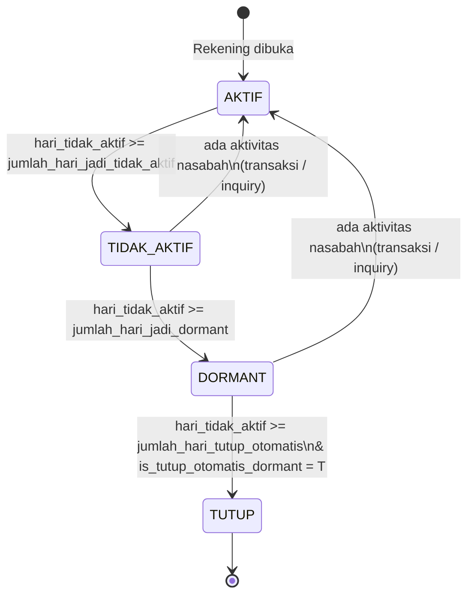

# Enhancement Rekening Dormant — Design Plan
> Pendekatan minimal change | Berbasis struktur existing: `rekeningliabilitas`, `rekeningtransaksi`, `transaksi`, `detiltransaksi`

---

## 1. Status Rekening — Alur Transisi



| Status | Kode | Keterangan |
|---|---|---|
| Aktif | `A` | Ada aktivitas dalam threshold |
| Tidak Aktif | **`T`** *(baru)* | Melewati `jumlah_hari_jadi_tidak_aktif`, belum dormant |
| Dormant | `D` | Melewati `jumlah_hari_jadi_dormant` |
| Tutup | `C` | Rekening ditutup |

---

## 2. Analisis Field Existing yang Relevan

| Tabel | Field | Fungsi Saat Ini | Aksi |
|---|---|---|---|
| produk | `jumlah_hari_jadi_tidak_aktif` | Threshold hari untuk status tidak aktif | **DIPAKAI** — sudah ada, tidak perlu tambah kolom |
| produk | `saldo_minimum_tidak_aktif` | Saldo minimum rekening tidak aktif | KEEP |
| produk | `is_param_saldo_tidak_aktif` | Flag apakah pakai parameter saldo tidak aktif | KEEP |
| produk | `is_tidak_dormant` | Override rekening tidak bisa dormant per produk | KEEP |
| produk | `tanggal_acuan_dormant` | Acuan tanggal perhitungan dormant | KEEP |
| produk | `is_biaya_rekening_dormant` | Flag pengenaan biaya dormant | KEEP |
| produk | `biaya_rekening_dormant` | Nominal biaya rekening dormant | KEEP |
| produk | `jumlah_hari_tutup_otomatis` | Threshold hari tutup otomatis | KEEP |
| produk | `is_tutup_otomatis_dormant` | Flag tutup otomatis saat dormant | KEEP |
| produk | **`jumlah_hari_jadi_dormant`** *(baru)* | Threshold hari untuk status dormant | **ADD COLUMN** |
| produk | **`biaya_rekening_tidak_aktif`** *(baru)* | Nominal biaya rekening tidak aktif | **ADD COLUMN** |
| produk | **`is_biaya_rekening_tidak_aktif`** *(baru)* | Flag pengenaan biaya tidak aktif | **ADD COLUMN** |
| parametertransaksiumum | **`is_exclude_aktivitas_dormant`** *(baru)* | Flag transaksi sistem yang tidak dihitung aktivitas | **ADD COLUMN** |
| rekeningliabilitas | `tgl_trans_terakhir` | Tanggal transaksi finansial terakhir — basis dormant existing | KEEP |
| rekeningliabilitas | `tgl_trans_cabang_terakhir` | Transaksi terakhir via cabang | KEEP |
| rekeningliabilitas | `tgl_trans_echannel_terakhir` | Transaksi terakhir via e-channel | KEEP |
| rekeningliabilitas | `is_tidak_dormant` | Flag override — rekening tidak bisa dormant | KEEP |
| rekeningliabilitas | `is_biaya_rekening_dormant` | Flag pengenaan biaya dormant | KEEP |
| rekeningliabilitas | **`tgl_aktivitas_terakhir`** *(baru)* | Field baru — transaksi + aktivitas non-finansial | **ADD COLUMN** |
| rekeningliabilitas | **`kode_aktivitas_terakhir`** *(baru)* | Kode jenis aktivitas terakhir | **ADD COLUMN** |
| rekeningliabilitas | **`status_tidak_aktif`** *(baru)* | Status rekening: A/T/D/C | **ADD COLUMN** |
| rekeningtransaksi | `tanggal_aktifitas_terakhir` | Aktivitas level GL/posting, bukan level nasabah | KEEP |
| detiltransaksi | `nomor_rekening` | Index `idx_idx_46_2` sudah ada | KEEP |

> **Kesimpulan:**
> - **3 kolom baru** di `produk` (threshold dormant + biaya tidak aktif)
> - **3 kolom baru** di `rekeningliabilitas` (aktivitas terakhir + status)
> - **1 kolom baru** di `parametertransaksiumum` (flag exclude aktivitas)
> - **1 tabel baru** `rekening_aktivitas_nonfin` untuk log non-finansial
> - Tidak ada perubahan pada tabel `transaksi`, `detiltransaksi`, `rekeningtransaksi`

---

## 3. Ringkasan Perubahan Database

### Tidak Diubah
- Tabel `transaksi`, `detiltransaksi`, `rekeningtransaksi`
- Field `tgl_trans_terakhir`, `tgl_trans_cabang_terakhir`, `tgl_trans_echannel_terakhir`
- Field `is_tidak_dormant`, `is_biaya_rekening_dormant`
- Semua index existing

### Ditambahkan
- `ADD COLUMN tgl_aktivitas_terakhir` di `rekeningliabilitas`
- `ADD COLUMN kode_aktivitas_terakhir` di `rekeningliabilitas`
- `ADD COLUMN status_tidak_aktif` di `rekeningliabilitas`
- `ADD COLUMN jumlah_hari_jadi_dormant` di `produk`
- `ADD COLUMN biaya_rekening_tidak_aktif` di `produk`
- `ADD COLUMN is_biaya_rekening_tidak_aktif` di `produk`
- `ADD COLUMN is_exclude_aktivitas_dormant` di `parametertransaksiumum`
- `ADD INDEX` pada kolom baru
- `CREATE TABLE rekening_aktivitas_nonfin`
- One-time migration: isi `tgl_aktivitas_terakhir` dari `tgl_trans_terakhir`

### Mengapa tidak mengganti `tgl_trans_terakhir`?

| Aspek | tgl_trans_terakhir (existing) | tgl_aktivitas_terakhir (baru) |
|---|---|---|
| Isi | Hanya transaksi finansial | Transaksi + inquiry + login |
| Diupdate oleh | Proses posting transaksi | Posting + modul inquiry |
| Risiko perubahan | Tinggi — banyak yang bergantung | Tidak ada — field baru |
| Backward compatibility | Tidak terganggu | Breaking nothing |

---

## 4. DDL

### ① ALTER TABLE produk — Tambah Threshold Dormant dan Biaya

```sql
-- Tambah threshold dormant dan biaya untuk status tidak aktif
ALTER TABLE ibcore.produk
  ADD COLUMN jumlah_hari_jadi_dormant      int4            NULL,
  ADD COLUMN biaya_rekening_tidak_aktif    numeric(20, 8)  NULL,
  ADD COLUMN is_biaya_rekening_tidak_aktif varchar(1)      NULL;
  -- Contoh: tidak aktif setelah 90 hari, dormant setelah 180 hari

COMMENT ON COLUMN ibcore.produk.jumlah_hari_jadi_dormant IS
  'Threshold hari untuk rekening menjadi status DORMANT (setelah melewati status TIDAK_AKTIF)';
COMMENT ON COLUMN ibcore.produk.biaya_rekening_tidak_aktif IS
  'Biaya bulanan untuk rekening dengan status TIDAK_AKTIF';
COMMENT ON COLUMN ibcore.produk.is_biaya_rekening_tidak_aktif IS
  'Flag pengenaan biaya rekening tidak aktif: T = Ya, F = Tidak';

-- Contoh pengisian: dormant = 2x threshold tidak aktif
UPDATE ibcore.produk
SET jumlah_hari_jadi_dormant = jumlah_hari_jadi_tidak_aktif * 2,
    biaya_rekening_tidak_aktif = 0,
    is_biaya_rekening_tidak_aktif = 'F'
WHERE jumlah_hari_jadi_tidak_aktif IS NOT NULL;
```

### ② ALTER TABLE rekeningliabilitas — Tambah Kolom Baru

```sql
ALTER TABLE ibcore.rekeningliabilitas
  ADD COLUMN tgl_aktivitas_terakhir    timestamp   NULL,
  ADD COLUMN kode_aktivitas_terakhir  varchar(20) NULL,
  ADD COLUMN status_tidak_aktif        varchar(1)  DEFAULT 'A' NULL;
  -- A = Aktif, T = Tidak Aktif, D = Dormant, C = Tutup

CREATE INDEX idx_rekliab_tglakt       ON ibcore.rekeningliabilitas USING btree (tgl_aktivitas_terakhir);
CREATE INDEX idx_rekliab_statustiakt  ON ibcore.rekeningliabilitas USING btree (status_tidak_aktif);

-- One-time migration
UPDATE ibcore.rekeningliabilitas
SET tgl_aktivitas_terakhir   = tgl_trans_terakhir,
    kode_aktivitas_terakhir = 'TRX',
    status_tidak_aktif       = 'A'
WHERE tgl_trans_terakhir IS NOT NULL;
```

### ③ ALTER TABLE parametertransaksiumum — Tambah Flag Exclude Aktivitas

```sql
ALTER TABLE ibcore.parametertransaksiumum
  ADD COLUMN is_exclude_aktivitas_dormant varchar(1) DEFAULT 'F';

COMMENT ON COLUMN ibcore.parametertransaksiumum.is_exclude_aktivitas_dormant IS
  'T = Transaksi sistem/EOD yang tidak dihitung sebagai aktivitas nasabah untuk perhitungan dormant. F atau NULL = Dihitung sebagai aktivitas nasabah (default)';

-- Update kode transaksi sistem yang perlu di-exclude
UPDATE ibcore.parametertransaksiumum
SET is_exclude_aktivitas_dormant = 'T'
WHERE kode_transaksi IN ('SD', 'PD', 'SC', 'SCD', 'SDP', 'SDZ', 'SI');
```

### ④ CREATE TABLE rekening_aktivitas_nonfin

```sql
CREATE TABLE ibcore.rekening_aktivitas_nonfin (
    id                  bigserial    NOT NULL,
    nomor_rekening      varchar(20)  NOT NULL,
    tanggal_aktivitas   timestamp    NOT NULL,
    kode_aktivitas     varchar(20)  NOT NULL,  -- CEK_SALDO | CEK_MUTASI | CETAK_PASSBOOK | CETAK_SALDO
    kode_channel             varchar(10)  NULL,       -- ATM | MOBILE | IB | TELLER | API
    nomor_referensi     varchar(50)  NULL,
    user_input          varchar(20)  NULL,
    terminal_input      varchar(19)  NULL,
    kode_cabang         varchar(10)  NULL,
    tanggal_input       timestamp    DEFAULT CURRENT_TIMESTAMP,

    CONSTRAINT rekening_aktivitas_nonfin_pkey PRIMARY KEY (id)
);

-- Index per rekening + tanggal (query audit)
CREATE INDEX idx_ran_norek_tgl
    ON ibcore.rekening_aktivitas_nonfin
    USING btree (nomor_rekening, tanggal_aktivitas DESC);

-- Index untuk monitoring per jenis/kode_channel
CREATE INDEX idx_ran_jenis
    ON ibcore.rekening_aktivitas_nonfin
    USING btree (kode_aktivitas, tanggal_aktivitas);

-- Index untuk purge / archival berkala
CREATE INDEX idx_ran_tglakt
    ON ibcore.rekening_aktivitas_nonfin
    USING btree (tanggal_aktivitas);
```

> **Catatan:** Nama field mengikuti konvensi existing (`user_input`, `terminal_input`, `kode_cabang`) agar konsisten. Tabel ini bisa dipartisi per bulan atau di-purge > 2 tahun jika volume tinggi.

---

## 5. Alur Proses

### Alur A — Transaksi Finansial (tidak ada perubahan di path transaksi)
```
Transaksi masuk (Teller/ATM/Mobile)
  → Proses existing: INSERT transaksi, detiltransaksi  ← tidak diubah sama sekali
  → tgl_trans_terakhir akan diupdate saat EOD          ← sudah existing, tidak diubah
```
> Tidak ada perubahan apapun pada path transaksi. Optimasi performa tetap terjaga.

### Alur B — Aktivitas Non-Finansial (baru, real-time)
```
Nasabah cek saldo / mutasi via ATM, Mobile, IB
  → Proses existing: return saldo/mutasi ke nasabah  ← tidak diubah
  → [BARU] INSERT rekening_aktivitas_nonfin          ← real-time, async
           nomor_rekening, tanggal_aktivitas, kode_aktivitas, kode_channel, ...
```
> INSERT ke log dilakukan **asynchronous** agar tidak menambah latency di path inquiry.  
> `tgl_aktivitas_terakhir` di `rekeningliabilitas` **tidak diupdate real-time** — diurus oleh proses EOD (lihat Alur C).

### Alur C — EOD Update (baru, kritis)
```
EOD berjalan:

  Step 1 — Update tgl_trans_terakhir (existing, tidak diubah)
           Ambil transaksi hari ini dari tabel transaksi/detiltransaksi
           → UPDATE rekeningliabilitas SET tgl_trans_terakhir = max(tanggal_transaksi)

  Step 2 — [BARU] Update tgl_aktivitas_terakhir
           Bandingkan dua sumber untuk setiap rekening:
           a. tgl_trans_terakhir hasil Step 1
           b. MAX(tanggal_aktivitas) dari rekening_aktivitas_nonfin hari ini
           → Ambil yang TERBARU dari keduanya
           → UPDATE rekeningliabilitas
                    SET tgl_aktivitas_terakhir   = nilai terbaru,
                        kode_aktivitas_terakhir = jenis dari nilai terbaru

  Step 3 — [BARU] Batch Dormant
           Baca rekeningliabilitas.tgl_aktivitas_terakhir (sudah ter-update)
           → Tentukan rekening mana yang dormant
```

> ⚠️ **Urutan Step 1 → 2 → 3 wajib dijaga.** Batch dormant harus selalu jalan setelah `tgl_aktivitas_terakhir` selesai diupdate.

### SQL untuk Step 2 — Update tgl_aktivitas_terakhir EOD

```sql
-- Step 1: Ambil transaksi hari ini yang dihitung sebagai aktivitas nasabah
WITH trx_hari_ini AS (
    SELECT
        dt.nomor_rekening,
        MAX(t.tanggal_transaksi) AS tgl_trans
    FROM ibcore.detiltransaksi dt
    JOIN ibcore.transaksi t ON t.id_transaksi = dt.id_transaksi
    LEFT JOIN ibcore.parametertransaksiumum ptu ON ptu.kode_transaksi = t.kode_transaksi
    WHERE t.tanggal_transaksi >= CURRENT_DATE
      AND t.tanggal_transaksi <  CURRENT_DATE + INTERVAL '1 day'
      AND t.status_otorisasi  = 1
      AND COALESCE(ptu.is_exclude_aktivitas_dormant, 'F') = 'F'  -- exclude transaksi sistem
    GROUP BY dt.nomor_rekening
),
-- Step 2: Ambil aktivitas non-finansial terbaru hari ini per rekening
aktivitas_nonfin AS (
    SELECT
        nomor_rekening,
        MAX(tanggal_aktivitas) AS tgl_aktivitas,
        (ARRAY_AGG(kode_aktivitas ORDER BY tanggal_aktivitas DESC))[1] AS kode_aktivitas
    FROM ibcore.rekening_aktivitas_nonfin
    WHERE tanggal_aktivitas >= CURRENT_DATE
      AND tanggal_aktivitas <  CURRENT_DATE + INTERVAL '1 day'
    GROUP BY nomor_rekening
),
-- Step 3: Gabungkan dan pilih yang terbaru
sumber_gabungan AS (
    SELECT
        rl.nomor_rekening,
        ti.tgl_trans,
        an.tgl_aktivitas        AS tgl_nonfin,
        an.kode_aktivitas      AS jenis_nonfin,
        CASE
            WHEN ti.tgl_trans IS NULL     THEN an.tgl_aktivitas
            WHEN an.tgl_aktivitas IS NULL THEN ti.tgl_trans
            WHEN an.tgl_aktivitas > ti.tgl_trans THEN an.tgl_aktivitas
            ELSE ti.tgl_trans
        END AS tgl_aktivitas_final,
        CASE
            WHEN ti.tgl_trans IS NULL     THEN an.kode_aktivitas
            WHEN an.tgl_aktivitas IS NULL THEN 'TRX'
            WHEN an.tgl_aktivitas > ti.tgl_trans THEN an.kode_aktivitas
            ELSE 'TRX'
        END AS kode_aktivitas_final
    FROM ibcore.rekeningliabilitas rl
    LEFT JOIN trx_hari_ini ti ON ti.nomor_rekening = rl.nomor_rekening
    LEFT JOIN aktivitas_nonfin an ON an.nomor_rekening = rl.nomor_rekening
    WHERE ti.nomor_rekening IS NOT NULL
       OR an.nomor_rekening IS NOT NULL
)
UPDATE ibcore.rekeningliabilitas rl
SET
    tgl_aktivitas_terakhir   = sg.tgl_aktivitas_final,
    kode_aktivitas_terakhir = sg.kode_aktivitas_final
FROM sumber_gabungan sg
WHERE rl.nomor_rekening = sg.nomor_rekening;
```

---

## 6. Perubahan Query Batch Dormant

### Sebelum
```sql
SELECT
    rl.nomor_rekening,
    rl.nomor_nasabah,
    rl.tgl_trans_terakhir,
    CURRENT_DATE - rl.tgl_trans_terakhir::date AS hari_tidak_aktif
FROM ibcore.rekeningliabilitas rl
WHERE
    rl.is_tidak_dormant = 'N'
    AND (
        rl.tgl_trans_terakhir IS NULL
        OR rl.tgl_trans_terakhir < CURRENT_DATE - INTERVAL '180 days'
    );
```

### Sesudah — hanya ganti referensi field
```sql
SELECT
    rl.nomor_rekening,
    rl.nomor_nasabah,
    rl.tgl_trans_terakhir,                        -- tetap ada untuk referensi
    rl.tgl_aktivitas_terakhir,                    -- ← field baru, penentu dormant
    rl.kode_aktivitas_terakhir,                  -- ← untuk audit/laporan
    CURRENT_DATE - rl.tgl_aktivitas_terakhir::date AS hari_tidak_aktif
FROM ibcore.rekeningliabilitas rl
WHERE
    rl.is_tidak_dormant = 'N'                     -- pengecualian tetap berlaku
    AND (
        rl.tgl_aktivitas_terakhir IS NULL
        OR rl.tgl_aktivitas_terakhir < CURRENT_DATE - INTERVAL '180 days'
    );
```

### Bonus — Query rekening yang "diselamatkan" oleh enhancement
```sql
-- Rekening dormant menurut logika lama, tapi aktif menurut logika baru
SELECT
    rl.nomor_rekening,
    rl.nomor_nasabah,
    rl.tgl_trans_terakhir,
    rl.tgl_aktivitas_terakhir,
    rl.kode_aktivitas_terakhir,
    CURRENT_DATE - rl.tgl_trans_terakhir::date       AS hari_sejak_trx,
    CURRENT_DATE - rl.tgl_aktivitas_terakhir::date   AS hari_sejak_aktivitas
FROM ibcore.rekeningliabilitas rl
WHERE
    rl.tgl_trans_terakhir      < CURRENT_DATE - INTERVAL '180 days'
    AND rl.tgl_aktivitas_terakhir >= CURRENT_DATE - INTERVAL '180 days'
    AND rl.is_tidak_dormant = 'N';
```

---

## 7. Konfigurasi Kode Transaksi — Pengecualian Sistem

### Pendekatan: Flag di `parametertransaksiumum`

Menggunakan kolom baru `is_exclude_aktivitas_dormant` di tabel `parametertransaksiumum` untuk menandai transaksi sistem yang **tidak dihitung** sebagai aktivitas nasabah.

**Prinsip fail-safe:**
- Kode transaksi dengan flag `'T'` → **di-exclude** (transaksi sistem)
- Kode transaksi dengan flag `'F'` atau `NULL` → **dihitung sebagai aktivitas nasabah** (default)
- Kode transaksi yang **belum terdaftar** di `parametertransaksiumum` → **dihitung sebagai aktivitas nasabah** (default aman)

### Kode Transaksi yang Di-exclude

| kode_transaksi | keterangan | is_exclude_aktivitas_dormant |
|---|---|---|
| `SD` | Bagi Hasil Tabungan/Giro - dibuat sistem EOD | T |
| `PD` | Bagi Hasil Deposito - dibuat sistem EOD | T |
| `SC` | Biaya Administrasi Bulanan - dibuat sistem EOD | T |
| `SCD` | Biaya Rekening Dormant - dibuat sistem EOD | T |
| `SDP` | Pajak Bagi Hasil - dibuat sistem EOD | T |
| `SDZ` | Zakat Bagi Hasil - dibuat sistem EOD | T |
| `SI` | Auto Transfer Antar Rekening - dibuat sistem | T |

> **Catatan:** Semua kode transaksi lainnya (yang tidak di-flag `'T'`) otomatis dihitung sebagai aktivitas nasabah — termasuk kode yang belum terdaftar di `parametertransaksiumum`.

### Implementasi di SQL EOD

Filter diterapkan saat mengambil transaksi hari ini menggunakan `LEFT JOIN` dengan `COALESCE` untuk default aman:

```sql
-- Step 1 EOD — Filter transaksi yang dihitung sebagai aktivitas nasabah
WITH trx_hari_ini AS (
    SELECT
        dt.nomor_rekening,
        MAX(t.tanggal_transaksi) AS tgl_trans
    FROM ibcore.detiltransaksi dt
    JOIN ibcore.transaksi t ON t.id_transaksi = dt.id_transaksi
    LEFT JOIN ibcore.parametertransaksiumum ptu ON ptu.kode_transaksi = t.kode_transaksi
    WHERE t.tanggal_transaksi >= CURRENT_DATE
      AND t.tanggal_transaksi <  CURRENT_DATE + INTERVAL '1 day'
      AND t.status_otorisasi  = 1                                        -- hanya transaksi yang sudah diotorisasi
      AND COALESCE(ptu.is_exclude_aktivitas_dormant, 'F') = 'F'         -- ← exclude transaksi sistem, default 'F' = aktivitas
    GROUP BY dt.nomor_rekening
),
aktivitas_nonfin AS (
    SELECT
        nomor_rekening,
        MAX(tanggal_aktivitas) AS tgl_aktivitas,
        (ARRAY_AGG(kode_aktivitas ORDER BY tanggal_aktivitas DESC))[1] AS kode_aktivitas
    FROM ibcore.rekening_aktivitas_nonfin
    WHERE tanggal_aktivitas >= CURRENT_DATE
      AND tanggal_aktivitas <  CURRENT_DATE + INTERVAL '1 day'
    GROUP BY nomor_rekening
),
sumber_gabungan AS (
    SELECT
        rl.nomor_rekening,
        ti.tgl_trans,
        an.tgl_aktivitas        AS tgl_nonfin,
        an.kode_aktivitas      AS jenis_nonfin,
        CASE
            WHEN ti.tgl_trans IS NULL     THEN an.tgl_aktivitas
            WHEN an.tgl_aktivitas IS NULL THEN ti.tgl_trans
            WHEN an.tgl_aktivitas > ti.tgl_trans THEN an.tgl_aktivitas
            ELSE ti.tgl_trans
        END AS tgl_aktivitas_final,
        CASE
            WHEN ti.tgl_trans IS NULL     THEN an.kode_aktivitas
            WHEN an.tgl_aktivitas IS NULL THEN 'TRX'
            WHEN an.tgl_aktivitas > ti.tgl_trans THEN an.kode_aktivitas
            ELSE 'TRX'
        END AS kode_aktivitas_final
    FROM ibcore.rekeningliabilitas rl
    LEFT JOIN trx_hari_ini ti ON ti.nomor_rekening = rl.nomor_rekening
    LEFT JOIN aktivitas_nonfin an ON an.nomor_rekening = rl.nomor_rekening
    WHERE ti.nomor_rekening IS NOT NULL
       OR an.nomor_rekening IS NOT NULL
)
UPDATE ibcore.rekeningliabilitas rl
SET
    tgl_aktivitas_terakhir   = sg.tgl_aktivitas_final,
    kode_aktivitas_terakhir = sg.kode_aktivitas_final
FROM sumber_gabungan sg
WHERE rl.nomor_rekening = sg.nomor_rekening;
```

---

## 8. Jenis Aktivitas Non-Finansial yang Dicatat

| Kode `kode_aktivitas` | Deskripsi | Channel |
|---|---|---|
| `CEK_SALDO` | Cek saldo | ATM, MOBILE, IB, TELLER |
| `CEK_MUTASI` | Cek mutasi / histori transaksi | ATM, MOBILE, IB |
| `CETAK_PASSBOOK` | Cetak passbook | TELLER |
| `CETAK_SALDO` | Cetak saldo passbook | TELLER |