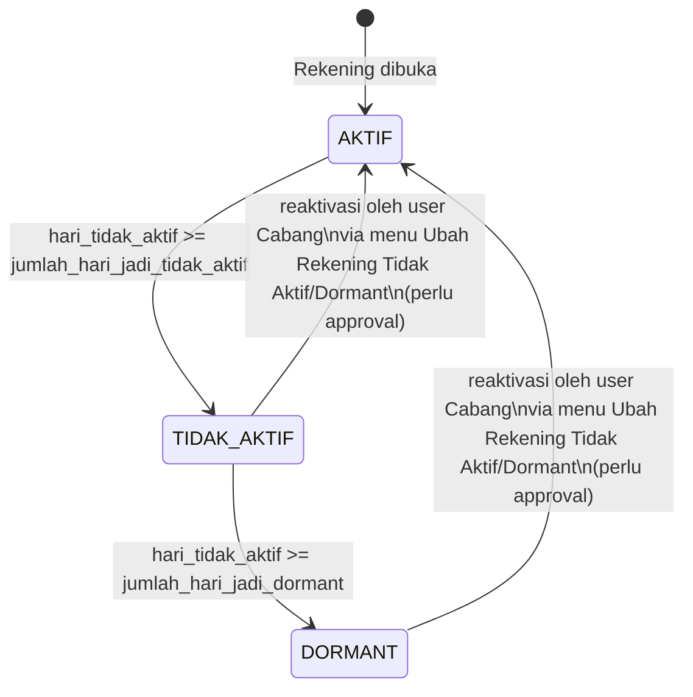
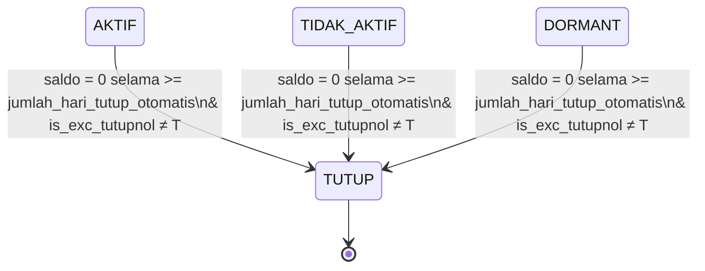
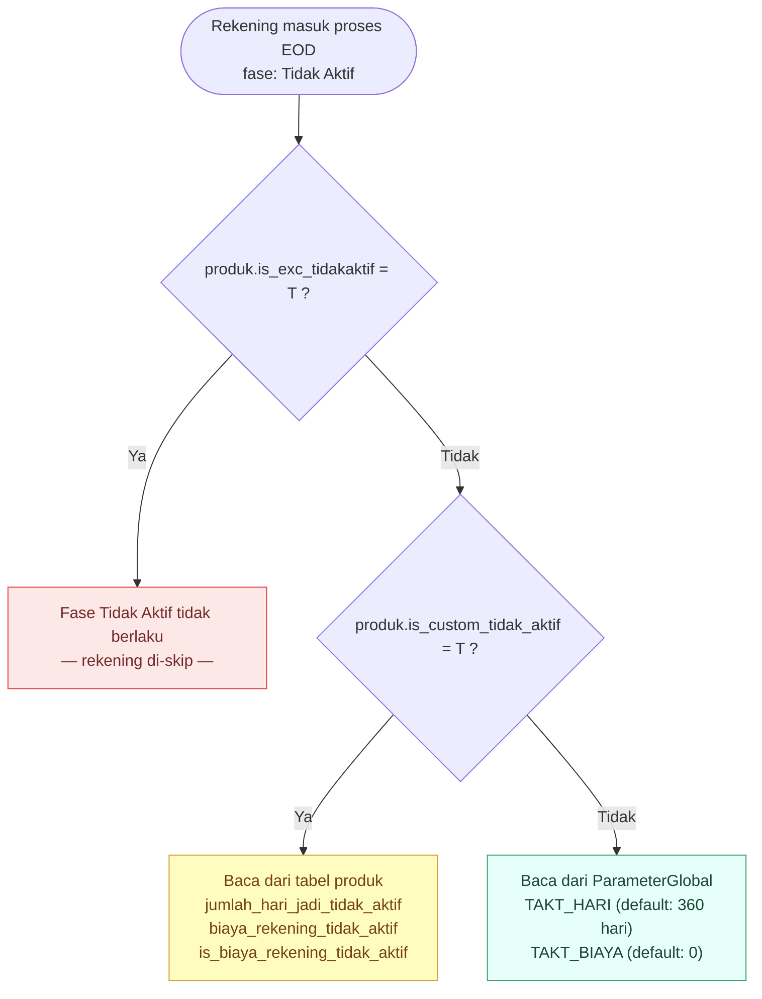
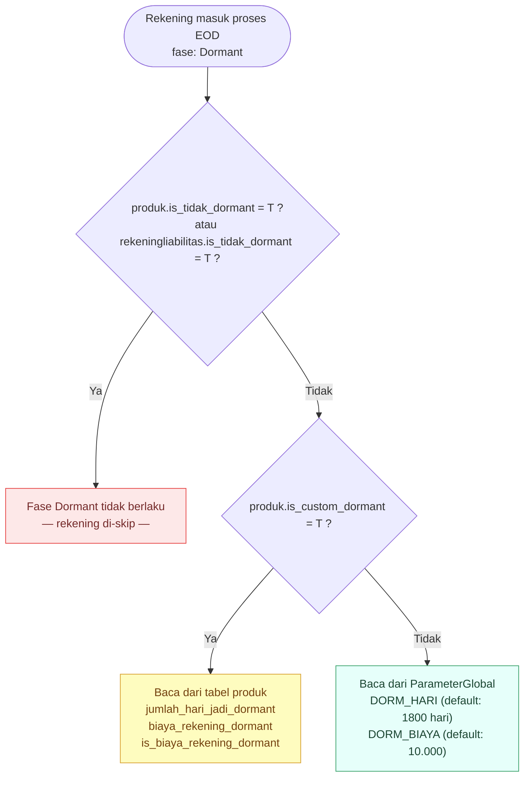
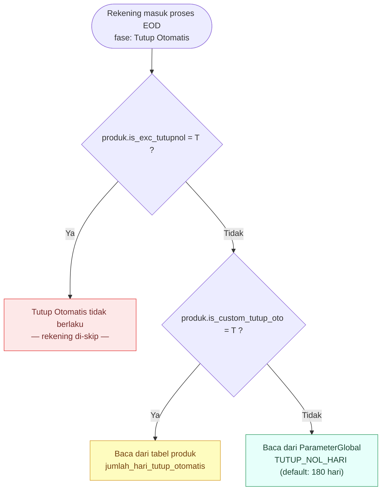

# Enhancement Rekening Dormant — Design Plan
> Pendekatan minimal change | Berbasis struktur existing: `rekeningliabilitas`, `rekeningtransaksi`, `transaksi`, `detiltransaksi`
> Aturan dormant dikonfigurasi terpusat via **`ParameterGlobal`**, dapat di-override di level produk.

---

## 1. Status Rekening — Alur Transisi

### 1.1 Diagram Transisi

#### Diagram A — Status Tidak Aktif & Dormant



#### Diagram B — Tutup Otomatis Saldo Nol



> Tutup otomatis berlaku untuk semua status rekening, tidak bergantung pada status aktif/tidak aktif/dormant.

| Status | Enum `rekeningtransaksi` | Keterangan |
|---|---|---|
| Aktif | `1` | Ada aktivitas dalam threshold |
| Tidak Aktif *(baru)* | **`7`** *(baru)* | Melewati `jumlah_hari_jadi_tidak_aktif`, belum dormant |
| Dormant | `2` | Melewati `jumlah_hari_jadi_dormant` |
| Tutup | `3` | Rekening ditutup |

> **Mapping Enum `status_rekening` di `rekeningtransaksi`:**
> - `1` = Aktif
> - `2` = Dormant
> - `3` = Tutup
> - **`7` = Tidak Aktif** *(baru — ditambahkan untuk enhancement ini)*

---

### 1.2 Hierarki Parameter — Tidak Aktif, Dormant & Tutup Otomatis

Setiap fase dikontrol oleh 3 layer parameter: **Pengecualian → Override Produk → Default Global**.

### Fase 1 — Tidak Aktif



### Fase 2 — Dormant



> `is_tidak_dormant` di `rekeningliabilitas` adalah satu-satunya pengecualian yang bisa dikonfigurasi **per rekening** (bukan per produk).

### Fase 3 — Tutup Otomatis Saldo Nol



> Fase Tutup Otomatis tidak bergantung pada status dormant/tidak aktif rekening — berlaku untuk semua status selama saldo = 0 dan melebihi threshold.

---

## 2. Analisis Field Existing yang Relevan

| Tabel | Field | Fungsi Saat Ini | Aksi |
|---|---|---|---|
| produk | `jumlah_hari_jadi_tidak_aktif` | Threshold hari untuk status tidak aktif | **DIPAKAI** — sudah ada, tidak perlu tambah kolom |
| produk | `saldo_minimum_tidak_aktif` | Saldo minimum rekening tidak aktif | KEEP |
| produk | `is_param_saldo_tidak_aktif` | Flag apakah pakai parameter saldo tidak aktif | KEEP |
| produk | `is_tidak_dormant` | Override rekening tidak bisa dormant per produk | KEEP |
| produk | `tanggal_acuan_dormant` | Acuan tanggal perhitungan dormant | KEEP |
| produk | `is_biaya_rekening_dormant` | Flag pengenaan biaya dormant | KEEP |
| produk | `biaya_rekening_dormant` | Nominal biaya rekening dormant | KEEP |
| produk | `jumlah_hari_tutup_otomatis` | Threshold hari tutup otomatis | KEEP |
| produk | `is_tutup_otomatis_dormant` | Flag tutup otomatis saat dormant | KEEP |
| produk | **`is_custom_tidak_aktif`** *(baru)* | `T` = produk pakai threshold & biaya tidak aktif sendiri, bukan dari ParameterGlobal | **ADD COLUMN** |
| produk | **`is_custom_dormant`** *(baru)* | `T` = produk pakai threshold & biaya dormant sendiri, bukan dari ParameterGlobal | **ADD COLUMN** |
| produk | **`is_custom_tutup_oto`** *(baru)* | `T` = produk pakai threshold tutup otomatis sendiri, bukan dari ParameterGlobal | **ADD COLUMN** |
| produk | **`is_exc_tidakaktif`** *(baru)* | `T` = rekening produk ini tidak akan pernah masuk status Tidak Aktif | **ADD COLUMN** |
| produk | **`is_exc_tutupnol`** *(baru)* | `T` = rekening produk ini tidak akan ditutup otomatis saat saldo nol | **ADD COLUMN** |
| produk | **`jumlah_hari_jadi_dormant`** *(baru)* | Override threshold hari dormant — dibaca hanya jika `is_custom_dormant = 'T'` | **ADD COLUMN** |
| produk | **`jumlah_hari_jadi_tidak_aktif`** *(sudah ada, ubah semantik)* | Override threshold hari tidak aktif — dibaca hanya jika `is_custom_tidak_aktif = 'T'` | **UBAH SEMANTIK** |
| produk | **`biaya_rekening_tidak_aktif`** *(baru)* | Override nominal biaya tidak aktif — dibaca hanya jika `is_custom_tidak_aktif = 'T'` | **ADD COLUMN** |
| produk | **`is_biaya_rekening_tidak_aktif`** *(baru)* | Override flag biaya tidak aktif — dibaca hanya jika `is_custom_tidak_aktif = 'T'` | **ADD COLUMN** |
| produk | **`biaya_rekening_dormant`** *(sudah ada, ubah semantik)* | Override nominal biaya dormant — dibaca hanya jika `is_custom_dormant = 'T'` | **UBAH SEMANTIK** |
| produk | **`is_biaya_rekening_dormant`** *(sudah ada, ubah semantik)* | Override flag biaya dormant — dibaca hanya jika `is_custom_dormant = 'T'` | **UBAH SEMANTIK** |
| produk | **`jumlah_hari_tutup_otomatis`** *(sudah ada, ubah semantik)* | Override hari tutup otomatis — dibaca hanya jika `is_custom_tutup_oto = 'T'` | **UBAH SEMANTIK** |
| parametertransaksiumum | **`is_exclude_aktivitas_nasabah`** *(baru)* | Flag transaksi sistem yang tidak dihitung aktivitas | **ADD COLUMN** |
| parameterglobal | **`TAKT_HARI`** *(data baru, `kode_group='REKENING_DORMANT'`)* | Default hari jadi tidak aktif (global) | **INSERT DATA** |
| parameterglobal | **`DORM_HARI`** *(data baru, `kode_group='REKENING_DORMANT'`)* | Default hari jadi dormant (global) | **INSERT DATA** |
| parameterglobal | **`TUTUP_NOL_HARI`** *(data baru, `kode_group='REKENING_DORMANT'`)* | Default hari tutup otomatis rekening dormant (global) | **INSERT DATA** |
| parameterglobal | **`TAKT_BIAYA`** *(data baru, `kode_group='REKENING_DORMANT'`)* | Default nominal biaya rekening tidak aktif (global) | **INSERT DATA** |
| parameterglobal | **`DORM_BIAYA`** *(data baru, `kode_group='REKENING_DORMANT'`)* | Default nominal biaya rekening dormant (global) | **INSERT DATA** |
| rekeningliabilitas | `tgl_transaksi_terakhir` | Tanggal transaksi finansial terakhir — basis dormant existing | KEEP |
| rekeningliabilitas | `tgl_trans_cabang_terakhir` | Transaksi terakhir via cabang | KEEP |
| rekeningliabilitas | `tgl_trans_echannel_terakhir` | Transaksi terakhir via e-channel | KEEP |
| rekeningliabilitas | `is_tidak_dormant` | Flag override — rekening tidak bisa dormant | KEEP |
| rekeningliabilitas | `is_biaya_rekening_dormant` | Flag pengenaan biaya dormant | KEEP |
| rekeningliabilitas | **`tgl_aktivitas_terakhir`** *(baru)* | Field baru — transaksi + aktivitas non-finansial | **ADD COLUMN** |

| rekeningtransaksi | `tanggal_aktifitas_terakhir` | Aktivitas level GL/posting, bukan level nasabah | KEEP |
| detiltransaksi | `nomor_rekening` | Index `idx_idx_46_2` sudah ada | KEEP |

> **Kesimpulan:**
> - **1 kolom baru** di `parameterglobal`: `kode_group` varchar(30) — untuk pengelompokan parameter per fitur/modul
> - **5 data baru** di `parameterglobal` (`kode_group='REKENING_DORMANT'`) — konfigurasi terpusat hari & biaya dormant/tidak aktif
> - **8 kolom baru** di `produk`: 3 flag override (`is_custom_tidak_aktif`, `is_custom_dormant`, `is_custom_tutup_oto`) + 2 flag pengecualian (`is_exc_tidakaktif`, `is_exc_tutupnol`) + 3 field nilai override
> - **3 kolom ubah semantik** di `produk` (existing field → hanya dibaca jika flag custom aktif)
> - **1 kolom baru** di `rekeningliabilitas` (`tgl_aktivitas_terakhir`)
> - **1 kolom baru** di `parametertransaksiumum` (flag exclude aktivitas)
> - **1 tabel baru** `rekeningaktivitasnonfin` untuk log non-finansial
> - Tidak ada perubahan pada tabel `transaksi`, `detiltransaksi`, `rekeningtransaksi`

---

## 3. Ringkasan Perubahan Database

### Tidak Diubah
- Tabel `transaksi`, `detiltransaksi`, `rekeningtransaksi`
- Field `tgl_transaksi_terakhir`, `tgl_trans_cabang_terakhir`, `tgl_trans_echannel_terakhir`
- Field `is_tidak_dormant`, `is_biaya_rekening_dormant`
- Semua index existing

### Ditambahkan / Diubah
- **`ADD COLUMN kode_group`** di `parameterglobal` varchar(30) nullable — pengelompokan parameter per fitur (lihat Section 9)
- **`INSERT` data baru** di `parameterglobal`: 5 kode parameter rekening status (lihat Section 9)
- `ADD COLUMN tgl_aktivitas_terakhir` di `rekeningliabilitas`
- `ADD COLUMN is_custom_tidak_aktif` di `produk` — flag eksplisit override fase tidak aktif
- `ADD COLUMN is_custom_dormant` di `produk` — flag eksplisit override fase dormant
- `ADD COLUMN is_custom_tutup_oto` di `produk` — flag eksplisit override fase tutup otomatis
- `ADD COLUMN is_exc_tidakaktif` di `produk` — pengecualian: rekening produk ini tidak pernah masuk status Tidak Aktif
- `ADD COLUMN is_exc_tutupnol` di `produk` — pengecualian: rekening produk ini tidak pernah ditutup otomatis saldo nol
- `ADD COLUMN jumlah_hari_jadi_dormant` di `produk` *(dibaca hanya jika `is_custom_dormant='T'`)*
- `ADD COLUMN biaya_rekening_tidak_aktif` di `produk` *(dibaca hanya jika `is_custom_tidak_aktif='T'`)*
- `ADD COLUMN is_biaya_rekening_tidak_aktif` di `produk` *(dibaca hanya jika `is_custom_tidak_aktif='T'`)*
- **Semantik berubah** untuk field existing `produk`: `jumlah_hari_jadi_tidak_aktif`, `biaya_rekening_dormant`, `is_biaya_rekening_dormant`, `jumlah_hari_tutup_otomatis` → hanya dibaca jika flag custom masing-masing aktif
- `ADD COLUMN is_exclude_aktivitas_nasabah` di `parametertransaksiumum`
- `ADD INDEX` pada kolom baru
- `CREATE TABLE rekeningaktivitasnonfin`
- `CREATE TABLE report.rekening_tidak_aktif` *(tabel report baru untuk log status tidak aktif)*
- One-time migration: isi `tgl_aktivitas_terakhir` dari `tgl_transaksi_terakhir`

### Mengapa tidak mengganti `tgl_transaksi_terakhir`?

| Aspek | tgl_transaksi_terakhir (existing) | tgl_aktivitas_terakhir (baru) |
|---|---|---|
| Isi | Hanya transaksi finansial | Transaksi + inquiry + login |
| Diupdate oleh | Proses posting transaksi | Posting + modul inquiry |
| Risiko perubahan | Tinggi — banyak yang bergantung | Tidak ada — field baru |
| Backward compatibility | Tidak terganggu | Breaking nothing |

---

## 4. DDL

### ① ALTER TABLE produk — Tambah Flag Custom & Kolom Override

```sql
-- Tambah flag override per fase, flag pengecualian, dan kolom nilai baru
ALTER TABLE ibankcore.produk ADD (
  is_custom_tidak_aktif         VARCHAR2(1),   -- override threshold & biaya tidak aktif
  is_custom_dormant             VARCHAR2(1),   -- override threshold & biaya dormant
  is_custom_tutup_oto           VARCHAR2(1),   -- override threshold tutup otomatis
  is_exc_tidakaktif             VARCHAR2(1),   -- pengecualian: tidak pernah jadi tidak aktif
  is_exc_tutupnol               VARCHAR2(1),   -- pengecualian: tidak pernah ditutup otomatis
  jumlah_hari_jadi_dormant      NUMBER,
  biaya_rekening_tidak_aktif    NUMBER(20, 8),
  is_biaya_rekening_tidak_aktif VARCHAR2(1)
);

COMMENT ON COLUMN ibankcore.produk.is_custom_tidak_aktif IS
  'T = produk pakai threshold & biaya tidak aktif sendiri (baca dari field produk), F/NULL = ikut ParameterGlobal';
COMMENT ON COLUMN ibankcore.produk.is_custom_dormant IS
  'T = produk pakai threshold & biaya dormant sendiri (baca dari field produk), F/NULL = ikut ParameterGlobal';
COMMENT ON COLUMN ibankcore.produk.is_custom_tutup_oto IS
  'T = produk pakai threshold tutup otomatis sendiri (baca dari field produk), F/NULL = ikut ParameterGlobal';
COMMENT ON COLUMN ibankcore.produk.is_exc_tidakaktif IS
  'T = rekening produk ini dikecualikan dari status Tidak Aktif, tidak akan pernah masuk fase tidak aktif';
COMMENT ON COLUMN ibankcore.produk.is_exc_tutupnol IS
  'T = rekening produk ini dikecualikan dari tutup otomatis saldo nol';
COMMENT ON COLUMN ibankcore.produk.jumlah_hari_jadi_dormant IS
  'Threshold hari dormant — hanya digunakan jika is_custom_dormant = T';
COMMENT ON COLUMN ibankcore.produk.biaya_rekening_tidak_aktif IS
  'Biaya rekening tidak aktif — hanya digunakan jika is_custom_tidak_aktif = T';
COMMENT ON COLUMN ibankcore.produk.is_biaya_rekening_tidak_aktif IS
  'Flag pengenaan biaya tidak aktif: T = Ya, F = Tidak — hanya digunakan jika is_custom_tidak_aktif = T';

-- Default: semua produk ikut ParameterGlobal (flag NULL = ikut global)
-- Isi hanya untuk produk yang memang perlu override atau pengecualian
```

### ② ALTER TABLE rekeningliabilitas — Tambah Kolom Baru

```sql
ALTER TABLE ibankcore.rekeningliabilitas
  ADD tgl_aktivitas_terakhir TIMESTAMP NULL;

ALTER TABLE ibankcore.rekeningliabilitas
  ADD tgl_aktivitas_nonfin_terakhir TIMESTAMP NULL;

CREATE INDEX idx_rekliab_tglakt ON ibankcore.rekeningliabilitas (tgl_aktivitas_terakhir);

-- One-time migration
UPDATE ibankcore.rekeningliabilitas
SET tgl_aktivitas_terakhir = tgl_transaksi_terakhir
WHERE tgl_transaksi_terakhir IS NOT NULL;
```

### ③ ALTER TABLE parametertransaksiumum — Tambah Flag Exclude Aktivitas

```sql
ALTER TABLE ibankcore.parametertransaksiumum
  ADD is_exclude_aktivitas_nasabah VARCHAR2(1) DEFAULT 'F';

COMMENT ON COLUMN ibankcore.parametertransaksiumum.is_exclude_aktivitas_nasabah IS
  'T = Transaksi sistem/EOD yang tidak dihitung sebagai aktivitas nasabah untuk perhitungan dormant. F atau NULL = Dihitung sebagai aktivitas nasabah (default)';

-- Update kode transaksi sistem yang perlu di-exclude
UPDATE ibankcore.parametertransaksiumum
SET is_exclude_aktivitas_nasabah = 'T'
WHERE kode_transaksi IN ('SD', 'PD', 'SC', 'SCD', 'SDP', 'SDZ', 'SI');
```

### ④ CREATE TABLE rekeningaktivitasnonfin

```sql
CREATE TABLE ibankcore.rekeningaktivitasnonfin (
    id                  NUMBER GENERATED BY DEFAULT AS IDENTITY NOT NULL,
    nomor_rekening      VARCHAR2(20)  NOT NULL,
    tanggal_aktivitas   TIMESTAMP     NOT NULL,
    kode_aktivitas      VARCHAR2(20)  NOT NULL,  -- CEK_SALDO | CEK_MUTASI | CETAK_PASSBOOK | CETAK_SALDO
    kode_channel        VARCHAR2(10)  NULL,       -- ATM | MOBILE | IB | TELLER | API
    nomor_referensi     VARCHAR2(50)  NULL,
    user_input          VARCHAR2(20)  NULL,
    terminal_input      VARCHAR2(19)  NULL,
    kode_cabang         VARCHAR2(10)  NULL,
    tanggal_input       TIMESTAMP     DEFAULT SYSTIMESTAMP,

    CONSTRAINT rekeningaktivitasnonfin_pkey PRIMARY KEY (id)
);

-- Index per rekening + tanggal (query audit)
CREATE INDEX idx_ran_norek_tgl
    ON ibankcore.rekeningaktivitasnonfin
    (nomor_rekening, tanggal_aktivitas DESC);

-- Index untuk monitoring per jenis/kode_channel
CREATE INDEX idx_ran_jenis
    ON ibankcore.rekeningaktivitasnonfin
    (kode_aktivitas, tanggal_aktivitas);

-- Index untuk purge / archival berkala
CREATE INDEX idx_ran_tglakt
    ON ibankcore.rekeningaktivitasnonfin
    (tanggal_aktivitas);
```

> **Catatan:** Nama field mengikuti konvensi existing (`user_input`, `terminal_input`, `kode_cabang`) agar konsisten. Tabel ini bisa dipartisi per bulan atau di-purge > 2 tahun jika volume tinggi.

### ⑤ CREATE TABLE ibankrep.rekening_tidak_aktif

```sql
-- Tabel report baru: log rekening yang berpindah status menjadi TIDAK AKTIF
-- Dipisah dari report.rekening_dorman agar lebih mudah di-query per status
CREATE TABLE ibankrep.rekening_tidak_aktif (
    id_report              NUMBER(*,0)     NOT NULL,
    nomor_rekening         VARCHAR2(20)    NOT NULL,
    tanggal_proses         DATE            NOT NULL,
    tgl_aktivitas_terakhir TIMESTAMP       NULL,
    param_hari_tidak_aktif NUMBER          NULL,
    saldo                  NUMBER(36, 10)  NULL,

    CONSTRAINT rekening_tidak_aktif_pkey PRIMARY KEY (id_report)
);

CREATE SEQUENCE ibankrep.seq_rekening_tidak_aktif
    START WITH 1 INCREMENT BY 1 NOMAXVALUE NOCYCLE CACHE 20;

CREATE INDEX idx_rep_tdkakt_norek ON ibankrep.rekening_tidak_aktif
    (nomor_rekening, tanggal_proses DESC);

-- Kolom tambahan (alter setelah tabel dibuat)
ALTER TABLE ibankrep.rekening_tidak_aktif ADD param_hari_tidak_aktif NUMBER;
```


### ⑥ ALTER TABLE ibankrep.rekening_dorman — Tambah Kolom Baru

```sql
-- Kolom baru untuk menyimpan tanggal aktivitas terakhir saat rekening dicatat sebagai dormant
-- Menggantikan tgl_trans_cabang_terakhir / tgl_trans_echannel_terakhir yang terpisah
ALTER TABLE ibankrep.rekening_dorman
    ADD tgl_aktivitas_terakhir TIMESTAMP;

COMMENT ON COLUMN ibankrep.rekening_dorman.tgl_aktivitas_terakhir IS
    'Tanggal aktivitas terakhir nasabah (gabungan transaksi + non-finansial) saat rekening ditetapkan dormant';
```

### ⑦ ALTER TABLE ibankrep.rekening_tutupotomatis — Tambah Kolom Audit Trail

```sql
ALTER TABLE ibankrep.rekening_tutupotomatis ADD (
    tgl_saldo_nol       TIMESTAMP,
    param_hari_tutup_oto NUMBER
);

COMMENT ON COLUMN ibankrep.rekening_tutupotomatis.tgl_saldo_nol IS
    'Tanggal rekening terakhir tercatat saldo nol di DailyBalanceRekening — audit trail kapan saldo mulai nol';
COMMENT ON COLUMN ibankrep.rekening_tutupotomatis.param_hari_tutup_oto IS
    'Threshold hari efektif yang digunakan saat rekening ditutup otomatis (dari produk atau ParameterGlobal)';
```

### ⑧ CREATE TABLE ibanktmp.autoclose_zerobalance_candidate

```sql
CREATE TABLE ibanktmp.autoclose_zerobalance_candidate
(
    nomor_rekening   VARCHAR2(20)    NOT NULL,
    kode_cabang      VARCHAR2(20),
    kode_valuta      VARCHAR2(10),
    kode_produk      VARCHAR2(10),
    param_hari_tutup_oto NUMBER,
    tgl_saldo_nol    TIMESTAMP,
    saldo            NUMBER(38, 8),
    CONSTRAINT autoclose_zerobalance_candidate_pkey PRIMARY KEY (nomor_rekening)
);

CREATE INDEX idx_autoclose_cand_norek ON ibanktmp.autoclose_zerobalance_candidate (nomor_rekening);
CREATE INDEX idx_autoclose_cand_tgl   ON ibanktmp.autoclose_zerobalance_candidate (tgl_saldo_nol);
```

> Kolom `tgl_saldo_nol` diisi dari `MAX(balance_date) WHERE balance < 0.01` di `DailyBalanceRekening`.
> Kolom `param_hari_tutup_oto` diisi threshold efektif: `COALESCE(CASE WHEN is_custom_tutup_oto = 'T' THEN jumlah_hari_tutup_otomatis ELSE NULL END, TUTUP_NOL_HARI)`.
> Kemudian keduanya disalin ke `rekening_tutupotomatis` saat `AC_SaveReportAll`.

### ⑨ CREATE TABLE ibanktmp — Staging Kandidat Status

```sql
-- Staging rekening yang akan diproses menjadi DORMANT
CREATE TABLE ibanktmp.rekening_dorman_candidate
(
    nomor_rekening          VARCHAR2(20)    NOT NULL,
    saldo                   NUMBER(36, 10),
    tgl_aktivitas_terakhir  TIMESTAMP,
    kode_produk             VARCHAR2(10),
    param_hari_dormant      NUMBER,
    process_status          NUMBER,
    PRIMARY KEY (nomor_rekening)
);

-- Staging rekening yang akan diproses menjadi TIDAK AKTIF
CREATE TABLE ibanktmp.rekening_tidak_aktif_candidate
(
    nomor_rekening          VARCHAR2(20)    NOT NULL,
    saldo                   NUMBER(36, 10),
    tgl_aktivitas_terakhir  TIMESTAMP,
    kode_produk             VARCHAR2(10),
    param_hari_tidak_aktif  NUMBER,
    process_status          NUMBER,
    PRIMARY KEY (nomor_rekening)
);
```

### ⑩ CREATE TABLE ibanktmp — Staging Tgl Transaksi Terakhir

```sql
-- Staging kandidat rekening untuk update tgl_transaksi_terakhir (dari tabel Transaksi H+0)
CREATE TABLE ibanktmp.rekening_transaksi_terakhir
(
    nomor_rekening    VARCHAR2(20)  NOT NULL,
    tanggal_transaksi TIMESTAMP    NOT NULL,
    CONSTRAINT rekening_transaksi_terakhir_pkey PRIMARY KEY (nomor_rekening)
);

-- Staging kandidat rekening untuk update tgl_aktivitas_nonfin_terakhir (dari rekeningaktivitasnonfin H+0)
CREATE TABLE ibanktmp.rekening_aktivitas_nonfin_terakhir
(
    nomor_rekening    VARCHAR2(20)  NOT NULL,
    tanggal_aktivitas TIMESTAMP    NOT NULL,
    CONSTRAINT rekening_aktivitas_terakhir_pkey PRIMARY KEY (nomor_rekening)
);
```

### ⑪ INSERT — Registrasi Script EOD di Batch Process

```sql
-- Daftarkan script update_account_lasttxdate ke tabel bpscript
INSERT INTO ibankent.bpscript (script_id, description, script_path, kode_aplikasi)
VALUES (ibankent.seq_bpscript.nextval, 'UPDATE ACCOUNT LAST TRX DATE', 'batchprocess\update_account_lasttxdate', '20000');

-- Daftarkan ke bpstep EOD01 dengan urutan 145 (sebelum batch dormant)
INSERT INTO ibankent.bpstep (step_id, description, step_order, disabled, scenario_code, script_id)
SELECT ibankent.seq_bpstep.nextval, description, 145, 'F', 'EOD01', script_id
FROM ibankent.bpscript
WHERE script_path = 'batchprocess\update_account_lasttxdate' AND kode_aplikasi = '20000';
```

### ⑫ INSERT — Registrasi Laporan Rekening Tidak Aktif

```sql
-- Daftarkan laporan baru: Rekening Aktif jadi Tidak Aktif (R041)
INSERT INTO ibankcore.report (kode_report, nama_report, template_name, script_name, tag_report, is_eod_execute, recipient, retensi, is_show_bds, kode_report_tm)
VALUES ('R041', 'Laporan Rekening Aktif jadi Tidak Aktif', 'tplRekeningTidakAktifOtomatis', 'rekening_tidakaktif_otomatis', 'GENERAL', 'F', 'C', '1B/6B/12B', NULL, NULL);

-- Salin akses dari laporan R029 (acuan laporan satu kategori)
INSERT INTO ibankcore.reportgroupaccess (accessid, id_peran, kode_report, accessflag)
SELECT ibankcore.seq_reportgroupaccess.nextval, id_peran, 'R041', accessflag
FROM ibankcore.reportgroupaccess
WHERE kode_report = 'R029';
```

### ⑬ Penyesuaian Tabel Staging & Laporan (Ringkasan)
- **Tabel Staging Tutup Otomatis**: `ibanktmp.autoclose_zerobalance_candidate` — baru (CREATE TABLE, sudah termasuk kolom `tgl_saldo_nol` dan `param_hari_tutup_oto`)
- **Tabel Report Tutup Otomatis**: `ibankrep.rekening_tutupotomatis` ditambah 2 kolom audit trail (`tgl_saldo_nol`, `param_hari_tutup_oto`)
- **Tabel Staging Status**: `ibanktmp.rekening_dorman_candidate` dan `ibanktmp.rekening_tidak_aktif_candidate` — baru (CREATE TABLE)
- **Report Dormant**: Kolom `kode_status` tidak lagi disertakan dalam insert laporan dormant
- **Laporan baru**: R041 — Rekening Aktif jadi Tidak Aktif

---


## 5. Alur Proses

### Alur A — Transaksi Finansial (tidak ada perubahan di path transaksi)
```
Transaksi masuk (Teller/ATM/Mobile)
  → Proses existing: INSERT transaksi, detiltransaksi  ← tidak diubah sama sekali
  → tgl_transaksi_terakhir akan diupdate saat EOD          ← sudah existing, tidak diubah
```
> Tidak ada perubahan apapun pada path transaksi. Optimasi performa tetap terjaga.

### Alur B — Aktivitas Non-Finansial (baru, real-time)
```
Nasabah cek saldo / mutasi via ATM, Mobile, IB
  → Proses existing: return saldo/mutasi ke nasabah  ← tidak diubah
  → [BARU] INSERT rekeningaktivitasnonfin          ← real-time, async
           nomor_rekening, tanggal_aktivitas, kode_aktivitas, kode_channel, ...
```
> INSERT ke log dilakukan **asynchronous** agar tidak menambah latency di path inquiry.  
> `tgl_aktivitas_terakhir` di `rekeningliabilitas` **tidak diupdate real-time** — diurus oleh proses EOD (lihat Alur C).

### Alur C — EOD Update
```
EOD berjalan (urutan wajib):

  Step 1 — [BARU] Update tanggal aktivitas terakhir
           Script: batchprocess/update_account_lasttxdate.py
           Update `tgl_transaksi_terakhir` (dari transaksi nasabah) dan `tgl_aktivitas_terakhir`
           (gabungan: transaksi nasabah + aktivitas non-finansial dari `rekeningaktivitasnonfin`)

  Step 2 — [EXISTING, DIMODIFIKASI] Batch Dormant
           Script: batchprocess/update_dormant_account.py
           Yang dimodifikasi:
           a. Ganti referensi `tgl_transaksi_terakhir` → `tgl_aktivitas_terakhir`
           b. Baca threshold efektif dari produk (jika `is_custom_tidak_aktif`/`is_custom_dormant = 'T'`)
              atau fallback ke ParameterGlobal (`TAKT_HARI`, `DORM_HARI`)
           c. Update status rekening ke TIDAK_AKTIF atau DORMANT sesuai threshold

  Step 3 — [EXISTING, DIMODIFIKASI] Batch Tutup Otomatis
           Script: batchprocess/saving_auto_close.py
           Yang dimodifikasi:
           a. Pemisahan query menjadi 2 tahap: (1) `AC_SelectZeroBalance` — isi kandidat ke `tmp_autoclose_zerobalance_candidate` termasuk `tgl_saldo_nol` (dari `MAX(balance_date WHERE balance < 0.01)` di `DailyBalanceRekening`) dan `param_hari_tutup_oto` (threshold efektif), (2) `AC_SelectAccount` — validasi durasi saldo 0 menggunakan logika `MAX(balance_date)` dari `DailyBalanceRekening`.
           b. Penilaian status\_rekening diubah menjadi `<> 3` (tidak melihat indikator aktif/dormant).
           c. Tambah fallback ke ParameterGlobal `TUTUP_NOL_HARI` jika `is_custom_tutup_oto ≠ 'T'`
           d. Query kandidat tutup menggunakan threshold efektif (produk atau global)
```

> ⚠️ **Urutan Step 1 → 2 → 3 wajib dijaga.** Step 2 dan 3 HARUS jalan setelah `tgl_aktivitas_terakhir` selesai diupdate oleh Step 1.

### Alur E — Reaktivasi Manual (Menu Cabang)

```
User Cabang membuka menu "Ubah Rekening Tidak Aktif/Dormant"
  → Pilih/cari rekening dengan status TIDAK AKTIF atau DORMANT
  → Input alasan reaktivasi
  → Submit → status berubah menjadi PENDING APPROVAL

Supervisor/Pejabat Cabang membuka antrian approval
  → Review data rekening + alasan reaktivasi
  → Approve / Reject

  Jika Approve:
    → status_rekening diubah ke AKTIF ('A')
    → tgl_aktivitas_terakhir di-reset ke SYSDATE
    → LOG: catat user input, user approval, tanggal, alasan
    → Notifikasi ke user Cabang

  Jika Reject:
    → Status rekening tetap (TIDAK AKTIF / DORMANT)
    → LOG: catat alasan reject
    → Notifikasi ke user Cabang
```

> **Catatan:**
> - Aktivitas nasabah (transaksi, inquiry, login) **tidak** mengubah status rekening kembali ke AKTIF secara otomatis.
> - Rekening TIDAK AKTIF dan DORMANT menggunakan alur reaktivasi yang sama (belum ada perbedaan prosedur).
> - Perlu form baru: `fUbahRekeningTidakAktifDormant` (dialog di modul Funding / Cabang).
> - Perlu tabel/log: `rekening_reaktivasi_log` atau reuse log existing (`rekening_aktivitas_nonfin` dengan `kode_aktivitas = 'REAKTIVASI'`).

---

### Alur D — EOM (End of Month) — Biaya Rekening
```
EOM berjalan (akhir bulan):

  Step 1 — [EXISTING, DIMODIFIKASI] Biaya Rekening Dormant & Tidak Aktif
           Script: batchprocess/admcost_dormant_process.py
           Yang dimodifikasi:
           a. Tambah pengenaan biaya rekening TIDAK AKTIF (saat ini hanya biaya DORMANT)
           b. Baca nominal biaya efektif dari produk (jika `is_custom_dormant`/`is_custom_tidak_aktif = 'T'`)
              atau fallback ke ParameterGlobal (`DORM_BIAYA`, `TAKT_BIAYA`)
           c. Kode transaksi: `SCD` (dormant), tambah kode baru untuk biaya tidak aktif
```

### SQL untuk Step 2 — Update tgl_aktivitas_terakhir EOD

> **Implementasi Step 1** sudah ada di script `batchprocess/update_account_lasttxdate.py`.
> Script tersebut perlu **dimodifikasi** untuk:
> - Membaca tabel `rekeningaktivitasnonfin` (tabel baru)
> - Mengupdate `tgl_aktivitas_terakhir` di `rekeningliabilitas` (field baru)
> 
> Detail SQL flows ada di script: `ULT_Select_RekeningTransaksiTerakhir`, `ULT_Select_RekeningAktivitasNonfinTerakhir`, `ULT_UpdateTglAktivitasTerakhir`.
---

## 6. Perubahan Query Batch Dormant

### Sebelum
```sql
SELECT
    rl.nomor_rekening,
    rl.nomor_nasabah,
    rl.tgl_transaksi_terakhir,
    TRUNC(SYSDATE) - TRUNC(rl.tgl_transaksi_terakhir) AS hari_tidak_aktif
FROM ibankcore.rekeningliabilitas rl
WHERE
    rl.is_tidak_dormant = 'N'
    AND (
        rl.tgl_transaksi_terakhir IS NULL
        OR rl.tgl_transaksi_terakhir < TRUNC(SYSDATE) - 180
    );
```

### Sesudah — hanya ganti referensi field
```sql
SELECT
    rl.nomor_rekening,
    rl.nomor_nasabah,
    rl.tgl_transaksi_terakhir,                        -- tetap ada untuk referensi
    rl.tgl_aktivitas_terakhir,                    -- ← field baru, penentu dormant
    rl.kode_aktivitas_terakhir,                  -- ← untuk audit/laporan
    TRUNC(SYSDATE) - TRUNC(rl.tgl_aktivitas_terakhir) AS hari_tidak_aktif
FROM ibankcore.rekeningliabilitas rl
WHERE
    rl.is_tidak_dormant = 'N'                     -- pengecualian tetap berlaku
    AND (
        rl.tgl_aktivitas_terakhir IS NULL
        OR rl.tgl_aktivitas_terakhir < TRUNC(SYSDATE) - 180
    );
```

### Bonus — Query rekening yang "diselamatkan" oleh enhancement
```sql
-- Rekening dormant menurut logika lama, tapi aktif menurut logika baru
SELECT
    rl.nomor_rekening,
    rl.nomor_nasabah,
    rl.tgl_transaksi_terakhir,
    rl.tgl_aktivitas_terakhir,
    rl.kode_aktivitas_terakhir,
    TRUNC(SYSDATE) - TRUNC(rl.tgl_transaksi_terakhir)     AS hari_sejak_trx,
    TRUNC(SYSDATE) - TRUNC(rl.tgl_aktivitas_terakhir) AS hari_sejak_aktivitas
FROM ibankcore.rekeningliabilitas rl
WHERE
    rl.tgl_transaksi_terakhir         < TRUNC(SYSDATE) - 180
    AND rl.tgl_aktivitas_terakhir >= TRUNC(SYSDATE) - 180
    AND rl.is_tidak_dormant = 'N';
```

---

## 7. Konfigurasi Kode Transaksi — Pengecualian Sistem

### Pendekatan: Flag di `parametertransaksiumum`

Menggunakan kolom baru `is_exclude_aktivitas_nasabah` di tabel `parametertransaksiumum` untuk menandai transaksi sistem yang **tidak dihitung** sebagai aktivitas nasabah.

**Prinsip fail-safe:**
- Kode transaksi dengan flag `'T'` → **di-exclude** (transaksi sistem)
- Kode transaksi dengan flag `'F'` atau `NULL` → **dihitung sebagai aktivitas nasabah** (default)
- Kode transaksi yang **belum terdaftar** di `parametertransaksiumum` → **dihitung sebagai aktivitas nasabah** (default aman)

### Kode Transaksi yang Di-exclude

| kode_transaksi | keterangan | is_exclude_aktivitas_nasabah |
|---|---|---|
| `SD` | Bagi Hasil Tabungan/Giro - dibuat sistem EOD | T |
| `PD` | Bagi Hasil Deposito - dibuat sistem EOD | T |
| `SC` | Biaya Administrasi Bulanan - dibuat sistem EOD | T |
| `SCD` | Biaya Rekening Dormant - dibuat sistem EOD | T |
| `SDP` | Pajak Bagi Hasil - dibuat sistem EOD | T |
| `SDZ` | Zakat Bagi Hasil - dibuat sistem EOD | T |
| `SI` | Auto Transfer Antar Rekening - dibuat sistem | T |

> **Catatan:** Semua kode transaksi lainnya (yang tidak di-flag `'T'`) otomatis dihitung sebagai aktivitas nasabah — termasuk kode yang belum terdaftar di `parametertransaksiumum`.

### Implementasi di SQL EOD

Filter diterapkan saat mengambil transaksi hari ini menggunakan `LEFT JOIN` dengan `COALESCE` untuk default aman:

```sql
-- Step 1 EOD — Filter transaksi yang dihitung sebagai aktivitas nasabah
MERGE INTO ibankcore.rekeningliabilitas rl
USING (
    WITH trx_hari_ini AS (
        SELECT
            dt.nomor_rekening,
            MAX(t.tanggal_transaksi) AS tgl_trans
        FROM ibankcore.detiltransaksi dt
        JOIN ibankcore.transaksi t ON t.id_transaksi = dt.id_transaksi
        LEFT JOIN ibankcore.parametertransaksiumum ptu ON ptu.kode_transaksi = t.kode_transaksi
        WHERE t.tanggal_transaksi >= TRUNC(SYSDATE)
          AND t.tanggal_transaksi <  TRUNC(SYSDATE) + 1
          AND t.status_otorisasi  = 1                                        -- hanya transaksi yang sudah diotorisasi
          AND COALESCE(ptu.is_exclude_aktivitas_nasabah, 'F') = 'F'         -- ← exclude transaksi sistem, default 'F' = aktivitas
        GROUP BY dt.nomor_rekening
    ),
    aktivitas_nonfin AS (
        SELECT
            nomor_rekening,
            MAX(tanggal_aktivitas) AS tgl_aktivitas,
            MAX(kode_aktivitas) KEEP (DENSE_RANK FIRST ORDER BY tanggal_aktivitas DESC) AS kode_aktivitas
        FROM ibankcore.rekeningaktivitasnonfin
        WHERE tanggal_aktivitas >= TRUNC(SYSDATE)
          AND tanggal_aktivitas <  TRUNC(SYSDATE) + 1
        GROUP BY nomor_rekening
    ),
    sumber_gabungan AS (
        SELECT
            rl.nomor_rekening,
            ti.tgl_trans,
            an.tgl_aktivitas        AS tgl_nonfin,
            an.kode_aktivitas      AS jenis_nonfin,
            CASE
                WHEN ti.tgl_trans IS NULL     THEN an.tgl_aktivitas
                WHEN an.tgl_aktivitas IS NULL THEN ti.tgl_trans
                WHEN an.tgl_aktivitas > ti.tgl_trans THEN an.tgl_aktivitas
                ELSE ti.tgl_trans
            END AS tgl_aktivitas_final,
            CASE
                WHEN ti.tgl_trans IS NULL     THEN an.kode_aktivitas
                WHEN an.tgl_aktivitas IS NULL THEN 'TRX'
                WHEN an.tgl_aktivitas > ti.tgl_trans THEN an.kode_aktivitas
                ELSE 'TRX'
            END AS kode_aktivitas_final
        FROM ibankcore.rekeningliabilitas rl
        LEFT JOIN trx_hari_ini ti ON ti.nomor_rekening = rl.nomor_rekening
        LEFT JOIN aktivitas_nonfin an ON an.nomor_rekening = rl.nomor_rekening
        WHERE ti.nomor_rekening IS NOT NULL
           OR an.nomor_rekening IS NOT NULL
    )
    SELECT sg.nomor_rekening, sg.tgl_aktivitas_final, sg.kode_aktivitas_final
    FROM sumber_gabungan sg
) sg_final
ON (rl.nomor_rekening = sg_final.nomor_rekening)
WHEN MATCHED THEN
  UPDATE SET
      rl.tgl_aktivitas_terakhir   = sg_final.tgl_aktivitas_final,
      rl.kode_aktivitas_terakhir = sg_final.kode_aktivitas_final;
```

---

## 8. Jenis Aktivitas Non-Finansial yang Dicatat

| Kode `kode_aktivitas` | Deskripsi | Channel |
|---|---|---|
| `CEK_SALDO` | Cek saldo | ATM, MOBILE, IB, TELLER |
| `CEK_MUTASI` | Cek mutasi / histori transaksi | ATM, MOBILE, IB, TELLER |
| `CETAK_PASSBOOK` | Cetak passbook | TELLER |
| `CETAK_SALDO` | Cetak saldo passbook | TELLER |

---

## 9. ParameterGlobal — Konfigurasi Terpusat

### 9.1 Filosofi: Global Default + Override Per Produk

Aturan dormant dan tidak aktif dikonfigurasi **terpusat** di tabel `parameterglobal` sehingga:
- Perubahan aturan bisa dilakukan dari satu tempat (UI Parameter Global), tanpa harus ubah data tiap produk.
- Produk tertentu tetap bisa menggunakan nilai berbeda dengan cara mengisi field override di tabel `produk`.
- Jika field override produk **`NULL`** → sistem otomatis fallback ke nilai di `parameterglobal`.

```
Priority (tinggi ke rendah):
  1. Field di tabel produk (jika NOT NULL)  ← override per produk
  2. Nilai di parameterglobal               ← default global
```

### 9.2 Struktur Tabel `parameterglobal` (existing + 1 kolom baru)

| Kolom | Tipe | Status | Keterangan |
|---|---|---|---|
| `kode_parameter` | varchar(15) PK | existing | Kode unik parameter, contoh: `DORM_HARI` |
| `tipe_parameter` | varchar(1) | existing | Tipe: lihat enum `eGlobalParameterType` |
| `nilai_parameter` | double | existing | Nilai numerik (hari, nominal biaya) |
| `deskripsi` | varchar(60) | existing | Keterangan singkat |
| `is_parameter_system` | varchar(1) | existing | `T` = parameter sistem (tidak boleh dihapus user) |
| `nilai_parameter_tanggal` | timestamp | existing | Untuk nilai bertipe tanggal |
| `nilai_parameter_string` | varchar(150) | existing | Untuk nilai bertipe string |
| **`kode_group`** | **varchar(30)** | **ADD COLUMN** | **Grup/kategori parameter per fitur. NULL = parameter umum.** |

> **Catatan:** `kode_group` nullable — parameter lama yang belum diisi group tetap berfungsi normal (backward compatible). Untuk kebutuhan dormant, digunakan `nilai_parameter` (double/numerik) untuk menyimpan nilai **hari** dan **nominal biaya**.

### 9.3 Kode-kode ParameterGlobal untuk Status Rekening

Semua parameter di-group dengan `kode_group = 'REKENING_DORMANT'`.

| `kode_parameter` | Panjang | `kode_group` | `deskripsi` | `nilai_parameter` (contoh) | Digunakan untuk |
|---|---|---|---|---|---|
| `TAKT_HARI` | 9 | `REKENING_DORMANT` | Hari default jadi tidak aktif | `360` | Threshold hari sejak aktivitas terakhir → status TIDAK AKTIF |
| `DORM_HARI` | 9 | `REKENING_DORMANT` | Hari default jadi dormant | `1800` | Threshold hari sejak aktivitas terakhir → status DORMANT |
| `TUTUP_NOL_HARI` | 10 | `REKENING_DORMANT` | Hari default tutup otomatis | `180` | Threshold hari sejak dormant → TUTUP OTOMATIS |
| `TAKT_BIAYA` | 10 | `REKENING_DORMANT` | Biaya default rekening tidak aktif | `0` | Nominal biaya bulanan rekening tidak aktif (0 = tidak ada biaya) |
| `DORM_BIAYA` | 10 | `REKENING_DORMANT` | Biaya default rekening dormant | `10000` | Nominal biaya bulanan rekening dormant |

> **Catatan OJK:** Sesuai regulasi, threshold rekening tidak aktif = **360 hari** (1 tahun), rekening dormant = **1800 hari** (5 tahun). Sesuaikan `TUTUP_NOL_HARI` dengan kebijakan internal bank.

> **Naming rationale:** Prefix per grup sudah diwakili oleh `kode_group`, sehingga `kode_parameter` cukup semantik per parameter saja. Query per grup cukup: `WHERE kode_group = 'REKENING_DORMANT'`.

### 9.4 DDL — ALTER TABLE & INSERT Data ParameterGlobal

```sql
-- ① Tambah kolom kode_group di tabel parameterglobal (nullable, backward compatible)
ALTER TABLE ibankcore.parameterglobal
  ADD kode_group varchar(30) NULL;

-- ② Seed data parameter status rekening
-- Sesuaikan nilai_parameter dengan kebijakan bank
INSERT ALL
  INTO ibankcore.parameterglobal (kode_parameter, tipe_parameter, nilai_parameter, deskripsi, is_parameter_system, kode_group)
    VALUES ('TAKT_HARI',      'N', 360,   'Hari default jadi tidak aktif',       'F', 'REKENING_DORMANT')
  INTO ibankcore.parameterglobal (kode_parameter, tipe_parameter, nilai_parameter, deskripsi, is_parameter_system, kode_group)
    VALUES ('DORM_HARI',      'N', 1800,  'Hari default jadi dormant',           'F', 'REKENING_DORMANT')
  INTO ibankcore.parameterglobal (kode_parameter, tipe_parameter, nilai_parameter, deskripsi, is_parameter_system, kode_group)
    VALUES ('TUTUP_NOL_HARI', 'N', 180,   'Hari default tutup otomatis dormant', 'F', 'REKENING_DORMANT')
  INTO ibankcore.parameterglobal (kode_parameter, tipe_parameter, nilai_parameter, deskripsi, is_parameter_system, kode_group)
    VALUES ('TAKT_BIAYA',     'N', 0,     'Biaya default rekening tidak aktif',  'F', 'REKENING_DORMANT')
  INTO ibankcore.parameterglobal (kode_parameter, tipe_parameter, nilai_parameter, deskripsi, is_parameter_system, kode_group)
    VALUES ('DORM_BIAYA',     'N', 10000, 'Biaya default rekening dormant',      'F', 'REKENING_DORMANT')
SELECT 1 FROM DUAL;
```

> **Catatan `core.mdt`:** Field `kode_group` perlu ditambahkan ke PClass `ParameterGlobal` di `core.mdt` via DAF IDE agar form UI menampilkannya.

### 9.5 Override di Level Produk

Logika resolusi nilai per fase dikontrol oleh **flag eksplisit** di tabel `produk`:

```
if is_custom_tidak_aktif = 'T':
    pakai jumlah_hari_jadi_tidak_aktif, biaya_rekening_tidak_aktif, is_biaya_rekening_tidak_aktif dari produk
else:
    pakai TAKT_HARI, TAKT_BIAYA dari ParameterGlobal

if is_custom_dormant = 'T':
    pakai jumlah_hari_jadi_dormant, biaya_rekening_dormant, is_biaya_rekening_dormant dari produk
else:
    pakai DORM_HARI, DORM_BIAYA dari ParameterGlobal

if is_custom_tutup_oto = 'T':
    pakai jumlah_hari_tutup_otomatis dari produk
else:
    pakai TUTUP_NOL_HARI dari ParameterGlobal
```

| Flag di `produk` | Fase | Field nilai yang digunakan saat flag = `T` |
|---|---|---|
| `is_custom_tidak_aktif` | Tidak Aktif | `jumlah_hari_jadi_tidak_aktif`, `biaya_rekening_tidak_aktif`, `is_biaya_rekening_tidak_aktif` |
| `is_custom_dormant` | Dormant | `jumlah_hari_jadi_dormant`, `biaya_rekening_dormant`, `is_biaya_rekening_dormant` |
| `is_custom_tutup_oto` | Tutup Otomatis | `jumlah_hari_tutup_otomatis`, `is_tutup_otomatis_dormant` |

**Contoh kasus:**
- **TabunganKu** — biaya tidak aktif beda → `is_custom_tidak_aktif = 'T'`, set `biaya_rekening_tidak_aktif = 0`, `is_biaya_rekening_tidak_aktif = 'F'`
- **Deposito** — tidak perlu cek dormant sama sekali → `is_tidak_dormant = 'T'` (existing, tidak berubah)
- **Giro Korporat** — threshold dormant lebih panjang → `is_custom_dormant = 'T'`, set `jumlah_hari_jadi_dormant = 180`
- **TabunganKu** — tidak ada tutup otomatis → `is_custom_tutup_oto = 'T'`, `is_tutup_otomatis_dormant = 'F'`

### 9.6 Cara Baca ParameterGlobal di Kode Python (Batch EOD)

Pola standar menggunakan `helper.GetObject`:

```python
# Baca semua parameter status rekening sekaligus di awal batch
helper = phelper.PObjectHelper(config)

oParamHariTdkAktif  = helper.GetObject('ParameterGlobal', 'TAKT_HARI')
oParamHariDormant   = helper.GetObject('ParameterGlobal', 'DORM_HARI')
oParamHariTutup     = helper.GetObject('ParameterGlobal', 'TUTUP_NOL_HARI')
oParamBiayaTdkAktif = helper.GetObject('ParameterGlobal', 'TAKT_BIAYA')
oParamBiayaDormant  = helper.GetObject('ParameterGlobal', 'DORM_BIAYA')

# Ambil sebagai integer (hari) atau float (biaya)
nDefaultHariTdkAktif  = oParamHariTdkAktif.GetInt()          # → 360
nDefaultHariDormant   = oParamHariDormant.GetInt()            # → 1800
nDefaultHariTutup     = oParamHariTutup.GetInt()              # → 180
nDefaultBiayaTdkAktif = oParamBiayaTdkAktif.Nilai_Parameter  # → 0.0
nDefaultBiayaDormant  = oParamBiayaDormant.Nilai_Parameter    # → 10000.0
```

### 9.7 Pola Resolusi Nilai di Batch Dormant (Python)

```python
def resolveNilaiDormant(oProduk, nDefaultGlobal, fieldProduk):
    """
    Ambil nilai dari produk jika ada (NOT NULL), fallback ke default global.
    oProduk     : object PClass Produk
    nDefaultGlobal : nilai dari ParameterGlobal
    fieldProduk : nama field di produk, e.g. 'Jumlah_Hari_Jadi_Dormant'
    """
    nOverride = getattr(oProduk, fieldProduk, None)
    if nOverride is None or nOverride == 0:
        return nDefaultGlobal
    return nOverride

# Contoh penggunaan:
nHariDormant = resolveNilaiDormant(oProduk, nDefaultHariDormant, 'Jumlah_Hari_Jadi_Dormant')
nBiayaDormant = resolveNilaiDormant(oProduk, nDefaultBiayaDormant, 'Biaya_Rekening_Dormant')
```

### 9.8 SQL Resolusi Override di Query Batch (alternatif pure SQL)

Resolusi bisa juga dilakukan langsung di SQL menggunakan `COALESCE`:

```sql
-- Ambil threshold efektif per rekening (produk override atau global default)
SELECT
    rl.nomor_rekening,
    rl.kode_produk,
    -- Hari threshold: pakai produk jika tidak NULL, else global
    COALESCE(p.jumlah_hari_jadi_tidak_aktif, :pg_hari_tdk_aktif)  AS hari_tdk_aktif_efektif,
    COALESCE(p.jumlah_hari_jadi_dormant,     :pg_hari_dormant)    AS hari_dormant_efektif,
    COALESCE(p.jumlah_hari_tutup_otomatis,   :pg_hari_tutup)      AS hari_tutup_efektif,
    -- Biaya efektif
    COALESCE(p.biaya_rekening_tidak_aktif,   :pg_biaya_tdk_aktif) AS biaya_tdk_aktif_efektif,
    COALESCE(p.biaya_rekening_dormant,       :pg_biaya_dormant)   AS biaya_dormant_efektif,
    -- Hitung hari tidak aktif
    TRUNC(SYSDATE) - TRUNC(rl.tgl_aktivitas_terakhir)             AS hari_tidak_aktif
FROM ibankcore.rekeningliabilitas rl
JOIN ibankcore.produk p ON p.kode_produk = rl.kode_produk
WHERE rl.is_tidak_dormant = 'N'
  AND rl.status_rekening NOT IN ('C');
-- :pg_hari_tdk_aktif, dll. di-bind dari nilai ParameterGlobal yang sudah dibaca di awal batch
```

---

## 10. Matriks Status Rekening Berdasarkan Aktivitas dan Jenis Transaksi

Dokumen ini berisi matriks status rekening berdasarkan aturan praktik perbankan yang merujuk pada ketentuan OJK terkait rekening aktif, tidak aktif, dan dormant.

### 10.1 Matriks Status Rekening vs Jumlah Hari Tanpa Aktivitas

| Status Rekening | Jumlah Hari Tanpa Aktivitas | Deskripsi |
|---|---|---|
| Aktif | ≤ 360 hari | Rekening masih memiliki aktivitas nasabah |
| Tidak Aktif | > 360 hari – ≤ 1.800 hari | Tidak ada aktivitas nasabah lebih dari 1 tahun |
| Dormant | > 1.800 hari | Tidak ada aktivitas lebih dari 5 tahun |

Catatan:
- Aktivitas meliputi transaksi finansial maupun non finansial oleh nasabah.
- Biaya admin otomatis biasanya tidak dihitung sebagai aktivitas.

### 10.2 Matriks Status Rekening vs Jenis Transaksi (Ringkas)

| Status Rekening | Kredit | Debit | Keterangan |
|---|---|---|---|
| Aktif | ✅ Boleh | ✅ Boleh | Operasional normal |
| Tidak Aktif | ✅ Boleh | ⚠️ Terbatas | Beberapa bank membatasi debit |
| Dormant | ❌ Tidak boleh | ❌ Tidak boleh | Harus reaktivasi |

### 10.3 Matriks Detail Status Rekening vs Jenis Transaksi

| Jenis Transaksi | Aktif | Tidak Aktif | Dormant | Keterangan |
|---|---|---|---|---|
| Setor Tunai (Teller) | ✅ | ✅ | ❌ | Biasanya boleh untuk reaktivasi |
| Tarik Tunai (Teller) | ✅ | ❌ | ❌ | Harus aktivasi dulu |
| Transfer Masuk | ✅ | ✅ | ❌ | Umumnya masih diperbolehkan |
| Transfer Keluar | ✅ | ❌ | ❌ | Debit biasanya dibatasi |
| Pindah Buku (Rekening Kredit) | ✅ | ✅ | ❌ | Sebagai rekening penerima dana |
| Pindah Buku (Rekening Debet) | ✅ | ❌ | ❌ | Sebagai rekening sumber dana |
| Setor Tunai via ATM/CDM | ✅ | ❌ | ❌ | Tergantung kebijakan bank |
| Tarik Tunai ATM | ✅ | ❌ | ❌ | Umumnya diblok |
| Pembayaran (bill payment) | ✅ | ❌ | ❌ | Debit transaksi |
| Autodebit | ✅ | ❌ | ❌ | Biasanya dihentikan jika dormant |
| BI-FAST / Online Transfer | ✅ | ❌ | ❌ | Termasuk debit |
| Debet Kredit Umum (Rekening Kredit) | ✅ | ✅ | ⚠️ | Sebagai rekening penerima dana boleh dengan override |
| Debet Kredit Umum (Rekening Debet) | ✅ | ⚠️ | ⚠️ | Sebagai rekening sumber dana boleh dengan override |
| Transaksi Umum (Rekening Kredit) | ✅ | ✅ | ⚠️ | Sebagai rekening penerima dana boleh dengan override |
| Transaksi Umum (Rekening Debet) | ✅ | ⚠️ | ⚠️ | Sebagai rekening sumber dana boleh dengan override |
| Cek Saldo / Inquiry | ✅ | ✅ | ❌ | Tidak dapat digunakan untuk reaktivasi; reaktivasi hanya via menu Ubah Rekening Tidak Aktif/Dormant oleh user Cabang |

Keterangan simbol:

| Simbol | Arti |
|---|---|
| ✅ | Diperbolehkan |
| ⚠️ | Terbatas / tergantung kebijakan bank |
| ❌ | Tidak diperbolehkan |
---

*File ini dibuat: 2026-03-23. Update setiap kali ada perubahan signifikan pada struktur atau konvensi koding.*