# Screenshot Checklist — Enhance Dormant

| | |
|---|---|
| **Versi** | 1.0 |
| **Tanggal** | 1 April 2026 |
| **Status** | Draft |

---

## 1. Konfigurasi Parameter

### 1.1 Parameter Global
- Menu : **Parameter → Parameter Global** (filter grup: `REKENING_DORMANT`)

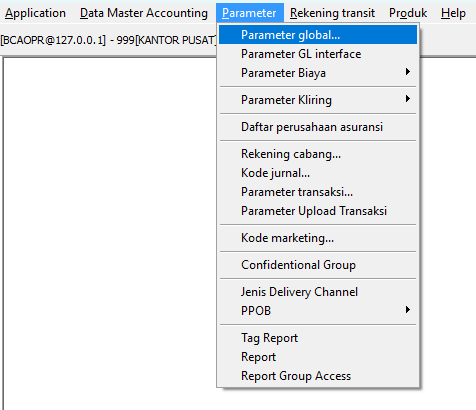 

- List : Daftar parameter `REKENING_DORMANT` (tampilkan: TAKT_HARI, DORM_HARI, TUTUP_NOL_HARI, TAKT_BIAYA, DORM_BIAYA)

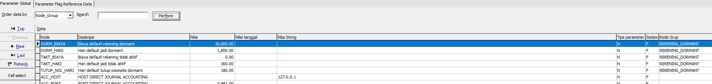 

- Form : Form edit salah satu parameter (contoh: TAKT_HARI = 360)

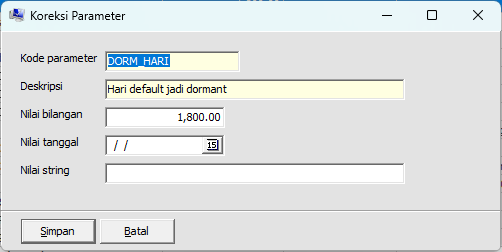

### 1.2 Parameter Transaksi
- Menu: **Parameter → Parameter Transaksi**

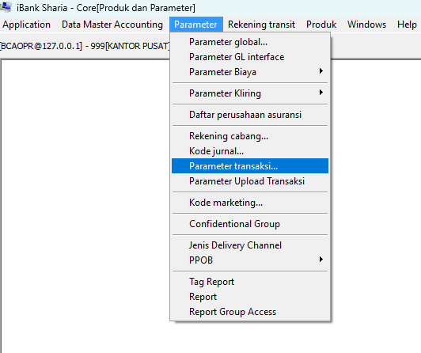

- List : Daftar parameter transaksi dengan kolom `is_exclude_aktivitas_nasabah`

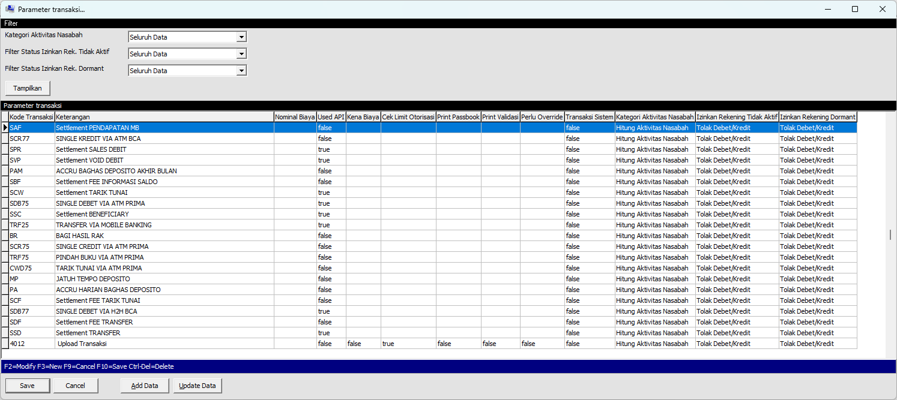

- Form : Form Detail Parameter Transaksi

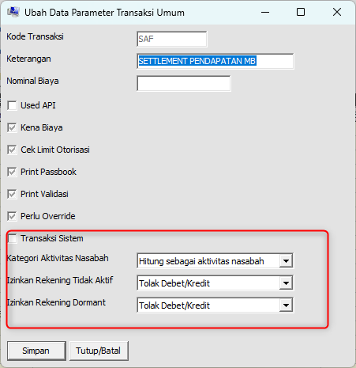

> **Catatan:** Contoh kode yang di-exclude: SD, PD, SC, SCD, SDP, SDZ, SI (tampilkan flag = T)

### 1.3 Parameter Produk
- Menu: **Parameter → List Produk Tabungan** (atau Giro)

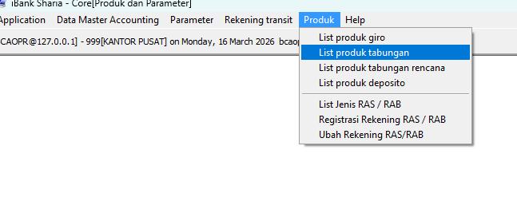

- Form : Ubah Produk — Penyesuaian Field Parameter Tidak Aktif, Dormant dan Tutup Otomatis Saldo Nol

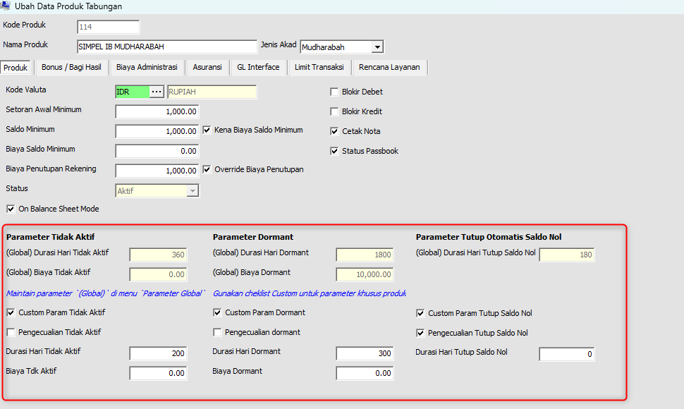

**Ringkasan field produk yang terlibat:**

| Caption di Form | Fungsi |
|---|---|
| **Custom Param Tidak Aktif** | ☑ = gunakan threshold & biaya tidak aktif dari produk, bukan global |
| **Pengecualian Tidak Aktif** | ☑ = rekening produk ini tidak akan pernah masuk status Tidak Aktif |
| **Durasi Hari Tidak Aktif** | Override threshold hari tidak aktif *(aktif jika Custom Param dicentang)* |
| **Biaya Tdk Aktif** | Override nominal biaya tidak aktif *(aktif jika Custom Param dicentang)* |
| **Custom Param Dormant** | ☑ = gunakan threshold & biaya dormant dari produk, bukan global |
| **Pengecualian Dormant** | ☑ = rekening produk ini tidak akan pernah masuk status Dormant |
| **Durasi Hari Dormant** | Override threshold hari dormant *(aktif jika Custom Param dicentang)* |
| **Biaya Dormant** | Override nominal biaya dormant *(aktif jika Custom Param dicentang)* |
| **Custom Param Tutup Saldo Nol** | ☑ = gunakan threshold tutup otomatis dari produk, bukan global |
| **Pengecualian Tutup Saldo Nol** | ☑ = rekening produk ini tidak akan ditutup otomatis saat saldo nol |
| **Durasi Hari Tutup Saldo Nol** | Override threshold hari tutup otomatis *(aktif jika Custom Param dicentang)* |

---

## 2. Informasi Rekening Nasabah

- Informasi Rekening → Info Tgl Aktivitas Terakhir
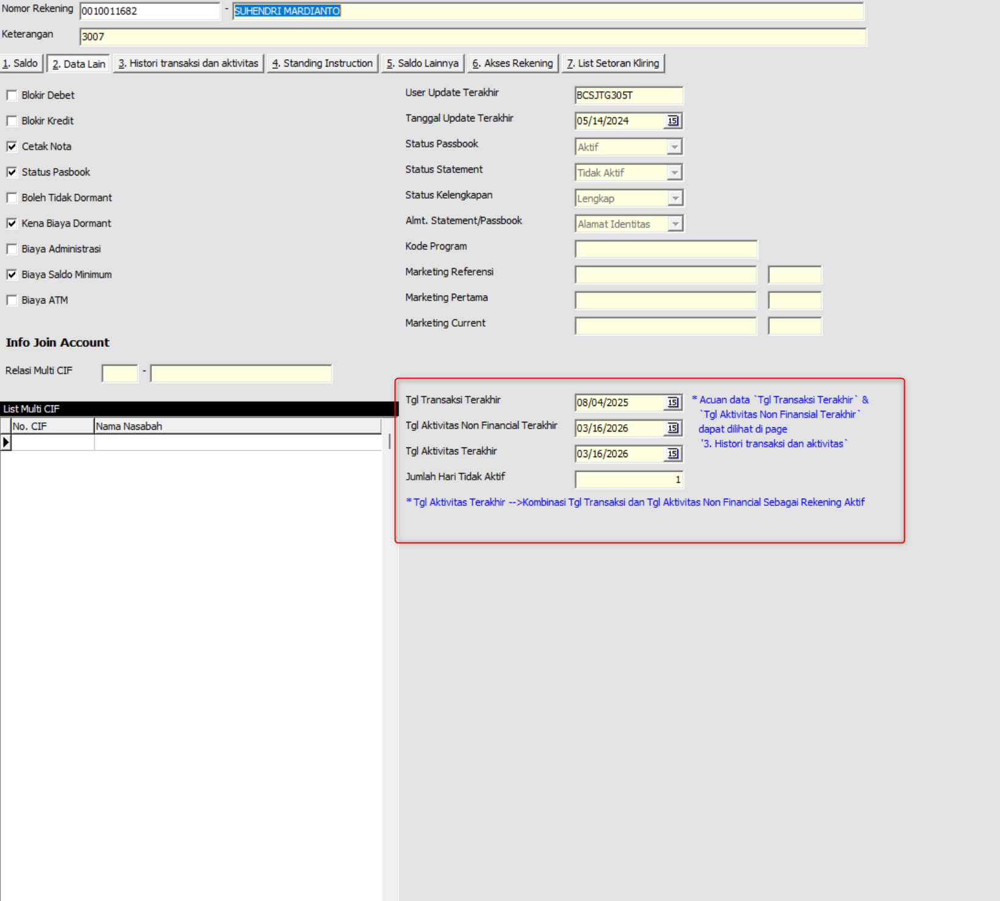 

!!! note "Mekanisme `tgl_aktivitas_terakhir`"
    - Merupakan **gabungan** dari transaksi finansial nasabah (kecuali transaksi otomatis sistem) dan aktivitas non-finansial nasabah.
    - **Hanya diperbarui jika rekening berstatus Aktif**. Jika rekening sudah berstatus Tidak Aktif atau Dormant, tanggal ini berhenti diperbarui agar hitungan batas hari tidak ter-reset secara otomatis (memerlukan reaktivasi manual dari petugas).
    - Tanggal ini adalah acuan utama perhitungan *threshold* perpindahan status rekening pada proses *End of Day* (EOD).
    - **Update Realtime Saat *Inquiry*:** Khusus ketika nomor rekening di-*inquiry* (misalnya dibuka di layar Informasi Rekening), sistem akan langsung melakukan operasi kalkulasi dan *update* data tanpa menunggu jadwal EOD, memastikan data yang tampil selalu sinkron dengan aktivitas dan transaksi hari ini.

- Informasi Rekening → Info Histori Tgl Aktivitas Nonfin Terakhir
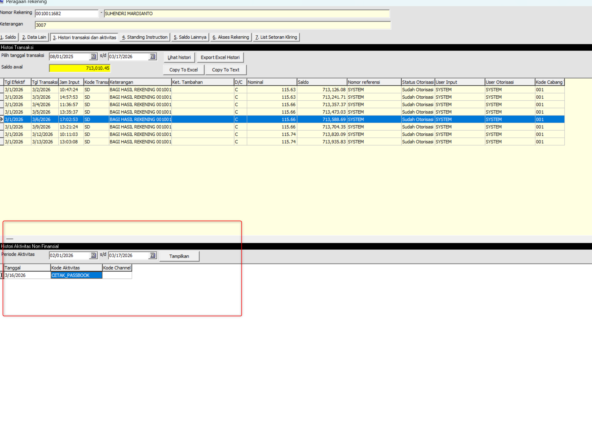 

- Informasi Rekening - Info Saldo Nol
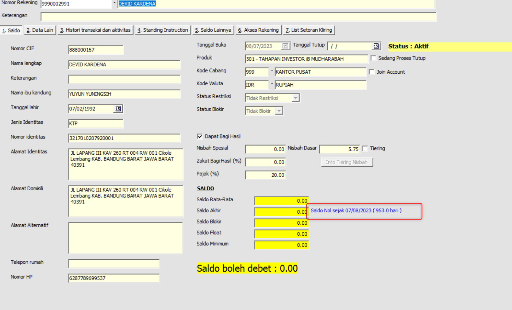

---

## 3. Transaksi Berdasarkan Status Rekening

> Menunjukkan perbedaan perilaku sistem saat transaksi dilakukan pada rekening dengan status berbeda.

### 3.1 Transaksi pada Rekening Tidak Aktif
- Transaksi debet tidak **diperbolehkan** (contoh: pindah buku)

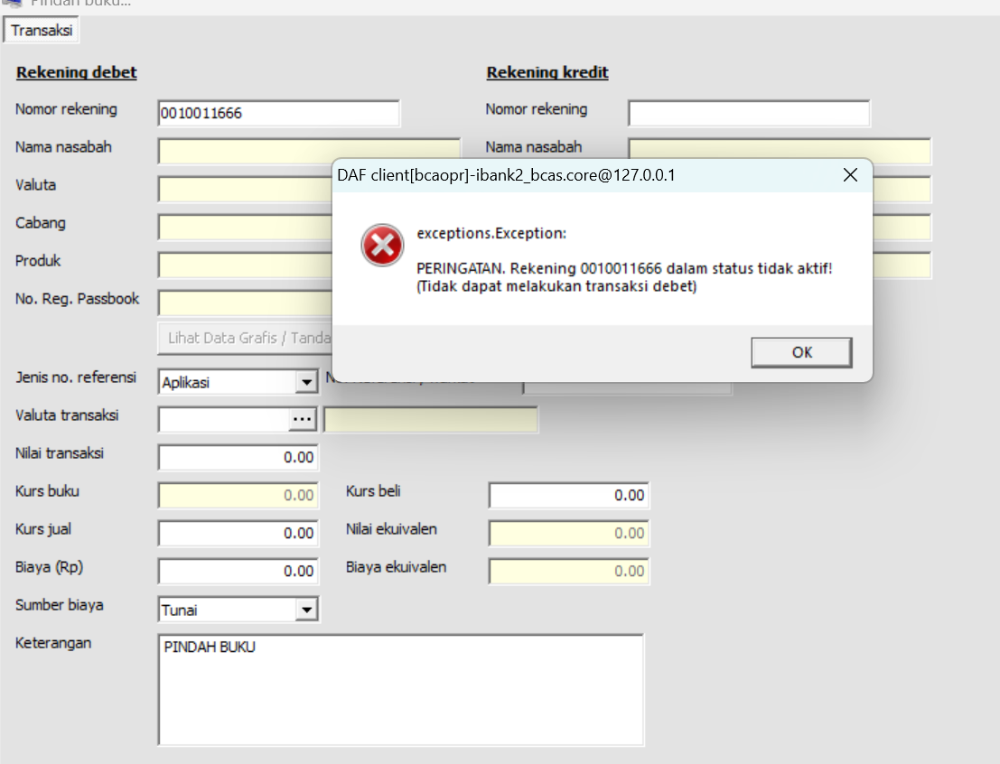
*Contoh transaksi pada rekening Tidak Aktif*

### 3.2 Transaksi pada Rekening Dormant
- Transaksi **diblokir** — pesan penolakan bahwa rekening berstatus Dormant

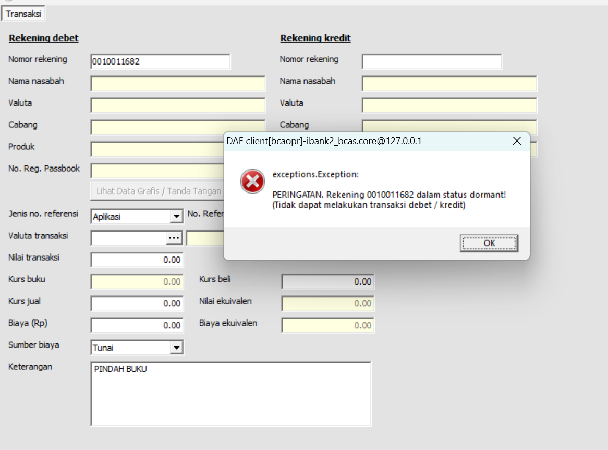
*Pesan penolakan transaksi pada rekening Dormant*

> **Catatan:** Matriks lengkap transaksi yang diperbolehkan per status rekening:
>
> | Jenis Transaksi | Aktif | Tidak Aktif | Dormant |
> |---|:---:|:---:|:---:|
> | Setor Tunai (Teller) | ✅ | ✅ | ❌ |
> | Tarik Tunai (Teller) | ✅ | ❌ | ❌ |
> | Transfer Masuk | ✅ | ✅ | ❌ |
> | Transfer Keluar | ✅ | ❌ | ❌ |
> | Cek Saldo / Inquiry | ✅ | ✅ | ❌ |
> | Tarik Tunai ATM | ✅ | ❌ | ❌ |

---

## 4. Reaktivasi Rekening (UC-05)

- Menu: **Rekening → Ubah Rekening Tidak Aktif / Dormant**
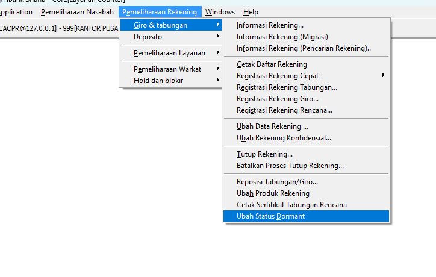 

- Form : **Form Ubah Rekening Tidak Aktif / Dormant**
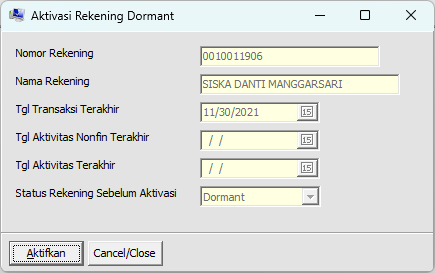

---

## 5. Laporan

### 5.1 Laporan Rekening Tidak Aktif (R041)
- Menu: **Laporan → Rekening Aktif jadi Tidak Aktif**
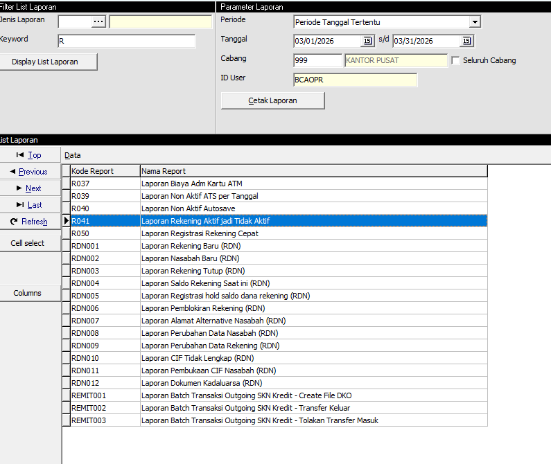 

- Result : **Laporan Rekening Aktif jadi Tidak Aktif**
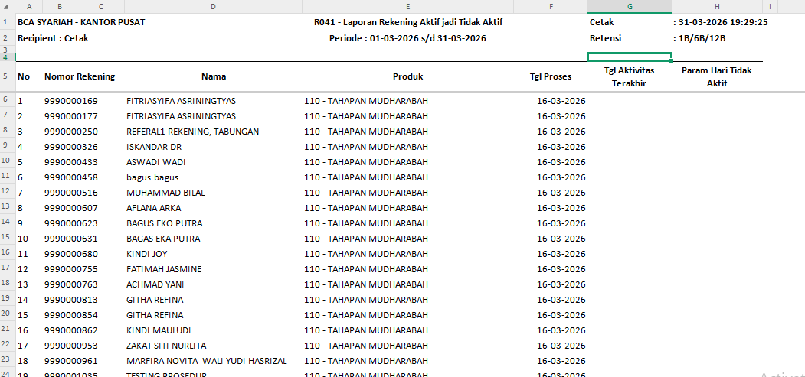

### 5.2 Laporan Rekening Dormant (R029)
- Menu: **Laporan → Rekening Dormant**
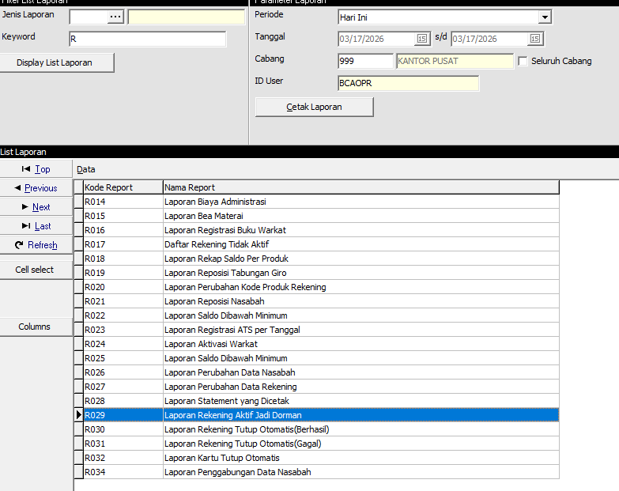 

- Result: **Laporan Rekening Dormant**
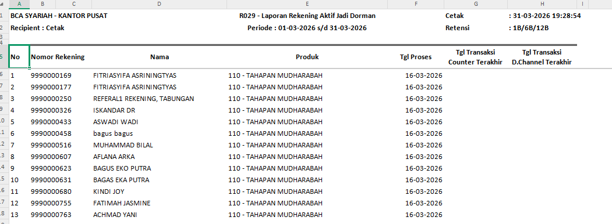

### 5.3 Laporan Tutup Otomatis (R030)
- Menu: **Laporan → Rekening Tutup Otomatis**
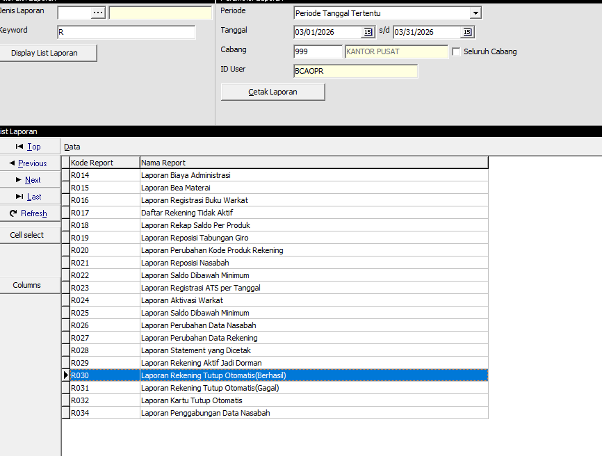 

- Result: **Laporan Tutup Otomatis**
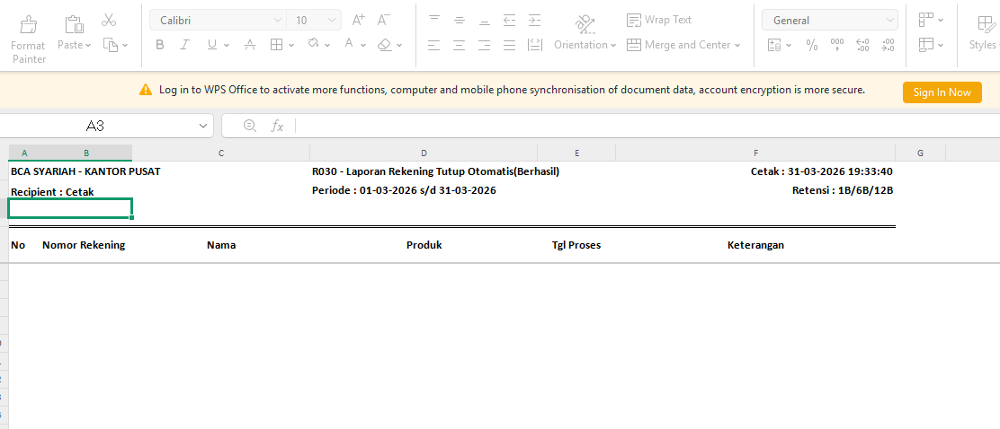

---

## 6. Batch EOD 

- EODLIAB01 - UPDATE ACCOUNT LAST TRX DATE (urutan 145)
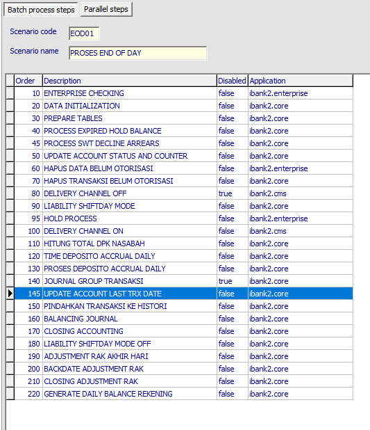 

- EODLIAB02 - Batch Dormant (deteksi tidak aktif → dormant)
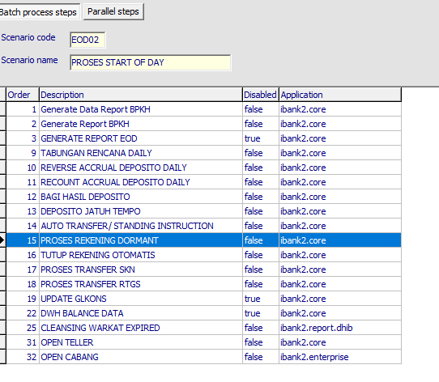 

- EODLIAB02 - Tutup Otomatis
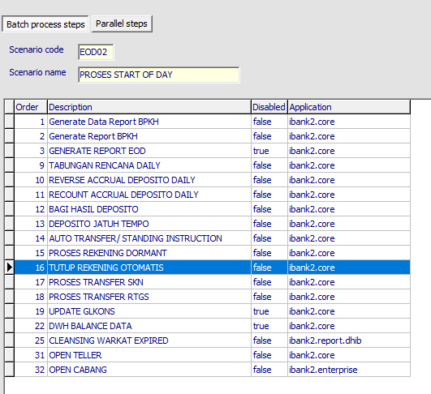 

---
