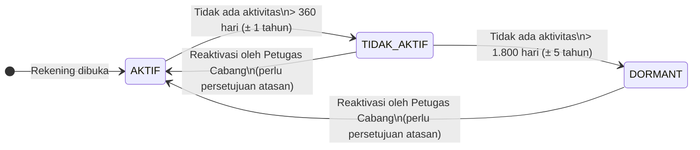
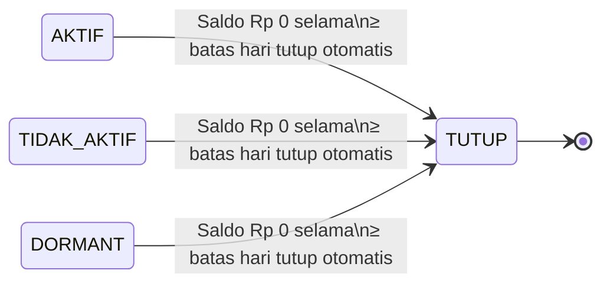
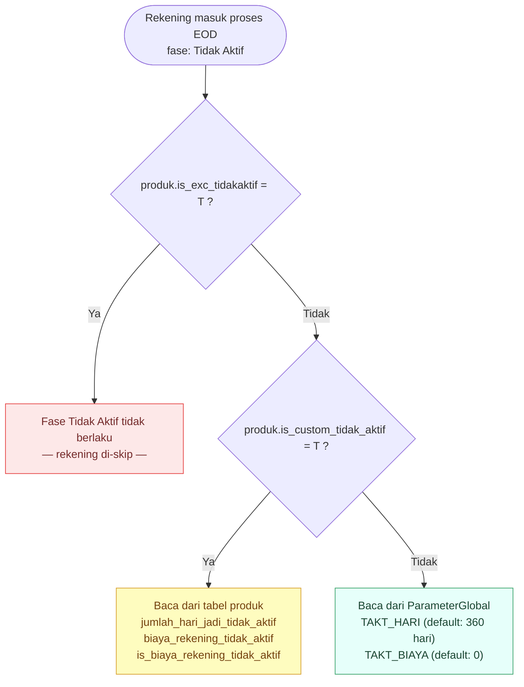
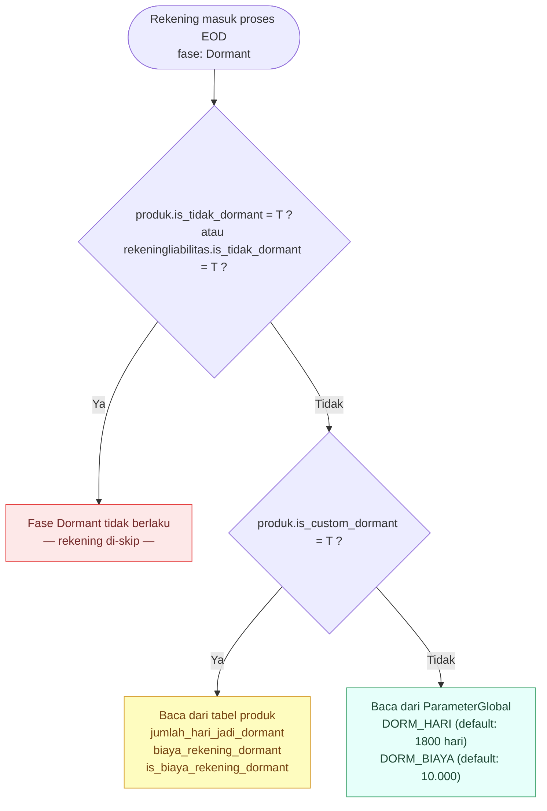
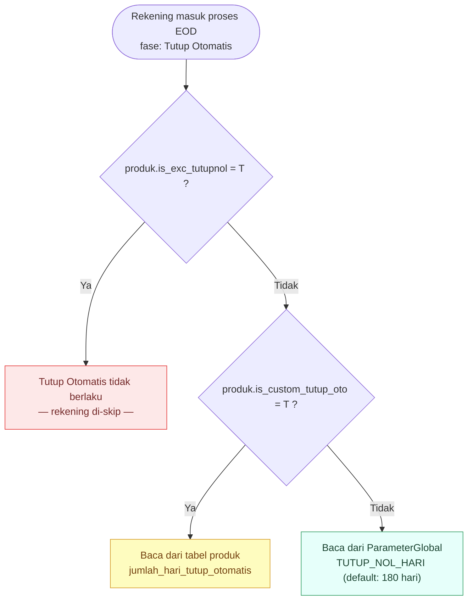
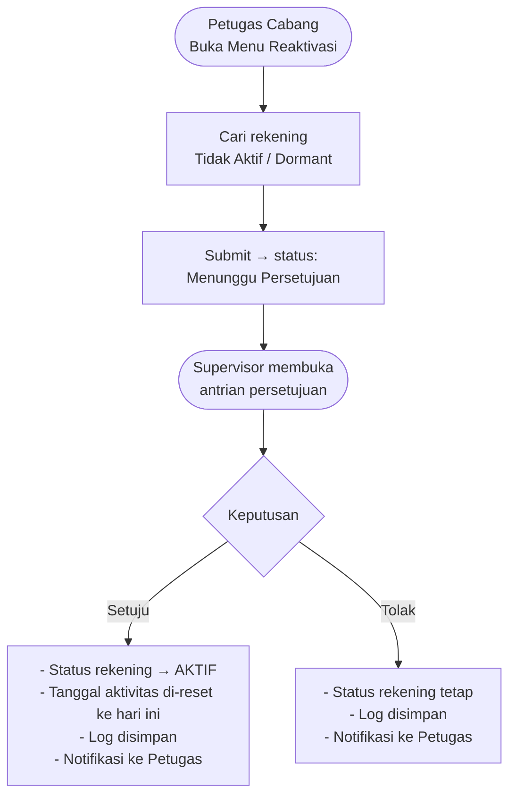

# Use Case — Pengelolaan Rekening Tidak Aktif & Dormant

| | |
|---|---|
| **Versi** | 1.0 |
| **Tanggal** | 1 April 2026 |
| **Status** | Draft |

---

## Diagram A — Alur Status Rekening (Tidak Aktif & Dormant)

> Perubahan status **Tidak Aktif** dan **Dormant** ditentukan berdasarkan lamanya waktu tanpa aktivitas nasabah — dihitung setiap hari oleh sistem.

## Diagram B — Tutup Otomatis Saldo Nol (Independen)

> Tutup otomatis adalah proses **terpisah** dari alur tidak aktif/dormant. Rekening dalam status apapun — termasuk **Aktif** — dapat ditutup otomatis apabila saldonya Rp 0 secara terus-menerus melebihi batas hari yang dikonfigurasi. Rekening yang dikecualikan dari aturan ini tidak akan ditutup otomatis.

---

## Ringkasan Status Rekening

| Status | Kondisi | Keterangan |
|---|---|---|
| **Aktif** | Ada aktivitas dalam 360 hari terakhir | Operasional normal |
| **Tidak Aktif** | Tidak ada aktivitas > 360 hari s.d. ≤ 1.800 hari | Beberapa transaksi dibatasi — perlu reaktivasi |
| **Dormant** | Tidak ada aktivitas > 1.800 hari | Transaksi diblokir — perlu reaktivasi |
| **Tutup** | Saldo Rp 0 melebihi batas hari tutup otomatis *(dari status apapun)* | Rekening ditutup permanen |

---

## Matriks Transaksi Berdasarkan Status Rekening

| Jenis Transaksi | Aktif | Tidak Aktif | Dormant |
|---|:---:|:---:|:---:|
| Setor Tunai (Teller) | ✅ | ✅ | ❌ |
| Tarik Tunai (Teller) | ✅ | ❌ | ❌ |
| Transfer Masuk | ✅ | ✅ | ❌ |
| Transfer Keluar | ✅ | ❌ | ❌ |
| Autodebit | ✅ | ❌ | ❌ |
| Cek Saldo / Inquiry | ✅ | ✅ | ❌ |
| Tarik Tunai ATM | ✅ | ❌ | ❌ |

| Simbol | Arti |
|:---:|---|
| ✅ | Diperbolehkan |
| ⚠️ | Terbatas (tergantung kebijakan bank) |
| ❌ | Tidak diperbolehkan |

---

## Konfigurasi Parameter

Semua parameter hari dan biaya dapat dikonfigurasikan oleh administrator sistem melalui menu **Parameter Global**, tanpa perlu mengubah konfigurasi di setiap produk secara satu per satu.

| Parameter | Nilai Default | Keterangan |
|---|---|---|
| Batas hari menjadi Tidak Aktif | 360 hari (± 1 tahun) | Sesuai ketentuan OJK. Dapat disesuaikan kebijakan bank |
| Batas hari menjadi Dormant | 1.800 hari (± 5 tahun) | Sesuai ketentuan OJK. Dapat disesuaikan kebijakan bank |
| Batas hari tutup otomatis (saldo nol) | 180 hari | Dapat disesuaikan kebijakan bank |
| Biaya rekening Tidak Aktif | Rp 0 | Default tidak ada biaya |
| Biaya rekening Dormant | Rp 10.000 | Dapat disesuaikan kebijakan bank |

> **Parameter di atas dapat di-*override* per jenis produk.** Artinya, produk tertentu (mis. TabunganKu, Giro Korporat) dapat memiliki batas hari dan biaya yang berbeda dari nilai default global.

### Hierarki Parameter — Cara Kerja

Sistem menggunakan **3 layer** untuk menentukan threshold dan biaya setiap rekening:

> **Pengecualian → Override Produk → Default Global**

**Fase 1 — Tidak Aktif**

**Fase 2 — Dormant**

> `is_tidak_dormant` di `rekeningliabilitas` adalah satu-satunya pengecualian yang bisa dikonfigurasi **per rekening** (bukan per produk).

**Fase 3 — Tutup Otomatis Saldo Nol**

---

## UC-01 — Rekening Berubah Menjadi Tidak Aktif

**Aktor:** Sistem (proses otomatis harian / EOD)

| | Keterangan |
|---|---|
| **Given** | Rekening nasabah berstatus **Aktif** dan tidak memiliki aktivitas apapun (transaksi, cek saldo, login mobile banking, dll.) selama lebih dari batas hari yang dikonfigurasi (default: 360 hari / ± 1 tahun) |
| **When** | Proses harian (End of Day) berjalan |
| **Then** | Status rekening berubah menjadi **Tidak Aktif**, dan rekening dicatat dalam laporan rekening tidak aktif |

### Skenario Tambahan

| Skenario | Given | When | Then |
|---|---|---|---|
| **Produk dikecualikan** | Rekening menggunakan produk yang dikonfigurasi untuk tidak pernah masuk status Tidak Aktif (mis. rekening khusus) | Proses harian berjalan | Rekening **tidak** berubah status — tetap Aktif |
| **Produk dengan threshold custom** | Rekening menggunakan produk dengan batas hari tidak aktif berbeda dari standar (mis. 180 hari) | Proses harian berjalan | Sistem menggunakan batas hari dari konfigurasi produk tersebut |
| **Nasabah cek saldo melalui ATM** | Rekening hampir melewati batas hari tidak aktif, lalu nasabah melakukan cek saldo via ATM | Proses harian berjalan | Aktivitas cek saldo **dicatat** dan hitungan hari tidak aktif di-reset, rekening tetap Aktif |

---

## UC-02 — Rekening Berubah Menjadi Dormant

**Aktor:** Sistem (proses otomatis harian / EOD)

| | Keterangan |
|---|---|
| **Given** | Rekening nasabah berstatus **Tidak Aktif** dan tidak ada aktivitas apapun hingga melewati batas hari dormant (default: 1.800 hari / ± 5 tahun sejak aktivitas terakhir) |
| **When** | Proses harian (End of Day) berjalan |
| **Then** | Status rekening berubah menjadi **Dormant**, rekening dicatat dalam laporan rekening dormant, dan seluruh transaksi diblokir |

### Skenario Tambahan

| Skenario | Given | When | Then |
|---|---|---|---|
| **Rekening dikecualikan dari dormant** | Rekening dikonfigurasi untuk tidak bisa dormant (flag pengecualian aktif, mis. rekening giro korporat tertentu) | Proses harian berjalan | Rekening **tidak** berubah ke status Dormant |
| **Produk dengan threshold dormant custom** | Produk memiliki batas hari dormant berbeda dari standar global | Proses harian berjalan | Sistem menggunakan batas hari dari konfigurasi produk |

---

## UC-03 — Rekening Ditutup Otomatis (Saldo Nol)

**Aktor:** Sistem (proses otomatis harian / EOD)

| | Keterangan |
|---|---|
| **Given** | Rekening nasabah (dalam status apapun kecuali Tutup) memiliki **saldo Rp 0** secara terus-menerus selama lebih dari batas hari yang dikonfigurasi (default: 180 hari) |
| **When** | Proses harian (End of Day) berjalan |
| **Then** | Rekening ditutup otomatis, dicatat dalam laporan rekening tutup otomatis beserta tanggal saldo pertama kali menjadi nol dan parameter hari yang digunakan |

### Skenario Tambahan

| Skenario | Given | When | Then |
|---|---|---|---|
| **Produk dikecualikan dari tutup otomatis** | Rekening menggunakan produk yang dikonfigurasi untuk tidak pernah ditutup otomatis (mis. TabunganKu) | Proses harian berjalan | Rekening **tidak** ditutup, meskipun saldo Rp 0 dalam waktu lama |
| **Saldo kembali ada sebelum batas** | Rekening memiliki saldo Rp 0, kemudian ada setoran sebelum melewati batas hari | Proses harian berjalan | Hitungan hari saldo nol di-reset, rekening tidak ditutup |

---

## UC-04 — Pencatatan Aktivitas Nasabah

**Aktor:** Nasabah (via ATM, Mobile Banking, Internet Banking, atau Teller)

| | Keterangan |
|---|---|
| **Given** | Nasabah melakukan aktivitas apapun — baik transaksi finansial maupun non-finansial (cek saldo, cek mutasi, cetak buku tabungan, setor, tarik, transfer, dll.) |
| **When** | Nasabah menyelesaikan aktivitas tersebut melalui kanal manapun |
| **Then** | Aktivitas dicatat dan digunakan sebagai dasar perhitungan hari tidak aktif pada proses harian berikutnya |

> **Catatan:** Proses pencatatan ini berjalan di latar belakang dan **tidak memperlambat** layanan yang diterima nasabah.

### Aktivitas Non-Finansial yang Dicatat

Aktivitas berikut tidak melibatkan uang, namun tetap dihitung sebagai bukti nasabah masih aktif menggunakan rekeningnya:

| Jenis Aktivitas | Kanal |
|---|---|
| Cek Saldo | ATM, Mobile Banking, Internet Banking, Teller |
| Cek Mutasi / Riwayat Transaksi | ATM, Mobile Banking, Internet Banking, Teller |
| Cetak Buku Tabungan | Teller |
| Cetak Saldo Passbook | Teller |

### Transaksi Finansial — Yang Dihitung dan Yang Dikecualikan

Tidak semua transaksi finansial dihitung sebagai aktivitas nasabah. Transaksi yang **dibuat otomatis oleh sistem** (tanpa keterlibatan nasabah) **dikecualikan**, karena bukan cerminan keaktifan nasabah sesungguhnya.

| Kategori | Contoh Transaksi | Dihitung sebagai Aktivitas? |
|---|---|:---:|
| Transaksi oleh nasabah | Setor tunai, tarik tunai, transfer, pembayaran tagihan, pemindahbukuan | ✅ Ya |
| Bagi hasil / nisbah | Pembukuan bagi hasil tabungan, giro, deposito | ❌ Tidak |
| Pajak & zakat | Pemotongan pajak bagi hasil, zakat bagi hasil | ❌ Tidak |
| Biaya rekening | Biaya administrasi bulanan, biaya rekening dormant | ❌ Tidak |
| Transfer otomatis sistem | Auto transfer antar rekening yang dibuat oleh sistem | ❌ Tidak |

> Daftar transaksi yang dikecualikan dapat dikonfigurasi oleh administrator melalui menu **Parameter Transaksi**, sehingga fleksibel mengikuti kebijakan bank.

### Skenario Khusus — Aktivitas pada Rekening Tidak Aktif atau Dormant

| Skenario | Given | When | Then |
|---|---|---|---|
| **Nasabah melakukan transaksi pada rekening Tidak Aktif** | Rekening berstatus **Tidak Aktif**, nasabah melakukan transaksi (mis. setor tunai) | Proses harian berjalan | Transaksi tetap **dicatat** secara historis, namun **tidak me-reset hitungan hari** status rekening — rekening tetap berstatus Tidak Aktif |
| **Nasabah cek saldo pada rekening Dormant** | Rekening berstatus **Dormant**, nasabah melakukan cek saldo | Proses harian berjalan | Aktivitas cek saldo **tidak dicatat** sebagai aktivitas yang mengubah status — rekening tetap berstatus Dormant |

> **Catatan penting:** Aktivitas nasabah — baik transaksi finansial maupun non-finansial — **tidak** secara otomatis mengembalikan status rekening ke Aktif.
> Rekening yang sudah berstatus Tidak Aktif atau Dormant hanya bisa dikembalikan ke status Aktif melalui proses **reaktivasi manual** oleh petugas cabang (lihat UC-05).
>
> Hal ini dimaksudkan agar rekening yang sudah masuk kategori tidak aktif/dormant tidak "lolos" dari pemantauan hanya karena ada satu transaksi yang terjadi.

---

## UC-05 — Reaktivasi Rekening oleh Petugas Cabang

**Aktor:** Petugas Cabang (User), Supervisor/Pejabat Cabang (Approver)

| | Keterangan |
|---|---|
| **Given** | Rekening nasabah berstatus **Tidak Aktif** atau **Dormant**, dan petugas cabang membuka menu reaktivasi rekening |
| **When** | Petugas cabang mencari rekening dan mengajukan permohonan reaktivasi |
| **Then** | Permohonan masuk ke antrian persetujuan Supervisor/pejabat cabang |

### Skenario: Permohonan Disetujui

| | Keterangan |
|---|---|
| **Given** | Permohonan reaktivasi sudah diajukan oleh petugas cabang dan menunggu persetujuan |
| **When** | Supervisor/pejabat cabang menyetujui permohonan |
| **Then** | Status rekening berubah menjadi **Aktif**, tanggal aktivitas terakhir di-reset ke hari ini, aktivitas dicatat dalam log, dan notifikasi dikirimkan ke petugas cabang |

### Skenario: Permohonan Ditolak

| | Keterangan |
|---|---|
| **Given** | Permohonan reaktivasi sudah diajukan oleh petugas cabang dan menunggu persetujuan |
| **When** | Supervisor/pejabat cabang menolak permohonan |
| **Then** | Status rekening **tidak berubah** (tetap Tidak Aktif / Dormant), log disimpan, dan notifikasi dikirimkan ke petugas cabang |

> **Catatan Penting:** Aktivitas nasabah sendiri (seperti cek saldo, login, atau transaksi) **tidak** secara otomatis mengubah status rekening kembali menjadi Aktif. Reaktivasi hanya bisa dilakukan oleh petugas cabang melalui menu khusus dengan persetujuan atasan.

---

## UC-06 — Pengenaan Biaya Rekening Tidak Aktif & Dormant

**Aktor:** Sistem (proses otomatis bulanan / EOM)

| | Keterangan |
|---|---|
| **Given** | Rekening nasabah berstatus **Tidak Aktif** atau **Dormant** pada saat proses akhir bulan berjalan |
| **When** | Proses akhir bulan (End of Month) berjalan |
| **Then** | Biaya administrasi rekening dikenakan sesuai konfigurasi yang berlaku (dari pengaturan produk atau pengaturan global) |

### Skenario Tambahan

| Skenario | Given | When | Then |
|---|---|---|---|
| **Biaya dari konfigurasi produk** | Produk memiliki konfigurasi biaya sendiri yang berbeda dari standar global | Proses akhir bulan berjalan | Sistem menggunakan nominal biaya dari konfigurasi produk |
| **Biaya dari konfigurasi global** | Produk tidak memiliki konfigurasi biaya khusus | Proses akhir bulan berjalan | Sistem menggunakan nominal biaya dari pengaturan global (default) |
| **Produk tanpa biaya tidak aktif** | Produk dikonfigurasi dengan biaya tidak aktif = Rp 0 (mis. TabunganKu) | Proses akhir bulan berjalan | Tidak ada biaya yang dikenakan, rekening tetap pada statusnya |

---
