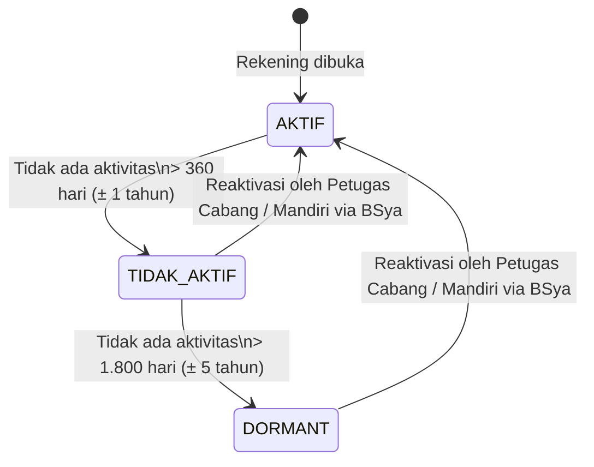
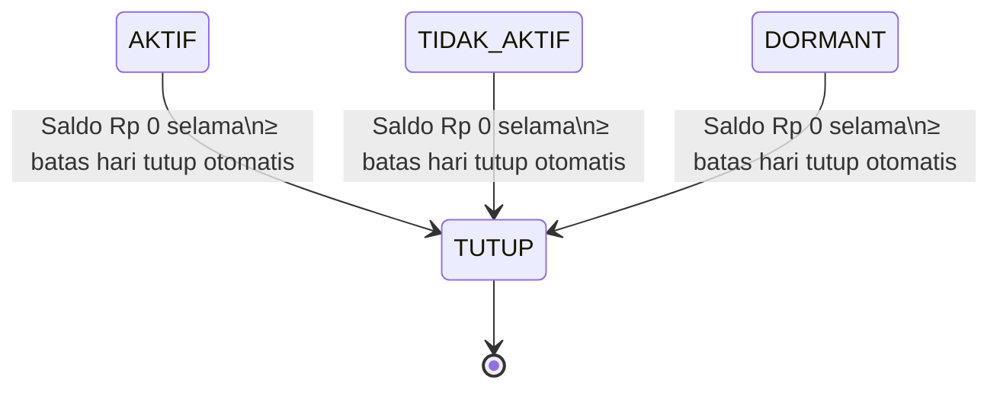
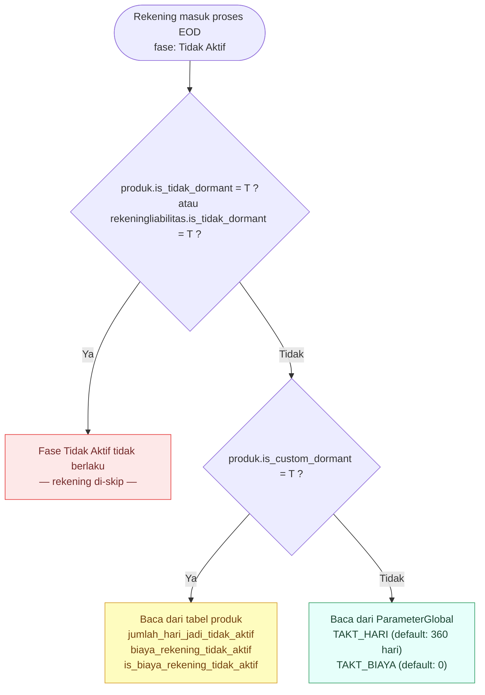
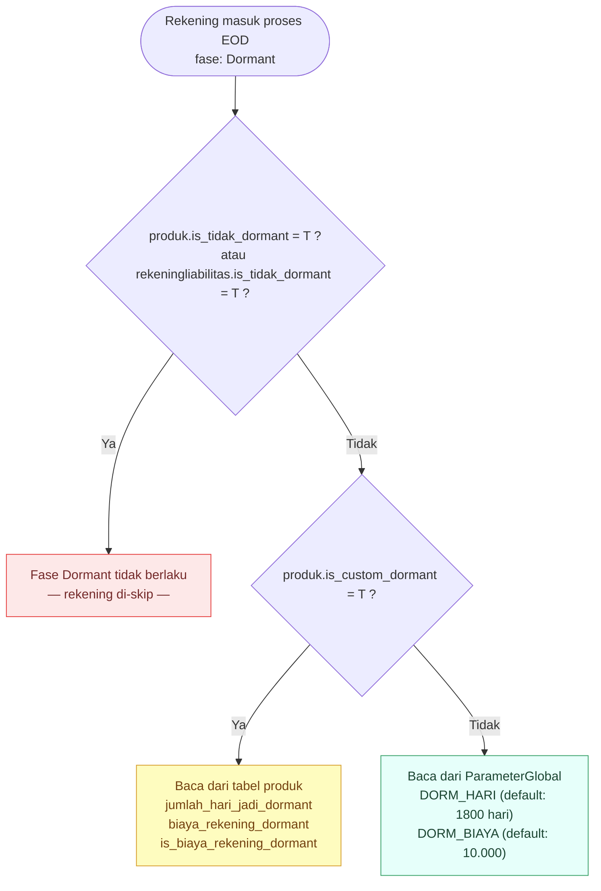
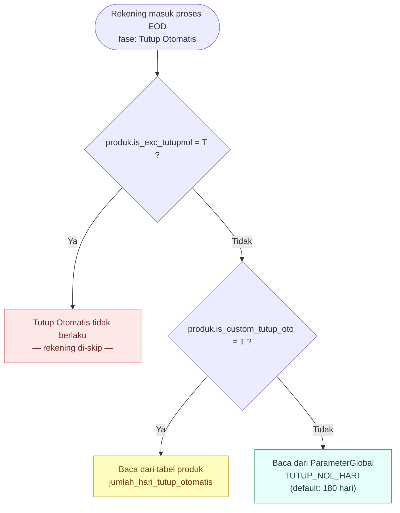
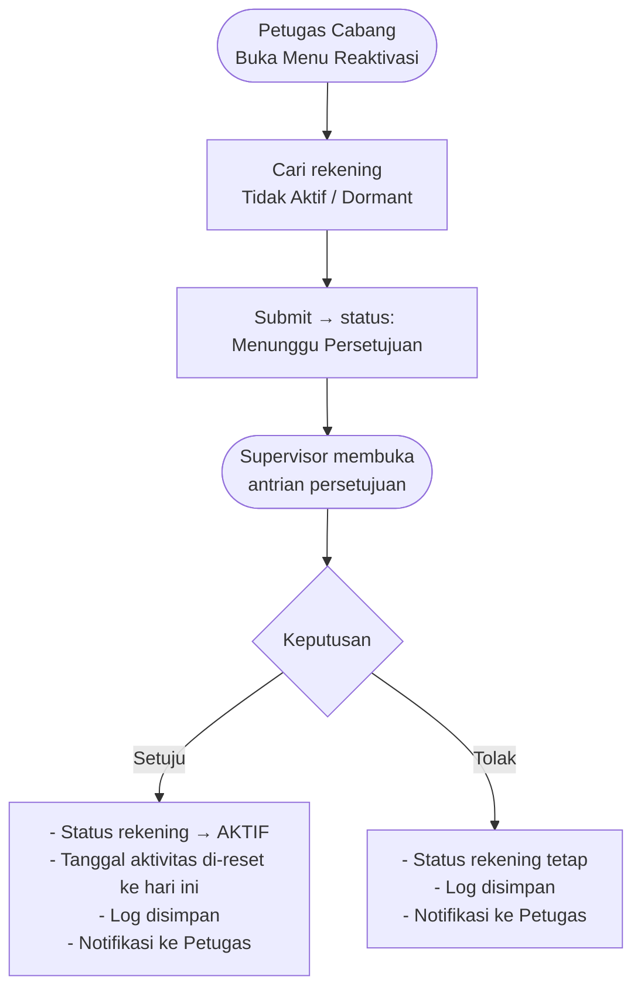

# FUNCTIONAL SPECIFICATION DOCUMENT

**BCA SYARIAH (BCAS)**
**MODUL REKENING FUNDING**
**FITUR ENHANCE REKENING TIDAK AKTIF & DORMANT**

Dipersiapkan oleh
PT Ihsan Solusi Informatika
Jl. PHH Mustofa No. 39
Ruko Surapati Core C-7 Bandung

| **Nomor Dokumen** | **Halaman** |
|---|---|
| **FSD-BCAS-DORMANT-01** | 1 / N |
| **Versi** | 1.0.0 | {DD Bulan YYYY} |

---

## Author

| **Nama** | **Role** |
|---|---|
| {Nama Writer} | Technical Writer |
| {Nama Reviewer} | Reviewer |

---

## Detail Daftar Perubahan

| Versi | Tanggal Perubahan | Penulis | Deskripsi |
|---|---|---|---|
| 1.0.0 | {DD/MM/YYYY} | {Nama Penulis} | Initial release dokumen FSD Enhance Rekening Tidak Aktif & Dormant |

---

## Daftar Isi

1. Gambaran Umum
   - 1.1. Latar Belakang
   - 1.2. Tujuan
   - 1.3. Ruang Lingkup
   - 1.4. Definisi
   - 1.5. Objektif
   - 1.6. Pengguna
2. Alur Status Rekening
   - 2.1. Diagram Transisi Status
   - 2.2. Ringkasan Status Rekening
   - 2.3. Matriks Transaksi Berdasarkan Status Rekening
3. Konfigurasi Parameter
   - 3.1. Parameter Global
   - 3.2. Parameter Transaksi
   - 3.3. Parameter Produk
4. Pencatatan Aktivitas Nasabah
   - 4.1. Aktivitas Non-Finansial
   - 4.2. Transaksi Finansial — Yang Dihitung dan Yang Dikecualikan
5. Proses EOD (End of Day)
   - 5.1. Alur Proses EOD
   - 5.2. Rekening Berubah Menjadi Tidak Aktif (UC-01)
   - 5.3. Rekening Berubah Menjadi Dormant (UC-02)
   - 5.4. Rekening Ditutup Otomatis Saldo Nol (UC-03)
6. Transaksi Berdasarkan Status Rekening
7. Reaktivasi Rekening (UC-05)
8. Pengenaan Biaya Rekening (UC-06)
9. Laporan
   - 9.1. Laporan Rekening Tidak Aktif (R041)
   - 9.2. Laporan Rekening Dormant (R029)
   - 9.3. Laporan Tutup Otomatis (R030)
10. Perubahan Database
    - 10.1. Ringkasan Perubahan
    - 10.2. DDL
11. Pengaturan Umum
12. Persetujuan Dokumen
13. Lampiran
    - Lampiran A. Screenshot Konfigurasi Parameter
    - Lampiran B. Screenshot Informasi Rekening
    - Lampiran C. Screenshot Transaksi Berdasarkan Status Rekening
    - Lampiran D. Screenshot Reaktivasi Rekening
    - Lampiran E. Screenshot Laporan

---

## 1. Gambaran Umum

### 1.1. Latar Belakang

OJK menerbitkan **POJK Nomor 24 Tahun 2025** tentang Pengelolaan Rekening Pada Bank Umum, yang mewajibkan seluruh bank umum — termasuk BCA Syariah — untuk menyesuaikan sistem pengelolaan rekening paling lambat **08 Mei 2026**. Peraturan ini memperkenalkan standar baru klasifikasi status rekening yang lebih terstruktur dan menggantikan kebijakan internal yang berlaku saat ini.

**Kondisi Sistem yang Ada (Sebelum Perubahan)**

Saat ini sistem BCA Syariah hanya mengenal dua klasifikasi rekening aktif-nonaktif: **Rekening Aktif** dan **Rekening Dormant**, dengan kondisi sebagai berikut:

- Threshold dormant: **180 hari** tanpa transaksi nasabah
- Tutup otomatis saldo nol: **48 bulan** berturut-turut
- Counter dormant dihitung dari transaksi nasabah (Counter/Delivery Channel); transaksi sistem (biaya admin, bagi hasil, pajak, zakat) tidak dihitung
- Belum ada status perantara antara Aktif dan Dormant
- Rekening dormant masih dapat bertransaksi melalui e-channel
- Aktivasi rekening dormant: nasabah datang langsung ke cabang

**Perubahan yang Diperlukan Berdasarkan POJK 24/2025**

Ketentuan baru mewajibkan penyesuaian pada tiga sistem yang saling terintegrasi:

1. **Core Banking System (DAF Legacy)** — penambahan status Tidak Aktif, perubahan threshold, logika counter aktivitas
2. **Branch Delivery System (BDS)** — menu aktivasi rekening Tidak Aktif/Dormant di kantor cabang
3. **E-Channel (Aplikasi BSya)** — aktivasi mandiri oleh nasabah dan notifikasi perubahan status

Poin utama penyesuaian:
- Penambahan status **Tidak Aktif** sebagai fase perantara antara Aktif dan Dormant (threshold: > 360 hari tanpa aktivitas)
- Perubahan threshold dormant dari **180 hari → 1.800 hari**
- Perubahan threshold tutup otomatis dari **48 bulan → 180 hari** saldo nol berturut-turut
- Perluasan definisi aktivitas yang mereset counter — mencakup **transaksi kredit, debet, dan cek saldo nasabah**
- Pembatasan biaya administrasi: tidak boleh menyebabkan saldo negatif

Dokumen sumber: *146/MO/STO/2026 — User Requirement DAF Legacy (5 Mar 2026)* dan *006/REQ/BDS/2026 — Catatan Requirement BDS (12 Jan 2026)*.

### 1.2. Tujuan

Berikut ini adalah tujuan pengembangan fitur Enhance Rekening Tidak Aktif & Dormant pada sistem BCAS:

- **Memenuhi ketentuan POJK Nomor 24 Tahun 2025** tentang Pengelolaan Rekening Pada Bank Umum, dengan tenggat implementasi 08 Mei 2026.
- Menambahkan status **Tidak Aktif** sebagai fase perantara antara Aktif dan Dormant, dengan threshold 360 hari sesuai ketentuan POJK.
- Mengubah threshold dormant dari 180 hari menjadi **1.800 hari** dan threshold tutup otomatis saldo nol dari 48 bulan menjadi **180 hari**, sesuai ketentuan POJK.
- Memperluas definisi aktivitas yang mereset counter keaktifan rekening, mencakup **transaksi kredit (pemasukan), debet (penarikan), dan pengecekan saldo** — termasuk aktivitas melalui ATM, Mobile Banking, dan kanal digital lainnya.
- Menyediakan **konfigurasi parameter yang fleksibel** — threshold hari dan biaya dapat dikonfigurasi secara global maupun di-override per produk.
- Memastikan **biaya administrasi tidak menyebabkan saldo negatif** — pendebetan biaya dilakukan hanya sebatas saldo yang tersedia (partial debet diperbolehkan).
- Menyediakan **proses reaktivasi** rekening Tidak Aktif dan Dormant melalui:
  - Menu di **Core Banking (DAF)**: input oleh petugas cabang dengan otorisasi supervisor.
  - Menu di **BDS (Branch Delivery System)**: pengajuan oleh operator dengan approve supervisor.
  - **E-Channel (BSya Mobile)**: aktivasi mandiri oleh nasabah.
- Menyediakan **notifikasi kepada nasabah** saat status rekening berubah dari Aktif ke Tidak Aktif atau Dormant.
- Mengotomatisasi **pengenaan biaya** rekening Tidak Aktif dan Dormant pada proses akhir bulan (EOM).
- Mengintegrasikan **audit trail** aktivasi dari seluruh channel (BDS, E-Channel, ATM) ke Core Banking System.

### 1.3. Ruang Lingkup

Ruang lingkup pengembangan fitur Enhance Rekening Tidak Aktif & Dormant pada sistem BCAS adalah sebagai berikut:

**Core Banking System (DAF Legacy)**

- **Status Rekening:** Penambahan status Tidak Aktif (status `7`) sebagai fase perantara antara Aktif (`1`) dan Dormant (`2`); perubahan threshold dormant dari 180 hari menjadi 1.800 hari.
- **Pencatatan Aktivitas:** Penambahan tabel `RekeningAktivitasNonfin` untuk mencatat aktivitas non-finansial nasabah secara real-time (cek saldo, cetak passbook, dll.). Counter aktivitas juga mencakup transaksi kredit dan debet oleh nasabah.
- **EOD — Update Aktivitas Terakhir:** Script baru `update_account_lasttxdate.py` untuk mengupdate `tgl_aktivitas_terakhir` di `RekeningLiabilitas` setiap EOD, menggabungkan transaksi finansial dan aktivitas non-finansial. Nilai efektif = nilai terbesar antara tanggal aktivitas, tanggal buka rekening, dan tanggal reaktivasi.
- **EOD — Batch Dormant:** Modifikasi script `update_dormant_account.py` untuk membaca `tgl_aktivitas_terakhir` (field baru) dan memproses dua fase: Tidak Aktif dan Dormant.
- **EOD — Tutup Otomatis:** Modifikasi script `saving_auto_close.py`; threshold tutup otomatis diubah dari 48 bulan menjadi 180 hari, dengan dukungan override per produk.
- **EOM — Biaya Rekening:** Modifikasi script `admcost_dormant_process.py` untuk mengenakan biaya rekening Tidak Aktif, di samping biaya Dormant yang sudah ada. Biaya tidak boleh melebihi saldo tersedia — partial debet diperbolehkan, saldo tidak boleh negatif.
- **Menu Reaktivasi (DAF):** Penambahan menu `Ubah Status Rekening` di modul Pemeliharaan Rekening untuk proses reaktivasi dengan mekanisme input oleh petugas dan otorisasi oleh supervisor.
- **Parameter Global:** Penambahan 5 parameter baru di `ParameterGlobal` (grup `REKENING_DORMANT`) untuk konfigurasi hari dan biaya secara terpusat.
- **Parameter Produk:** Penambahan kolom override per produk untuk threshold hari, biaya, dan pengecualian dari proses Tidak Aktif/Dormant/tutup otomatis.
- **Parameter Transaksi:** Penambahan field `tipe_exclude_aktivitas_nasabah`, `allow_rekening_tidak_aktif`, dan `allow_rekening_dormant` di `ParameterTransaksiUmum`.
- **Pengecualian Rekening:** Rekening dengan tujuan tertentu, fitur berjangka, atau dalam sengketa dikecualikan dari klasifikasi Tidak Aktif/Dormant.
- **Rekening Sub-Account / Valas:** Status Tidak Aktif/Dormant mengikuti rekening induk; transaksi saku valas dihitung sebagai aktivitas rekening induk; saldo saku valas diperhitungkan untuk tutup otomatis saldo nol.

**Branch Delivery System (BDS)**

- **Menu Aktivasi BDS:** Penambahan/modifikasi menu `Aktivasi Rekening Tidak Aktif/Dormant` di BDS cabang — operator input, supervisor otorisasi; status rekening efektif H+1 setelah EOD, sinkron dengan DAF.

**E-Channel (Aplikasi BSya)**

- **Aktivasi Mandiri Nasabah:** Fitur baru pada aplikasi BSya untuk nasabah mengaktifkan sendiri rekening Tidak Aktif atau Dormant tanpa harus datang ke cabang.
- **Notifikasi Nasabah:** Notifikasi otomatis kepada nasabah saat status rekening berubah dari Aktif menjadi Tidak Aktif atau Dormant. Detail pengembangan dituangkan dalam dokumen terpisah.

**Laporan**

- **DAF:** Penambahan laporan baru R041 (Rekening Aktif jadi Tidak Aktif); enhance R029 (Dormant) dan R030 (Tutup Otomatis Berhasil); tambah R031 (Tutup Otomatis Gagal) dan R032 (Kartu Tutup Otomatis) dengan kolom tambahan.
- **BDS:** R017 — Laporan Rekening Tidak Aktif dan Dormant; R029 — Laporan Perubahan Status Rekening.

**Integrasi & Audit Trail**

- **API Multi-Channel:** Seluruh aktivasi dari channel manapun (BDS, BSya, ATM) mencatat log ke Core Banking; update tabel data rekening dan tabel laporan perubahan status rekening.
- **Migrasi Data:** Rekening existing diklasifikasikan ulang saat implementasi: rekening dormant existing yang counter-nya < 360 hari → Aktif; counter 360–1800 hari → Tidak Aktif; counter > 1800 hari → tetap Dormant. Rekening saldo nol saat migrasi: counter tutup otomatis dimulai dari tanggal implementasi.

### 1.4. Definisi

Berikut adalah definisi dari beberapa istilah yang ada pada fitur Enhance Rekening Tidak Aktif & Dormant:

- **Rekening Aktif:** Rekening dengan status `1` — terdapat aktivitas nasabah dalam batas hari yang dikonfigurasi (default: 360 hari).
- **Rekening Tidak Aktif:** Status baru dengan kode `7` — rekening yang tidak memiliki aktivitas nasabah selama lebih dari batas hari tidak aktif (default: 360 hari), namun belum mencapai batas hari dormant.
- **Rekening Dormant:** Rekening dengan status `2` — tidak ada aktivitas nasabah lebih dari batas hari dormant (default: 1.800 hari / ± 5 tahun). Seluruh transaksi diblokir.
- **Rekening Tutup:** Rekening dengan status `3` — ditutup otomatis saat saldo Rp 0 secara terus-menerus melebihi batas hari tutup otomatis.
- **Tgl Aktivitas Terakhir (`tgl_aktivitas_terakhir`):** Field baru di `RekeningLiabilitas` — gabungan dari tanggal transaksi finansial nasabah dan tanggal aktivitas non-finansial terakhir. Merupakan acuan utama perhitungan status rekening pada proses EOD.
- **Aktivitas Non-Finansial:** Aktivitas yang tidak melibatkan pergerakan uang namun mencerminkan keaktifan nasabah, seperti cek saldo, cek mutasi, cetak buku tabungan. Dicatat di tabel `RekeningAktivitasNonfin`.
- **EOD (End of Day):** Proses harian otomatis yang berjalan setiap akhir hari kerja, termasuk update status rekening berdasarkan aktivitas terakhir.
- **EOM (End of Month):** Proses otomatis akhir bulan, termasuk pengenaan biaya rekening Tidak Aktif dan Dormant.
- **ParameterGlobal:** Tabel konfigurasi terpusat untuk threshold hari dan biaya — berlaku untuk semua produk kecuali produk yang memiliki konfigurasi override sendiri.
- **Override Produk:** Konfigurasi threshold dan biaya khusus per produk — digunakan jika produk mengaktifkan flag `is_custom_dormant = T`.
- **Reaktivasi:** Proses pengembalian status rekening Tidak Aktif atau Dormant menjadi Aktif, dilakukan oleh petugas cabang dengan persetujuan supervisor.

### 1.5. Objektif

- Dokumen ini disusun agar setiap pengguna dan pihak yang terlibat dalam proyek dapat memahami secara menyeluruh detail terkait fitur Enhance Rekening Tidak Aktif & Dormant.
- Seluruh ilustrasi/gambar pada dokumen ini digunakan semata-mata sebagai alat bantu untuk memudahkan pemahaman terhadap deskripsi field maupun alur proses/event.
- Dokumen ini merupakan dokumen fungsional yang dihasilkan dari proses pengumpulan kebutuhan bisnis (business requirement gathering) antara tim vendor (ISI) dan tim BCAS.
- Dokumen ini akan terus diperbarui sesuai kebutuhan, dan setiap perubahan harus disetujui oleh setiap pihak (vendor dan BCAS) melalui tanda tangan perwakilan resmi dari masing-masing pihak.

### 1.6. Pengguna

Berikut adalah pengguna fitur Enhance Rekening Tidak Aktif & Dormant:

| **No** | **Role** | **Deskripsi** |
|---|---|---|
| 1 | Nasabah | Melakukan aktivasi mandiri rekening Tidak Aktif atau Dormant melalui aplikasi BSya (E-Channel), tanpa harus datang ke cabang. |
| 2 | Petugas Cabang / Operator BDS | Melakukan pengajuan reaktivasi rekening Tidak Aktif atau Dormant melalui menu di DAF atau BDS. |
| 3 | Supervisor / Pejabat Cabang | Menyetujui atau menolak pengajuan reaktivasi rekening dari petugas cabang, baik di DAF maupun BDS. |
| 4 | System Administrator | Mengelola konfigurasi Parameter Global (hari dan biaya), Parameter Transaksi (exclude aktivitas nasabah), dan Parameter Produk (override threshold). |
| 5 | Finance & Accounting Staff | Mengakses laporan rekening Tidak Aktif (R041), Dormant (R029), Tutup Otomatis (R030/R031/R032), dan Laporan Perubahan Status Rekening. |

---

## 2. Alur Status Rekening

### 2.1. Diagram Transisi Status

#### Diagram A — Transisi Status Tidak Aktif & Dormant



> Perubahan status **Tidak Aktif** dan **Dormant** ditentukan berdasarkan lamanya waktu tanpa aktivitas nasabah — dihitung setiap hari oleh sistem pada proses EOD.

#### Diagram B — Tutup Otomatis Saldo Nol (Independen)



> Tutup otomatis adalah proses **terpisah** dari alur tidak aktif/dormant. Rekening dalam status apapun — termasuk **Aktif** — dapat ditutup otomatis apabila saldonya Rp 0 secara terus-menerus melebihi batas hari yang dikonfigurasi. Rekening yang dikecualikan dari aturan ini tidak akan ditutup otomatis.

### 2.2. Ringkasan Status Rekening

| Status | Kode | Kondisi | Keterangan |
|---|:---:|---|---|
| **Aktif** | `1` | Ada aktivitas dalam batas hari yang dikonfigurasi (default: 360 hari) | Operasional normal |
| **Tidak Aktif** | `7` *(baru)* | Tidak ada aktivitas > batas hari tidak aktif s.d. ≤ batas hari dormant | Beberapa transaksi dibatasi — perlu reaktivasi manual |
| **Dormant** | `2` | Tidak ada aktivitas > batas hari dormant (default: 1.800 hari) | Seluruh transaksi diblokir — perlu reaktivasi manual |
| **Tutup** | `3` | Saldo Rp 0 melebihi batas hari tutup otomatis *(dari status apapun)* | Rekening ditutup permanen |

### 2.3. Matriks Transaksi Berdasarkan Status Rekening

| Jenis Transaksi | Aktif | Tidak Aktif | Dormant |
|---|:---:|:---:|:---:|
| Setor Tunai (Teller) | ✅ | ✅ | ❌ |
| Tarik Tunai (Teller) | ✅ | ❌ | ❌ |
| Transfer Masuk | ✅ | ✅ | ❌ |
| Transfer Keluar | ✅ | ❌ | ❌ |
| Autodebit / Standing Instruction nasabah | ✅ | ❌ | ❌ |
| Cek Saldo / Inquiry | ✅ | ✅ | ✅ |
| Tarik Tunai ATM | ✅ | ❌ | ❌ |
| Bagi Hasil / Pajak / Zakat / Biaya Admin *(sistem)* | ✅ | ✅ | ✅ |
| ATS / Standing Instruction *(sistem)* | ✅ | ✅ | ✅ |

| Simbol | Arti |
|:---:|---|
| ✅ | Diperbolehkan |
| ❌ | Tidak diperbolehkan |

> **Catatan:**
> - Matriks di atas merupakan konfigurasi default. Perilaku per kode transaksi dapat dikonfigurasi lebih lanjut melalui **Parameter Transaksi** (field `allow_rekening_tidak_aktif` dan `allow_rekening_dormant`).
> - Transaksi yang dihasilkan otomatis oleh sistem bank (bagi hasil, pajak, zakat, biaya admin, ATS) **tetap dapat dilakukan** pada rekening Tidak Aktif maupun Dormant — ketentuan Post No Debet/Kredit hanya berlaku untuk transaksi yang diprakarsai nasabah.
> - **Cek Saldo / Inquiry** tetap dapat dilakukan di semua status rekening, namun tidak mengubah status rekening yang sudah Tidak Aktif atau Dormant.

---

## 3. Konfigurasi Parameter

### 3.1. Parameter Global

Semua parameter hari dan biaya dapat dikonfigurasikan oleh administrator sistem melalui menu **Parameter → Parameter Global** (filter grup: `REKENING_DORMANT`), tanpa perlu mengubah konfigurasi di setiap produk satu per satu.

| Kode Parameter | Nilai Default | Keterangan |
|---|---|---|
| `TAKT_HARI` | 360 hari | Batas hari menjadi Tidak Aktif (± 1 tahun). Sesuai ketentuan OJK |
| `DORM_HARI` | 1.800 hari | Batas hari menjadi Dormant (± 5 tahun). Sesuai ketentuan OJK |
| `TUTUP_NOL_HARI` | 180 hari | Batas hari tutup otomatis saldo nol |
| `TAKT_BIAYA` | Rp 0 | Default biaya rekening Tidak Aktif |
| `DORM_BIAYA` | Rp 10.000 | Default biaya rekening Dormant |

### 3.2. Parameter Transaksi

Menu: **Parameter → Parameter Transaksi**

Field baru yang ditambahkan pada `ParameterTransaksiUmum`:

| Caption di Form | Field | Nilai | Fungsi |
|---|---|---|---|
| **Transaksi Sistem** | `is_transaksi_sistem` | `T` / `F` (default `F`) | Menandai transaksi yang berasal dari sistem (mis. posting bagi hasil), untuk keperluan audit dan logika tertentu |
| **Kategori Aktivitas Nasabah** | `tipe_exclude_aktivitas_nasabah` | `F` / `DC` / `D` / `C` (default `F`) | `F` = hitung sebagai aktivitas nasabah; `DC` = exclude dari aktivitas nasabah; `D` = exclude debit; `C` = exclude kredit |
| **Izinkan Rekening Tidak Aktif** | `allow_rekening_tidak_aktif` | `F` / `DC` / `D` / `C` (default `C`) | `F` = Tolak Debet/Kredit; `DC` = Izinkan Debet/Kredit; `D` = Hanya Debet; `C` = Hanya Kredit |
| **Izinkan Rekening Dormant** | `allow_rekening_dormant` | `F` / `DC` / `D` / `C` (default `F`) | `F` = Tolak Debet/Kredit; `DC` = Izinkan Debet/Kredit; `D` = Hanya Debet; `C` = Hanya Kredit |

> **Catatan:** Jika kode transaksi tidak terdapat di parameter ini, maka secara default dianggap sebagai aktivitas nasabah (`tipe_exclude_aktivitas_nasabah = 'F'`), dan tidak diizinkan untuk rekening Tidak Aktif maupun Dormant.

**Contoh kode transaksi yang dikecualikan dari aktivitas nasabah:**

| Kode Transaksi | Keterangan | tipe_exclude_aktivitas_nasabah |
|---|---|:---:|
| `SD` | Bagi Hasil Tabungan/Giro — dibuat sistem EOD | `DC` |
| `PD` | Bagi Hasil Deposito — dibuat sistem EOD | `DC` |
| `SC` | Biaya Administrasi Bulanan — dibuat sistem EOD | `DC` |
| `SCD` | Biaya Rekening Dormant — dibuat sistem EOD | `DC` |
| `SDP` | Pajak Bagi Hasil — dibuat sistem EOD | `DC` |
| `SDZ` | Zakat Bagi Hasil — dibuat sistem EOD | `DC` |
| `SI` | Auto Transfer Antar Rekening — dibuat sistem | `DC` |

### 3.3. Parameter Produk

Menu: **Parameter → List Produk Tabungan** (atau Giro)

Sistem menggunakan **3 layer** untuk menentukan threshold dan biaya setiap rekening:

> **Pengecualian → Override Produk → Default Global**

**Fase 1 — Tidak Aktif**



**Fase 2 — Dormant**



> `is_tidak_dormant` berlaku untuk **kedua fase** — jika `T` di level produk atau per rekening (`rekeningliabilitas.is_tidak_dormant`), rekening dikecualikan dari fase Tidak Aktif maupun Dormant. Pengecualian per rekening adalah satu-satunya konfigurasi yang bisa diset **per rekening** (bukan per produk).

**Fase 3 — Tutup Otomatis Saldo Nol**



**Ringkasan field produk yang terlibat:**

*Parameter Global Dormant / Tidak Aktif (read-only, referensi dari ParameterGlobal):*

| Caption di Form | Fungsi |
|---|---|
| **(Global) Durasi Hari Tidak Aktif** | Nilai global threshold hari tidak aktif *(read-only)* |
| **(Global) Biaya Tidak Aktif** | Nilai global biaya tidak aktif *(read-only)* |
| **(Global) Durasi Hari Dormant** | Nilai global threshold hari dormant *(read-only)* |
| **(Global) Biaya Dormant** | Nilai global biaya dormant *(read-only)* |
| **(Global) Durasi Hari Tutup Saldo Nol** | Nilai global threshold hari tutup otomatis *(read-only)* |

*Parameter Produk Dormant / Tidak Aktif (override):*

| Caption di Form | Field | Fungsi |
|---|---|---|
| **Boleh Tidak (Dormant dan Tidak Aktif)** | `is_tidak_dormant` | ☑ = rekening produk ini boleh berstatus Tidak Aktif maupun Dormant |
| **Custom Param Dormant / Tidak Aktif** | `is_custom_dormant` | ☑ = gunakan threshold & biaya dari produk, bukan global |
| **Durasi Hari Tidak Aktif** | `jumlah_hari_jadi_tidak_aktif` | Override threshold hari tidak aktif *(aktif jika Custom Param dicentang)* |
| **Durasi Hari Dormant** | `jumlah_hari_jadi_dormant` | Override threshold hari dormant *(aktif jika Custom Param dicentang)* |
| **Biaya Tidak Aktif** | `biaya_rekening_tidak_aktif` | Override nominal biaya tidak aktif *(aktif jika Custom Param dicentang)* |
| **Biaya Dormant** | `biaya_rekening_dormant` | Override nominal biaya dormant *(aktif jika Custom Param dicentang)* |

*Parameter Produk Tutup Otomatis Saldo Nol:*

| Caption di Form | Field | Fungsi |
|---|---|---|
| **Pengecualian Tutup Saldo Nol** | `is_exc_tutupnol` | ☑ = rekening produk ini tidak akan ditutup otomatis saat saldo nol |
| **Custom Param Tutup Saldo Nol** | `is_custom_tutup_oto` | ☑ = gunakan threshold tutup otomatis dari produk, bukan global |
| **Durasi Hari Tutup Saldo Nol** | `jumlah_hari_tutup_otomatis` | Override threshold hari tutup otomatis *(aktif jika Custom Param dicentang)* |

---

## 4. Pencatatan Aktivitas Nasabah (UC-04)

**Aktor:** Nasabah (via ATM, Mobile Banking, Internet Banking, atau Teller)

Nasabah yang melakukan aktivitas apapun — baik transaksi finansial maupun non-finansial — akan dicatat oleh sistem sebagai bukti keaktifan rekening. Pencatatan berjalan di latar belakang dan **tidak memperlambat** layanan yang diterima nasabah.

### 4.1. Aktivitas Non-Finansial yang Dicatat

Aktivitas berikut tidak melibatkan pergerakan uang, namun tetap dihitung sebagai bukti nasabah masih aktif menggunakan rekeningnya:

| Jenis Aktivitas | Kanal | Kode Aktivitas |
|---|---|---|
| Cek Saldo | ATM, Mobile Banking, Internet Banking, Teller | `CEK_SALDO` |
| Cek Mutasi / Riwayat Transaksi | ATM, Mobile Banking, Internet Banking, Teller | `CEK_MUTASI` |
| Cetak Buku Tabungan | Teller | `CETAK_PASSBOOK` |
| Cetak Saldo Passbook | Teller | `CETAK_SALDO` |
| Pembukaan Rekening | Teller | `REGISTER_REKENING` |

Aktivitas non-finansial dicatat ke tabel `RekeningAktivitasNonfin` secara real-time (asynchronous). Field `tgl_aktivitas_terakhir` di `RekeningLiabilitas` **tidak diupdate real-time** — diurus oleh proses EOD setiap akhir hari kerja.

> **Update Realtime saat Inquiry:** Khusus ketika nomor rekening di-inquiry melalui layar Informasi Rekening, sistem akan langsung melakukan kalkulasi dan update data tanpa menunggu jadwal EOD, memastikan data yang tampil selalu sinkron dengan aktivitas hari ini.

### 4.2. Transaksi Finansial — Yang Dihitung dan Yang Dikecualikan

Tidak semua transaksi finansial dihitung sebagai aktivitas nasabah. Transaksi yang **dibuat otomatis oleh sistem** (tanpa keterlibatan nasabah) **dikecualikan**, karena bukan cerminan keaktifan nasabah sesungguhnya.

| Kategori | Contoh Transaksi | Dihitung sebagai Aktivitas? |
|---|---|:---:|
| Transaksi oleh nasabah | Setor tunai, tarik tunai, transfer, pembayaran tagihan, pemindahbukuan | ✅ Ya |
| Bagi hasil / nisbah | Pembukuan bagi hasil tabungan, giro, deposito | ❌ Tidak |
| Pajak & zakat | Pemotongan pajak bagi hasil, zakat bagi hasil | ❌ Tidak |
| Biaya rekening | Biaya administrasi bulanan, biaya rekening dormant | ❌ Tidak |
| Transfer otomatis sistem | Auto transfer antar rekening yang dibuat oleh sistem | ❌ Tidak |

> Daftar transaksi yang dikecualikan dapat dikonfigurasi oleh administrator melalui menu **Parameter Transaksi** (`tipe_exclude_aktivitas_nasabah`), sehingga fleksibel mengikuti kebijakan bank.

### Skenario Khusus — Aktivitas pada Rekening Tidak Aktif atau Dormant

| Skenario | Given | When | Then |
|---|---|---|---|
| **Nasabah melakukan transaksi pada rekening Tidak Aktif** | Rekening berstatus Tidak Aktif, nasabah melakukan transaksi (mis. setor tunai) | Proses harian berjalan | Transaksi tetap **dicatat** secara historis, namun **tidak me-reset hitungan hari** status rekening — rekening tetap berstatus Tidak Aktif |
| **Nasabah cek saldo pada rekening Dormant** | Rekening berstatus Dormant, nasabah melakukan cek saldo | Proses harian berjalan | Aktivitas cek saldo **tidak dicatat** sebagai aktivitas yang mengubah status — rekening tetap berstatus Dormant |

> **Catatan penting:** Aktivitas nasabah — baik transaksi finansial maupun non-finansial — **tidak** secara otomatis mengembalikan status rekening ke Aktif. Rekening yang sudah berstatus Tidak Aktif atau Dormant hanya bisa dikembalikan ke status Aktif melalui proses **reaktivasi manual** oleh petugas cabang (lihat Bab 7).

---

## 5. Proses EOD (End of Day)

### 5.1. Alur Proses EOD

Urutan proses EOD yang wajib dijaga:

```
Step 1 — [BARU] Update Tanggal Aktivitas Terakhir
         Script: batchprocess/update_account_lasttxdate.py
         - Update tgl_transaksi_terakhir (dari transaksi nasabah finansial hari ini)
         - Update tgl_aktivitas_nonfin_terakhir (dari RekeningAktivitasNonfin hari ini)
         - Update tgl_aktivitas_terakhir (gabungan transaksi + non-finansial)

Step 2 — [EXISTING, DIMODIFIKASI] Batch Dormant
         Script: batchprocess/update_dormant_account.py
         - Baca tgl_aktivitas_terakhir (field baru) sebagai acuan penentuan status
         - Baca threshold efektif dari produk (jika is_custom_dormant = T) atau ParameterGlobal
         - Update status rekening ke TIDAK_AKTIF (7) atau DORMANT (2) sesuai threshold

Step 3 — [EXISTING, DIMODIFIKASI] Batch Tutup Otomatis
         Script: batchprocess/saving_auto_close.py
         - Identifikasi rekening dengan saldo nol melewati threshold (dari semua status)
         - Baca threshold efektif dari produk (jika is_custom_tutup_oto = T) atau ParameterGlobal
         - Tutup rekening otomatis jika memenuhi syarat
```

> ⚠️ **Urutan Step 1 → 2 → 3 wajib dijaga.** Step 2 dan 3 harus berjalan setelah `tgl_aktivitas_terakhir` selesai diupdate oleh Step 1.

### 5.2. Rekening Berubah Menjadi Tidak Aktif (UC-01)

**Aktor:** Sistem (proses otomatis harian / EOD)

| | Keterangan |
|---|---|
| **Given** | Rekening nasabah berstatus **Aktif** dan tidak memiliki aktivitas apapun (transaksi, cek saldo, login mobile banking, dll.) selama lebih dari batas hari yang dikonfigurasi (default: 360 hari / ± 1 tahun) |
| **When** | Proses harian (End of Day) berjalan |
| **Then** | Status rekening berubah menjadi **Tidak Aktif**, dan rekening dicatat dalam laporan rekening tidak aktif (R041) |

**Skenario Tambahan:**

| Skenario | Given | When | Then |
|---|---|---|---|
| **Produk dikecualikan** | Rekening menggunakan produk dengan `is_tidak_dormant = T` | Proses harian berjalan | Rekening **tidak** berubah status — tetap Aktif |
| **Produk dengan threshold custom** | Rekening menggunakan produk dengan `is_custom_dormant = T` dan batas hari tidak aktif berbeda dari standar | Proses harian berjalan | Sistem menggunakan batas hari dari konfigurasi produk |
| **Nasabah cek saldo melalui ATM** | Rekening hampir melewati batas hari tidak aktif, lalu nasabah melakukan cek saldo via ATM | Proses harian berjalan | Aktivitas cek saldo **dicatat** dan hitungan hari tidak aktif di-reset — rekening tetap Aktif |

### 5.3. Rekening Berubah Menjadi Dormant (UC-02)

**Aktor:** Sistem (proses otomatis harian / EOD)

| | Keterangan |
|---|---|
| **Given** | Rekening nasabah berstatus **Tidak Aktif** dan tidak ada aktivitas apapun hingga melewati batas hari dormant (default: 1.800 hari / ± 5 tahun sejak aktivitas terakhir) |
| **When** | Proses harian (End of Day) berjalan |
| **Then** | Status rekening berubah menjadi **Dormant**, rekening dicatat dalam laporan rekening dormant (R029), dan seluruh transaksi diblokir |

**Skenario Tambahan:**

| Skenario | Given | When | Then |
|---|---|---|---|
| **Rekening dikecualikan dari dormant** | Rekening menggunakan produk dengan `is_tidak_dormant = T`, atau rekening spesifik dengan `rekeningliabilitas.is_tidak_dormant = T` | Proses harian berjalan | Rekening **tidak** berubah ke status Dormant |
| **Produk dengan threshold dormant custom** | Produk memiliki `is_custom_dormant = T` dan batas hari dormant berbeda dari standar global | Proses harian berjalan | Sistem menggunakan batas hari dari konfigurasi produk |

### 5.4. Rekening Ditutup Otomatis Saldo Nol (UC-03)

**Aktor:** Sistem (proses otomatis harian / EOD)

| | Keterangan |
|---|---|
| **Given** | Rekening nasabah (dalam status apapun kecuali Tutup) memiliki **saldo Rp 0** secara terus-menerus selama lebih dari batas hari yang dikonfigurasi (default: 180 hari) |
| **When** | Proses harian (End of Day) berjalan |
| **Then** | Rekening ditutup otomatis, dicatat dalam laporan rekening tutup otomatis (R030) beserta tanggal saldo pertama kali menjadi nol dan parameter hari yang digunakan |

**Skenario Tambahan:**

| Skenario | Given | When | Then |
|---|---|---|---|
| **Produk dikecualikan dari tutup otomatis** | Rekening menggunakan produk yang dikonfigurasi untuk tidak pernah ditutup otomatis | Proses harian berjalan | Rekening **tidak** ditutup, meskipun saldo Rp 0 dalam waktu lama |
| **Saldo kembali ada sebelum batas** | Rekening memiliki saldo Rp 0, kemudian ada setoran sebelum melewati batas hari | Proses harian berjalan | Hitungan hari saldo nol di-reset, rekening tidak ditutup |

---

## 6. Transaksi Berdasarkan Status Rekening

Perilaku sistem saat transaksi dilakukan pada rekening dengan status berbeda ditentukan oleh konfigurasi `allow_rekening_tidak_aktif` dan `allow_rekening_dormant` di **Parameter Transaksi**. Nilai default:

| Kondisi | Default |
|---|---|
| Rekening Tidak Aktif | Hanya kredit yang diizinkan (`allow_rekening_tidak_aktif = C`) |
| Rekening Dormant | Seluruh transaksi ditolak (`allow_rekening_dormant = F`) |

**Tabel nilai `allow_rekening_*`:**

| Nilai | Arti |
|:---:|---|
| `DC` | Izinkan Debet dan Kredit |
| `C` | Tolak Debet, Kredit diizinkan |
| `D` | Tolak Kredit, Debet diizinkan |
| `F` | Tolak Debet dan Kredit |

Untuk kode transaksi yang **tidak terdaftar** di Parameter Transaksi, sistem menggunakan nilai default: `allow_rekening_tidak_aktif = C` dan `allow_rekening_dormant = F`.

Lihat **Lampiran C** untuk screenshot pesan penolakan transaksi pada rekening Tidak Aktif dan Dormant.

---

## 7. Reaktivasi Rekening (UC-05)

**Aktor:** Petugas Cabang (User), Supervisor/Pejabat Cabang (Approver)

Menu: **Rekening → Ubah Rekening Tidak Aktif / Dormant**



| | Keterangan |
|---|---|
| **Given** | Rekening nasabah berstatus **Tidak Aktif** atau **Dormant**, dan petugas cabang membuka menu reaktivasi rekening |
| **When** | Petugas cabang mencari rekening dan mengajukan permohonan reaktivasi |
| **Then** | Permohonan masuk ke antrian persetujuan Supervisor/pejabat cabang |

**Skenario: Permohonan Disetujui**

| | Keterangan |
|---|---|
| **Given** | Permohonan reaktivasi sudah diajukan oleh petugas cabang dan menunggu persetujuan |
| **When** | Supervisor/pejabat cabang menyetujui permohonan |
| **Then** | Status rekening berubah menjadi **Aktif**, tanggal aktivitas terakhir di-reset ke hari ini, aktivitas dicatat dalam log, dan notifikasi dikirimkan ke petugas cabang |

**Skenario: Permohonan Ditolak**

| | Keterangan |
|---|---|
| **Given** | Permohonan reaktivasi sudah diajukan oleh petugas cabang dan menunggu persetujuan |
| **When** | Supervisor/pejabat cabang menolak permohonan |
| **Then** | Status rekening **tidak berubah** (tetap Tidak Aktif / Dormant), log disimpan, dan notifikasi dikirimkan ke petugas cabang |

> **Catatan Penting:** Aktivitas nasabah sendiri (seperti cek saldo, login, atau transaksi) **tidak** secara otomatis mengubah status rekening kembali menjadi Aktif. Reaktivasi hanya bisa dilakukan oleh petugas cabang melalui menu khusus dengan persetujuan atasan.

---

## 8. Pengenaan Biaya Rekening (UC-06)

**Aktor:** Sistem (proses otomatis bulanan / EOM)

| | Keterangan |
|---|---|
| **Given** | Rekening nasabah berstatus **Tidak Aktif** atau **Dormant** pada saat proses akhir bulan berjalan |
| **When** | Proses akhir bulan (End of Month) berjalan |
| **Then** | Biaya administrasi rekening dikenakan sesuai konfigurasi yang berlaku (dari pengaturan produk atau pengaturan global) |

**Skenario Tambahan:**

| Skenario | Given | When | Then |
|---|---|---|---|
| **Biaya dari konfigurasi produk** | Produk memiliki konfigurasi biaya sendiri yang berbeda dari standar global (`is_custom_dormant = T`) | Proses akhir bulan berjalan | Sistem menggunakan nominal biaya dari konfigurasi produk |
| **Biaya dari konfigurasi global** | Produk tidak memiliki konfigurasi biaya khusus | Proses akhir bulan berjalan | Sistem menggunakan nominal biaya dari pengaturan global (`TAKT_BIAYA`, `DORM_BIAYA`) |
| **Produk tanpa biaya tidak aktif** | Produk dikonfigurasi dengan biaya tidak aktif = Rp 0 (mis. TabunganKu) | Proses akhir bulan berjalan | Tidak ada biaya yang dikenakan, rekening tetap pada statusnya |

Script: `batchprocess/admcost_dormant_process.py` — dimodifikasi untuk menambah pengenaan biaya rekening Tidak Aktif.

---

## 9. Laporan

### 9.1. Laporan Rekening Tidak Aktif (R041)

- **Nama Laporan:** Rekening Aktif jadi Tidak Aktif
- **Menu:** Laporan → Rekening Aktif jadi Tidak Aktif
- **Trigger:** Dihasilkan setiap hari setelah proses EOD — rekening yang berubah dari Aktif ke Tidak Aktif pada hari tersebut
- **Kolom:** Nomor Rekening, Nama Nasabah, Tanggal Aktivitas Terakhir, Saldo, Parameter Hari Tidak Aktif, Tanggal Proses

### 9.2. Laporan Rekening Dormant (R029)

- **Nama Laporan:** Rekening Dormant
- **Menu:** Laporan → Rekening Dormant
- **Trigger:** Dihasilkan setiap hari setelah proses EOD
- **Enhance:** Penambahan kolom `tgl_aktivitas_terakhir` (gabungan transaksi + non-finansial) untuk menggantikan kolom `tgl_trans_cabang_terakhir` / `tgl_trans_echannel_terakhir` yang terpisah

### 9.3. Laporan Tutup Otomatis (R030)

- **Nama Laporan:** Rekening Tutup Otomatis
- **Menu:** Laporan → Rekening Tutup Otomatis
- **Trigger:** Dihasilkan setiap hari setelah proses EOD
- **Enhance:** Penambahan kolom `tgl_saldo_nol` (tanggal saldo pertama kali menjadi nol) dan `param_hari_tutup_oto` (threshold hari efektif yang digunakan)

---

## 10. Perubahan Database

### 10.1. Ringkasan Perubahan

| Objek | Aksi | Keterangan |
|---|---|---|
| `parameterglobal` | ADD COLUMN `kode_group` | Pengelompokan parameter per fitur/modul |
| `parameterglobal` | INSERT 5 data | Parameter `REKENING_DORMANT`: `TAKT_HARI`, `DORM_HARI`, `TUTUP_NOL_HARI`, `TAKT_BIAYA`, `DORM_BIAYA` |
| `produk` | ADD COLUMN | `is_custom_dormant`, `is_custom_tutup_oto`, `is_exc_tutupnol`, `jumlah_hari_jadi_dormant`, `biaya_rekening_tidak_aktif`, `is_biaya_rekening_tidak_aktif` |
| `produk` | UBAH SEMANTIK | `is_tidak_dormant` diperluas ke fase Tidak Aktif; `jumlah_hari_jadi_tidak_aktif`, `biaya_rekening_dormant`, `is_biaya_rekening_dormant`, `jumlah_hari_tutup_otomatis` hanya dibaca jika flag custom aktif |
| `rekeningliabilitas` | ADD COLUMN | `tgl_aktivitas_terakhir TIMESTAMP`, `tgl_aktivitas_nonfin_terakhir TIMESTAMP` |
| `parametertransaksiumum` | ADD COLUMN | `tipe_exclude_aktivitas_nasabah`, `is_transaksi_sistem`, `allow_rekening_tidak_aktif`, `allow_rekening_dormant` |
| `rekeningaktivitasnonfin` | CREATE TABLE | Log aktivitas non-finansial nasabah |
| `ibankrep.rekening_tidak_aktif` | CREATE TABLE | Tabel report rekening yang berpindah status ke Tidak Aktif |
| `ibankrep.rekening_dorman` | ADD COLUMN | `tgl_aktivitas_terakhir` |
| `ibankrep.rekening_tutupotomatis` | ADD COLUMN | `tgl_saldo_nol`, `param_hari_tutup_oto` |
| `ibanktmp.rekening_dorman_candidate` | CREATE TABLE | Staging kandidat rekening Dormant |
| `ibanktmp.rekening_tidak_aktif_candidate` | CREATE TABLE | Staging kandidat rekening Tidak Aktif |
| `ibanktmp.rekening_transaksi_terakhir` | CREATE TABLE | Staging update `tgl_transaksi_terakhir` |
| `ibanktmp.rekening_aktivitas_nonfin_terakhir` | CREATE TABLE | Staging update `tgl_aktivitas_nonfin_terakhir` |
| `ibanktmp.autoclose_zerobalance_candidate` | CREATE TABLE | Staging kandidat tutup otomatis saldo nol |
| `bpscript` / `bpstep` | INSERT | Registrasi script `update_account_lasttxdate` ke EOD |
| `report` | INSERT | Registrasi laporan R041 — Rekening Aktif jadi Tidak Aktif |

### 10.2. DDL

#### ① ALTER TABLE produk — Tambah Flag Custom & Kolom Override

```sql
ALTER TABLE ibankcore.produk ADD (
  is_custom_dormant             VARCHAR2(1),
  is_custom_tutup_oto           VARCHAR2(1),
  is_exc_tutupnol               VARCHAR2(1),
  jumlah_hari_jadi_dormant      NUMBER,
  biaya_rekening_tidak_aktif    NUMBER(20, 8),
  is_biaya_rekening_tidak_aktif VARCHAR2(1)
);
```

#### ② ALTER TABLE rekeningliabilitas — Tambah Kolom Baru

```sql
ALTER TABLE ibankcore.rekeningliabilitas
  ADD tgl_aktivitas_terakhir      TIMESTAMP NULL;

ALTER TABLE ibankcore.rekeningliabilitas
  ADD tgl_aktivitas_nonfin_terakhir TIMESTAMP NULL;

CREATE INDEX idx_rekliab_tglakt ON ibankcore.rekeningliabilitas (tgl_aktivitas_terakhir);

-- One-time migration: isi dari tgl_transaksi_terakhir
UPDATE ibankcore.rekeningliabilitas
SET tgl_aktivitas_terakhir = tgl_transaksi_terakhir
WHERE tgl_transaksi_terakhir IS NOT NULL;
```

#### ③ ALTER TABLE parametertransaksiumum — Tambah Field

```sql
ALTER TABLE ibankcore.parametertransaksiumum ADD (
  is_transaksi_sistem            VARCHAR2(1)  DEFAULT 'F',
  tipe_exclude_aktivitas_nasabah VARCHAR2(2)  DEFAULT 'F',
  allow_rekening_tidak_aktif     VARCHAR2(2)  DEFAULT 'C',
  allow_rekening_dormant         VARCHAR2(2)  DEFAULT 'F'
);
```

#### ④ CREATE TABLE rekeningaktivitasnonfin

```sql
CREATE TABLE ibankcore.rekeningaktivitasnonfin (
    id                  NUMBER GENERATED BY DEFAULT AS IDENTITY NOT NULL,
    nomor_rekening      VARCHAR2(20)  NOT NULL,
    tanggal_aktivitas   TIMESTAMP     NOT NULL,
    kode_aktivitas      VARCHAR2(20)  NOT NULL,
    kode_channel        VARCHAR2(10)  NULL,
    nomor_referensi     VARCHAR2(50)  NULL,
    user_input          VARCHAR2(20)  NULL,
    terminal_input      VARCHAR2(19)  NULL,
    kode_cabang         VARCHAR2(10)  NULL,
    tanggal_input       TIMESTAMP     DEFAULT SYSTIMESTAMP,
    CONSTRAINT rekeningaktivitasnonfin_pkey PRIMARY KEY (id)
);

CREATE INDEX idx_ran_norek_tgl ON ibankcore.rekeningaktivitasnonfin (nomor_rekening, tanggal_aktivitas DESC);
CREATE INDEX idx_ran_jenis     ON ibankcore.rekeningaktivitasnonfin (kode_aktivitas, tanggal_aktivitas);
CREATE INDEX idx_ran_tglakt    ON ibankcore.rekeningaktivitasnonfin (tanggal_aktivitas);
```

#### ⑤ CREATE TABLE ibankrep.rekening_tidak_aktif

```sql
CREATE TABLE ibankrep.rekening_tidak_aktif (
    id_report              NUMBER(*,0)     NOT NULL,
    nomor_rekening         VARCHAR2(20)    NOT NULL,
    tanggal_proses         DATE            NOT NULL,
    tgl_aktivitas_terakhir TIMESTAMP       NULL,
    param_hari_tidak_aktif NUMBER          NULL,
    saldo                  NUMBER(36, 10)  NULL,
    CONSTRAINT rekening_tidak_aktif_pkey PRIMARY KEY (id_report)
);

CREATE SEQUENCE ibankrep.seq_rekening_tidak_aktif START WITH 1 INCREMENT BY 1 NOMAXVALUE NOCYCLE CACHE 20;
CREATE INDEX idx_rep_tdkakt_norek ON ibankrep.rekening_tidak_aktif (nomor_rekening, tanggal_proses DESC);
```

---

## 11. Pengaturan Umum

- Seluruh konfigurasi parameter (hari dan biaya) dapat diubah oleh administrator sistem tanpa perlu deployment ulang aplikasi.
- Nilai parameter global berlaku untuk semua produk kecuali produk yang memiliki konfigurasi override sendiri (`is_custom_dormant = T` atau `is_custom_tutup_oto = T`).
- Perubahan threshold parameter global berlaku efektif pada proses EOD berikutnya setelah perubahan disimpan.
- Reaktivasi rekening hanya dapat dilakukan melalui menu yang tersedia, oleh petugas yang memiliki hak akses, dan memerlukan persetujuan supervisor — tidak ada reaktivasi otomatis berdasarkan aktivitas nasabah.
- Tabel `RekeningAktivitasNonfin` dapat di-purge secara berkala (retensi disarankan: 2 tahun) untuk mengendalikan pertumbuhan volume data.

---

## 12. Persetujuan Dokumen

Dokumen ini telah disetujui oleh pihak-pihak berikut:

| **No** | **Nama** | **Jabatan** | **Institusi** | **Tanda Tangan** | **Tanggal** |
|---|---|---|---|---|---|
| 1 | | | PT Ihsan Solusi Informatika | | |
| 2 | | | PT Ihsan Solusi Informatika | | |
| 3 | | | BCA Syariah | | |
| 4 | | | BCA Syariah | | |

---

## 13. Lampiran

### Lampiran A. Screenshot Konfigurasi Parameter

**A.1 Parameter Global**

- Menu Parameter Global (filter grup: `REKENING_DORMANT`)


- List parameter `REKENING_DORMANT`


- Form edit parameter (contoh: `TAKT_HARI = 360`)


**A.2 Parameter Transaksi**

- Menu Parameter Transaksi


- List daftar parameter transaksi


- Form detail parameter transaksi


**A.3 Parameter Produk**

- Menu List Produk Tabungan / Giro


- Form Ubah Produk — Parameter Tidak Aktif, Dormant, dan Tutup Otomatis


---

### Lampiran B. Screenshot Informasi Rekening

- Info Tanggal Aktivitas Terakhir


- Info Histori Tanggal Aktivitas Nonfin Terakhir


- Info Saldo Nol


---

### Lampiran C. Screenshot Transaksi Berdasarkan Status Rekening

- Transaksi pada rekening **Tidak Aktif** — debet ditolak


- Transaksi pada rekening **Dormant** — transaksi diblokir


---

### Lampiran D. Screenshot Reaktivasi Rekening

- Menu Ubah Rekening Tidak Aktif / Dormant


- Form Ubah Rekening Tidak Aktif / Dormant


---

### Lampiran E. Screenshot Laporan

**E.1 Laporan Rekening Tidak Aktif (R041)**

- Menu Laporan Rekening Aktif jadi Tidak Aktif


- Hasil laporan


**E.2 Laporan Rekening Dormant (R029)**

- Menu Laporan Rekening Dormant


- Hasil laporan


**E.3 Laporan Tutup Otomatis (R030)**

- Menu Laporan Rekening Tutup Otomatis


- Hasil laporan


