# Dasar Perhitungan Tanggal Aktivitas Nasabah
## Enhancement Rekening Dormant & Tidak Aktif

---

## Latar Belakang Masalah

Sistem saat ini menentukan status rekening (Aktif → Tidak Aktif → Dormant) berdasarkan **satu field**:

```
rekeningliabilitas.tgl_transaksi_terakhir
```

Field ini hanya mencatat tanggal transaksi finansial terakhir — yaitu mutasi yang mengubah saldo rekening.

---

## Apa yang Dimaksud "Transaksi" Saat Ini?

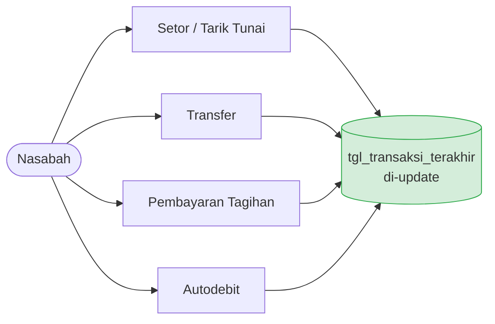

> Hanya transaksi yang **mengubah saldo** yang tercatat.

---

## Yang Tidak Tercatat — Padahal Nasabah Aktif

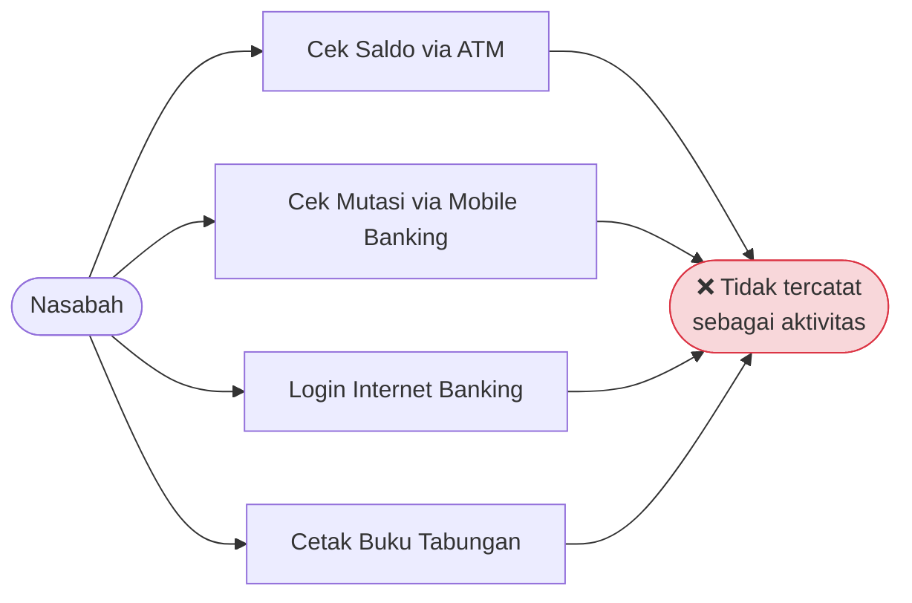

> Aktivitas-aktivitas ini **tidak mengubah saldo**, sehingga tidak masuk ke `tgl_transaksi_terakhir`.

---

## Dampak: Rekening Salah Masuk Dormant

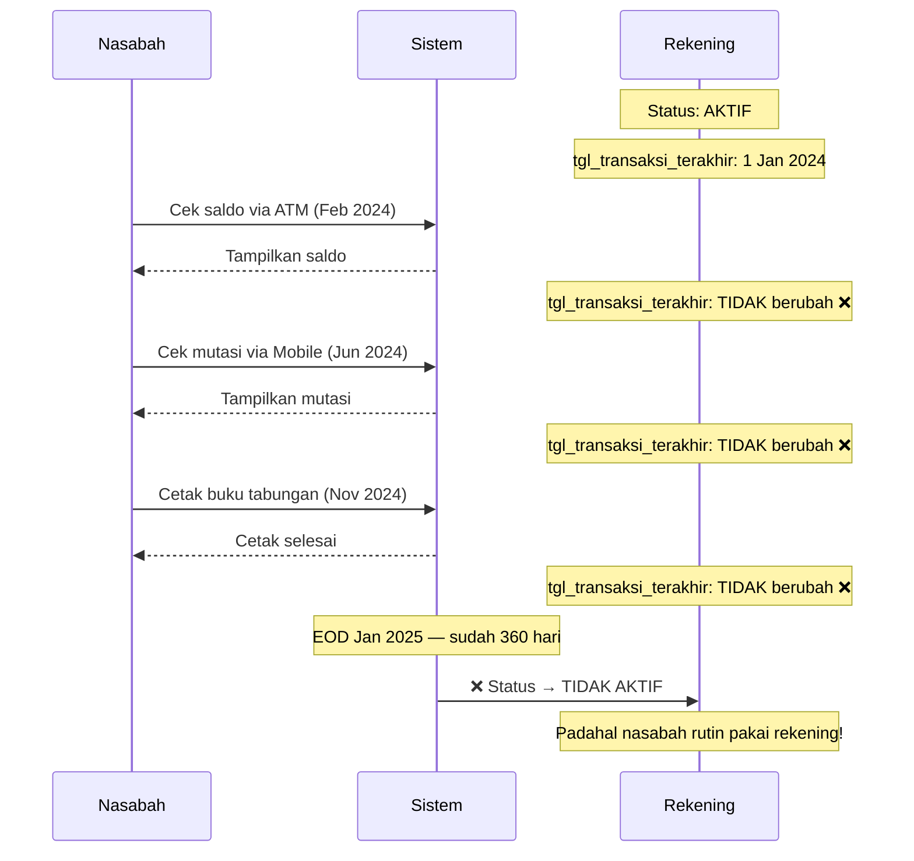

---

## Akar Masalah

| Aspek | Kondisi Saat Ini |
|---|---|
| **Yang dicatat** | Hanya transaksi finansial (debet/kredit) |
| **Yang tidak dicatat** | Cek saldo, cek mutasi, login, cetak buku |
| **Akibat** | Rekening bisa masuk status Tidak Aktif / Dormant meski nasabah masih aktif menggunakannya |
| **Potensi kerugian** | Nasabah komplain, biaya dormant dikenakan pada rekening yang sebenarnya aktif |

---

## Solusi: Perluas Definisi "Aktivitas"

Sistem tidak hanya mencatat transaksi finansial, tapi juga **aktivitas non-finansial** nasabah.

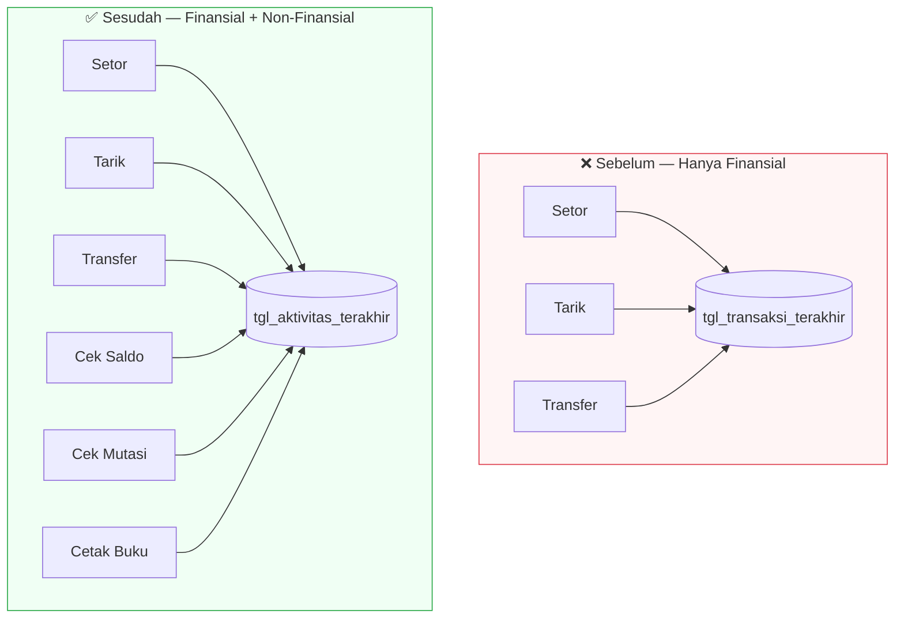

---

## Dua Sumber Data Aktivitas

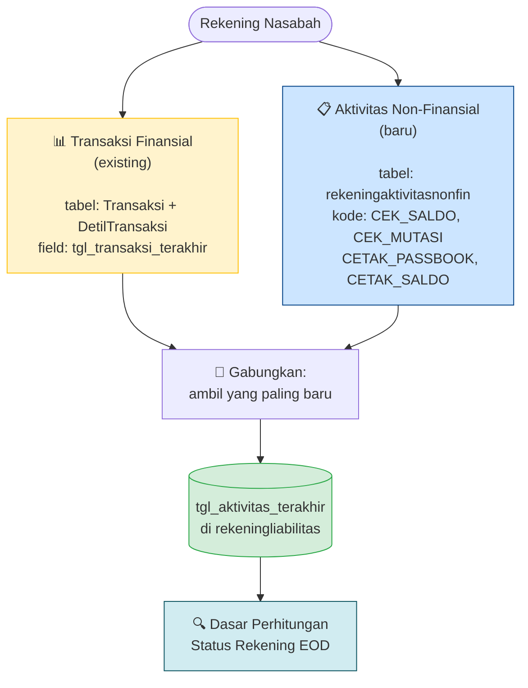

---

## Mengapa Tidak Langsung Update `tgl_transaksi_terakhir`?

`tgl_transaksi_terakhir` adalah field **existing yang sudah banyak dipakai** oleh modul lain.

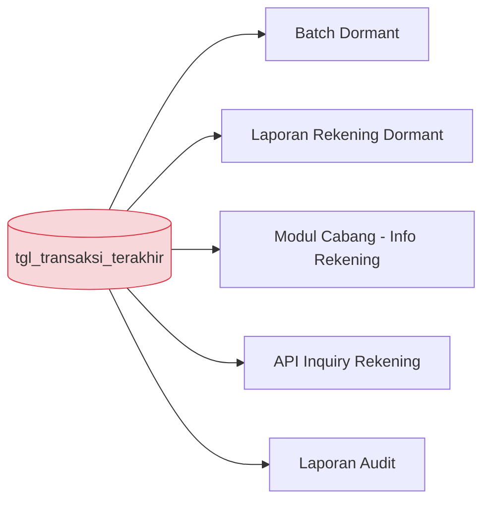

> Mengubah field ini berisiko **merusak modul lain** yang bergantung pada semantik lamanya.

---

## Solusi: Field Baru, Tidak Ubah yang Lama

| | `tgl_transaksi_terakhir` | `tgl_aktivitas_terakhir` |
|---|---|---|
| **Status** | Existing — tetap ada | Baru — ditambahkan |
| **Isi** | Hanya transaksi finansial | Finansial + Non-Finansial |
| **Diupdate oleh** | Proses posting transaksi | Proses EOD (batch harian) |
| **Dipakai untuk** | Modul-modul existing | Perhitungan status dormant/tidak aktif |
| **Risiko** | Tidak ada — tidak diubah | Tidak ada — field baru |

> **Prinsip:** *Minimal change* — tidak mengubah yang sudah berjalan, hanya menambahkan.

---

## Transaksi Sistem — Tidak Dihitung Sebagai Aktivitas Nasabah

Tidak semua transaksi finansial mencerminkan keaktifan nasabah. Transaksi otomatis oleh sistem **dikecualikan**:

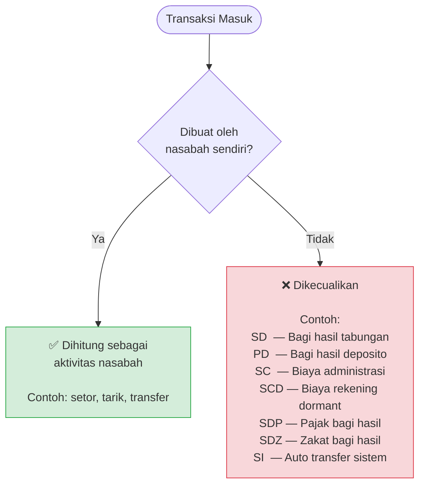

> Dikonfigurasi via **Parameter Transaksi** — flag `is_exclude_aktivitas_nasabah = 'T'`

---

## Alur Lengkap — EOD Harian

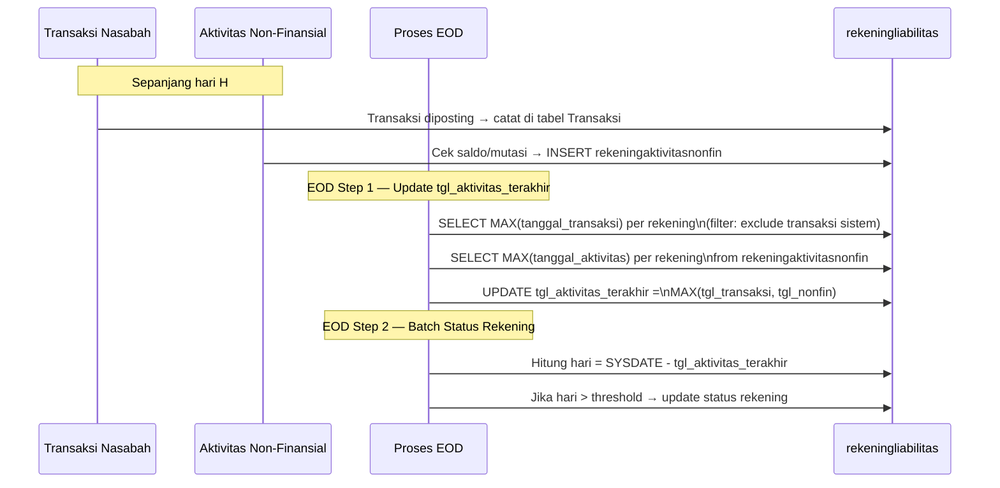

---

## Mengapa Hanya Baca Transaksi Hari Ini (H)?

### Asumsi Dasar: EOD Berjalan Setiap Hari

Setiap EOD berjalan, sistem memperbarui `tgl_aktivitas_terakhir` di `rekeningliabilitas`. Nilai ini adalah **akumulasi yang sudah benar per akhir hari sebelumnya (H-1)**.

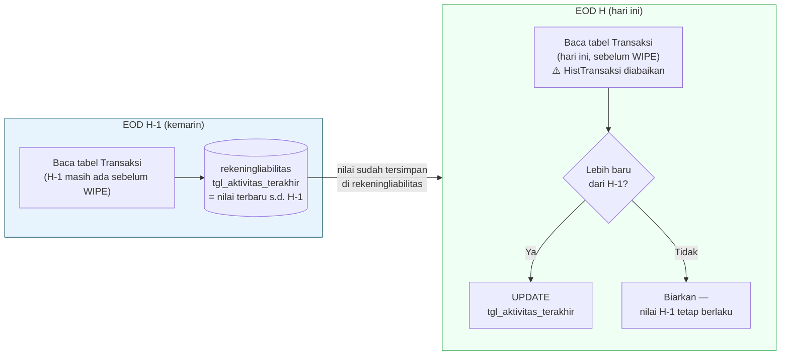

> EOD hari ini membaca tabel **`Transaksi`** (transaksi hari berjalan yang belum di-WIPE) — bukan `HistTransaksi`. Transaksi lama sudah diwakili oleh nilai `tgl_aktivitas_terakhir` yang tersimpan dari EOD sebelumnya.

---

## Mengapa Ini Aman?

### Properti "Monotonically Non-Decreasing"

`tgl_aktivitas_terakhir` hanya bisa **sama atau lebih baru** — tidak pernah mundur.

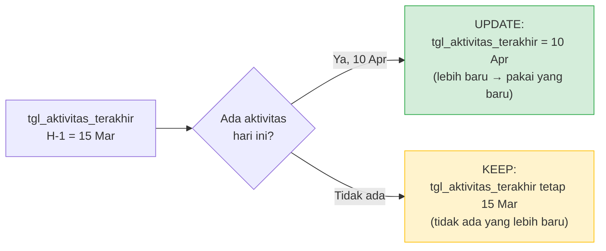

| Kondisi | Aksi EOD | Hasil |
|---|---|---|
| Ada aktivitas hari ini | `UPDATE` jika lebih baru dari nilai tersimpan | `tgl_aktivitas_terakhir` = hari ini |
| Tidak ada aktivitas hari ini | Tidak ada `UPDATE` | `tgl_aktivitas_terakhir` tetap dari EOD sebelumnya |
| Nilai tersimpan sudah lebih baru | Tidak ada `UPDATE` | Nilai lama dipertahankan |

---

## Ilustrasi: 3 Hari Berturut-turut

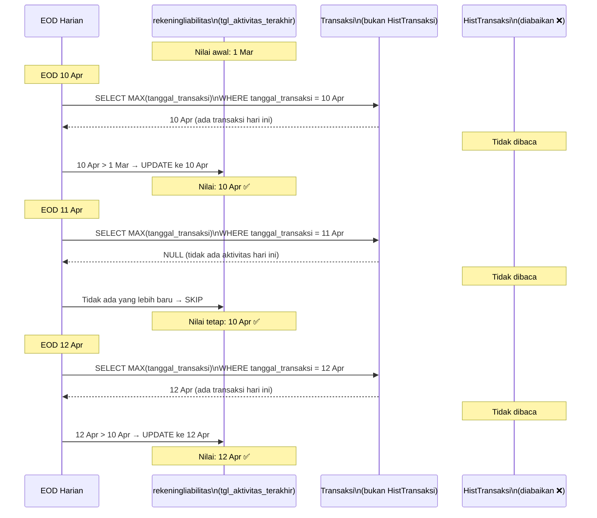

> Meskipun 11 Apr tidak ada aktivitas, nilai 10 Apr tetap tersimpan dengan benar karena EOD H-1 sudah menjaganya. `HistTransaksi` **tidak perlu dibaca** — seluruh histori sudah terepresentasi oleh nilai `tgl_aktivitas_terakhir` yang tersimpan.

---

## Mengapa Tidak Scan Seluruh Histori Setiap Hari?

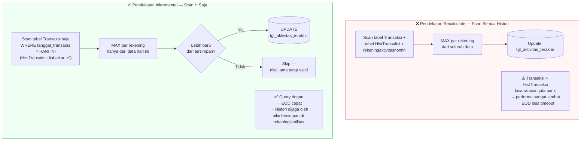

| | Scan Semua Histori | Scan H Saja (inkremental) |
|---|---|---|
| **Volume data dibaca** | Seluruh riwayat transaksi | Hanya transaksi hari ini |
| **Performa** | Lambat — tidak skalabel | Cepat — stabil meski data tumbuh |
| **Keakuratan** | Sama | Sama (karena nilai H-1 sudah benar) |
| **Ketergantungan** | Tidak ada | EOD wajib berjalan setiap hari |

---

## Syarat Agar Pendekatan Ini Valid

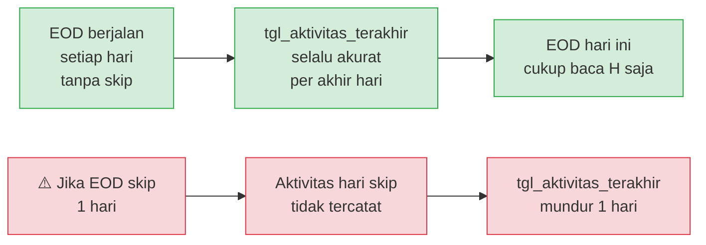

> **Kesimpulan:** Pendekatan inkremental benar selama EOD **tidak pernah dilewati**. Jika EOD pernah skip, perlu mekanisme koreksi (scan N hari ke belakang).

---

## Perbandingan Skenario: Sebelum vs Sesudah

### Skenario: Nasabah hanya cek saldo, tidak ada transaksi selama 2 tahun

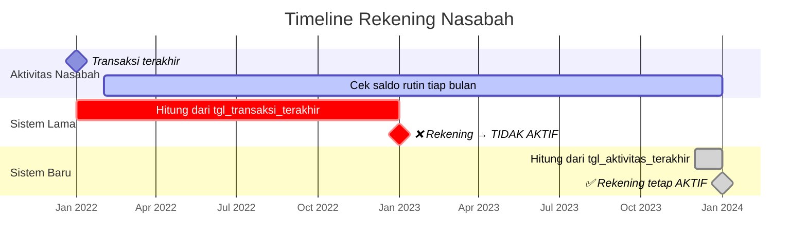

| | Sistem Lama | Sistem Baru |
|---|---|---|
| **Dasar hitung** | `tgl_transaksi_terakhir` = 1 Jan 2022 | `tgl_aktivitas_terakhir` = Des 2023 |
| **Hari dihitung** | 730 hari (> 360) | 30 hari (< 360) |
| **Status rekening** | ❌ TIDAK AKTIF (salah) | ✅ AKTIF (benar) |

---

## Ringkasan

| Poin | Penjelasan |
|---|---|
| **Masalah** | `tgl_transaksi_terakhir` hanya mencatat mutasi saldo — aktivitas non-finansial tidak terhitung |
| **Dampak** | Rekening bisa masuk Tidak Aktif / Dormant meski nasabah masih aktif menggunakan |
| **Solusi** | Tambah field baru `tgl_aktivitas_terakhir` yang menggabungkan transaksi nasabah + aktivitas non-finansial |
| **Mengapa field baru** | Menghindari perubahan pada field existing yang banyak dipakai modul lain |
| **Pengecualian** | Transaksi sistem otomatis (bagi hasil, biaya admin, dll.) tetap dikecualikan dari hitungan aktivitas |
| **Konfigurasi** | Daftar transaksi yang dikecualikan dapat dikelola via **Parameter Transaksi** — fleksibel |

---

## Posisi Update Ketiga Field

### Mekanisme Update (Kapan & Siapa)

| | `tgl_transaksi_terakhir` | `tgl_aktivitas_nonfin_terakhir` | `tgl_aktivitas_terakhir` |
|---|---|---|---|
| **Diupdate oleh** | Proses posting transaksi (real-time) | Insert ke `rekeningaktivitasnonfin` (real-time) | Proses EOD (batch harian) |
| **Waktu update** | Saat transaksi diposting | Saat nasabah melakukan aktivitas non-fin | Satu kali per hari, saat EOD |
| **Sumber nilai** | `tanggal_transaksi` dari tabel Transaksi | `tanggal_aktivitas` dari `rekeningaktivitasnonfin` | `MAX(tgl_transaksi_terakhir, tgl_aktivitas_nonfin_terakhir)` |

---

### Kondisi Update per Skenario EOD

| Kondisi | `tgl_transaksi_terakhir` | `tgl_aktivitas_nonfin_terakhir` | `tgl_aktivitas_terakhir` |
|---|---|---|---|
| Ada transaksi finansial nasabah hari ini | Sudah ter-`UPDATE` saat posting | Tidak berubah | `UPDATE` ke tanggal hari ini |
| Ada aktivitas non-finansial hari ini (cek saldo, cetak buku, dll.) | Tidak berubah | Sudah ter-`INSERT` saat aktivitas terjadi | `UPDATE` ke tanggal hari ini |
| Keduanya ada hari ini | Sudah ter-`UPDATE` saat posting | Sudah ter-`INSERT` | `UPDATE` ke yang paling baru |
| Tidak ada aktivitas apapun hari ini | Tidak ada `UPDATE` | Tidak ada `UPDATE` | Tidak ada `UPDATE` — nilai dari EOD sebelumnya dipertahankan |
| Hanya transaksi sistem hari ini (bagi hasil, biaya admin, dll.) | Tidak ada `UPDATE` *(dikecualikan)* | Tidak ada `UPDATE` | Tidak ada `UPDATE` — transaksi sistem tidak dihitung |

---

### Ringkasan Peran Masing-masing Field

| | `tgl_transaksi_terakhir` | `tgl_aktivitas_nonfin_terakhir` | `tgl_aktivitas_terakhir` |
|---|---|---|---|
| **Mencatat** | Transaksi finansial nasabah saja | Aktivitas non-finansial saja | Gabungan — ambil yang paling baru |
| **Acuan perhitungan status rekening** | Jika ada data di tabel transaksi dan parametertransaksi tiak exclude maka tgl_transaksi_terakhir di update  | Jika ada data di tabel rekeningaktivitasnonfin yang sama dengang tgl sistem update tgl_aktivitas_nonfin_terakhir | Jika Rekening tidak dalam posisi dormant / non aktif lihat tanggal yang paling besar antara tgl_transaksi_terakhir dan tgl_aktivitas_nonfin_terakhir  |
| **Given** | Ada baris di `DetilTransaksi` JOIN `Transaksi` untuk rekening ini dengan `status_otorisasi = 1` | Ada baris di `rekeningaktivitasnonfin` dengan `tanggal_aktivitas` = hari ini | `RekeningTransaksi.status_rekening = 1` (rekening aktif) dan salah satu dari `tgl_transaksi_terakhir` / `tgl_aktivitas_nonfin_terakhir` tidak NULL |
| **When** | `tipe_exclude_aktivitas_nasabah` di `parametertransaksiumum`: NULL atau tidak ada = ✅ hitung \| `'F'` = ✅ hitung \| `'D'` + `jenis_mutasi='C'` = ✅ kredit dihitung \| `'C'` + `jenis_mutasi='D'` = ✅ debit dihitung \| `'DC'` = ❌ exclude semua | `tanggal_aktivitas >= Today AND tanggal_aktivitas < Today + 1` | — (langsung kalkulasi setelah step 1 & 2 selesai) |
| **Then** | `tgl_transaksi_terakhir = Today` | `tgl_aktivitas_nonfin_terakhir = Today` | `tgl_aktivitas_terakhir = GREATEST(NVL(tgl_transaksi_terakhir, tgl_aktivitas_nonfin_terakhir), NVL(tgl_aktivitas_nonfin_terakhir, tgl_transaksi_terakhir))` — handles NULL di salah satu sisi |

---

### Kondisi Update — Bahasa Bisnis

| | `tgl_transaksi_terakhir` | `tgl_aktivitas_nonfin_terakhir` | `tgl_aktivitas_terakhir` |
|---|---|---|---|
| **Situasi awal** | Nasabah melakukan transaksi finansial hari ini (setor, tarik, transfer, bayar tagihan) dan transaksi sudah diotorisasi | Nasabah melakukan aktivitas non-finansial hari ini (cek saldo, cek mutasi, cetak buku tabungan) | Proses akhir hari (EOD) sedang berjalan dan rekening masih berstatus aktif |
| **Syarat berlaku** | Jenis transaksi tersebut tidak dikecualikan oleh pengaturan parameter — atau jika dikecualikan sebagian, setidaknya ada sisi (debit/kredit) yang tetap dihitung | Aktivitas tercatat pada tanggal yang sama dengan tanggal sistem hari ini | Minimal salah satu dari tanggal transaksi atau tanggal aktivitas non-finansial sudah terisi |
| **Hasilnya** | Tanggal transaksi terakhir rekening diperbarui menjadi hari ini | Tanggal aktivitas non-finansial terakhir rekening diperbarui menjadi hari ini | Tanggal aktivitas terakhir rekening diisi dengan tanggal yang paling baru di antara keduanya — jika salah satu kosong, dipakai yang ada |

---

### Detail per Field

#### `tgl_transaksi_terakhir`

**Situasi:** Nasabah melakukan transaksi finansial hari ini (setor, tarik, transfer, bayar tagihan) dan transaksi sudah diotorisasi.

**Data yang dilihat:**
- **Transaksi** — header transaksi, difilter yang sudah diotorisasi (`status_otorisasi = 1`)
- **DetilTransaksi** — detail mutasi per rekening, untuk melihat arah mutasi (debit/kredit)
- **Parametertransaksiumum** — pengaturan per kode transaksi (`tipe_exclude_aktivitas_nasabah`):
  - Tidak terdaftar / kosong → dihitung sebagai aktivitas nasabah
  - `F` → dihitung sebagai aktivitas nasabah
  - `D` → sisi debit dikecualikan, sisi kredit tetap dihitung
  - `C` → sisi kredit dikecualikan, sisi debit tetap dihitung
  - `DC` → seluruh transaksi dikecualikan

**Syarat:** Jenis transaksi tersebut tidak dikecualikan oleh pengaturan parameter — atau jika dikecualikan sebagian, setidaknya ada sisi (debit/kredit) yang tetap dihitung.

**Hasil:** Tanggal transaksi terakhir rekening diperbarui menjadi hari ini.

**Contoh kasus:**

> Rekening 001-123456 memiliki `tgl_transaksi_terakhir` = 1 Maret 2025. Pada 10 April 2025, nasabah melakukan transfer keluar (debit) sebesar Rp 500.000. Kode transaksi `TF` terdaftar di parameter dengan `tipe_exclude_aktivitas_nasabah = NULL`. Karena tidak dikecualikan, EOD 10 April memperbarui `tgl_transaksi_terakhir` menjadi **10 April 2025**.

> Rekening 001-654321 menerima bagi hasil (kode `SD`) pada 10 April 2025. Kode `SD` terdaftar dengan `tipe_exclude_aktivitas_nasabah = 'DC'`. Karena seluruh transaksi dikecualikan, `tgl_transaksi_terakhir` **tidak berubah**.

---

#### `tgl_aktivitas_nonfin_terakhir`

**Situasi:** Nasabah melakukan aktivitas non-finansial hari ini (cek saldo, cek mutasi, cetak buku tabungan).

**Data yang dilihat:**
- **RekeningAktivitasNonfin** — log aktivitas non-finansial per rekening, difilter `tanggal_aktivitas` yang jatuh pada hari ini

**Syarat:** Aktivitas tercatat pada tanggal yang sama dengan tanggal sistem hari ini.

**Hasil:** Tanggal aktivitas non-finansial terakhir rekening diperbarui menjadi hari ini.

**Contoh kasus:**

> Rekening 001-123456 memiliki `tgl_aktivitas_nonfin_terakhir` = 5 Januari 2025. Pada 10 April 2025, nasabah mengecek saldo via ATM — sistem mencatat satu baris di `RekeningAktivitasNonfin` dengan `tanggal_aktivitas = 10 April 2025`. EOD 10 April memperbarui `tgl_aktivitas_nonfin_terakhir` menjadi **10 April 2025**.

> Rekening 001-654321 tidak ada aktivitas non-finansial sama sekali pada 10 April 2025. Tidak ada baris baru di `RekeningAktivitasNonfin`, sehingga `tgl_aktivitas_nonfin_terakhir` **tidak berubah**.

---

#### `tgl_aktivitas_terakhir`

**Situasi:** Proses akhir hari (EOD) sedang berjalan dan rekening masih berstatus aktif.

**Data yang dilihat:**
- **RekeningTransaksi** — status rekening, difilter `status_rekening = 1` (rekening aktif)
- **rekeningliabilitas** — nilai `tgl_transaksi_terakhir` dan `tgl_aktivitas_nonfin_terakhir` yang sudah diperbarui di dua langkah sebelumnya

**Syarat:** Minimal salah satu dari tanggal transaksi atau tanggal aktivitas non-finansial sudah terisi.

**Hasil:** Tanggal aktivitas terakhir rekening diisi dengan tanggal yang paling baru di antara keduanya — jika salah satu kosong, dipakai yang ada.

**Contoh kasus:**

> Setelah EOD 10 April 2025: `tgl_transaksi_terakhir` = 10 April (ada transfer), `tgl_aktivitas_nonfin_terakhir` = 5 Januari (tidak ada aktivitas non-fin hari ini). Sistem mengambil yang paling baru → `tgl_aktivitas_terakhir` = **10 April 2025**.

> Setelah EOD 11 April 2025: tidak ada transaksi finansial maupun non-finansial. `tgl_transaksi_terakhir` tetap 10 April, `tgl_aktivitas_nonfin_terakhir` tetap 5 Januari. Tidak ada yang lebih baru → `tgl_aktivitas_terakhir` tetap **10 April 2025**.

> Rekening yang `tgl_transaksi_terakhir` kosong (belum pernah bertransaksi), namun `tgl_aktivitas_nonfin_terakhir` = 10 April (pernah cek saldo). Sistem memakai yang ada → `tgl_aktivitas_terakhir` = **10 April 2025**.

---

### Tabel Contoh Kasus Gabungan

`Tanggal Sistem` : 2 April 2026

`tgl_transaksi_terakhir` = 15 Jan 2026

`tgl_aktivitas_nonfin_terakhir` = 20 Feb 2026

`tgl_aktivitas_terakhir` = 20 Feb 2026

| # | Skenario hari ini (2 Apr 2026) | `tgl_transaksi_terakhir` | `tgl_aktivitas_nonfin_terakhir` | `tgl_aktivitas_terakhir` |
|---|---|---|---|---|
| 1 | Nasabah transfer (kode `TF`, tidak dikecualikan) | ~~15 Jan~~ → **02 Apr 2026** | 20 Feb 2026 | ~~20 Feb~~ → **02 Apr 2026** |
| 2 | Nasabah cek saldo via ATM | 15 Jan 2026 | ~~20 Feb~~ → **02 Apr 2026** | ~~20 Feb~~ → **02 Apr 2026** |
| 3 | Nasabah transfer sekaligus cek mutasi | ~~15 Jan~~ → **02 Apr 2026** | ~~20 Feb~~ → **02 Apr 2026** | ~~20 Feb~~ → **02 Apr 2026** |
| 4 | Hanya terima bagi hasil (kode `SD`, `tipe = DC`) | 15 Jan 2026 *(dikecualikan)* | 20 Feb 2026 | 20 Feb 2026 |
| 5 | Tidak ada aktivitas apapun | 15 Jan 2026 | 20 Feb 2026 | 20 Feb 2026 |
| 6 | Rekening baru — belum pernah bertransaksi, baru pertama cek saldo | *(NULL)* | NULL → **02 Apr 2026** | NULL → **02 Apr 2026** *(diambil dari nonfin)* |
| 7 | Terima autodebit (kode `AD`, `tipe = D`) + nasabah juga setor tunai (kredit) | ~~15 Jan~~ → **02 Apr 2026** *(kredit setor dihitung)* | 20 Feb 2026 | ~~20 Feb~~ → **02 Apr 2026** |
| 8a | Pindah Buku masuk — rekening **menerima** dana (kredit, kode `PB`, `tipe = DC`) | 15 Jan 2026 *(PB dikecualikan penuh, tidak berubah)* | 20 Feb 2026 | 20 Feb 2026 |
| 8b | Pindah Buku keluar — rekening **mengirim** dana (debit, kode `PB`, `tipe = DC`) | 15 Jan 2026 *(PB dikecualikan penuh, tidak berubah)* | 20 Feb 2026 | 20 Feb 2026 |


