# FUNCTIONAL SPECIFICATION DOCUMENT

**BCA SYARIAH (BCAS)**
**MODUL SAKU VALAS**
**FITUR PENGEMBANGAN SAKU VALAS**

Dipersiapkan oleh
PT Ihsan Solusi Informatika
Jl. PHH Mustofa No. 39
Ruko Surapati Core C-7 Bandung

| **Nomor Dokumen** | **Halaman** |
|---|---|
| **FSD-BCAS-VALAS-01** | 1 / N |
| **Versi** | 1.0.0 | {DD Bulan YYYY} |

---

## Author

| **Nama** | **Role** |
|---|---|
| {Nama Writer} | Technical Writer |
| {Nama Reviewer} | Reviewer |

---

## Detail Daftar Perubahan

| Versi | Tanggal Perubahan | Penulis | Deskripsi |
|---|---|---|---|
| 1.0.0 | {DD/MM/YYYY} | {Nama Penulis} | Initial release dokumen FSD Saku Valas |

---

## Daftar Isi

1. Gambaran Umum
   - 1.1. Latar Belakang
   - 1.2. Tujuan
   - 1.3. Ruang Lingkup
   - 1.4. Definisi
   - 1.5. Objektif
   - 1.6. Pengguna
2. Arsitektur Sistem
   - 2.1. Arsitektur Sistem
   - 2.2. Spesifikasi Integrasi REST API
3. Manajemen Kurs
   - 3.1. Penambahan Valuta Baru
   - 3.2. Perubahan Nilai Kurs
4. Laporan Valas
   - 4.1. Laporan Trial Balance Valas
   - 4.2. Laporan Buku Besar Valas
   - 4.3. Laporan Neraca Valas
5. LBV (Ledger Balance Verification)
   - 5.1. Laporan LBV
6. EOM Hitung GDR
   - 6.1. Simulasi GDR
   - 6.2. Eksekusi EOM
7. Pengaturan Umum
8. Persetujuan Dokumen
9. Lampiran
   - Lampiran A. Screenshot Manajemen Kurs
   - Lampiran B. Screenshot Laporan Valas
   - Lampiran C. Screenshot LBV
   - Lampiran D. Screenshot Simulasi GDR & Eksekusi EOM

---

## 1. Gambaran Umum

### 1.1. Latar Belakang

Dalam rangka mendukung pertumbuhan layanan perbankan syariah berbasis valuta asing, BCA Syariah (BCAS) menggunakan **Tought Machine (TM)** sebagai sistem utama yang menjalankan fitur Saku Valas. Pengembangan ini mencakup penguatan integrasi antara TM dengan sistem Core Banking BCAS (iBank), sehingga data jurnal valas serta saldo harian dan saldo rata-rata valas yang dihasilkan TM dapat diterima, diolah, dan dilaporkan secara akurat di sisi Core Banking. Cakupan pengembangan meliputi pengelolaan kurs valuta asing, penyediaan laporan valas yang komprehensif, verifikasi saldo buku besar (LBV), serta proses End of Month (EOM) untuk penghitungan Gross Daily Rate (GDR). Pengembangan ini bertujuan untuk meningkatkan efisiensi operasional, akurasi data valas, serta kepatuhan terhadap regulasi pelaporan keuangan yang berlaku.

### 1.2. Tujuan

Berikut ini adalah tujuan pengembangan fitur Saku Valas pada sistem BCAS:

- Menyediakan fungsi manajemen kurs yang memungkinkan penambahan valuta baru dan pembaruan nilai kurs secara real-time di Core Banking.
- Menghasilkan laporan valas yang akurat di Core Banking, meliputi Trial Balance, Buku Besar, dan Neraca Valas, berdasarkan data yang diterima dari TM.
- Meningkatkan integrasi penerimaan saldo harian valas dari TM ke Core Banking melalui mekanisme LBV.
- Mengotomatisasi proses EOM di Core Banking untuk penghitungan GDR berdasarkan saldo valas dan saldo rata-rata yang dikirim oleh TM.

### 1.3. Ruang Lingkup

Ruang lingkup pengembangan fitur Saku Valas pada sistem BCAS adalah sebagai berikut:

- **Manajemen Kurs:** Penambahan valuta baru dan perubahan nilai kurs per valuta di Core Banking.
- **Laporan Valas:** Laporan Trial Balance Valas, Laporan Buku Besar Valas, dan Laporan Neraca Valas di Core Banking berdasarkan data jurnal valas yang diterima dari TM.
- **LBV (Ledger Balance Verification):** Enhance penerimaan dan verifikasi saldo harian valas yang dikirim TM ke Core Banking.
- **EOM Hitung GDR:** Enhance penerimaan saldo rata-rata valas dari TM dan enhance script EOM di Core Banking untuk penghitungan GDR dari data yang dikirim TM.

### 1.4. Definisi

Berikut adalah definisi dari beberapa istilah yang ada pada proses Saku Valas:

- **Valas (Valuta Asing):** Mata uang asing selain Rupiah yang digunakan dalam transaksi perbankan internasional.
- **Kurs:** Nilai tukar suatu mata uang terhadap mata uang lainnya (umumnya terhadap IDR).
- **GDR (Gross Daily Rate):** Nilai rata-rata kotor harian yang dihitung dari saldo valas selama periode tertentu.
- **TM (Tought Machine):** Sistem utama (core banking) tempat fitur Saku Valas berjalan. TM mengirimkan jurnal valas, saldo harian, dan saldo rata-rata valas ke Core Banking BCAS melalui REST API.
- **LBV (Ledger Balance Verification):** Proses verifikasi antara saldo valas yang diterima Core Banking dari TM dengan saldo yang tercatat di Core DB BCAS.
- **EOM (End of Month):** Proses penutupan akhir bulan yang mencakup rekalkulasi saldo, GDR, dan rekonsiliasi valas.
- **Trial Balance Valas:** Laporan yang menampilkan saldo debet dan kredit dari seluruh akun valas pada periode tertentu.
- **Buku Besar Valas:** Catatan lengkap seluruh transaksi valas yang dikelompokkan per akun.
- **Neraca Valas:** Laporan posisi keuangan yang menyajikan aset, liabilitas, dan ekuitas dalam denominasi valas.
- **CIF:** Customer Information File — nomor identifikasi unik nasabah di sistem core banking.

### 1.5. Objektif

- Dokumen ini disusun agar setiap pengguna dan pihak yang terlibat dalam proyek dapat memahami secara menyeluruh detail terkait fitur Saku Valas.
- Seluruh ilustrasi/gambar pada dokumen ini digunakan semata-mata sebagai alat bantu untuk memudahkan pemahaman terhadap deskripsi field maupun alur proses/event.
- Aplikasi ini ditujukan untuk mendukung operasional cabang dan treasury, digunakan oleh petugas bank dalam melakukan transaksi dan aktivitas terkait, dengan pendekatan yang sederhana, efektif, dan mendukung implementasi cepat (quick win).
- Dokumen ini merupakan dokumen fungsional yang dihasilkan dari proses pengumpulan kebutuhan bisnis (business requirement gathering) antara tim vendor (ISI) dan tim BCAS.
- Dokumen ini akan terus diperbarui sesuai kebutuhan, dan setiap perubahan harus disetujui oleh setiap pihak (vendor dan BCAS) melalui tanda tangan perwakilan resmi dari masing-masing pihak.

### 1.6. Pengguna

Berikut adalah pengguna fitur Saku Valas:

| **No** | **Role** | **Deskripsi** |
|---|---|---|
| 1 | Accounting Officer | Petugas accounting yang bertanggung jawab atas pengelolaan kurs valas, termasuk penambahan valuta baru dan pembaruan nilai kurs. Dapat mengakses menu Manajemen Kurs. |
| 2 | Accounting Supervisor | Supervisor accounting yang melakukan approval atas perubahan kurs dan penambahan valuta baru. Dapat mengakses seluruh menu Manajemen Kurs termasuk fungsi approval. |
| 3 | Treasury Officer | Petugas treasury yang bertanggung jawab atas proses EOM dan simulasi GDR valas. Dapat mengakses menu Simulasi GDR dan Eksekusi EOM. |
| 4 | Treasury Supervisor | Supervisor treasury yang melakukan approval atas hasil hitung GDR. Dapat mengakses menu EOM Hitung GDR termasuk fungsi approval. |
| 3 | Finance & Accounting Staff | Staf keuangan yang bertanggung jawab menghasilkan dan memverifikasi laporan valas (Trial Balance, Buku Besar, Neraca). Dapat mengakses menu Laporan Valas dan LBV. |
| 4 | System Administrator | Administrator sistem yang mengelola konfigurasi integrasi antara core banking dan sistem TM. Dapat mengakses seluruh menu termasuk pengaturan integrasi. |

---

## 2. Arsitektur Sistem

### 2.1. Arsitektur Sistem

Berikut ini adalah arsitektur sistem dari fitur Saku Valas BCAS:

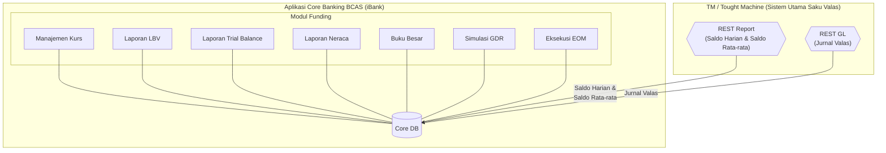

**Keterangan:**

Fitur Saku Valas utamanya berjalan di **Tought Machine (TM)**. **Modul Funding** pada Aplikasi Core Banking BCAS (iBank) berperan sebagai sistem penerima yang mengolah data yang dikirim oleh TM melalui dua endpoint REST API. Modul ini terdiri dari tujuh menu: Manajemen Kurs, Laporan LBV, Laporan Trial Balance, Laporan Neraca, Buku Besar, Simulasi GDR, dan Eksekusi EOM. Seluruh menu membaca dan menyimpan data ke **Core DB**.

Integrasi dari **TM ke Core Banking** dilakukan melalui dua endpoint REST API:
- **REST Report** — TM mengirimkan saldo harian valas (setiap akhir hari kerja) dan saldo rata-rata valas (setiap akhir bulan) ke Core Banking, digunakan untuk LBV dan perhitungan GDR.
- **REST GL** — TM mengirimkan jurnal valas (setiap ada jurnal yang dikonfirmasi) ke Core Banking, digunakan untuk pencatatan Buku Besar, Trial Balance, dan Neraca Valas.

---

### 2.2. Spesifikasi Integrasi REST API

#### 2.2.1. REST Report

| **Atribut** | **Keterangan** |
|---|---|
| **Nama Endpoint** | REST Report |
| **Arah Data** | TM → Core Banking |
| **Data yang Diterima** | Saldo harian valas, Saldo rata-rata valas |
| **Trigger** | Dikirim oleh TM setiap akhir hari kerja (saldo harian) dan akhir bulan (saldo rata-rata) |
| **Format** | JSON |
| **Digunakan Oleh** | Laporan LBV, Simulasi GDR, Eksekusi EOM |

#### 2.2.2. REST GL

| **Atribut** | **Keterangan** |
|---|---|
| **Nama Endpoint** | REST GL |
| **Arah Data** | TM → Core Banking |
| **Data yang Diterima** | Jurnal valas (entri debet/kredit per akun valas) |
| **Trigger** | Dikirim oleh TM setiap ada jurnal valas yang dikonfirmasi |
| **Format** | JSON |
| **Digunakan Oleh** | Buku Besar, Laporan Trial Balance, Laporan Neraca |

---

## 3. Manajemen Kurs

### 3.1. Penambahan Valuta Baru

#### 3.1.1. Alur Proses

Alur proses penambahan valuta baru pada fitur Manajemen Kurs.

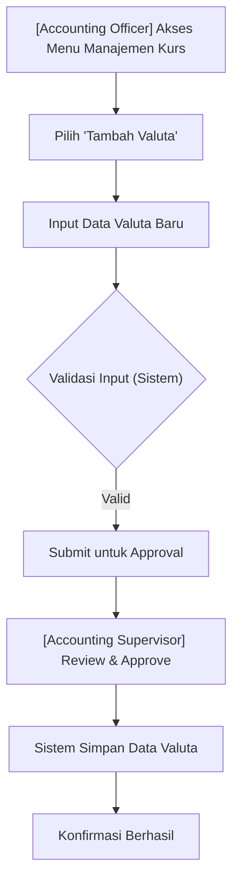

#### 3.1.2. Keterangan Alur Proses

| **Deskripsi** | : | Proses penambahan data valuta baru ke dalam sistem Saku Valas |
|---|---|---|
| **User** | : | Accounting Officer (input), Accounting Supervisor (approval) |
| **Pre kondisi** | : | 1. User telah login ke sistem BCAS. 2. User memiliki role Accounting Officer. 3. Valuta yang akan ditambahkan belum terdaftar di sistem. |
| **Alur** | : | 1. Accounting Officer mengakses menu Manajemen Kurs. 2. Accounting Officer memilih tombol "Tambah Valuta". 3. Sistem menampilkan form input data valuta baru. 4. Accounting Officer mengisi seluruh field yang tersedia (kode valuta, nama valuta, nilai kurs beli, nilai kurs jual). 5. Sistem melakukan validasi input secara real-time. 6. Accounting Officer menekan tombol "Submit". 7. Sistem mengirimkan notifikasi kepada Accounting Supervisor untuk approval. 8. Accounting Supervisor menyetujui atau menolak penambahan valuta. 9. Jika disetujui, sistem menyimpan data valuta baru dan menampilkan konfirmasi. |
| **Error Handling** | : | Sistem menampilkan pesan error sesuai dengan Tabel Validasi Manajemen Kurs |
| **Post kondisi** | : | Valuta baru berhasil tersimpan di database dan dapat digunakan dalam transaksi valas. |

#### 3.1.3. Use Case

| **Given** | : | User sudah berada pada halaman **Manajemen Kurs** |
|---|---|---|
| **When** | : | User menekan tombol "Tambah Valuta" dan mengisi form data valuta baru, kemudian menekan tombol "Submit". |
| **Then** | : | Sistem memvalidasi seluruh input. Jika semua field valid, sistem mengirimkan data ke antrian approval. Jika ada field yang tidak valid, sistem menampilkan pesan error yang relevan dan tidak melanjutkan proses. Setelah approval dari Supervisor, data valuta baru tersimpan dan muncul pada daftar valuta aktif. |

#### 3.1.4. Mockup Penambahan Valuta Baru

{Lampirkan UI mockup form penambahan valuta baru}

*Keterangan: Halaman ini menampilkan form input untuk mendaftarkan kode valuta baru beserta nilai kurs awal.*

#### 3.1.5. Field Description — Form Tambah Valuta Baru

Berikut adalah tabel field description pada halaman **Tambah Valuta Baru**:

| **Nama Field** | **Deskripsi** | **Data Type** | **Length** | **Mandatory (M/O/C)** | **Sumber Data** |
|---|---|---|---|---|---|
| Kode Valuta | Kode ISO 4217 mata uang (contoh: USD, SGD, MYR) | VARCHAR | 3 | M | Manual Input |
| Nama Valuta | Nama lengkap mata uang (contoh: US Dollar) | VARCHAR | 50 | M | Manual Input |
| Kurs Beli | Nilai kurs beli terhadap IDR | DECIMAL(18,4) | - | M | Manual Input |
| Kurs Jual | Nilai kurs jual terhadap IDR | DECIMAL(18,4) | - | M | Manual Input |
| Kurs Tengah | Nilai kurs tengah, dihitung otomatis: (Kurs Beli + Kurs Jual) / 2 | DECIMAL(18,4) | - | - | Auto-calculate |
| Tanggal Efektif | Tanggal mulai berlakunya kurs | DATE | - | M | Manual Input / Date Picker |
| Status | Status aktif/nonaktif valuta | VARCHAR | 10 | M | Dropdown |
| Keterangan | Catatan tambahan terkait valuta | VARCHAR | 200 | O | Manual Input |

Keterangan pilihan pada field dropdown:

| **Field** | **Option Dropdown** |
|---|---|
| Status | Aktif, Nonaktif |

#### 3.1.6. Action — Penambahan Valuta Baru

| **Action** | **Output** | **Keterangan** |
|---|---|---|
| Submit | Sistem mengirimkan data ke antrian approval Supervisor | Tombol aktif setelah seluruh field mandatory terisi dan valid |
| Reset | Seluruh field dikosongkan kembali ke kondisi awal | Membatalkan input tanpa menyimpan data |
| Approve (Supervisor) | Valuta baru tersimpan di database dan muncul pada daftar valuta aktif | Hanya dapat dilakukan oleh user dengan role Accounting Supervisor |
| Reject (Supervisor) | Data tidak tersimpan; sistem mengirimkan notifikasi penolakan ke Accounting Officer | Supervisor wajib mengisi alasan penolakan |

#### 3.1.7. Tabel Validasi — Penambahan Valuta Baru

| **Case** | **Result** |
|---|---|
| Kode valuta sudah terdaftar di sistem | "Kode valuta [XXX] sudah terdaftar. Silakan gunakan kode yang berbeda." |
| Kode valuta tidak sesuai format ISO 4217 (bukan 3 karakter alfabetik) | "Kode valuta harus terdiri dari 3 karakter huruf (ISO 4217)." |
| Kurs Beli atau Kurs Jual bernilai 0 atau negatif | "Nilai kurs harus lebih besar dari 0." |
| Kurs Beli lebih besar dari Kurs Jual | "Kurs Beli tidak boleh lebih besar dari Kurs Jual." |
| Tanggal Efektif lebih kecil dari tanggal hari ini | "Tanggal Efektif tidak boleh lebih kecil dari tanggal hari ini." |
| Field mandatory tidak diisi | "Field [nama field] wajib diisi." |
| Timeout koneksi ke database saat penyimpanan | "Terjadi kesalahan sistem. Silakan coba kembali atau hubungi administrator." |

---

### 3.2. Perubahan Nilai Kurs

#### 3.2.1. Alur Proses

Alur proses perubahan nilai kurs untuk valuta yang sudah terdaftar.

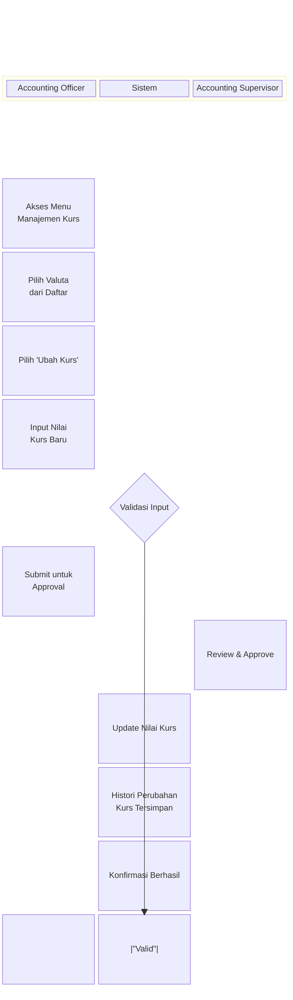

#### 3.2.2. Keterangan Alur Proses

| **Deskripsi** | : | Proses pembaruan nilai kurs untuk valuta yang sudah terdaftar dalam sistem |
|---|---|---|
| **User** | : | Accounting Officer (input), Accounting Supervisor (approval) |
| **Pre kondisi** | : | 1. User telah login ke sistem BCAS. 2. User memiliki role Accounting Officer. 3. Valuta yang akan diubah kursnya sudah terdaftar dan berstatus Aktif. |
| **Alur** | : | 1. Accounting Officer mengakses menu Manajemen Kurs. 2. Sistem menampilkan daftar valuta aktif. 3. Accounting Officer memilih valuta yang akan diubah kursnya. 4. Accounting Officer menekan tombol "Ubah Kurs". 5. Sistem menampilkan form perubahan kurs dengan nilai kurs terkini sebagai referensi. 6. Accounting Officer mengisi nilai kurs baru dan tanggal efektif. 7. Sistem melakukan validasi input. 8. Accounting Officer menekan "Submit". 9. Accounting Supervisor melakukan review dan approval. 10. Sistem memperbarui nilai kurs dan menyimpan histori perubahan. |
| **Error Handling** | : | Sistem menampilkan pesan error sesuai dengan Tabel Validasi Perubahan Kurs |
| **Post kondisi** | : | Nilai kurs valuta berhasil diperbarui. Histori perubahan kurs tersimpan dan dapat diaudit. |

#### 3.2.3. Use Case

| **Given** | : | User sudah berada pada halaman **Manajemen Kurs** dan memilih salah satu valuta aktif |
|---|---|---|
| **When** | : | User menekan tombol "Ubah Kurs", mengisi nilai kurs baru, dan menekan tombol "Submit" |
| **Then** | : | Sistem memvalidasi nilai kurs baru. Jika valid, sistem mengirim request approval ke Supervisor. Setelah disetujui, nilai kurs pada sistem diperbarui sesuai tanggal efektif yang ditentukan, dan data kurs lama tersimpan sebagai histori. |

#### 3.2.4. Mockup Perubahan Nilai Kurs

{Lampirkan UI mockup form perubahan nilai kurs}

*Keterangan: Halaman ini menampilkan daftar valuta aktif dan form untuk memperbarui nilai kurs beli, jual, dan tengah.*

#### 3.2.5. Field Description — Form Perubahan Kurs

Berikut adalah tabel field description pada halaman **Ubah Nilai Kurs**:

| **Nama Field** | **Deskripsi** | **Data Type** | **Length** | **Mandatory (M/O/C)** | **Sumber Data** |
|---|---|---|---|---|---|
| Kode Valuta | Kode ISO valuta yang akan diubah kursnya (read-only) | VARCHAR | 3 | M | Core (auto-fill) |
| Nama Valuta | Nama lengkap valuta (read-only) | VARCHAR | 50 | - | Core (auto-fill) |
| Kurs Beli Lama | Nilai kurs beli yang sedang berlaku (read-only, untuk referensi) | DECIMAL(18,4) | - | - | Core |
| Kurs Jual Lama | Nilai kurs jual yang sedang berlaku (read-only, untuk referensi) | DECIMAL(18,4) | - | - | Core |
| Kurs Beli Baru | Nilai kurs beli yang baru | DECIMAL(18,4) | - | M | Manual Input |
| Kurs Jual Baru | Nilai kurs jual yang baru | DECIMAL(18,4) | - | M | Manual Input |
| Kurs Tengah Baru | Nilai kurs tengah baru, dihitung otomatis | DECIMAL(18,4) | - | - | Auto-calculate |
| Tanggal Efektif | Tanggal mulai berlakunya kurs baru | DATE | - | M | Manual Input / Date Picker |
| Alasan Perubahan | Keterangan alasan perubahan kurs | VARCHAR | 200 | M | Manual Input |

#### 3.2.6. Action — Perubahan Nilai Kurs

| **Action** | **Output** | **Keterangan** |
|---|---|---|
| Submit | Sistem mengirimkan data perubahan kurs ke antrian approval Supervisor | Tombol aktif setelah seluruh field mandatory terisi dan valid |
| Batal | Sistem kembali ke halaman daftar valuta tanpa menyimpan perubahan | Membatalkan proses perubahan kurs |
| Approve (Supervisor) | Nilai kurs diperbarui; histori kurs lama tersimpan di log | Hanya dapat dilakukan oleh user dengan role Accounting Supervisor |
| Reject (Supervisor) | Nilai kurs tidak berubah; notifikasi dikirim ke Accounting Officer | Supervisor wajib mengisi alasan penolakan |

#### 3.2.7. Tabel Validasi — Perubahan Nilai Kurs

| **Case** | **Result** |
|---|---|
| Kurs Beli Baru atau Kurs Jual Baru bernilai 0 atau negatif | "Nilai kurs harus lebih besar dari 0." |
| Kurs Beli Baru lebih besar dari Kurs Jual Baru | "Kurs Beli tidak boleh lebih besar dari Kurs Jual." |
| Nilai kurs baru sama dengan nilai kurs yang sedang berlaku | "Nilai kurs baru tidak boleh sama dengan nilai kurs yang sedang berlaku." |
| Tanggal Efektif lebih kecil dari tanggal hari ini | "Tanggal Efektif tidak boleh lebih kecil dari tanggal hari ini." |
| Field mandatory tidak diisi | "Field [nama field] wajib diisi." |
| Valuta berstatus Nonaktif | "Kurs valuta nonaktif tidak dapat diubah." |

---

## 4. Laporan Valas

### 4.1. Laporan Trial Balance Jurnal

#### 4.1.1. Alur Proses

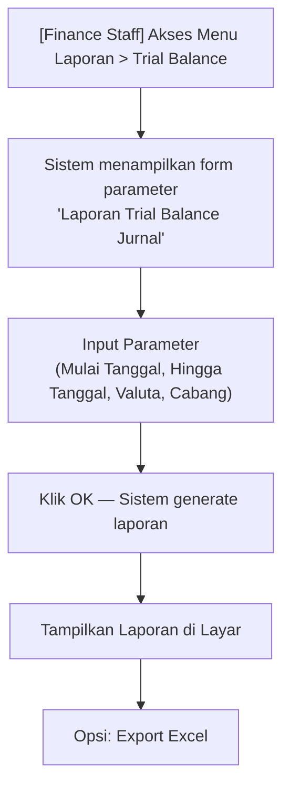

#### 4.1.2. Keterangan Alur Proses

| **Deskripsi** | : | Proses pembuatan laporan Trial Balance Jurnal yang menampilkan saldo, mutasi debet/kredit, saldo akhir, dan ekuivalen IDR per akun valas pada periode tertentu |
|---|---|---|
| **User** | : | Finance & Accounting Staff |
| **Pre kondisi** | : | 1. User telah login ke sistem BCAS. 2. User memiliki role Finance & Accounting Staff. 3. Data transaksi valas pada periode yang diminta tersedia di sistem. |
| **Alur** | : | 1. User mengakses menu Laporan > Trial Balance. 2. Sistem menampilkan form parameter "Laporan Trial Balance Jurnal". 3. User mengisi Mulai Tanggal dan Hingga Tanggal. 4. User memilih Valuta (spesifik atau centang "Seluruh Valuta") dan Cabang (spesifik atau centang "Seluruh Cabang"). 5. User menekan tombol "OK". 6. Sistem mengambil data dari database dan menampilkan laporan. 7. User dapat melakukan export ke format Excel. |
| **Error Handling** | : | Sistem menampilkan pesan error sesuai Tabel Validasi Laporan Valas |
| **Post kondisi** | : | Laporan Trial Balance Jurnal berhasil ditampilkan dan/atau dieksport. |

#### 4.1.3. Field Description — Parameter & Output Trial Balance Jurnal

Berikut adalah tabel field description untuk parameter input laporan **Trial Balance Jurnal**:

| **Nama Field** | **Deskripsi** | **Data Type** | **Length** | **Mandatory (M/O/C)** | **Sumber Data** |
|---|---|---|---|---|---|
| Mulai Tanggal | Tanggal awal periode laporan | DATE | - | M | Manual Input / Date Picker |
| Hingga Tanggal | Tanggal akhir periode laporan | DATE | - | M | Manual Input / Date Picker |
| Valuta | Filter berdasarkan kode valuta; centang "Seluruh Valuta" untuk semua valuta | VARCHAR | 3 | O | Manual Input / Checkbox |
| Cabang | Filter berdasarkan cabang; centang "Seluruh Cabang" untuk semua cabang | VARCHAR | 10 | O | Manual Input / Checkbox |

Berikut adalah kolom output yang ditampilkan pada laporan **Trial Balance Jurnal**:

| **Nama Field** | **Deskripsi** | **Sumber Data** |
|---|---|---|
| Kode Akun | Kode akun buku besar | Core |
| Nama Akun | Nama akun buku besar | Core |
| Kode Cabang | Kode cabang | Core |
| Kode Valuta | Kode mata uang (contoh: USD, EUR, SGD) | Core |
| RC Code | Kode rekening/kategori akun | Core |
| Saldo | Saldo awal pada tanggal mulai periode | Core |
| Debet | Total mutasi debet selama periode | Core |
| Kredit | Total mutasi kredit selama periode | Core |
| Saldo Akhir | Saldo akhir pada tanggal akhir periode | Calculated |
| Kurs Realisasi | Kurs realisasi yang digunakan pada tanggal akhir | Core |
| Saldo Ekuivalen IDR | Nilai saldo akhir yang dikonversi ke IDR | Calculated |

#### 4.1.4. Action — Trial Balance Jurnal

| **Action** | **Output** | **Keterangan** |
|---|---|---|
| OK | Sistem mengambil data dan menampilkan laporan sesuai parameter | Memerlukan minimal Mulai Tanggal dan Hingga Tanggal |
| Export Excel | File Excel (.xlsx) laporan Trial Balance Jurnal terunduh | Memuat seluruh data tanpa paginasi |
| Batal | Form ditutup tanpa generate laporan | - |

#### 4.1.5. Tabel Validasi — Trial Balance Jurnal

| **Case** | **Result** |
|---|---|
| Mulai Tanggal lebih besar dari Hingga Tanggal | "Tanggal awal periode tidak boleh lebih besar dari tanggal akhir periode." |
| Data transaksi valas pada periode yang diminta tidak tersedia | "Tidak ada data yang ditemukan untuk parameter yang dipilih." |

---

### 4.2. Laporan Buku Besar Valas

#### 4.2.1. Alur Proses

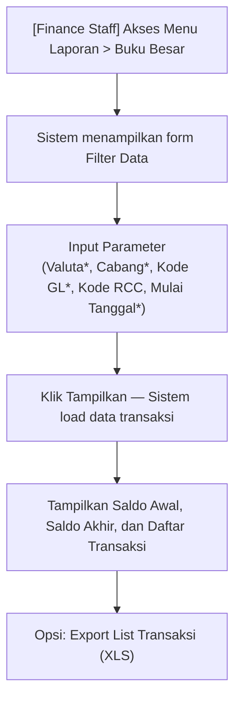

#### 4.2.2. Keterangan Alur Proses

| **Deskripsi** | : | Proses pembuatan laporan Buku Besar Valas yang menampilkan detail seluruh transaksi valas per akun GL dalam suatu periode, beserta saldo awal dan saldo akhir dalam valuta asli dan ekuivalen IDR |
|---|---|---|
| **User** | : | Finance & Accounting Staff |
| **Pre kondisi** | : | 1. User telah login ke sistem BCAS. 2. Data transaksi valas pada periode yang diminta tersedia. |
| **Alur** | : | 1. User mengakses menu Laporan > Buku Besar. 2. Sistem menampilkan form Filter Data. 3. User mengisi Valuta, Cabang, Kode GL (wajib), serta Kode RCC (opsional) dan periode. 4. User menekan tombol "Tampilkan". 5. Sistem menampilkan saldo awal, saldo akhir, saldo awal ekuivalen, dan saldo akhir ekuivalen IDR di bagian atas, serta daftar transaksi di bawahnya. 6. User dapat export daftar transaksi ke Excel. |
| **Error Handling** | : | Sistem menampilkan pesan error sesuai Tabel Validasi Laporan Valas |
| **Post kondisi** | : | Laporan Buku Besar Valas ditampilkan dengan detail transaksi dan saldo per akun GL. |

#### 4.2.3. Field Description — Parameter & Output Buku Besar Valas

Berikut adalah tabel field description untuk parameter input laporan **Buku Besar Valas**:

| **Nama Field** | **Deskripsi** | **Data Type** | **Length** | **Mandatory (M/O/C)** | **Sumber Data** |
|---|---|---|---|---|---|
| Valuta | Kode valuta yang ditampilkan | VARCHAR | 3 | M | Manual Input |
| Cabang | Kode cabang yang ditampilkan | VARCHAR | 10 | M | Manual Input |
| Kode GL | Kode akun General Ledger yang ditampilkan | VARCHAR | 20 | M | Manual Input |
| Kode RCC | Filter berdasarkan kode rekening nasabah (RCC) | VARCHAR | 20 | O | Manual Input |
| Mulai Tanggal | Tanggal awal periode laporan | DATE | - | M | Manual Input / Date Picker |
| Hingga Tanggal | Tanggal akhir periode laporan | DATE | - | O | Manual Input / Date Picker |

Berikut adalah field ringkasan yang ditampilkan setelah generate laporan **Buku Besar Valas**:

| **Nama Field** | **Deskripsi** | **Sumber Data** |
|---|---|---|
| Saldo Awal | Saldo akun pada tanggal mulai dalam valuta asli | Core |
| Saldo Awal Ekuivalen | Saldo awal yang dikonversi ke IDR | Calculated |
| Saldo Akhir | Saldo akun pada tanggal akhir dalam valuta asli | Calculated |
| Saldo Akhir Ekuivalen | Saldo akhir yang dikonversi ke IDR | Calculated |

#### 4.2.4. Action — Buku Besar Valas

| **Action** | **Output** | **Keterangan** |
|---|---|---|
| Tampilkan | Sistem menampilkan saldo ringkasan dan daftar transaksi sesuai filter | Wajib mengisi Valuta, Cabang, Kode GL, dan Mulai Tanggal |
| Export List Transaksi (XLS) | File Excel berisi daftar transaksi Buku Besar terunduh | - |

#### 4.2.5. Tabel Validasi — Buku Besar Valas

| **Case** | **Result** |
|---|---|
| Kode GL tidak ditemukan di sistem | "Kode GL tidak terdaftar. Silakan periksa kembali." |
| Mulai Tanggal lebih besar dari Hingga Tanggal | "Tanggal awal periode tidak boleh lebih besar dari tanggal akhir." |
| Tidak ada transaksi pada parameter yang dipilih | "Tidak ada data transaksi yang ditemukan." |

---

### 4.3. Laporan Neraca Valas

#### 4.3.1. Alur Proses

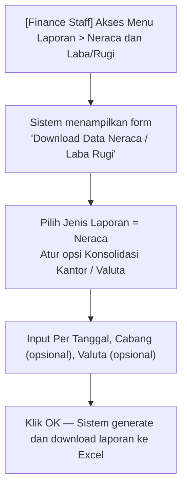

#### 4.3.2. Keterangan Alur Proses

| **Deskripsi** | : | Proses download laporan Neraca atau Laba Rugi valas melalui form "Download Data Neraca / Laba Rugi", dengan opsi konsolidasi per kantor dan per valuta |
|---|---|---|
| **User** | : | Finance & Accounting Staff |
| **Pre kondisi** | : | 1. User telah login ke sistem BCAS. 2. Data saldo akun valas tersedia pada tanggal yang diminta. |
| **Alur** | : | 1. User mengakses menu Laporan > Neraca dan Laba/Rugi. 2. Sistem menampilkan form "Download Data Neraca / Laba Rugi". 3. User memilih Jenis Laporan (Neraca atau Laba Rugi). 4. User mengatur opsi Konsolidasi Kantor dan/atau Konsolidasi Valuta jika diperlukan. 5. User mengisi Per Tanggal, dan opsional Kode Cabang dan Valuta. 6. User menekan "OK". 7. Sistem generate laporan dan mendownload file Excel. |
| **Error Handling** | : | Sistem menampilkan pesan error sesuai Tabel Validasi Laporan Valas |
| **Post kondisi** | : | File laporan Neraca Valas berhasil terunduh dalam format Excel. |

#### 4.3.3. Field Description — Parameter Neraca Valas

| **Nama Field** | **Deskripsi** | **Data Type** | **Length** | **Mandatory (M/O/C)** | **Sumber Data** |
|---|---|---|---|---|---|
| Jenis Laporan | Pilihan jenis laporan: Neraca atau Laba Rugi | VARCHAR | - | M | Dropdown |
| Konsolidasi Kantor | Jika dicentang, laporan menggabungkan semua kantor/cabang | BOOLEAN | - | O | Checkbox |
| Konsolidasi Valuta | Jika dicentang, laporan menggabungkan semua valuta ke IDR | BOOLEAN | - | O | Checkbox |
| Per Tanggal | Tanggal posisi laporan | DATE | - | M | Manual Input / Date Picker |
| Kode dan Nama Cabang | Filter per cabang tertentu; diabaikan jika Konsolidasi Kantor aktif | VARCHAR | 10 | O | Manual Input |
| Valuta | Filter per valuta tertentu; diabaikan jika Konsolidasi Valuta aktif | VARCHAR | 3 | O | Manual Input |

#### 4.3.4. Action — Neraca Valas

| **Action** | **Output** | **Keterangan** |
|---|---|---|
| OK | Sistem generate laporan dan mendownload file Excel Neraca Valas | - |
| Batal | Form ditutup tanpa generate laporan | - |

#### 4.3.5. Tabel Validasi — Neraca Valas

| **Case** | **Result** |
|---|---|
| Per Tanggal melebihi tanggal hari ini | "Tanggal posisi tidak boleh melebihi tanggal hari ini." |
| Data saldo tidak tersedia pada tanggal yang dipilih | "Data saldo valas tidak tersedia pada tanggal tersebut." |

---

## 5. LBV (Ledger Balance Verification)

### 5.1. Laporan Proofing Saldo Produk vs GL (LBV)

#### 5.1.1. Alur Proses

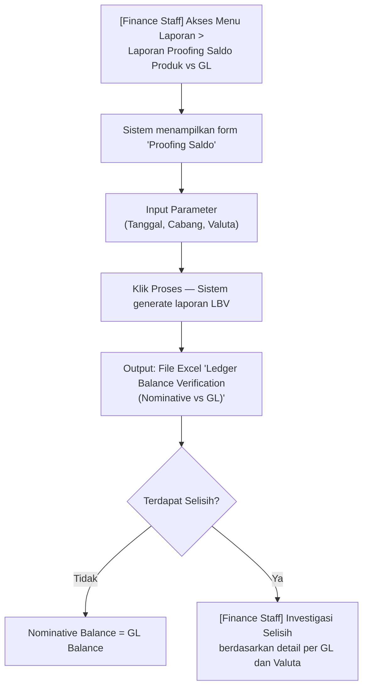

#### 5.1.2. Keterangan Alur Proses

| **Deskripsi** | : | Laporan on-request yang membandingkan saldo nominatif produk (dari TM) dengan saldo General Ledger (Core DB) per tanggal tertentu, untuk mendeteksi selisih (discrepancy) |
|---|---|---|
| **User** | : | Finance & Accounting Staff |
| **Pre kondisi** | : | 1. TM telah mengirimkan data saldo nominatif produk ke Core DB via REST Report. 2. Data saldo GL tersedia di Core DB untuk tanggal yang diminta. |
| **Alur** | : | 1. Finance Staff mengakses menu Laporan > Laporan Proofing Saldo Produk vs GL. 2. Sistem menampilkan form "Proofing Saldo". 3. Staff mengisi Tanggal, memilih Cabang (atau centang "Seluruh Cabang"), dan memilih Valuta (atau centang "Seluruh Valuta"). 4. Staff menekan tombol "Proses". 5. Sistem menghasilkan laporan Excel "Ledger Balance Verification (Nominative vs GL)". 6. Staff memeriksa kolom SELISIH untuk mendeteksi discrepancy per akun GL dan valuta. |
| **Error Handling** | : | Sistem menampilkan pesan error jika data tidak tersedia |
| **Post kondisi** | : | Laporan LBV berhasil digenerate dan Finance Staff dapat mengidentifikasi selisih saldo nominatif vs GL. |

#### 5.1.3. Use Case

| **Given** | : | Data saldo nominatif produk dari TM dan saldo GL di Core DB tersedia pada tanggal yang diminta |
|---|---|---|
| **When** | : | Finance Staff membuka form Proofing Saldo, mengisi parameter, dan menekan Proses |
| **Then** | : | Sistem mendownload file Excel yang berisi perbandingan Nominative Balance vs GL Balance per nomor GL dan valuta, beserta nilai SELISIH. Finance Staff menggunakan laporan ini untuk investigasi jika ditemukan selisih. |

#### 5.1.4. Field Description — Parameter & Output LBV

Berikut adalah tabel field description untuk parameter input form **Proofing Saldo**:

| **Nama Field** | **Deskripsi** | **Data Type** | **Mandatory (M/O/C)** | **Sumber Data** |
|---|---|---|---|---|
| Tanggal | Tanggal posisi verifikasi saldo | DATE | M | Manual Input / Date Picker |
| Cabang | Kode cabang; centang "Seluruh Cabang" untuk semua cabang | VARCHAR | O | Manual Input / Checkbox |
| Valuta | Kode valuta; centang "Seluruh Valuta" untuk semua valuta | VARCHAR | O | Manual Input / Checkbox |

Berikut adalah kolom output pada file Excel laporan **Ledger Balance Verification (Nominative vs GL)**:

| **Nama Field** | **Deskripsi** | **Sumber Data** |
|---|---|---|
| NO | Nomor urut baris | System |
| GL NO | Nomor akun General Ledger | Core |
| GL NAME | Nama akun General Ledger | Core |
| CABANG | Kode cabang | Core |
| VALUTA | Kode mata uang | Core |
| NOMINATIVE BALANCE | Saldo nominatif produk (dari TM) | TM via REST Report |
| GL BALANCE | Saldo akun GL di Core Banking | Core |
| SELISIH | Perbedaan antara Nominative Balance dan GL Balance | Calculated |
| KODE SISTEM EXT | Kode identifikasi sistem eksternal (TM) | TM |

#### 5.1.5. Action — LBV

| **Action** | **Output** | **Keterangan** |
|---|---|---|
| Proses | Sistem generate dan download file Excel laporan LBV | Parameter Tanggal wajib diisi |

#### 5.1.6. Tabel Validasi — LBV

| **Case** | **Result** |
|---|---|
| Data nominatif produk dari TM belum tersedia pada tanggal yang diminta | "Data saldo nominatif untuk tanggal [DD/MM/YYYY] belum tersedia." |
| Data GL tidak tersedia pada tanggal yang diminta | "Data saldo GL untuk tanggal [DD/MM/YYYY] tidak ditemukan." |

---

## 6. EOM Hitung GDR

### 6.1. Simulasi GDR

#### 6.1.1. Alur Proses

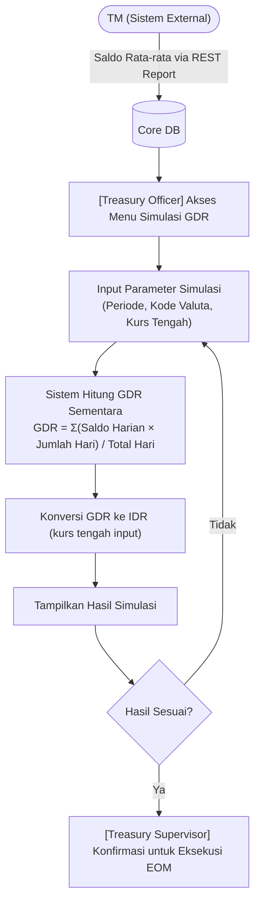

#### 6.1.2. Keterangan Alur Proses

| **Deskripsi** | : | Proses simulasi perhitungan GDR sebelum eksekusi EOM resmi, menggunakan data saldo rata-rata yang diterima dari TM melalui REST Report |
|---|---|---|
| **User** | : | Treasury Officer (simulasi), Treasury Supervisor (konfirmasi) |
| **Pre kondisi** | : | 1. TM telah mengirimkan data saldo rata-rata bulan berjalan ke endpoint REST Report. 2. Data saldo harian valas tersedia di Core DB. 3. Kurs tengah estimasi tersedia untuk diinput. |
| **Alur** | : | 1. Treasury Officer mengakses menu Simulasi GDR. 2. Sistem mengambil data saldo rata-rata valas dari Core DB (hasil kiriman TM via REST Report). 3. Treasury Officer mengisi parameter simulasi: periode dan kurs tengah estimasi. 4. Sistem menghitung GDR sementara per valuta menggunakan formula: GDR = Σ(Saldo Harian × Jumlah Hari Saldo Berlaku) / Total Hari Dalam Bulan. 5. Sistem menampilkan hasil simulasi dalam valuta asli dan ekuivalen IDR. 6. Treasury Officer atau Supervisor mengevaluasi hasil simulasi. 7. Jika hasil sesuai, Supervisor mengkonfirmasi untuk dilanjutkan ke Eksekusi EOM. |
| **Error Handling** | : | Sistem menampilkan pesan error sesuai Tabel Validasi EOM GDR |
| **Post kondisi** | : | Hasil simulasi GDR ditampilkan dan dapat dijadikan acuan sebelum eksekusi EOM resmi. |

#### 6.1.3. Use Case

| **Given** | : | Data saldo rata-rata valas dari TM telah tersimpan di Core DB |
|---|---|---|
| **When** | : | Treasury Officer mengakses menu Simulasi GDR dan mengisi parameter periode serta kurs tengah estimasi |
| **Then** | : | Sistem menampilkan hasil simulasi GDR per valuta, meliputi: saldo rata-rata dalam valuta asli, kurs tengah yang digunakan, dan nilai GDR dalam IDR. Hasil simulasi tidak tersimpan ke database utama dan tidak dikirimkan ke TM. |

#### 6.1.4. Field Description — Simulasi GDR

| **Nama Field** | **Deskripsi** | **Data Type** | **Mandatory (M/O/C)** | **Sumber Data** |
|---|---|---|---|---|
| Periode Bulan/Tahun | Periode bulan yang disimulasikan | VARCHAR | M | Manual Input |
| Kode Valuta | Filter kode valuta yang disimulasikan | VARCHAR | O | Dropdown |
| Kurs Tengah Estimasi | Kurs tengah yang digunakan dalam simulasi | DECIMAL(18,4) | M | Manual Input |
| Saldo Rata-rata | Rata-rata saldo harian dalam valuta asli (dari Core DB) | DECIMAL(18,4) | - | Core DB |
| Total Hari Bulan | Jumlah hari dalam bulan yang disimulasikan | INTEGER | - | Calculated |
| GDR Valuta | Hasil simulasi GDR dalam valuta asli | DECIMAL(18,4) | - | Calculated |
| GDR IDR | Hasil simulasi GDR setelah dikonversi ke IDR | DECIMAL(18,4) | - | Calculated |

#### 6.1.5. Action — Simulasi GDR

| **Action** | **Output** | **Keterangan** |
|---|---|---|
| Hitung Simulasi | Sistem menampilkan hasil simulasi GDR per valuta | Tidak menyimpan data ke database, hanya untuk preview |
| Reset | Parameter simulasi dikosongkan | - |
| Export Hasil Simulasi | File Excel berisi hasil simulasi GDR terunduh | Untuk keperluan review sebelum eksekusi EOM |

#### 6.1.6. Tabel Validasi — Simulasi GDR

| **Case** | **Result** |
|---|---|
| Data saldo rata-rata dari TM belum tersedia di Core DB | "Data saldo rata-rata valas untuk periode [bulan/tahun] belum tersedia. Pastikan TM telah mengirimkan data melalui REST Report." |
| Terdapat hari dalam bulan tanpa data saldo harian | "Terdapat [N] hari tanpa data saldo pada bulan [bulan/tahun]. Hasil simulasi mungkin tidak akurat." |
| Kurs tengah estimasi bernilai 0 atau negatif | "Kurs tengah harus lebih besar dari 0." |

---

### 6.2. Eksekusi EOM

#### 6.2.1. Alur Proses

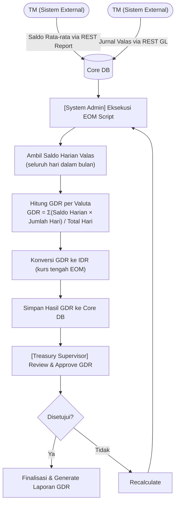

#### 6.2.2. Keterangan Alur Proses

| **Deskripsi** | : | Proses eksekusi EOM resmi untuk menghitung Gross Daily Rate (GDR) dari data saldo valas harian dan jurnal valas yang diterima dari TM |
|---|---|---|
| **User** | : | System Administrator (eksekusi), Treasury Supervisor (review & approval) |
| **Pre kondisi** | : | 1. TM telah mengirimkan saldo rata-rata via REST Report ke Core DB. 2. TM telah mengirimkan seluruh jurnal valas bulan berjalan via REST GL ke Core DB. 3. Kurs tengah EOM telah dikonfirmasi dan tersimpan di sistem. 4. Simulasi GDR (6.1) telah direview dan disetujui oleh Supervisor. |
| **Alur** | : | 1. System Administrator mengeksekusi EOM Script. 2. Sistem mengambil saldo harian valas dari Core DB untuk setiap hari dalam bulan. 3. Sistem menghitung GDR per valuta: GDR = Σ(Saldo Harian × Jumlah Hari Saldo Berlaku) / Total Hari Dalam Bulan. 4. Sistem mengkonversi GDR ke IDR menggunakan kurs tengah EOM. 5. Hasil GDR disimpan ke Core DB. 6. Treasury Supervisor mereview dan menyetujui hasil GDR. 7. Jika disetujui, sistem memfinalisasi GDR dan menghasilkan laporan. 8. Jika tidak disetujui, sistem menjalankan ulang perhitungan (recalculate). |
| **Error Handling** | : | Sistem menampilkan pesan error sesuai Tabel Validasi Eksekusi EOM |
| **Post kondisi** | : | GDR seluruh valuta berhasil dihitung, disetujui, disimpan di Core DB, dan laporan GDR tersedia untuk diakses. |

#### 6.2.3. Use Case

| **Given** | : | EOM Script telah dieksekusi dan hasil perhitungan GDR tersedia di Core DB |
|---|---|---|
| **When** | : | Treasury Supervisor mengakses halaman Review GDR EOM |
| **Then** | : | Sistem menampilkan ringkasan GDR per valuta, mencakup: saldo rata-rata dalam valuta asli, kurs tengah EOM yang digunakan, nilai GDR dalam IDR. Supervisor dapat menyetujui atau meminta recalculation jika terdapat data yang perlu dikoreksi. |

#### 6.2.4. Field Description — Eksekusi EOM GDR

| **Nama Field** | **Deskripsi** | **Data Type** | **Mandatory (M/O/C)** | **Sumber Data** |
|---|---|---|---|---|
| Bulan/Tahun Proses | Periode EOM yang diproses | VARCHAR | M | System |
| Kode Valuta | Kode mata uang yang dihitung GDR-nya | VARCHAR | M | Core |
| Total Hari Bulan | Jumlah hari dalam bulan yang diproses | INTEGER | - | Calculated |
| Saldo Rata-rata | Rata-rata saldo harian dalam valuta asli | DECIMAL(18,4) | - | Calculated |
| GDR Valuta | Gross Daily Rate dalam valuta asli | DECIMAL(18,4) | - | Calculated |
| Kurs Tengah EOM | Kurs tengah yang digunakan untuk konversi ke IDR | DECIMAL(18,4) | - | Core |
| GDR IDR | Nilai GDR setelah dikonversi ke IDR | DECIMAL(18,4) | - | Calculated |
| Status Approval | Status persetujuan Supervisor | VARCHAR | - | System |

#### 6.2.5. Action — Eksekusi EOM GDR

| **Action** | **Output** | **Keterangan** |
|---|---|---|
| Run EOM GDR | Sistem mengeksekusi perhitungan GDR seluruh valuta untuk periode EOM | Hanya dapat dijalankan oleh System Administrator |
| Review GDR | Sistem menampilkan detail hasil GDR per valuta | Tersedia setelah proses Run EOM selesai |
| Approve GDR | Hasil GDR difinalisasi dan laporan GDR dihasilkan | Hanya Treasury Supervisor |
| Recalculate | Sistem menjalankan ulang perhitungan GDR | Digunakan jika terdapat koreksi data saldo harian |
| Export Laporan GDR | File Excel berisi hasil GDR EOM terunduh | - |

#### 6.2.6. Tabel Validasi — Eksekusi EOM GDR

| **Case** | **Result** |
|---|---|
| Data saldo rata-rata dari TM (REST Report) belum tersedia di Core DB | "Data saldo rata-rata valas untuk periode [bulan/tahun] belum tersedia. Pastikan TM telah mengirimkan data melalui REST Report." |
| Data jurnal valas dari TM (REST GL) belum lengkap | "Jurnal valas dari TM untuk periode [bulan/tahun] belum lengkap. Harap konfirmasi dengan TM." |
| Terdapat hari dalam bulan yang tidak memiliki data saldo | "Terdapat [N] hari tanpa data saldo pada bulan [bulan/tahun]. Proses GDR tidak dapat dilanjutkan." |
| Kurs tengah EOM belum tersedia | "Kurs tengah EOM untuk periode [bulan/tahun] belum dikonfirmasi. Harap input kurs tengah EOM sebelum eksekusi." |
| Proses EOM GDR sudah pernah di-approve pada periode yang sama | "GDR periode [bulan/tahun] sudah difinalisasi dan tidak dapat diubah. Hubungi administrator untuk pembatalan." |
| Script EOM timeout atau error database | "Proses EOM GDR gagal karena kesalahan sistem. Kode Error: [kode]. Hubungi administrator." |

---

## 7. Pengaturan Umum

### 7.1. Pengaturan

Pengaturan umum pada aplikasi Saku Valas adalah sebagai berikut:

| **Konfigurasi** | **Keterangan** |
|---|---|
| Single Session | Jika ada user yang sedang login kemudian ada user lain yang menggunakan credential yang sama, maka user lama akan dikeluarkan dari sesi aktifnya. |
| Idle Timeout | Sistem akan logout secara otomatis apabila tidak ada interaksi atau proses selama 10 menit. |
| Audit Trail | Seluruh aktivitas pengguna pada fitur Saku Valas (input kurs, approval, generate laporan, eksekusi EOM) tercatat di log audit trail beserta timestamp dan ID user. |
| Scheduled Job LBV | Proses LBV dijalankan secara otomatis setiap hari kerja pada pukul 18.00 WIB setelah proses EOD selesai. Jadwal dapat dikonfigurasi oleh System Administrator. |
| Scheduled Job EOM | Proses EOM GDR dijalankan secara otomatis pada hari kerja pertama setelah akhir bulan pukul 08.00 WIB. Dapat dipicu manual jika diperlukan. |
| Approval Workflow | Setiap perubahan data kurs (penambahan valuta dan update kurs) wajib melalui proses approval dua tingkat (maker-checker) sebelum data efektif di sistem. |
| Notifikasi | Sistem mengirimkan notifikasi (in-app dan/atau email) kepada Supervisor ketika terdapat data yang menunggu approval, dan kepada Finance Staff ketika proses LBV/EOM selesai dijalankan. |
| Retensi Data Histori Kurs | Histori perubahan kurs disimpan dalam sistem selama minimal 5 tahun sesuai ketentuan regulasi OJK. |

---

## 8. Persetujuan Dokumen

### Persetujuan Dokumen BCA Syariah

| **PT Bank BCA Syariah** | | |
|---|---|---|
| | | |
| {Diisi Nama} | {Diisi Nama} | {Diisi Nama} |
| {Role/Jabatan} | {Role/Jabatan} | {Role/Jabatan} |
| {DD/MM/YYYY} | {DD/MM/YYYY} | {DD/MM/YYYY} |

### Persetujuan Dokumen ISI

| **PT Ihsan Solusi Informatika** | | |
|---|---|---|
| | | |
| {Diisi Nama} | {Diisi Nama} | {Diisi Nama} |
| {Role/Jabatan} | {Role/Jabatan} | {Role/Jabatan} |
| {DD/MM/YYYY} | {DD/MM/YYYY} | {DD/MM/YYYY} |

---

## 9. Lampiran

### Lampiran A. Screenshot Manajemen Kurs

#### A.1. Menu Navigasi Daftar Valuta

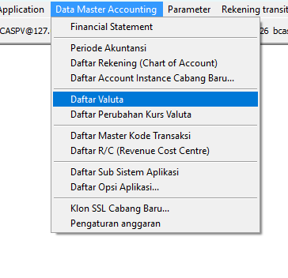

#### A.2. Halaman Daftar Valuta

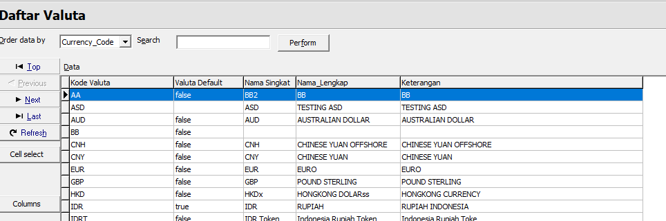

#### A.3. Form Ubah Data Valuta

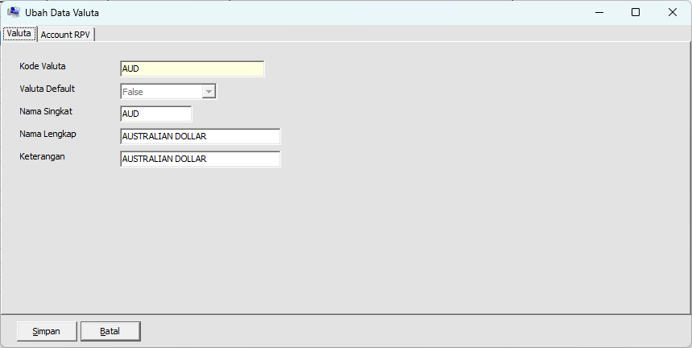

#### A.4. Form Buat Perubahan Kurs Baru

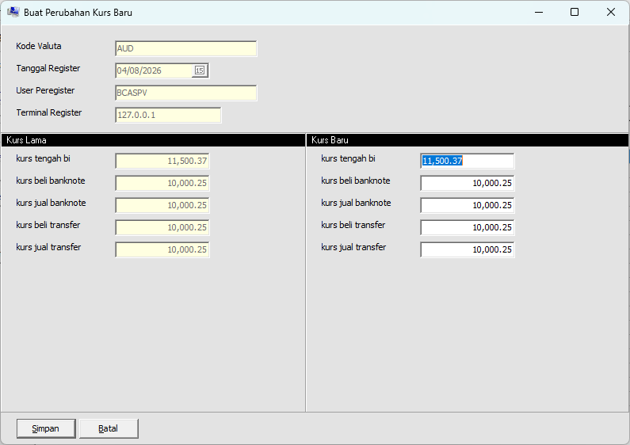

---

### Lampiran B. Screenshot Laporan Valas

#### B.1. Form Parameter Laporan Trial Balance

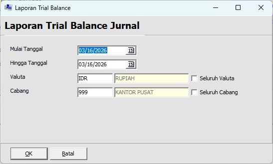

#### B.2. Output Laporan Trial Balance

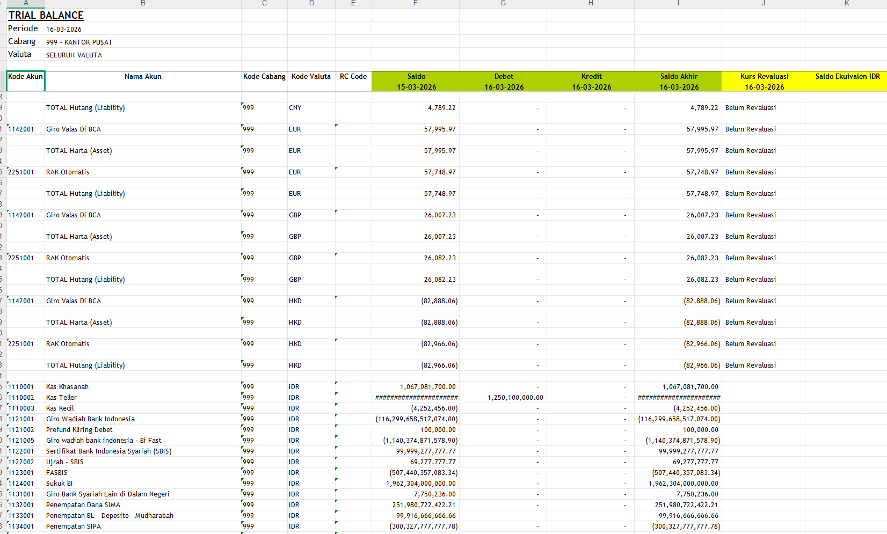

#### B.3. Halaman Buku Besar Valas

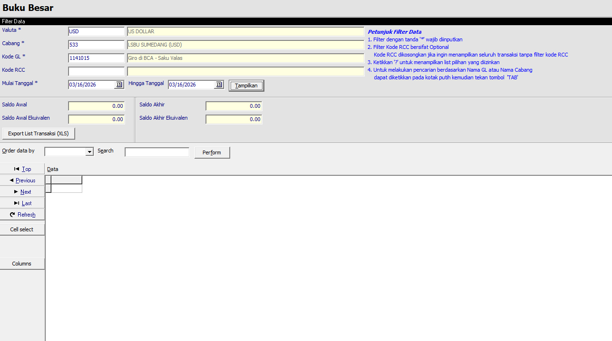

#### B.4. Form Parameter Laporan Neraca Valas

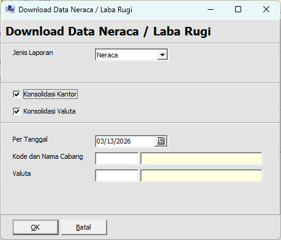

---

### Lampiran C. Screenshot Ledger Balance Verification (LBV)

#### C.1. Menu Akses Ledger Balance Verification (LBV)

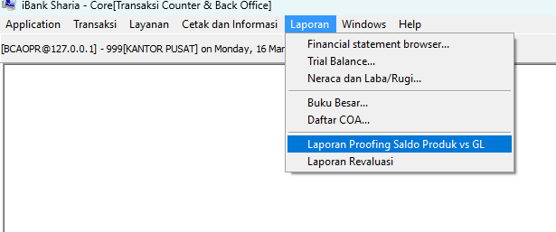

#### C.2. Form Ledger Balance Verification

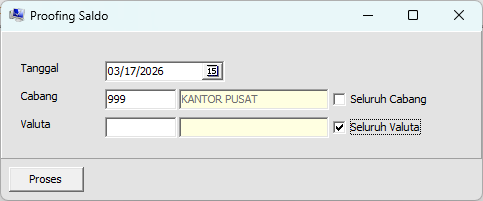

#### C.3. Output Hasil Ledger Balance Verification

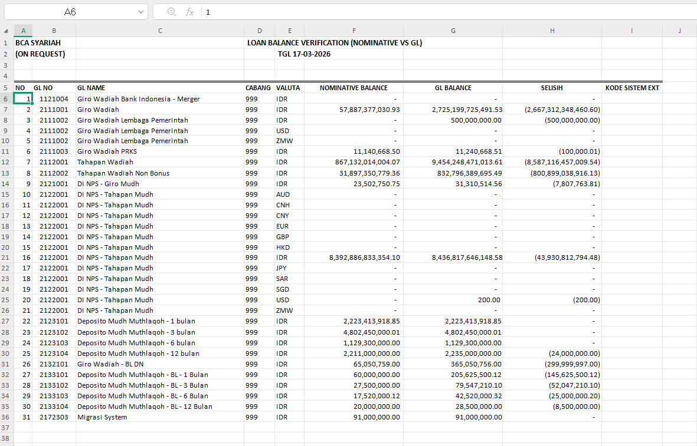

---

### Lampiran D. Screenshot Simulasi GDR & Eksekusi EOM

#### D.1. Halaman Simulasi GDR dan Daftar Bagi Hasil

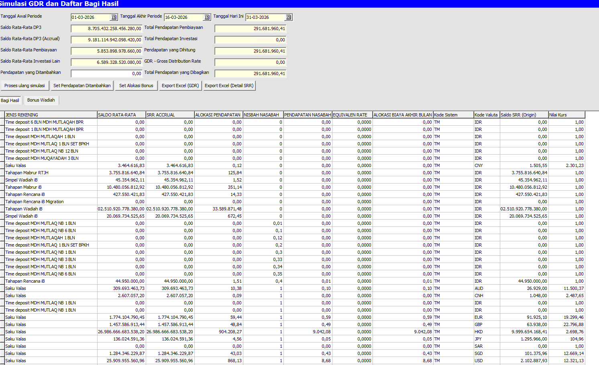
