# FUNCTIONAL DESIGN SPECIFICATION (FDS)

## FingerScan Biometric Authorization System

**Dokumen:** FDS-FINGERPRINT-001  
**Versi:** 1.0  
**Tanggal:** 28 Januari 2026  
**Status:** Draft  

---

**Dipersiapkan oleh:**  
PT Ihsan Solusi Informatika  
Jl. PHH Mustofa No. 39  
Ruko Surapati Core C-7 Bandung  

---

## 📑 Table of Contents

1. [Pendahuluan](#1-pendahuluan)
   - 1.1 [Tujuan Dokumen](#11-tujuan-dokumen)
   - 1.2 [Ruang Lingkup](#12-ruang-lingkup)
   - 1.3 [Definisi dan Istilah](#13-definisi-dan-istilah)
   - 1.4 [Referensi Dokumen](#14-referensi-dokumen)

2. [Gambaran Umum Sistem](#2-gambaran-umum-sistem)
   - 2.1 [Arsitektur Fungsional](#21-arsitektur-fungsional)
   - 2.2 [Komponen Utama](#22-komponen-utama)
   - 2.3 [Aktor Sistem](#23-aktor-sistem)

3. [Desain Fungsional Detail](#3-desain-fungsional-detail)
   - 3.1 [Modul Enrollment Biometrik](#31-modul-enrollment-biometrik)
   - 3.2 [Modul Verification/Otorisasi](#32-modul-verificationotorisasi)
   - 3.3 [Modul Management Template](#33-modul-management-template)
   - 3.4 [Modul Audit & Logging](#34-modul-audit--logging)

4. [Diagram Proses Bisnis](#4-diagram-proses-bisnis)
   - 4.1 [Activity Diagram - Enrollment](#41-activity-diagram---enrollment)
   - 4.2 [Activity Diagram - Verification](#42-activity-diagram---verification)
   - 4.3 [Activity Diagram - Template Management](#43-activity-diagram---template-management)

5. [Diagram Sequence](#5-diagram-sequence)
   - 5.1 [Sequence Diagram - Enrollment](#51-sequence-diagram---enrollment)
   - 5.2 [Sequence Diagram - Verification](#52-sequence-diagram---verification)
   - 5.3 [Sequence Diagram - Template Sync](#53-sequence-diagram---template-sync)

6. [State Diagram](#6-state-diagram)
   - 6.1 [State Diagram - Template Status](#61-state-diagram---template-status)
   - 6.2 [State Diagram - Transaction Authorization](#62-state-diagram---transaction-authorization)

7. [Business Rules](#7-business-rules)
   - 7.1 [Enrollment Rules](#71-enrollment-rules)
   - 7.2 [Verification Rules](#72-verification-rules)
   - 7.3 [Security Rules](#73-security-rules)

8. [Data Model](#8-data-model)
   - 8.1 [Entity Relationship](#81-entity-relationship)
   - 8.2 [Data Dictionary](#82-data-dictionary)

9. [Interface Design](#9-interface-design)
   - 9.1 [Enrollment Interface](#91-enrollment-interface)
   - 9.2 [Verification Interface](#92-verification-interface)
   - 9.3 [Admin Interface](#93-admin-interface)

10. [Error Handling](#10-error-handling)
    - 10.1 [Error Scenarios](#101-error-scenarios)
    - 10.2 [Error Messages](#102-error-messages)
    - 10.3 [Recovery Procedures](#103-recovery-procedures)

11. [Performance Requirements](#11-performance-requirements)
    - 11.1 [Response Time](#111-response-time)
    - 11.2 [Throughput](#112-throughput)
    - 11.3 [Scalability](#113-scalability)

12. [Acceptance Criteria](#12-acceptance-criteria)

---

## 1. Pendahuluan

### 1.1 Tujuan Dokumen

Dokumen Functional Design Specification (FDS) ini bertujuan untuk:
- Menjelaskan secara detail desain fungsional sistem FingerScan Biometric Authorization
- Mendefinisikan alur proses bisnis untuk enrollment dan verification
- Menyediakan panduan implementasi untuk development team
- Menjadi acuan testing dan quality assurance

### 1.2 Ruang Lingkup

Dokumen ini mencakup:
- **Enrollment biometrik** untuk user baru dan existing user
- **Verification/Authorization** untuk transaksi perbankan
- **Template Management** untuk maintenance data biometrik
- **Audit & Logging** untuk compliance dan security
- **Integration** dengan aplikasi DAF, BDS, CS Teller

Dokumen ini **tidak mencakup**:
- Implementasi hardware DigitalPersona 4500
- Login sistem menggunakan biometrik
- Detail implementasi surrounding apps

### 1.3 Definisi dan Istilah

| Istilah | Definisi |
|---------|----------|
| **Template** | Data hasil ekstraksi karakteristik unik sidik jari yang telah dienkripsi |
| **Enrollment** | Proses pendaftaran sidik jari user ke dalam sistem |
| **Verification** | Proses pencocokan sidik jari untuk otorisasi transaksi |
| **Matching Score** | Nilai kecocokan antara template tersimpan dengan scan real-time (0-100%) |
| **Threshold** | Batas minimum matching score untuk dianggap valid (default: 85%) |
| **FIDO** | Fast Identity Online - standard enkripsi biometrik |
| **ISO Template** | Format standar template sidik jari berdasarkan ISO/IEC 19794-2 |

### 1.4 Referensi Dokumen

- **PRD-FINGERPRINT-001**: Product Requirements Document FingerScan Biometric
- **TSD-FINGERPRINT-001**: Technical Specification Document (akan dibuat)
- **API-SPEC-FINGERPRINT**: API Specification Document (akan dibuat)
- **DigitalPersona SDK Documentation**: Versi 4.5.0

---

## 2. Gambaran Umum Sistem

### 2.1 Arsitektur Fungsional

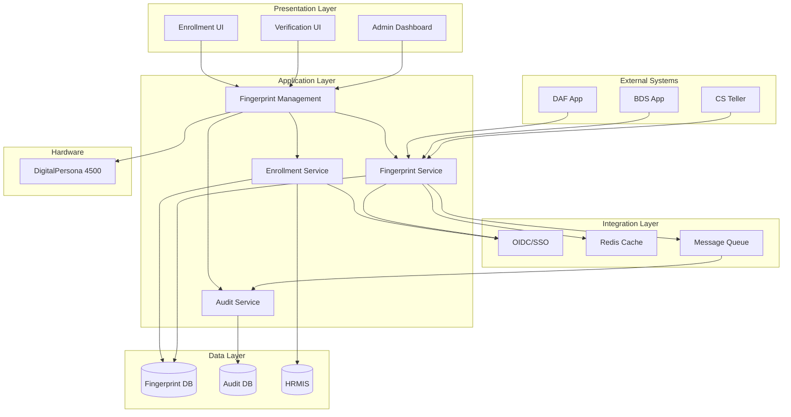

### 2.2 Komponen Utama

#### 2.2.1 Fingerprint Management (Frontend)
- **Fungsi**: Interface layer untuk interaksi user dengan device
- **Teknologi**: React/Vue.js dengan WebUSB API
- **Tanggung Jawab**:
  - Komunikasi dengan DigitalPersona device
  - Capture fingerprint scan
  - Display status enrollment/verification
  - Error handling dan user feedback

#### 2.2.2 Enrollment Service (Backend)
- **Fungsi**: Mengelola proses pendaftaran template baru
- **Teknologi**: Go/Java Spring Boot
- **Tanggung Jawab**:
  - Validasi user eligibility
  - Template extraction dan encryption
  - Quality check template
  - Penyimpanan ke database

#### 2.2.3 Fingerprint Service (Backend)
- **Fungsi**: Core service untuk verification
- **Teknologi**: Go dengan high-performance matching algorithm
- **Tanggung Jawab**:
  - Template matching
  - Score calculation
  - Cache management (Redis)
  - Transaction authorization

#### 2.2.4 Audit Service
- **Fungsi**: Logging dan monitoring
- **Teknologi**: ELK Stack / Custom logging service
- **Tanggung Jawab**:
  - Activity logging
  - Compliance reporting
  - Security monitoring

### 2.3 Aktor Sistem

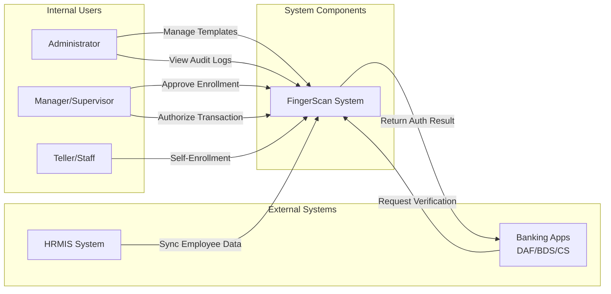

**Deskripsi Aktor:**

| Aktor | Peran | Hak Akses |
|-------|-------|-----------|
| **Administrator** | Mengelola sistem secara keseluruhan | Full access: enrollment, verification, template management, audit |
| **Manager/Supervisor** | Authorizer untuk transaksi critical | Verification, view own template, approve enrollment |
| **Teller/Staff** | User operasional | Self-enrollment, verification untuk transaksi sendiri |
| **Banking Apps** | Aplikasi yang memerlukan otorisasi | API access untuk verification request |
| **HRMIS System** | Sumber data karyawan | Sync employee master data |

---

## 3. Desain Fungsional Detail

### 3.1 Modul Enrollment Biometrik

#### 3.1.1 Tujuan
Mendaftarkan template sidik jari user ke dalam sistem untuk keperluan otorisasi transaksi.

#### 3.1.2 Business Process Flow

**Trigger:**
- User baru yang belum memiliki template
- User existing yang perlu update template
- Mandatory enrollment untuk role tertentu (Manager/Supervisor)

**Precondition:**
- User sudah terdaftar di HRMIS
- User memiliki NIK valid
- Device DigitalPersona tersedia dan terkoneksi
- User terautentikasi via OIDC/SSO

**Main Flow:**

1. **Inisiasi Enrollment**
   - User login ke Enrollment UI menggunakan OIDC
   - System validasi user di HRMIS (status aktif, role, NIK)
   - System check apakah user sudah memiliki template
   - Jika sudah ada, tampilkan option: Update atau View existing

2. **Device Detection**
   - System detect DigitalPersona device
   - Check device status (ready/busy/error)
   - Initialize fingerprint reader
   - Display instructional message

3. **Capture Process**
   - User diminta scan jari (minimum 2 jari: telunjuk kiri + kanan)
   - System capture fingerprint untuk setiap jari:
     - Scan #1: Initial capture
     - Scan #2: Verification capture (harus match dengan scan #1)
     - Scan #3: Quality assurance (optional jika quality score < 80%)
   - Quality check setiap capture (min score: 75%)
   - Retry mechanism jika quality rendah (max 3x per jari)

4. **Template Extraction**
   - System extract minutiae points dari scan
   - Convert ke ISO template format
   - Generate unique template ID
   - Encrypt template menggunakan FIDO standard

5. **Storage**
   - Save encrypted template ke database
   - Link dengan NIK dan user metadata
   - Set status: `PENDING_APPROVAL` (jika require approval)
   - Set status: `ACTIVE` (jika auto-approve)

6. **Notification**
   - Send notification ke user (enrollment success)
   - Send notification ke approver jika perlu approval
   - Log activity ke audit system

**Postcondition:**
- Template tersimpan dengan status ACTIVE atau PENDING_APPROVAL
- User dapat melakukan verification (jika ACTIVE)
- Audit log tercatat

**Alternative Flow:**

**A1: Template Already Exists**
- System detect existing template
- Tampilkan opsi: View, Update, atau Cancel
- Jika Update dipilih, lanjut ke main flow (dengan flag update mode)
- Old template di-archive dengan status `SUPERSEDED`

**A2: Quality Check Failed**
- Jika setelah 3 retry masih gagal
- Display error message dengan guidance
- Opsi: Retry atau Cancel
- Log failure ke audit system

**A3: Device Error**
- System detect device disconnected/error
- Display troubleshooting message
- Pause enrollment process
- Resume ketika device ready

**A4: User Cancellation**
- User cancel di tengah proses
- Cleanup partial data
- Log cancellation
- Return to home screen

#### 3.1.3 Data Flow Diagram

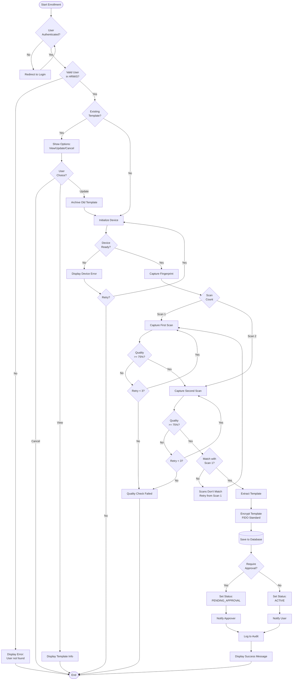

#### 3.1.4 Business Rules

| Rule ID | Deskripsi | Validasi |
|---------|-----------|----------|
| **ENR-001** | User harus terdaftar di HRMIS dengan status AKTIF | Check `employee.status = 'ACTIVE'` |
| **ENR-002** | Minimum 2 jari harus di-enroll (telunjuk kiri + kanan) | Count enrolled fingers >= 2 |
| **ENR-003** | Quality score minimum 75% untuk setiap scan | `quality_score >= 75` |
| **ENR-004** | Maximum retry per jari adalah 3 kali | `retry_count <= 3` |
| **ENR-005** | Scan #2 harus match dengan Scan #1 (score >= 85%) | `matching_score >= 85` |
| **ENR-006** | Template harus terenkripsi sebelum disimpan | Check encryption status |
| **ENR-007** | Untuk role Manager/Supervisor, enrollment require approval | If `role IN ('MANAGER', 'SUPERVISOR')` |
| **ENR-008** | User hanya boleh memiliki 1 active template per NIK | Unique constraint: `NIK + status='ACTIVE'` |
| **ENR-009** | Update template akan archive template lama | Old template status = 'SUPERSEDED' |
| **ENR-010** | Template ID harus unique di seluruh system | UUID generation + uniqueness check |

---

### 3.2 Modul Verification/Otorisasi

#### 3.2.1 Tujuan
Melakukan verifikasi identitas user melalui sidik jari untuk otorisasi transaksi perbankan.

#### 3.2.2 Business Process Flow

**Trigger:**
- Transaksi memerlukan dual authorization
- Transaction amount melebihi threshold
- High-risk transaction
- Request dari aplikasi DAF/BDS/CS Teller

**Precondition:**
- User sudah memiliki template ACTIVE
- Transaction data valid
- Device tersedia
- User terautentikasi

**Main Flow:**

1. **Transaction Initiation**
   - Aplikasi (DAF/BDS/CS) create transaction
   - System evaluate apakah perlu fingerprint authorization
   - Jika ya, generate authorization request
   - Display authorization prompt di UI

2. **User Identification**
   - System tampilkan daftar authorized approvers
   - System fetch template dari database/cache (Redis)
   - Prepare untuk matching process

3. **Fingerprint Capture**
   - Device ready untuk scan
   - User scan fingerprint (1 jari)
   - Quality check real-time (min 70% untuk verification)
   - Retry jika quality rendah (max 3x)

4. **Matching Process**
   - System perform 1:1 matching
   - Compare scanned template vs stored template
   - Calculate matching score (0-100%)
   - Apply threshold (default: 85%)

5. **Authorization Decision**
   - If score >= threshold: **APPROVED**
   - If score < threshold: **REJECTED**
   - Log decision dengan detail score

6. **Response to Application**
   - Return authorization result ke calling app
   - Include: status, timestamp, approver NIK, score
   - Update transaction status
   - Send notification

**Postcondition:**
- Transaction authorized atau rejected
- Audit trail lengkap tersimpan
- Notification terkirim

**Alternative Flow:**

**V1: Multiple Approvers Required**
- System loop verification untuk setiap approver
- Semua approver harus verified (AND logic)
- Jika ada 1 rejected, seluruh authorization gagal

**V2: Verification Failed - Threshold Not Met**
- Display error: "Sidik jari tidak cocok"
- Allow retry (max 3x)
- After 3 failed attempts: lock authorization untuk 5 menit
- Log suspicious activity

**V3: Timeout**
- Verification window: 60 detik
- Jika timeout, authorization auto-reject
- User harus re-initiate transaction

**V4: Template Not Found**
- System tidak menemukan active template
- Display error: "Template tidak ditemukan"
- Redirect ke enrollment
- Cancel authorization

**V5: Device Error**
- Same handling sebagai enrollment
- Pause verification
- Resume when ready

#### 3.2.3 Sequence Flow

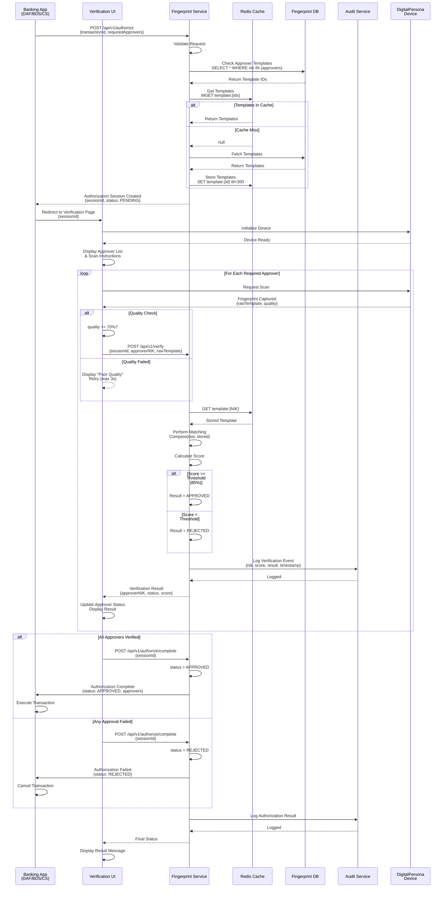

#### 3.2.4 Business Rules

| Rule ID | Deskripsi | Validasi |
|---------|-----------|----------|
| **VER-001** | Quality score minimum 70% untuk verification | `quality_score >= 70` |
| **VER-002** | Matching threshold default 85%, configurable per role | `matching_score >= threshold` |
| **VER-003** | Maximum retry untuk verification: 3 kali | `retry_count <= 3` |
| **VER-004** | After 3 failed attempts, lock selama 5 menit | `lock_duration = 300` seconds |
| **VER-005** | Verification timeout: 60 detik per approver | `session_timeout = 60` seconds |
| **VER-006** | Multi-approver menggunakan AND logic (semua harus approve) | All `approver_status = 'APPROVED'` |
| **VER-007** | Template di-cache di Redis dengan TTL 5 menit | `TTL = 300` seconds |
| **VER-008** | Hanya template dengan status ACTIVE yang bisa digunakan | `template.status = 'ACTIVE'` |
| **VER-009** | Transaction dengan amount > 100jt require 2 approvers | If `amount > 100000000` then `min_approvers = 2` |
| **VER-010** | Setiap verification harus ter-log dengan matching score | Mandatory audit logging |

---

### 3.3 Modul Management Template

#### 3.3.1 Tujuan
Mengelola lifecycle template biometrik, termasuk view, update, block, unblock, dan delete.

#### 3.3.2 Use Cases

**UC-3.1: View Template**
- Admin/User dapat melihat detail template
- Display: NIK, nama, tanggal enrollment, status, quality score
- Tidak menampilkan raw template (security)

**UC-3.2: Update Template**
- User re-enroll untuk update template
- Old template otomatis di-archive (status: SUPERSEDED)
- New template menjadi ACTIVE

**UC-3.3: Block Template**
- Admin dapat block template (suspicious activity, kehilangan jari, dll)
- Status berubah menjadi BLOCKED
- User tidak bisa verify dengan template yang blocked
- Require admin approval untuk unblock

**UC-3.4: Delete Template**
- Soft delete (status: DELETED)
- Tidak benar-benar dihapus dari database (for audit)
- Require strong justification + approval

**UC-3.5: Bulk Template Sync**
- Sync template dari HRMIS ketika ada perubahan employee status
- Auto-block template jika employee status = INACTIVE/TERMINATED
- Scheduled job: daily

#### 3.3.3 Activity Flow - Template Lifecycle

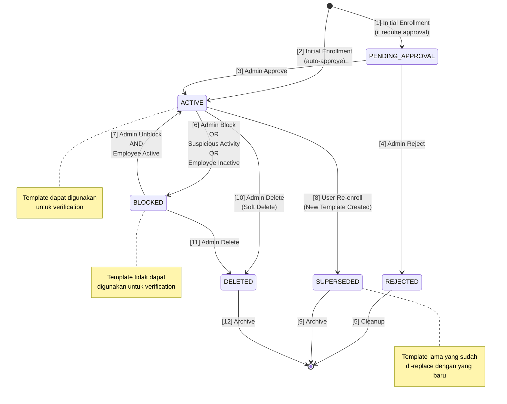

---

### 3.4 Modul Audit & Logging

#### 3.4.1 Tujuan
Mencatat seluruh aktivitas sistem untuk compliance, security monitoring, dan troubleshooting.

#### 3.4.2 Event yang Dicatat

| Event Category | Event Type | Data Logged |
|----------------|------------|-------------|
| **Enrollment** | enrollment.started | NIK, timestamp, initiator, device_id |
| | enrollment.completed | NIK, template_id, quality_score, status |
| | enrollment.failed | NIK, failure_reason, retry_count |
| **Verification** | verification.started | NIK, transaction_id, approver_list |
| | verification.scan | NIK, quality_score, timestamp |
| | verification.matched | NIK, matching_score, threshold, result |
| | verification.failed | NIK, failure_reason, attempts |
| **Template Mgmt** | template.viewed | NIK, viewer_nik, timestamp |
| | template.updated | NIK, old_template_id, new_template_id |
| | template.blocked | NIK, blocker_nik, reason |
| | template.deleted | NIK, deleter_nik, reason |
| **Security** | failed_attempts_exceeded | NIK, attempt_count, lockout_until |
| | suspicious_activity | NIK, activity_type, details |
| | unauthorized_access | NIK, resource, timestamp |
| **System** | device.connected | device_id, status |
| | device.error | device_id, error_code, message |
| | cache.hit | template_id |
| | cache.miss | template_id |

#### 3.4.3 Audit Log Structure

```json
{
  "event_id": "uuid",
  "event_type": "verification.matched",
  "event_category": "VERIFICATION",
  "timestamp": "2026-01-28T10:15:30.000Z",
  "actor": {
    "nik": "123456",
    "name": "John Doe",
    "role": "MANAGER",
    "ip_address": "192.168.1.100"
  },
  "target": {
    "nik": "789012",
    "name": "Jane Smith",
    "template_id": "temp-uuid-001"
  },
  "details": {
    "transaction_id": "TRX-20260128-001",
    "matching_score": 92.5,
    "threshold": 85.0,
    "result": "APPROVED",
    "quality_score": 88.0
  },
  "metadata": {
    "device_id": "DP4500-001",
    "session_id": "session-uuid",
    "application": "BDS-CS-TELLER"
  }
}
```

---

## 4. Diagram Proses Bisnis

### 4.1 Activity Diagram - Enrollment

```mermaid
flowchart TD
    Start([User Initiates<br/>Enrollment]) --> CheckAuth{Authenticated?}
    CheckAuth -->|No| Login[Login via OIDC]
    Login --> CheckAuth
    
    CheckAuth -->|Yes| ValidateHRMIS[Validate User<br/>in HRMIS]
    ValidateHRMIS --> UserValid{User<br/>Valid?}
    
    UserValid -->|No| ErrorMsg1[Display Error:<br/>User Not Found]
    ErrorMsg1 --> End1([End])
    
    UserValid -->|Yes| CheckExisting{Existing<br/>Template?}
    
    CheckExisting -->|Yes| Options[Present Options:<br/>View | Update | Cancel]
    Options --> Choice{User<br/>Choice}
    Choice -->|View| DisplayInfo[Show Template Info]
    DisplayInfo --> End1
    Choice -->|Cancel| End1
    Choice -->|Update| Archive[Archive Old Template<br/>Status: SUPERSEDED]
    Archive --> PrepareEnroll
    
    CheckExisting -->|No| PrepareEnroll[Prepare Enrollment<br/>Session]
    
    PrepareEnroll --> InitDevice[Initialize<br/>DigitalPersona Device]
    InitDevice --> DeviceOK{Device<br/>Ready?}
    
    DeviceOK -->|No| ErrorDevice[Display Device Error<br/>+ Troubleshooting]
    ErrorDevice --> RetryDevice{Retry?}
    RetryDevice -->|Yes| InitDevice
    RetryDevice -->|No| End1
    
    DeviceOK -->|Yes| FingerLoop[["Loop: For Each Finger<br/>(Min 2 fingers)"]]
    
    FingerLoop --> Scan1[Capture Scan #1]
    Scan1 --> Quality1{Quality >= 75%?}
    
    Quality1 -->|No| RetryCount1{Retry < 3?}
    RetryCount1 -->|Yes| Scan1
    RetryCount1 -->|No| QualityFail[Quality Check Failed<br/>Retry Finger or Cancel]
    QualityFail --> QualityChoice{Continue?}
    QualityChoice -->|No| End1
    QualityChoice -->|Yes| FingerLoop
    
    Quality1 -->|Yes| Scan2[Capture Scan #2]
    Scan2 --> Quality2{Quality >= 75%?}
    
    Quality2 -->|No| RetryCount2{Retry < 3?}
    RetryCount2 -->|Yes| Scan2
    RetryCount2 -->|No| QualityFail
    
    Quality2 -->|Yes| MatchScans{Scan #1 & #2<br/>Match >= 85%?}
    MatchScans -->|No| MismatchMsg[Display: Scans Don't Match]
    MismatchMsg --> Scan1
    
    MatchScans -->|Yes| SaveFinger[Save Finger Template<br/>to Session]
    SaveFinger --> FingerCount{Enrolled<br/>Fingers >= 2?}
    
    FingerCount -->|No| FingerLoop
    FingerCount -->|Yes| ExtractAll[Extract & Combine<br/>All Templates]
    
    ExtractAll --> Encrypt[Encrypt Template<br/>FIDO Standard]
    Encrypt --> GenID[Generate Template ID<br/>UUID]
    GenID --> SaveDB[(Save to Database)]
    
    SaveDB --> CheckApproval{Approval<br/>Required?}
    
    CheckApproval -->|Yes| SetPending[Set Status:<br/>PENDING_APPROVAL]
    SetPending --> NotifyApprover[Send Notification<br/>to Approver]
    NotifyApprover --> LogAudit1
    
    CheckApproval -->|No| SetActive[Set Status:<br/>ACTIVE]
    SetActive --> NotifyUser[Send Success<br/>Notification]
    NotifyUser --> LogAudit1[Log to Audit System]
    
    LogAudit1 --> DisplaySuccess[Display Success<br/>Message]
    DisplaySuccess --> End1
```

---

### 4.2 Activity Diagram - Verification

```mermaid
flowchart TD
    Start([Transaction Requires<br/>Authorization]) --> CreateSession[Create Authorization<br/>Session]
    
    CreateSession --> EvalRules{Evaluate<br/>Authorization Rules}
    
    EvalRules -->|Amount > 100M| Set2Approvers[Required Approvers = 2]
    EvalRules -->|High Risk| Set2Approvers
    EvalRules -->|Normal| Set1Approver[Required Approvers = 1]
    
    Set2Approvers --> FetchTemplates
    Set1Approver --> FetchTemplates[Fetch Approver Templates]
    
    FetchTemplates --> CheckCache{Templates<br/>in Cache?}
    CheckCache -->|Yes| GetFromCache[Get from Redis]
    CheckCache -->|No| GetFromDB[Get from Database]
    GetFromDB --> CacheTemplates[Store in Cache<br/>TTL: 5min]
    CacheTemplates --> StartVerif
    GetFromCache --> StartVerif
    
    StartVerif[Start Verification<br/>Process] --> InitDevice[Initialize Device]
    InitDevice --> DeviceReady{Device<br/>Ready?}
    
    DeviceReady -->|No| DeviceError[Handle Device Error]
    DeviceError --> RetryDevice{Retry?}
    RetryDevice -->|Yes| InitDevice
    RetryDevice -->|No| RejectAuth[Authorization: REJECTED<br/>Reason: Device Error]
    RejectAuth --> LogFinal
    
    DeviceReady -->|Yes| ApproverLoop[["Loop: For Each<br/>Required Approver"]]
    
    ApproverLoop --> DisplayPrompt[Display Approver Info<br/>& Scan Instruction]
    DisplayPrompt --> StartTimer[Start 60s Timer]
    
    StartTimer --> ScanFinger[Scan Fingerprint]
    ScanFinger --> CheckQuality{Quality<br/>>= 70%?}
    
    CheckQuality -->|No| RetryQuality{Retry < 3?}
    RetryQuality -->|Yes| ScanFinger
    RetryQuality -->|No| QualityTimeout[Quality Failed<br/>Mark Approver: FAILED]
    QualityTimeout --> NextApprover
    
    CheckQuality -->|Yes| PerformMatch[Perform 1:1 Matching<br/>vs Stored Template]
    
    PerformMatch --> CalcScore[Calculate<br/>Matching Score]
    CalcScore --> CompareThreshold{Score >=<br/>Threshold?}
    
    CompareThreshold -->|Yes| ApproverApproved[Mark Approver: APPROVED<br/>Log Score]
    ApproverApproved --> NextApprover
    
    CompareThreshold -->|No| AttemptCount{Attempts<br/>< 3?}
    AttemptCount -->|Yes| DisplayMismatch[Display: Fingerprint<br/>Tidak Cocok]
    DisplayMismatch --> ScanFinger
    
    AttemptCount -->|No| ApproverRejected[Mark Approver: REJECTED<br/>Lock 5 minutes]
    ApproverRejected --> LogSuspicious[Log Suspicious Activity]
    LogSuspicious --> NextApprover
    
    NextApprover{More<br/>Approvers?} -->|Yes| ApproverLoop
    NextApprover -->|No| CheckAllApprovals{All Approvers<br/>APPROVED?}
    
    CheckAllApprovals -->|Yes| AuthApproved[Authorization: APPROVED]
    AuthApproved --> UpdateTrx1[Update Transaction<br/>Status: APPROVED]
    UpdateTrx1 --> NotifyApp1[Notify Application<br/>+ Return Result]
    NotifyApp1 --> LogFinal
    
    CheckAllApprovals -->|No| AuthRejected[Authorization: REJECTED]
    AuthRejected --> UpdateTrx2[Update Transaction<br/>Status: REJECTED]
    UpdateTrx2 --> NotifyApp2[Notify Application<br/>+ Return Result]
    NotifyApp2 --> LogFinal[Log Final Authorization<br/>Result to Audit]
    
    LogFinal --> End1([End])
```

---

### 4.3 Activity Diagram - Template Management

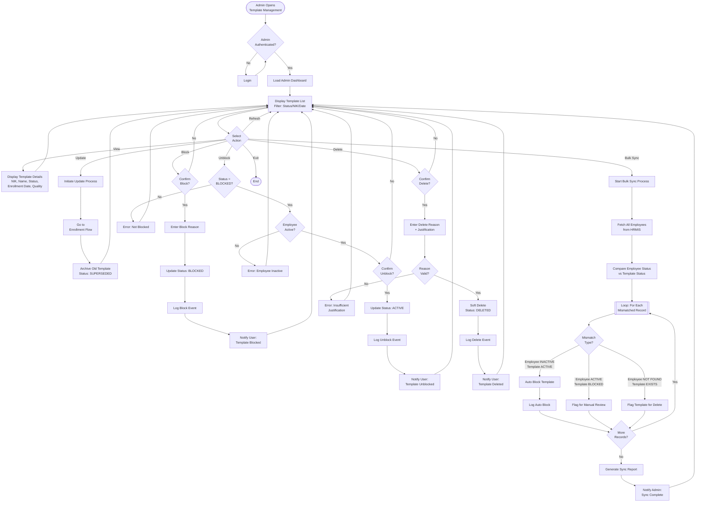

---

## 5. Diagram Sequence

### 5.1 Sequence Diagram - Enrollment

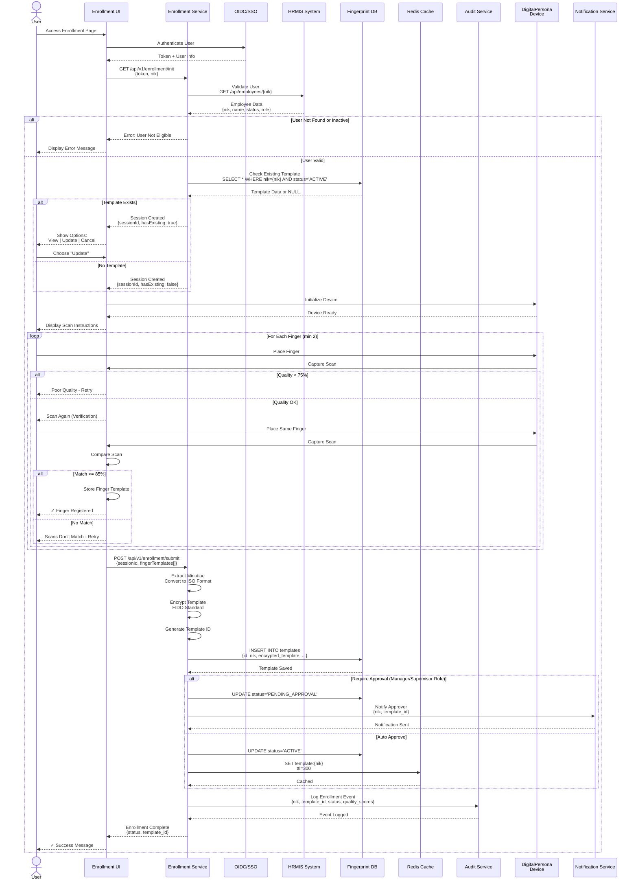

---

### 5.2 Sequence Diagram - Verification

*Sudah dijelaskan di bagian 3.2.3*

---

### 5.3 Sequence Diagram - Template Sync (Bulk Process)

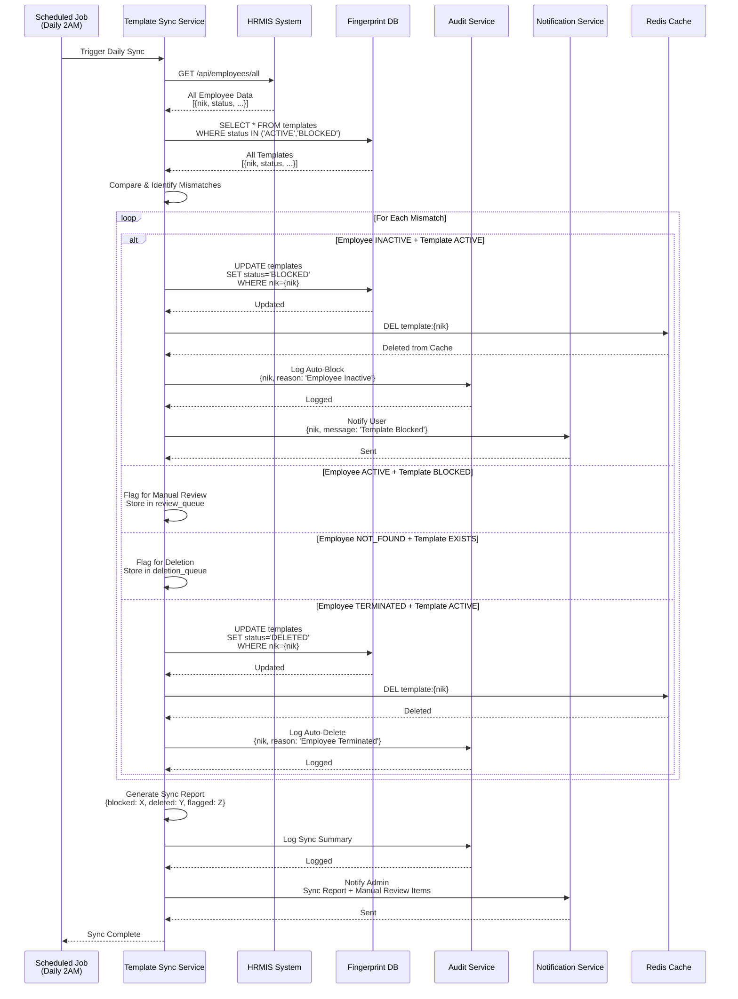

---

## 6. State Diagram

### 6.1 State Diagram - Template Status

*Sudah dijelaskan di bagian 3.3.3*

---

### 6.2 State Diagram - Transaction Authorization

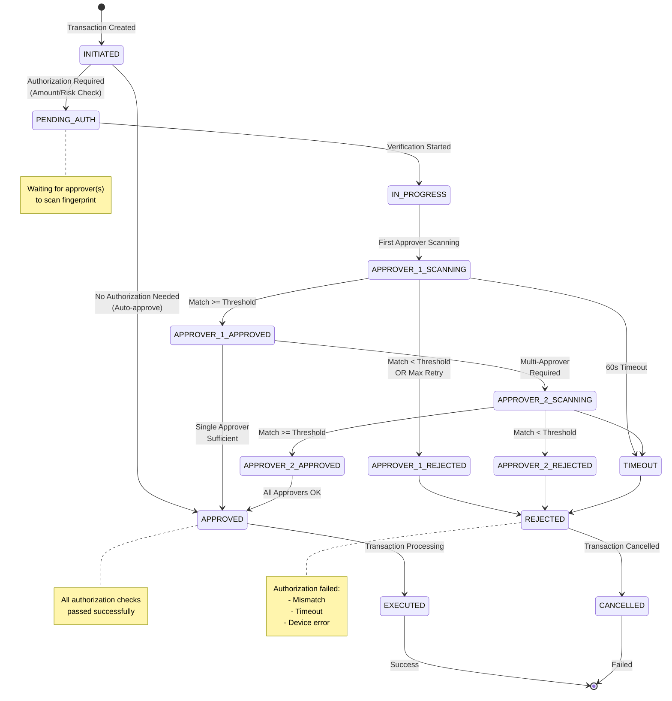

---

## 7. Business Rules

### 7.1 Enrollment Rules

*Sudah dijelaskan di bagian 3.1.4*

---

### 7.2 Verification Rules

*Sudah dijelaskan di bagian 3.2.4*

---

### 7.3 Security Rules

| Rule ID | Deskripsi | Implementation |
|---------|-----------|----------------|
| **SEC-001** | Template harus dienkripsi dengan FIDO standard | AES-256 encryption before storage |
| **SEC-002** | Raw fingerprint data tidak boleh disimpan | Only store encrypted ISO template |
| **SEC-003** | Communication antara device-UI harus encrypted | TLS 1.3 |
| **SEC-004** | API calls harus menggunakan JWT authentication | Validate JWT pada setiap request |
| **SEC-005** | Matching score tidak boleh exposed ke client | Return only APPROVED/REJECTED |
| **SEC-006** | Failed attempts harus di-log dan monitored | Log ke audit + alert if > threshold |
| **SEC-007** | Template cache di Redis harus ter-encrypt | Encrypt before storing in Redis |
| **SEC-008** | Session timeout: 15 menit inactivity | Auto logout after timeout |
| **SEC-009** | Admin actions require strong authentication | MFA for admin users |
| **SEC-010** | Audit logs harus immutable | Write-only audit table |

---

## 8. Data Model

### 8.1 Entity Relationship

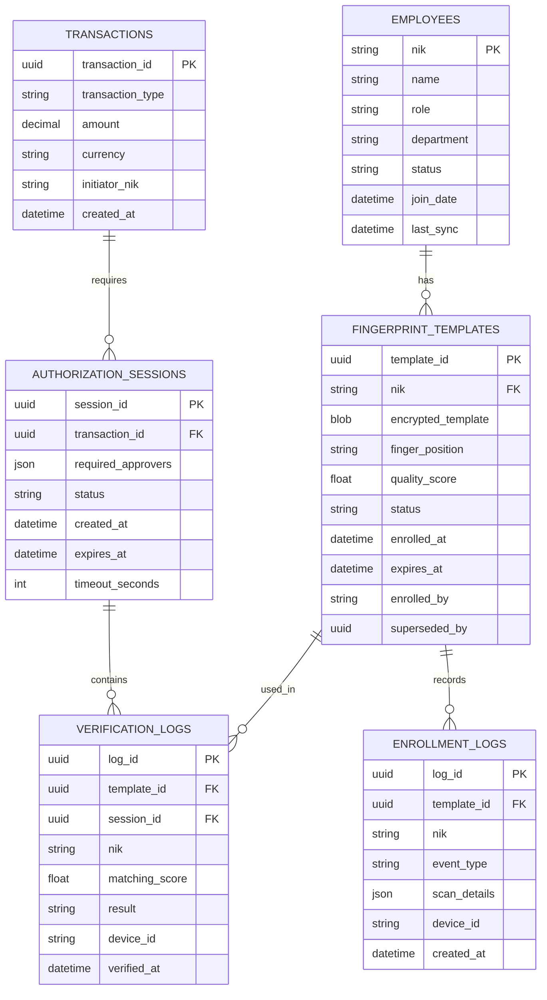

---

### 8.2 Data Dictionary

#### Table: `fingerprint_templates`

| Column | Type | Nullable | Description | Constraints |
|--------|------|----------|-------------|-------------|
| template_id | UUID | NO | Primary key | PK, Default: UUID() |
| nik | VARCHAR(20) | NO | Employee NIK | FK to employees.nik |
| encrypted_template | BLOB | NO | Encrypted ISO template | Max 64KB |
| finger_position | VARCHAR(20) | NO | Finger identifier | Enum: LEFT_THUMB, LEFT_INDEX, ... |
| quality_score | DECIMAL(5,2) | NO | Template quality (0-100) | Range: 0.00-100.00 |
| status | VARCHAR(20) | NO | Template status | Enum: PENDING_APPROVAL, ACTIVE, BLOCKED, SUPERSEDED, DELETED |
| enrolled_at | TIMESTAMP | NO | Enrollment timestamp | Default: CURRENT_TIMESTAMP |
| expires_at | TIMESTAMP | YES | Expiration date | Default: NULL (no expiry) |
| enrolled_by | VARCHAR(20) | NO | NIK of person who enrolled | FK to employees.nik |
| superseded_by | UUID | YES | ID of newer template | FK to template_id |
| created_at | TIMESTAMP | NO | Record creation | Default: CURRENT_TIMESTAMP |
| updated_at | TIMESTAMP | NO | Last update | On Update: CURRENT_TIMESTAMP |

**Indexes:**
- PRIMARY KEY (template_id)
- UNIQUE (nik, status) WHERE status='ACTIVE'
- INDEX idx_nik (nik)
- INDEX idx_status (status)

---

#### Table: `verification_logs`

| Column | Type | Nullable | Description | Constraints |
|--------|------|----------|-------------|-------------|
| log_id | UUID | NO | Primary key | PK, Default: UUID() |
| template_id | UUID | NO | Template used | FK to fingerprint_templates |
| session_id | UUID | YES | Authorization session | FK to authorization_sessions |
| nik | VARCHAR(20) | NO | User NIK | FK to employees.nik |
| matching_score | DECIMAL(5,2) | NO | Match score (0-100) | Range: 0.00-100.00 |
| threshold | DECIMAL(5,2) | NO | Applied threshold | Range: 0.00-100.00 |
| result | VARCHAR(20) | NO | Verification result | Enum: APPROVED, REJECTED |
| quality_score | DECIMAL(5,2) | NO | Scan quality | Range: 0.00-100.00 |
| device_id | VARCHAR(50) | NO | Device identifier | - |
| ip_address | VARCHAR(45) | NO | Client IP | IPv4/IPv6 |
| user_agent | VARCHAR(255) | YES | Client info | - |
| verified_at | TIMESTAMP | NO | Verification time | Default: CURRENT_TIMESTAMP |

**Indexes:**
- PRIMARY KEY (log_id)
- INDEX idx_template (template_id)
- INDEX idx_session (session_id)
- INDEX idx_verified_at (verified_at)

---

#### Table: `authorization_sessions`

| Column | Type | Nullable | Description | Constraints |
|--------|------|----------|-------------|-------------|
| session_id | UUID | NO | Primary key | PK, Default: UUID() |
| transaction_id | UUID | NO | Related transaction | FK to transactions |
| required_approvers | JSON | NO | List of approver NIKs | Array of strings |
| approved_by | JSON | YES | List of approved NIKs | Array of objects |
| status | VARCHAR(20) | NO | Session status | Enum: PENDING, IN_PROGRESS, APPROVED, REJECTED, TIMEOUT |
| timeout_seconds | INT | NO | Session timeout | Default: 60 |
| created_at | TIMESTAMP | NO | Session start | Default: CURRENT_TIMESTAMP |
| expires_at | TIMESTAMP | NO | Session expiry | created_at + timeout |
| completed_at | TIMESTAMP | YES | Completion time | - |

**Indexes:**
- PRIMARY KEY (session_id)
- INDEX idx_transaction (transaction_id)
- INDEX idx_status (status)

---

## 9. Interface Design

### 9.1 Enrollment Interface

**Wireframe:**

```
┌─────────────────────────────────────────────────────┐
│  FingerScan Biometric - Enrollment                 │
│  User: John Doe (NIK: 123456)                       │
└─────────────────────────────────────────────────────┘

┌─────────────────────────────────────────────────────┐
│  [Step 1 of 3] Device Detection                     │
├─────────────────────────────────────────────────────┤
│                                                      │
│  [●] DigitalPersona 4500 - Ready                    │
│                                                      │
│  [Next] [Cancel]                                    │
└─────────────────────────────────────────────────────┘

┌─────────────────────────────────────────────────────┐
│  [Step 2 of 3] Fingerprint Capture                  │
├─────────────────────────────────────────────────────┤
│                                                      │
│  Finger: Left Index                                 │
│  Scan #1: [========= ] 90% Quality ✓                │
│  Scan #2: [          ] Waiting...                   │
│                                                      │
│  Instructions:                                       │
│  - Place finger firmly on sensor                    │
│  - Keep finger still during scan                    │
│  - Remove finger when prompted                      │
│                                                      │
│  [Retry] [Skip Finger] [Cancel]                     │
└─────────────────────────────────────────────────────┘

┌─────────────────────────────────────────────────────┐
│  [Step 3 of 3] Confirmation                         │
├─────────────────────────────────────────────────────┤
│                                                      │
│  Enrolled Fingers:                                   │
│  ✓ Left Index  - Quality: 92%                       │
│  ✓ Right Index - Quality: 88%                       │
│                                                      │
│  Status: ACTIVE (Auto-approved)                      │
│                                                      │
│  [Finish] [Enroll More Fingers]                     │
└─────────────────────────────────────────────────────┘
```

**UI Components:**
- Progress indicator (Step 1/2/3)
- Device status badge (Ready/Error/Disconnected)
- Quality meter (0-100%) with color coding
- Instructional text (dynamic based on step)
- Action buttons (context-sensitive)

---

### 9.2 Verification Interface

**Wireframe:**

```
┌─────────────────────────────────────────────────────┐
│  Transaction Authorization Required                 │
│  TRX-20260128-001 - Transfer Rp 150,000,000         │
└─────────────────────────────────────────────────────┘

┌─────────────────────────────────────────────────────┐
│  Required Approvers: 2                               │
├─────────────────────────────────────────────────────┤
│                                                      │
│  [1] Manager: Jane Smith (NIK: 789012)              │
│      Status: ⏳ Waiting for scan...                 │
│      Timeout: 00:48                                 │
│                                                      │
│  [2] Supervisor: Bob Johnson (NIK: 345678)          │
│      Status: ⏸️ Pending (waiting for #1)            │
│                                                      │
├─────────────────────────────────────────────────────┤
│                                                      │
│  [Scan Now] [Cancel Authorization]                  │
│                                                      │
└─────────────────────────────────────────────────────┘

┌─────────────────────────────────────────────────────┐
│  Scanning: Jane Smith                               │
├─────────────────────────────────────────────────────┤
│                                                      │
│  [Fingerprint Animation]                            │
│                                                      │
│  Place your finger on the sensor                    │
│  Quality: [==========] 85% ✓                        │
│                                                      │
│  Verifying... Please wait                           │
│                                                      │
└─────────────────────────────────────────────────────┘

┌─────────────────────────────────────────────────────┐
│  ✓ Authorization Successful                         │
├─────────────────────────────────────────────────────┤
│                                                      │
│  [1] Jane Smith      - ✓ APPROVED (92% match)       │
│  [2] Bob Johnson     - ✓ APPROVED (88% match)       │
│                                                      │
│  Transaction has been approved.                      │
│  Returning to application...                         │
│                                                      │
└─────────────────────────────────────────────────────┘
```

**UI Components:**
- Transaction summary header
- Approver list with status badges
- Countdown timer
- Real-time fingerprint animation
- Quality indicator
- Success/Error messages with appropriate icons

---

### 9.3 Admin Interface

**Wireframe:**

```
┌─────────────────────────────────────────────────────┐
│  Admin Dashboard - Template Management              │
│  [Refresh] [Bulk Sync] [Export Report]              │
└─────────────────────────────────────────────────────┘

┌─────────────────────────────────────────────────────┐
│  Filters:                                            │
│  Status: [All ▼] NIK: [        ] Date: [         ]  │
│  [Apply Filter] [Reset]                             │
├─────────────────────────────────────────────────────┤
│                                                      │
│  NIK      | Name        | Status  | Enrolled  | ⚙️  │
│  ────────────────────────────────────────────────── │
│  123456   | John Doe    | ACTIVE  | 2026-01-20| ⋮  │
│  789012   | Jane Smith  | BLOCKED | 2026-01-15| ⋮  │
│  345678   | Bob Johnson | ACTIVE  | 2026-01-18| ⋮  │
│  ────────────────────────────────────────────────── │
│                                                      │
│  Showing 3 of 150 | [< Prev] Page 1 of 50 [Next >] │
└─────────────────────────────────────────────────────┘

┌─────────────────────────────────────────────────────┐
│  Template Details: Jane Smith (789012)              │
├─────────────────────────────────────────────────────┤
│  Template ID: temp-uuid-789012-001                  │
│  Status: BLOCKED                                     │
│  Enrolled: 2026-01-15 10:30:00                      │
│  Quality: 88%                                        │
│  Fingers: Left Index, Right Index                   │
│  Blocked By: admin@company.com                      │
│  Reason: Suspicious activity detected               │
│                                                      │
│  [Unblock] [Delete] [View Logs] [Close]             │
└─────────────────────────────────────────────────────┘
```

**UI Components:**
- Filter panel (status, NIK, date range)
- Sortable data table
- Pagination controls
- Actions dropdown (⋮) per row
- Modal dialogs for details/actions
- Bulk action buttons

---

## 10. Error Handling

### 10.1 Error Scenarios

| Error Code | Scenario | User Message | System Action |
|------------|----------|--------------|---------------|
| **ENR-E001** | User not found in HRMIS | "User tidak ditemukan. Hubungi HR untuk registrasi." | Log error, display message |
| **ENR-E002** | User status inactive | "User tidak aktif. Hubungi HR untuk aktivasi." | Log error, prevent enrollment |
| **ENR-E003** | Device not detected | "Device tidak terdeteksi. Periksa koneksi USB." | Display troubleshooting steps |
| **ENR-E004** | Device error | "Device error (Code: {code}). Hubungi IT support." | Log device error, notify admin |
| **ENR-E005** | Poor quality (retry exhausted) | "Kualitas sidik jari rendah. Coba lagi atau hubungi admin." | Log quality failure |
| **ENR-E006** | Scans don't match | "Sidik jari tidak cocok. Pastikan menggunakan jari yang sama." | Retry from Scan #1 |
| **ENR-E007** | Template already exists | "Template sudah ada. Pilih Update untuk mengganti." | Show options |
| **ENR-E008** | Encryption failed | "Gagal enkripsi template. Coba lagi atau hubungi IT." | Log critical error, alert admin |
| **VER-E001** | Template not found | "Template tidak ditemukan. Lakukan enrollment terlebih dahulu." | Redirect to enrollment |
| **VER-E002** | Template blocked | "Template di-block. Hubungi admin untuk unblock." | Display error, log access attempt |
| **VER-E003** | Matching score below threshold | "Sidik jari tidak cocok. Coba lagi." | Allow retry (max 3x) |
| **VER-E004** | Max retry exceeded | "Maksimal percobaan tercapai. Coba lagi dalam 5 menit." | Lock for 5 minutes, log |
| **VER-E005** | Verification timeout | "Waktu verifikasi habis. Silakan ulangi transaksi." | Reject authorization |
| **VER-E006** | Session expired | "Sesi authorization expired. Ulangi transaksi." | Cleanup session |
| **API-E001** | Invalid JWT token | "Unauthorized access." | Return 401 |
| **API-E002** | Missing required parameters | "Bad request: {param} is required." | Return 400 |
| **API-E003** | Database connection error | "Service unavailable. Please try again later." | Return 503, alert admin |
| **API-E004** | Redis unavailable | "Service degraded (cache unavailable)." | Fallback to DB, log |

---

### 10.2 Error Messages

**Format Error Message:**
```json
{
  "error": {
    "code": "VER-E003",
    "message": "Sidik jari tidak cocok. Coba lagi.",
    "details": {
      "matching_score": 72.5,
      "threshold": 85.0,
      "retry_count": 1,
      "max_retry": 3
    },
    "timestamp": "2026-01-28T10:15:30.000Z",
    "request_id": "req-uuid-001"
  }
}
```

---

### 10.3 Recovery Procedures

| Error Type | Recovery Procedure |
|------------|-------------------|
| **Device Disconnected** | 1. Display reconnection guide<br/>2. Poll device status every 5s<br/>3. Resume when ready<br/>4. Restore session state |
| **Quality Check Failed** | 1. Show finger placement guide<br/>2. Suggest cleaning sensor<br/>3. Allow 3 retries<br/>4. Escalate to admin if persist |
| **Matching Failed** | 1. Allow retry (max 3x)<br/>2. Suggest re-enrollment if persist<br/>3. Lock after max retry<br/>4. Log suspicious activity |
| **Database Error** | 1. Retry with exponential backoff (3x)<br/>2. Fallback to queue if persist<br/>3. Alert admin<br/>4. Display user-friendly message |
| **Cache Unavailable** | 1. Fallback to direct DB query<br/>2. Log degraded performance<br/>3. Continue normal operation<br/>4. Alert admin for Redis check |
| **Encryption Failed** | 1. Retry encryption (1x)<br/>2. If fail, abort enrollment<br/>3. Log critical error<br/>4. Immediate admin alert |

---

## 11. Performance Requirements

### 11.1 Response Time

| Operation | Target | Maximum | Measurement Point |
|-----------|--------|---------|-------------------|
| **Enrollment - Device Init** | < 1s | 2s | Device ready → UI confirmation |
| **Enrollment - Single Scan** | < 0.5s | 1s | Scan trigger → Capture complete |
| **Enrollment - Quality Check** | < 0.2s | 0.5s | Capture → Quality score display |
| **Enrollment - Template Extraction** | < 2s | 5s | All scans → Template generated |
| **Enrollment - Save to DB** | < 0.5s | 1s | Submit → DB confirmation |
| **Verification - Template Fetch** | < 0.1s | 0.3s | Request → Template retrieved (cache hit) |
| **Verification - Template Fetch** | < 0.5s | 1s | Request → Template retrieved (cache miss) |
| **Verification - Matching** | < 0.5s | 1s | Scan → Match score calculated |
| **Verification - End-to-End** | < 3s | 5s | Request → Authorization result |
| **API - Enrollment Init** | < 0.5s | 1s | Request → Response |
| **API - Verify Request** | < 1s | 2s | Request → Response |
| **Admin - Load Dashboard** | < 2s | 3s | Request → Full page render |
| **Bulk Sync** | < 5min | 10min | For 10,000 templates |

---

### 11.2 Throughput

| Metric | Target | Notes |
|--------|--------|-------|
| **Concurrent Enrollments** | 50 | Simultaneous enrollment sessions |
| **Concurrent Verifications** | 200 | Peak transaction authorization |
| **API Requests/sec** | 1000 | Mixed read/write operations |
| **Database Writes/sec** | 500 | Enrollment + audit logs |
| **Database Reads/sec** | 2000 | Verification template fetches |
| **Cache Hit Rate** | > 95% | Redis template cache |
| **Device per Branch** | 2-5 | Based on transaction volume |

---

### 11.3 Scalability

**Horizontal Scaling:**
- Fingerprint Service: Stateless, dapat scale to N instances
- Enrollment Service: Stateless, dapat scale to N instances
- Database: Master-slave replication (1 master, 2+ slaves)
- Redis: Cluster mode dengan 3+ nodes
- Load Balancer: NGINX/HAProxy untuk distribute load

**Vertical Scaling:**
- Database: Minimum 8 CPU, 16GB RAM untuk 10K users
- Redis: Minimum 4 CPU, 8GB RAM
- Application Server: Minimum 4 CPU, 8GB RAM per instance

**Capacity Planning:**
- 10,000 users: 2 app instances, 1 DB master + 1 slave, 3-node Redis
- 50,000 users: 5 app instances, 1 DB master + 2 slaves, 3-node Redis
- 100,000 users: 10 app instances, 1 DB master + 3 slaves, 5-node Redis

---

## 12. Acceptance Criteria

### 12.1 Functional Acceptance

| Criteria ID | Description | Acceptance Test |
|-------------|-------------|-----------------|
| **AC-F001** | User dapat melakukan enrollment dengan minimum 2 jari | Enroll 2 jari, verify template tersimpan dengan status ACTIVE |
| **AC-F002** | System menolak enrollment jika quality < 75% | Simulasi poor quality, verify enrollment ditolak |
| **AC-F003** | Template ter-enkripsi sebelum disimpan | Inspect DB record, verify encrypted_template tidak readable |
| **AC-F004** | Verification berhasil dengan matching score >= 85% | Scan jari yang sama dengan enrollment, verify APPROVED |
| **AC-F005** | Verification gagal dengan matching score < 85% | Scan jari berbeda, verify REJECTED |
| **AC-F006** | Multi-approver require semua approver APPROVED | Transaction dengan 2 approver, 1 reject, verify authorization REJECTED |
| **AC-F007** | Admin dapat block/unblock template | Block template, verify status=BLOCKED, unblock, verify status=ACTIVE |
| **AC-F008** | Template blocked tidak bisa untuk verification | Block template, attempt verification, verify REJECTED |
| **AC-F009** | Bulk sync auto-block template untuk employee inactive | Set employee status=INACTIVE, run sync, verify template BLOCKED |
| **AC-F010** | Audit log tercatat untuk setiap enrollment dan verification | Perform enrollment & verification, verify logs exist in audit_db |

---

### 12.2 Non-Functional Acceptance

| Criteria ID | Description | Acceptance Test |
|-------------|-------------|-----------------|
| **AC-NF001** | Verification response time < 3s end-to-end | Load test 100 concurrent verifications, verify p95 < 3s |
| **AC-NF002** | System dapat handle 200 concurrent verifications | Load test 200 concurrent users, verify no failures |
| **AC-NF003** | Cache hit rate > 95% untuk verification | Monitor Redis metrics selama 1 jam operasi, verify hit rate |
| **AC-NF004** | Template encryption menggunakan FIDO standard | Code review + security audit |
| **AC-NF005** | API authentication menggunakan JWT | Attempt API call without JWT, verify 401 response |
| **AC-NF006** | Failed attempts di-log dan monitored | Perform 3 failed verifications, verify logs + alert triggered |
| **AC-NF007** | System recovery dari Redis failure dalam < 1s | Simulate Redis down, verify fallback to DB works |
| **AC-NF008** | Bulk sync complete dalam < 5 min untuk 10K records | Run sync with 10K templates, measure execution time |
| **AC-NF009** | UI responsive pada device dengan < 100ms latency | Test pada various devices, verify UI responsiveness |
| **AC-NF010** | Error messages user-friendly dan informatif | Review all error messages, verify clarity |

---

### 12.3 Integration Acceptance

| Criteria ID | Description | Acceptance Test |
|-------------|-------------|-----------------|
| **AC-I001** | DAF app dapat request verification via API | DAF calls API, verify authorization result returned |
| **AC-I002** | BDS app dapat request verification via API | BDS calls API, verify authorization result returned |
| **AC-I003** | CS Teller dapat request verification via API | CS Teller calls API, verify authorization result returned |
| **AC-I004** | HRMIS sync update employee status di fingerprint DB | Update employee in HRMIS, verify sync updates template |
| **AC-I005** | Notification service send email/SMS untuk enrollment | Complete enrollment, verify notification sent |
| **AC-I006** | Audit logs dapat di-query via Admin Dashboard | Login admin, query audit logs, verify results |

---

## Document Revision History

| Version | Date | Author | Changes |
|---------|------|--------|---------|
| 1.0 | 2026-01-28 | PT Ihsan Solusi Informatika | Initial draft FDS |

---

## Approval

| Role | Name | Signature | Date |
|------|------|-----------|------|
| **Product Owner** | _______________ | _______________ | ________ |
| **Technical Lead** | _______________ | _______________ | ________ |
| **QA Lead** | _______________ | _______________ | ________ |
| **Security Officer** | _______________ | _______________ | ________ |

---

**END OF DOCUMENT**
